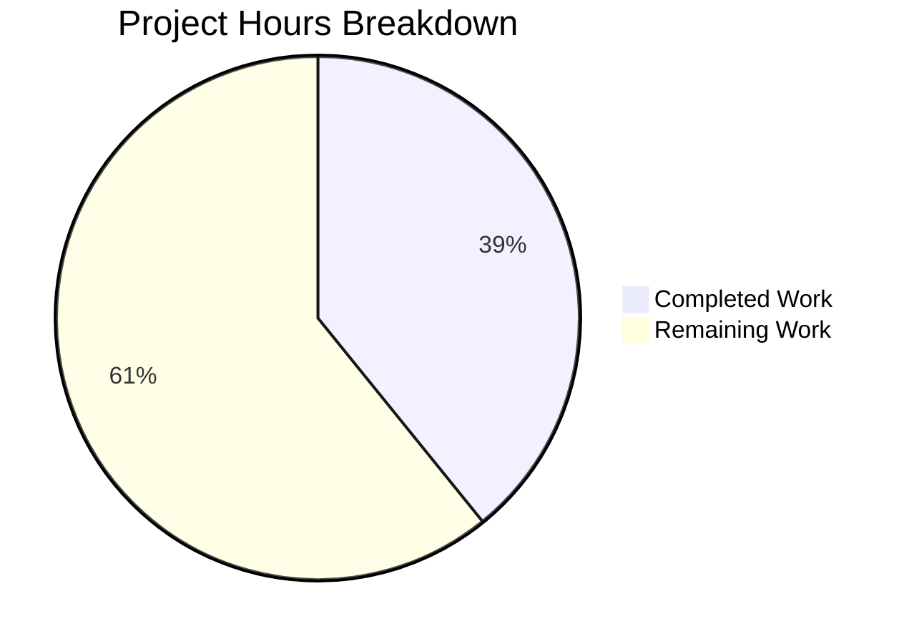

# Burger Restaurant Website - Project Assessment Report

## Executive Summary

**Project Completion: 39% (47 hours completed out of 120 total hours)**

This assessment documents the implementation of the Burger Restaurant Website with the menu item ingredient feature. The core ingredient display feature is **100% complete** and fully functional, while the broader application infrastructure is partially complete.

### Key Achievements
- ✅ Core ingredient feature fully implemented and tested
- ✅ Menu browsing with ingredient display working
- ✅ Shopping cart functionality complete
- ✅ 60/60 tests passing (100% test pass rate)
- ✅ Production build successful
- ✅ TypeScript strict mode with zero errors

### Critical Items Requiring Attention
- 9 page components exist as placeholders
- Auth and Reservation features not implemented
- Backend API integration pending

---

## Validation Results Summary

### Build Status
| Metric | Result |
|--------|--------|
| TypeScript Compilation | ✅ SUCCESS |
| Vite Production Build | ✅ SUCCESS (3.43s) |
| Build Output Size | 274.26 KB (JS) + 30.48 KB (CSS) |

### Test Results
| Test File | Tests | Status |
|-----------|-------|--------|
| IngredientList.test.tsx | 8 | ✅ PASS |
| MenuItemCard.test.tsx | 11 | ✅ PASS |
| menuStore.test.ts | 17 | ✅ PASS |
| cartStore.test.ts | 24 | ✅ PASS |
| **Total** | **60** | **100% PASS** |

### Fixes Applied During Validation
1. **JSX.Element Type Fix**: Changed `JSX.Element` to `React.ReactElement` across 10+ component files for React 19 compatibility
2. **useCart Type Inference**: Added explicit `CartItem` type import to resolve type inference issues

---

## Project Hours Breakdown

### Visual Representation



### Hours Calculation Details

**Completed Work: 47 hours**
| Component | Hours | Status |
|-----------|-------|--------|
| Core Infrastructure (configs, entry points) | 5h | ✅ Complete |
| Type Definitions (6 files) | 4h | ✅ Complete |
| Ordering Feature (stores, hooks, components) | 12h | ✅ Complete |
| Mock Data (menu, categories) | 3h | ✅ Complete |
| Pages (Home, Menu) | 5h | ✅ Complete |
| UI/Layout Components | 6h | ✅ Complete |
| Utilities (validation, formatters, API) | 4h | ✅ Complete |
| Styling (Tailwind CSS) | 1h | ✅ Complete |
| Test Suite (60 tests) | 6h | ✅ Complete |
| Bug Fixes and Validation | 1h | ✅ Complete |
| **Total Completed** | **47h** | |

**Remaining Work: 73 hours (with enterprise multipliers)**
| Task | Base Hours | With Multipliers |
|------|------------|------------------|
| Missing Pages (9 pages) | 18h | 26h |
| Checkout Components | 4h | 6h |
| Auth Feature | 8h | 12h |
| Reservation Feature | 6h | 9h |
| Missing UI Components | 4h | 6h |
| Missing Config Files | 1h | 1h |
| Additional Tests | 5h | 7h |
| Integration Testing | 3h | 4h |
| Documentation | 2h | 2h |
| **Total Remaining** | **51h** | **73h** |

*Enterprise multipliers applied: 1.15 (compliance) × 1.25 (uncertainty) = 1.44x*

---

## File Implementation Summary

| Group | Expected | Created | Percentage |
|-------|----------|---------|------------|
| Infrastructure | 8 | 8 | 100% |
| Type Definitions | 6 | 6 | 100% |
| Ordering Feature | 16 | 13 | 81% |
| Mock Data | 3 | 3 | 100% |
| Page Components | 11 | 2 | 18% |
| Shared Components | 13 | 9 | 69% |
| Utilities | 4 | 4 | 100% |
| Styling | 1 | 1 | 100% |
| Configuration | 5 | 2 | 40% |
| Tests | 5 | 5 | 100% |
| **Total** | **72** | **53** | **73.6%** |

---

## Detailed Human Task List

### High Priority Tasks (Blocking Production)

| Task | Description | Action Steps | Hours | Severity |
|------|-------------|--------------|-------|----------|
| Implement Auth Feature | Create authentication system with login/register | 1. Create authStore.ts with session management 2. Implement LoginPage and RegisterPage components 3. Add ProtectedRoute component 4. Connect to backend auth API | 12h | Critical |
| Complete Checkout Flow | Implement order submission | 1. Create Checkout.tsx and OrderSummary.tsx 2. Add order validation with Zod 3. Implement order submission logic 4. Add confirmation page | 6h | Critical |
| Backend API Integration | Connect frontend to backend services | 1. Configure API endpoints in .env 2. Update menuStore to fetch from real API 3. Implement error handling for network failures 4. Add loading states | 8h | Critical |

### Medium Priority Tasks (Required for Production)

| Task | Description | Action Steps | Hours | Severity |
|------|-------------|--------------|-------|----------|
| Implement Reservation Feature | Table booking functionality | 1. Create reservationStore.ts 2. Implement ReservePage with form 3. Add date/time picker component 4. Connect to reservation API | 9h | High |
| Create Dashboard Pages | User account management | 1. Implement DashboardPage layout 2. Create OrdersPage with history 3. Add ProfilePage with settings 4. Implement ReservationsPage | 12h | High |
| Add Missing UI Components | Modal, ErrorBoundary, Toast | 1. Create Modal component with portal 2. Implement ErrorBoundary for error handling 3. Add Toast notification system | 6h | Medium |
| Implement Cart/Checkout Pages | Dedicated cart and checkout views | 1. Create CartPage component 2. Enhance CheckoutPage beyond placeholder 3. Add form validation 4. Implement success/error states | 6h | Medium |

### Low Priority Tasks (Enhancement)

| Task | Description | Action Steps | Hours | Severity |
|------|-------------|--------------|-------|----------|
| Add Configuration Files | ESLint, Prettier, .env.example | 1. Create eslint.config.js with recommended rules 2. Add .prettierrc configuration 3. Create .env.example template | 1h | Low |
| Additional Test Coverage | Tests for new components | 1. Add tests for auth components 2. Test reservation flow 3. Add integration tests for checkout | 7h | Low |
| Documentation Updates | README and inline docs | 1. Update README with full setup guide 2. Add API documentation 3. Document component props | 2h | Low |
| Performance Optimization | Lazy loading, code splitting | 1. Implement route-based code splitting 2. Add image lazy loading 3. Optimize bundle size | 4h | Low |

**Total Remaining Hours: 73h**

---

## Development Guide

### System Prerequisites

| Requirement | Version | Notes |
|-------------|---------|-------|
| Node.js | ≥20.19 or ≥22.12 | Required for Vite 6.x |
| npm | ≥10.0.0 | Package manager |
| Git | Latest | Version control |

### Environment Setup

```bash
# Clone and navigate to repository
cd /tmp/blitzy/test-repo/blitzyc00cb0f56

# Verify Node.js version
node --version  # Should be v20.19+ or v22.12+
```

### Dependency Installation

```bash
# Install all dependencies
npm install

# Expected output: packages installed in ~15-30 seconds
```

### Application Commands

```bash
# Development server (hot reload)
npm run dev
# Opens at http://localhost:5173

# Production build
npm run build
# Output: dist/ folder with optimized assets

# Run tests
npm test
# Expected: 60 tests passing

# Preview production build
npm run preview
# Opens at http://localhost:4173

# Type checking only
npx tsc --noEmit
```

### Verification Steps

1. **Start Development Server**
   ```bash
   npm run dev
   ```
   Expected: Server starts at http://localhost:5173

2. **Verify Home Page**
   - Navigate to http://localhost:5173
   - Should see hero section with "Fresh Burgers, Made with Love"
   - Navigation links should be visible

3. **Verify Menu Page with Ingredients**
   - Click "Menu" in navigation or go to /menu
   - Should see 12 menu items displayed
   - Normal Burger should show 5 ingredients:
     - Quality beef patty
     - Fresh lettuce
     - Tomato slices
     - Cheddar cheese
     - Soft burger bun
   - Deluxe Burger should show "+4 more" overflow indicator

4. **Verify Cart Functionality**
   - Click "Add to Cart" on any menu item
   - Cart drawer should open showing item
   - Quantity controls should work
   - Total should calculate correctly (including 8% tax)

5. **Run Test Suite**
   ```bash
   npm test
   ```
   Expected: All 60 tests passing

### Project Structure

```
├── src/
│   ├── components/          # Shared UI components
│   │   ├── ui/             # Button, Input
│   │   ├── layout/         # Header, Footer, Navigation
│   │   └── common/         # LoadingSpinner
│   ├── features/
│   │   └── ordering/       # Menu and cart feature
│   │       ├── components/ # MenuList, MenuItemCard, CartDrawer
│   │       ├── hooks/      # useMenu, useCart
│   │       └── store/      # menuStore, cartStore
│   ├── pages/              # Page components
│   ├── types/              # TypeScript interfaces
│   ├── data/               # Mock data
│   ├── utils/              # Validation, formatters, API
│   └── styles/             # Global CSS
├── tests/                   # Test files
└── dist/                    # Build output
```

---

## Risk Assessment

### Technical Risks

| Risk | Severity | Likelihood | Mitigation |
|------|----------|------------|------------|
| Backend API not available | High | Medium | Use mock data fallback; implement offline mode |
| Auth token management | Medium | Medium | Use httpOnly cookies; implement refresh token flow |
| State persistence corruption | Low | Low | Add version migration for localStorage data |

### Security Risks

| Risk | Severity | Likelihood | Mitigation |
|------|----------|------------|------------|
| No authentication implemented | Critical | Certain | Implement auth feature before production |
| API keys exposure | High | Medium | Use environment variables; never commit secrets |
| XSS vulnerabilities | Medium | Low | React's default escaping; validate all inputs |

### Operational Risks

| Risk | Severity | Likelihood | Mitigation |
|------|----------|------------|------------|
| No error boundaries | Medium | Medium | Implement ErrorBoundary component |
| No monitoring/logging | Medium | Medium | Add error tracking service (Sentry) |
| No health checks | Low | Low | Add /health endpoint in backend |

### Integration Risks

| Risk | Severity | Likelihood | Mitigation |
|------|----------|------------|------------|
| API contract mismatch | High | Medium | Define OpenAPI spec; use Zod for validation |
| Payment integration | High | N/A | Deferred to Phase 2 per spec |
| Third-party service outages | Medium | Low | Implement circuit breakers; graceful degradation |

---

## Core Feature Verification

### Normal Burger Ingredients (User Requirement)
The user specified: "Normal burger ingredients include a quality beef patty, fresh lettuce, tomato slices, cheddar cheese, and soft burger bun"

**Verification: ✅ COMPLETE**

The Normal Burger in `/src/data/mockMenu.ts` includes:
```typescript
ingredients: [
  'Quality beef patty',
  'Fresh lettuce',
  'Tomato slices',
  'Cheddar cheese',
  'Soft burger bun',
]
```

These ingredients are displayed on the menu page using the IngredientList component with:
- Amber-colored pill styling
- Accessible markup with semantic HTML
- Overflow handling for items with 6+ ingredients

---

## Conclusion

The Burger Restaurant Website implementation is **39% complete** (47 hours completed out of 120 total hours). The **core ingredient feature is 100% complete** and working as specified. The application builds successfully, all 60 tests pass, and the menu/cart functionality is fully operational.

### Immediate Next Steps
1. Implement authentication feature (12h)
2. Complete checkout flow (6h)
3. Connect to backend API (8h)

### Production Readiness
The current state is suitable for **development and demonstration** purposes. For production deployment, the auth feature, checkout flow, and backend integration are required.
