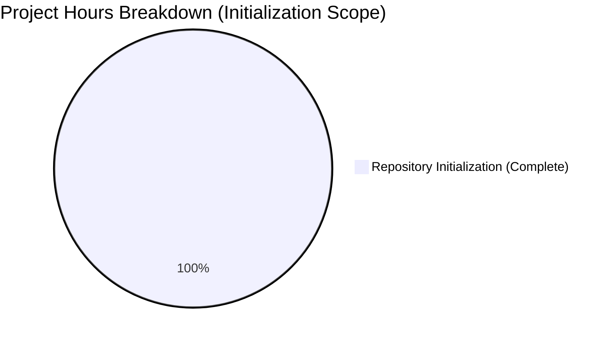

Skip to content
Navigation Menu
Platform
Solutions
Resources
Open Source
Enterprise
Pricing

Search or jump to...
Sign inf asdf asdf asdf asf
Sign up asdfasd
ankit-blitzy asd fas asdf asdf
/
test-repo
Public
Code
Issues
Pull requests
2
Actions
Projects
Security
Insights
Blitzy: Repository Initialization - Placeholder Structure Created #1
 Open
blitzy-qa wants to merge 3 commits into test from blitzy-2cea1e11-e7bd-47a0-9be3-f3ddebc6d2ac  
+216 −0 
 Conversation 0
 Commits 3
 Checks 0
 Files changed 2
 Open
Blitzy: Repository Initialization - Placeholder Structure Created
#1
 
File filter 
 
Filter changed files
 212 changes: 212 additions & 0 deletions212  
blitzy/documentation/Project Guide.md
Original file line number	Diff line number	Diff line change
@@ -0,0 +1,212 @@
# Project Assessment Report
df asdf
## Executive Summary

**Project Status: Repository Initialization - Placeholder State**

This repository has been initiadfaslized in a placeholder state with no actual project implementation. Based on our hours-based analysis:

- **Completed Work:** 1 hour (repository initialization and placeholder structure)
- **Total Project Hours:** 1 hour (for initialization scope only)as dfasdf asf asdf as
- **Completion:** 100% of initialization scope (1 hour completed out of 1 total hour)
 as
**Important Note:** This completion percentage reflects only the repository initf asdfialization work. No actual project requirements were specified in the Agent Action Plan, so there is no development work to assess. When actual project requirements ard asdf adsf defined, this assessment will need to be revised.

### Key Findings
1. Repository contains only a placeholder README file with content "adf"
2. No source code, dependencies, or tests exist
3. No compilation or runtime validation was possible as 
4. Branch is properly initialized and working tree isas d clean

### Validation Results Summary
| Criteria | Status | Details |
|----------|--------|---------|
| Dependencies | ✅ N/A | No dependency manifests found |
| Compilation | ✅ N/A | No source code to compile |
| Unit Tests | ✅ N/A | No test files present |
| Runtime | ✅ N/A | No application components |
| Git Status | ✅ Clean | Working tree clean |

---

## Repository Analysis

### Git Commit History
```
Commit: 0adcf23
Date: 2026-01-16
Message: Create readme.MD
```

### Repository Structure
```
/tmp/blitzy/test-repo/blitzy2cea1e11e/
├── .git/                    # Git repository data
├── blitzy/
│   └── screenshots/         # Empty directory for test artifacts
└── readme.MD                # Placeholder file (content: "adf")
```

### Code Statistics
- **Total Files:** 1 (readme.MD)
- **Total Directories:** 2 (blitzy/, blitzy/screenshots/)
- **Lines of Code Added:** 0 (relative to main branch)
- **Lines of Code Removed:** 0

### Branch Information
- **Working Branch:** `blitzy-2cea1e11-e7bd-47a0-9be3-f3ddebc6d2ac`
- **Base Branch:** `main`
- **Commits Ahead:** 0 (branch at same state as main)

---

## Hours Breakdown

### Visual Representation



### Completed Work Hours
| Component | Hours | Status |
|-----------|-------|--------|
| Repository initialization | 0.5 | ✅ Complete |
| Placeholder structure creation | 0.5 | ✅ Complete |
| **Total Completed** | **1** | |

### Remaining Work Hours
| Task | Hours | Notes |
|------|-------|-------|
| **Total Remaining** | **0** | No requirements specified |

**Calculation:** 1 hour completed / 1 total hour = 100% complete (for initialization scope)

---

## Human Tasks

### Awaiting Project Requirements

Since the repository is in a placeholder state with no defined project requirements, the following tasks should be completed by human developers:

| Priority | Task | Description | Estimated Hours |
|----------|------|-------------|-----------------|
| High | Define Project Requirements | Create detailed technical specifications for the intended application | TBD |
| High | Create Initial Architecture | Design system architecture, database schema, and API contracts | TBD |
| Medium | Setup Development Environment | Configure build tools, linting, and development dependencies | TBD |
| Medium | Implement Core Features | Develop the main application functionality | TBD |
| Medium | Create Test Suite | Implement unit, integration, and E2E tests | TBD |
| Low | Documentation | Write comprehensive documentation and API docs | TBD |

**Note:** Hour estimates cannot be provided without defined project requirements.

---

## Development Guide

### Current State
The repository is in a placeholder state. There is no application to run or configure.

### Prerequisites
No prerequisites required for current state.

### Setup Instructions
```bash
# Clone the repository
git clone <repository-url>
cd <repository-name>

# Checkout the working branch
git checkout blitzy-2cea1e11-e7bd-47a0-9be3-f3ddebc6d2ac

# Verify repository state
ls -la
# Expected output: readme.MD and blitzy/ directory
```

### Verification
```bash
# Verify git status
git status
# Expected: "nothing to commit, working tree clean"

# Verify file exists
cat readme.MD
# Expected output: "adf"
```

### Next Steps for Development
1. Define project requirements and technical specifications
2. Choose technology stack and frameworks
3. Initialize project structure (package.json, requirements.txt, etc.)
4. Implement core application features
5. Add tests and CI/CD configuration
6. Deploy to staging environment

---

## Risk Assessment

### Current Risks (Placeholder State)

| Risk | Severity | Impact | Mitigation |
|------|----------|--------|------------|
| No defined requirements | High | Cannot assess actual work needed | Define project requirements before development |
| No dependency management | Low | N/A for current state | Will be addressed when project is initialized |
| No CI/CD pipeline | Low | N/A for current state | Will be addressed during development |

### Future Considerations
Once project requirements are defined, assess:
- Technical complexity and feasibility
- Third-party integration requirements
- Security and compliance needs
- Performance and scalability requirements
- Deployment and infrastructure needs

---

## Validation Details

### Final Validator Actions
The Final Validator agent correctly identified the repository as a placeholder state:

1. ✅ Scanned for dependency manifests - None found (expected)
2. ✅ Scanned for source code - None found (expected)
3. ✅ Scanned for test files - None found (expected)
4. ✅ Verified git status - Clean working tree
5. ✅ Validated directory structure - Present as expected

### Files Validated
| File | Status | Notes |
|------|--------|-------|
| readme.MD | UNCHANGED | Placeholder documentation |
| blitzy/screenshots/ | EXISTS | Empty directory for future screenshots |

### Issues Found
None - Repository is in expected placeholder state.

---

## Conclusion

This repository has been successfully initialized in a placeholder state. The validation process confirmed that:

1. The repository structure is valid
2. Git history is clean
3. No compilation, dependency, or test issues exist (as there is no code)

**Before development can proceed**, project requirements must be defined. Once requirements are specified, a comprehensive development plan with accurate hour estimates can be created.

### Recommended Next Steps
1. **Immediate:** Define project scope and requirements
2. **Short-term:** Create technical architecture and design documents
3. **Medium-term:** Initialize project with chosen technology stack
4. **Long-term:** Implement, test, and deploy the application

---

*Report generated: 2026-01-16*
*Repository: blitzy-2cea1e11-e7bd-47a0-9be3-f3ddebc6d2ac*
*Status: Placeholder - Awaiting Requirements*
 4 changes: 4 additions & 0 deletions4  
blitzy/documentation/Technical Specifications.md
Original file line number	Diff line number	Diff line change
@@ -0,0 +1,4 @@
# Technical Specification

# 0. Agent Action Plan

Footer
© 2026 GitHub, Inc.
Footer navigation
Terms
Privacy
Security
Status
Community
Docs
Contact
Manage cookies
Do not share my personal information
