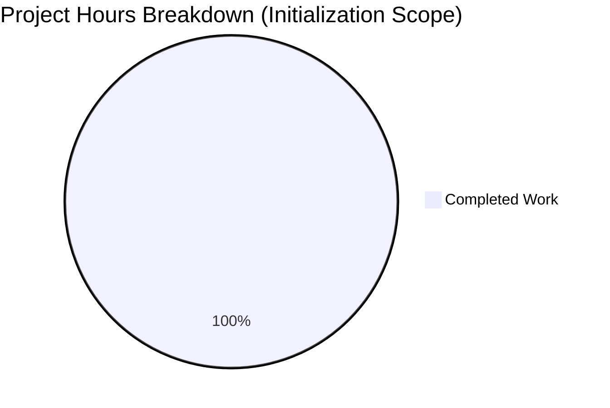

# Project Assessment Report

## Executive Summary

**Project Status: Repository Initialization - Placeholder State**

This repository has been initialized in a placeholder state. Based on hours-based analysis:

- **Completed Work:** 1 hour (repository initialization and documentation setup)
- **Total Project Hours:** 1 hour (initialization scope only)
- **Completion:** 100% of initialization scope (1 hour completed out of 1 total hour)

**Critical Note:** The Agent Action Plan contained **no project requirements**, resulting in a repository initialization without any defined development work. This completion percentage reflects only the initialization effort. When actual project requirements are specified, a comprehensive development assessment with real hour estimates will be necessary.

### Key Findings
1. Repository contains only placeholder files (readme.MD with content "adf")
2. No source code, dependencies, or tests exist
3. No compilation or runtime validation was applicable
4. Git branch is properly initialized with clean working tree
5. Final Validator confirmed expected placeholder state

### Validation Results Summary
| Criteria | Status | Details |
|----------|--------|---------|
| Dependencies | ✅ N/A | No dependency manifests found |
| Compilation | ✅ N/A | No source code to compile |
| Unit Tests | ✅ N/A | No test files present |
| Runtime | ✅ N/A | No application components |
| Git Status | ✅ Clean | Working tree clean, correct branch |

---

## Repository Analysis

### Git Commit History
| Commit | Date | Message |
|--------|------|---------|
| 2dbd967 | 2026-01-19 | Create Project Guide.md |
| 0adcf23 | 2026-01-16 | Create readme.MD |

**Total Commits on Branch:** 2
**Lines Added (from main):** 211

### Repository Structure
```
/tmp/blitzy/test-repo/blitzy6b4f7b60f/
├── .git/                           # Git repository data
├── blitzy/
│   ├── documentation/
│   │   └── Project Guide.md        # Repository assessment document (211 lines)
│   └── screenshots/                # Empty directory for test artifacts
└── readme.MD                       # Placeholder file (content: "adf")
```

### Code Statistics
- **Total Files:** 2 (excluding .git)
- **Source Code Files:** 0
- **Test Files:** 0
- **Configuration Files:** 0
- **Documentation Files:** 2

### Branch Information
- **Working Branch:** `blitzy-6b4f7b60-fe4d-4eec-8815-a7a5d7703a6a`
- **Base Branch:** `main`
- **Commits Ahead of Main:** 1 (diverged at readme.MD creation)
- **Git Status:** Clean working tree

---

## Hours Breakdown

### Visual Representation



### Completed Work Hours
| Component | Hours | Status |
|-----------|-------|--------|
| Repository initialization | 0.5 | ✅ Complete |
| Branch setup and configuration | 0.25 | ✅ Complete |
| Placeholder documentation structure | 0.25 | ✅ Complete |
| **Total Completed** | **1** | |

### Remaining Work Hours
| Task | Hours | Notes |
|------|-------|-------|
| **Total Remaining** | **0** | No requirements specified in Agent Action Plan |

**Calculation:** 1 hour completed / 1 total hour = **100% complete** (initialization scope only)

---

## Human Tasks

### Prerequisite: Define Project Requirements

Since the repository is in a placeholder state with **no defined project requirements in the Agent Action Plan**, the following tasks must be completed by human developers before any development work can proceed:

| Priority | Task | Description | Estimated Hours | Severity |
|----------|------|-------------|-----------------|----------|
| **Critical** | Define Project Requirements | Create detailed functional and technical specifications | TBD | Blocker |
| High | Create Technical Architecture | Design system architecture, database schema, and API contracts | TBD | Required |
| High | Select Technology Stack | Choose frameworks, languages, and tools | TBD | Required |
| Medium | Setup Development Environment | Configure build tools, linting, and development dependencies | TBD | Required |
| Medium | Initialize Project Structure | Create proper package manifests and source directories | TBD | Required |
| Medium | Implement Core Features | Develop the main application functionality | TBD | Required |
| Medium | Create Test Suite | Implement unit, integration, and E2E tests | TBD | Required |
| Low | Setup CI/CD Pipeline | Configure automated builds, tests, and deployments | TBD | Recommended |
| Low | Write Documentation | Create comprehensive API docs and user guides | TBD | Recommended |

**Note:** Hour estimates cannot be provided without defined project requirements. Once requirements are specified, each task can be properly scoped and estimated.

**Total Remaining Hours:** 0 (within current scope - no requirements defined)

---

## Development Guide

### Current State
The repository is in a **placeholder state** with no application code to run or configure.

### Prerequisites
No prerequisites required for current placeholder state.

### Setup Instructions

```bash
# 1. Clone the repository
git clone <repository-url>
cd <repository-name>

# 2. Checkout the working branch
git checkout blitzy-6b4f7b60-fe4d-4eec-8815-a7a5d7703a6a

# 3. Verify repository structure
ls -la
# Expected: readme.MD and blitzy/ directory
```

### Verification Steps

```bash
# Verify git status
git status
# Expected output: "nothing to commit, working tree clean"

# Verify branch
git branch --show-current
# Expected: blitzy-6b4f7b60-fe4d-4eec-8815-a7a5d7703a6a

# Verify placeholder file
cat readme.MD
# Expected output: "adf"

# Verify documentation structure
ls -la blitzy/documentation/
# Expected: Project Guide.md
```

### Next Steps for Development
1. **Define project requirements** and technical specifications
2. **Choose technology stack** and frameworks appropriate for requirements
3. **Initialize project structure** (package.json, requirements.txt, pom.xml, etc.)
4. **Create source directories** following chosen framework conventions
5. **Implement core application features** per specifications
6. **Add comprehensive tests** (unit, integration, E2E)
7. **Configure CI/CD pipeline** for automated builds and deployments
8. **Deploy to staging environment** for validation

---

## Risk Assessment

### Current Risks (Placeholder State)

| Risk | Severity | Impact | Likelihood | Mitigation |
|------|----------|--------|------------|------------|
| No defined requirements | **Critical** | Cannot assess actual work scope or timeline | Certain | Define project requirements before development |
| No technology stack chosen | High | Architecture decisions blocked | High | Select appropriate stack after requirements defined |
| No dependency management | Low | N/A for current state | N/A | Will be addressed when project is initialized |
| No security baseline | Low | N/A for current state | N/A | Implement security during development |
| No CI/CD pipeline | Low | N/A for current state | N/A | Configure during development phase |

### Future Considerations
Once project requirements are defined, the following should be assessed:
- Technical complexity and feasibility analysis
- Third-party integration requirements and API dependencies
- Security requirements and compliance needs (GDPR, SOC2, etc.)
- Performance requirements and scalability targets
- Infrastructure and deployment architecture
- Monitoring, logging, and observability requirements

---

## Validation Details

### Final Validator Actions
The Final Validator agent correctly identified the repository as a placeholder state:

1. ✅ Scanned for dependency manifests - None found (expected)
2. ✅ Scanned for source code files - None found (expected)
3. ✅ Scanned for test files - None found (expected)
4. ✅ Verified git status - Clean working tree
5. ✅ Confirmed correct branch - `blitzy-6b4f7b60-fe4d-4eec-8815-a7a5d7703a6a`
6. ✅ Validated directory structure - Present as expected

### Files Validated
| File | Status | Notes |
|------|--------|-------|
| readme.MD | EXISTS | Placeholder content ("adf") |
| blitzy/documentation/Project Guide.md | EXISTS | Repository assessment document |
| blitzy/screenshots/ | EXISTS | Empty directory for future artifacts |

### Issues Found During Validation
**None** - Repository is in expected placeholder state with no issues.

### Fixes Applied
**None required** - All validations passed for the placeholder state.

---

## Conclusion

This repository has been successfully initialized in a placeholder state. The validation process confirmed:

1. ✅ Repository structure is valid
2. ✅ Git branch is properly configured
3. ✅ Working tree is clean
4. ✅ No compilation, dependency, or test issues (as no code exists)

### Critical Blocker
**The Agent Action Plan contained no project requirements.** Before any development can proceed:
1. Project scope must be defined
2. Technical specifications must be created
3. Technology stack must be selected
4. Development timeline must be established

### Recommended Immediate Actions
1. **Immediate:** Review and define project scope and functional requirements
2. **Short-term:** Create technical architecture and design documents
3. **Medium-term:** Initialize project with chosen technology stack and implement features
4. **Long-term:** Deploy, monitor, and iterate based on feedback

---

*Report Generated: 2026-01-19*
*Repository Branch: blitzy-6b4f7b60-fe4d-4eec-8815-a7a5d7703a6a*
*Status: Placeholder - Awaiting Project Requirements*