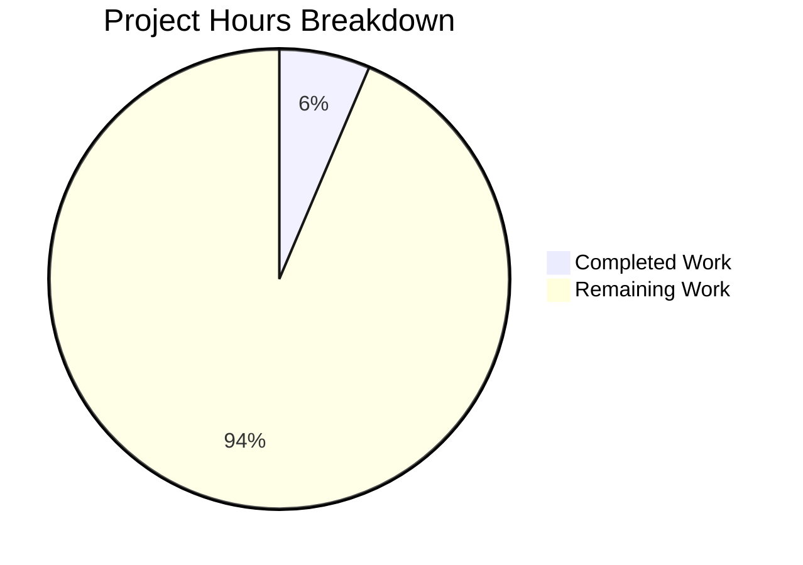
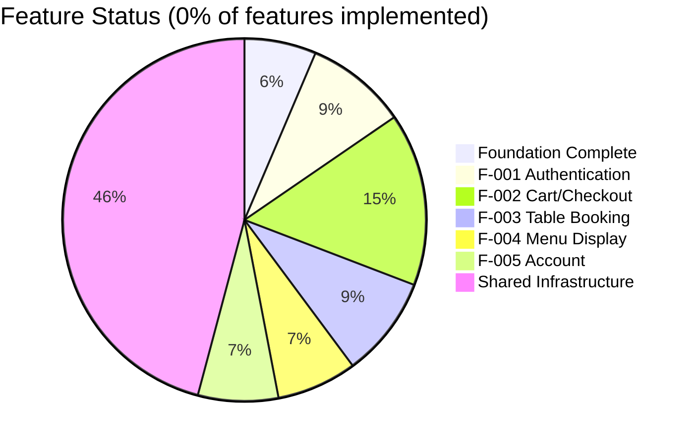

# Burger Restaurant Web Application - Project Guide

## Executive Summary

**Project Completion: 6.4% (17 hours completed out of 266 total hours)**

This project establishes the foundational infrastructure for a Burger Restaurant Web Application built with Vite.js, TypeScript, and React. The application will enable customers to authenticate, browse menus, place online orders, and book tables for dine-in dining experiences.

### Current Status
- **Completed**: Project foundation setup including build tooling, TypeScript configuration, Tailwind CSS theming, and basic application shell
- **Passing**: All validation gates (build, lint, tests)
- **Remaining**: All 5 core features (Authentication, Online Ordering, Menu Display, Table Booking, Account Management)

### Calculation
- **Completed Hours**: 17 hours (configuration, shell, tests, setup/validation)
- **Remaining Hours**: 249 hours (features, components, services, tests)
- **Total Project Hours**: 266 hours
- **Completion Percentage**: 17/266 = 6.4%

---

## Validation Results Summary

### What Was Accomplished

| Validation Gate | Status | Details |
|-----------------|--------|---------|
| Environment Verification | ✅ PASSED | Node.js v20.20.0, npm v11.1.0 |
| Dependency Installation | ✅ PASSED | 303 packages, 0 vulnerabilities |
| TypeScript Compilation | ✅ PASSED | tsc -b completes without errors |
| Vite Build | ✅ PASSED | Built in ~1.2s |
| ESLint | ✅ PASSED | 0 errors, 0 warnings |
| Test Execution | ✅ PASSED | 4/4 tests passing (100%) |
| Dev Server | ✅ PASSED | Starts on localhost:5173 |
| Preview Server | ✅ PASSED | Serves on localhost:4173 |

### Build Output
```
dist/index.html:            0.61 kB (gzip: 0.37 kB)
dist/assets/index-*.css:    7.14 kB (gzip: 2.13 kB)
dist/assets/index-*.js:   195.00 kB (gzip: 61.03 kB)
```

### Files Created (15 total)
| Category | Files |
|----------|-------|
| Configuration | package.json, tsconfig.json, tsconfig.node.json, vite.config.ts, vitest.config.ts, eslint.config.js |
| Build | index.html, .gitignore, .env.example |
| Source | src/main.tsx, src/App.tsx, src/index.css, src/vite-env.d.ts |
| Tests | tests/setup.ts, tests/unit/components/App.test.tsx |

---

## Visual Representation

### Hours Breakdown



### Feature Implementation Status



---

## Comprehensive Development Guide

### 1. System Prerequisites

| Requirement | Version | Verification Command |
|-------------|---------|---------------------|
| Node.js | 20.19+ or 22.12+ | `node --version` |
| npm | 10.x+ | `npm --version` |
| Git | 2.x+ | `git --version` |

**Operating System**: Linux, macOS, or Windows with WSL2

### 2. Environment Setup

```bash
# Clone the repository and checkout the feature branch
git clone <repository-url>
cd burger-restaurant-app
git checkout blitzy-1fcd8e8b-033e-4529-bcfb-af185a1edda2

# Create environment file from template
cp .env.example .env

# Verify Node.js version (must be 20.19+ or 22.12+)
node --version
```

### 3. Dependency Installation

```bash
# Install all dependencies (303 packages)
npm install

# Expected output: "added 303 packages"
# Verify: "0 vulnerabilities"
```

### 4. Application Startup

#### Development Mode
```bash
# Start development server with hot module replacement
npm run dev

# Expected output:
# VITE v6.4.1 ready in ~355 ms
# ➜  Local: http://localhost:5173/
```

#### Production Build
```bash
# Build for production
npm run build

# Expected output:
# ✓ built in ~1.2s
# dist/index.html, dist/assets/*.css, dist/assets/*.js
```

#### Preview Production Build
```bash
npm run preview

# Expected output:
# ➜  Local: http://localhost:4173/
```

### 5. Verification Steps

```bash
# Run linting
npm run lint
# Expected: No output (0 errors, 0 warnings)

# Run tests
npm run test
# Expected: 4 passed (4 total)

# Verify build
npm run build
# Expected: Successful build with no errors
```

### 6. Available Scripts

| Script | Command | Purpose |
|--------|---------|---------|
| `dev` | `npm run dev` | Start development server |
| `build` | `npm run build` | TypeScript compile + Vite build |
| `lint` | `npm run lint` | Run ESLint |
| `test` | `npm run test` | Run Vitest once |
| `test:watch` | `npm run test:watch` | Run Vitest in watch mode |
| `preview` | `npm run preview` | Preview production build |

### 7. Project Structure

```
burger-restaurant-app/
├── index.html              # HTML entry point
├── package.json            # NPM manifest
├── tsconfig.json           # TypeScript config
├── vite.config.ts          # Vite configuration
├── vitest.config.ts        # Vitest configuration
├── eslint.config.js        # ESLint configuration
├── .env.example            # Environment template
├── src/
│   ├── main.tsx            # Application entry point
│   ├── App.tsx             # Root component
│   ├── index.css           # Global styles + Tailwind
│   └── vite-env.d.ts       # Vite type declarations
└── tests/
    ├── setup.ts            # Test environment setup
    └── unit/
        └── components/
            └── App.test.tsx # App component tests
```

### 8. Path Aliases (Pre-configured)

| Alias | Target Path |
|-------|-------------|
| `@/*` | `./src/*` |
| `@components/*` | `./src/components/*` |
| `@features/*` | `./src/features/*` |
| `@services/*` | `./src/services/*` |
| `@types/*` | `./src/types/*` |
| `@utils/*` | `./src/utils/*` |
| `@hooks/*` | `./src/hooks/*` |

### 9. Troubleshooting

| Issue | Solution |
|-------|----------|
| Node.js version error | Install Node.js 20.19+ or 22.12+ using nvm |
| Port 5173 in use | Kill existing process or use `npm run dev -- --port 3000` |
| Build fails | Run `npm ci` to clean install dependencies |
| Tests hang | Run with `npm run test -- --run` |

---

## Detailed Task Table

### Remaining Work Summary
**Total Remaining Hours: 249 hours**

### High Priority Tasks (73 hours)

| Task ID | Task Description | Hours | Priority | Severity |
|---------|------------------|-------|----------|----------|
| HT-001 | Implement routing system with React Router 7.x, lazy loading, and protected route wrappers | 5 | High | Critical |
| HT-002 | Create UI component library (Button, Input, Card, Modal, Loader, Badge, Alert with variants and states) | 15 | High | Critical |
| HT-003 | Implement layout components (Header with navigation, Footer, MainLayout with responsive design) | 10 | High | Critical |
| HT-004 | Build Authentication Feature (F-001): AuthContext, useAuth hook, LoginForm, RegisterForm, LogoutButton, ProtectedRoute | 24 | High | Critical |
| HT-005 | Build Menu Display Feature (F-004): MenuList, MenuItem, CategoryNav, MenuItemDetail with lazy loading | 19 | High | High |

### Medium Priority Tasks (108 hours)

| Task ID | Task Description | Hours | Priority | Severity |
|---------|------------------|-------|----------|----------|
| HT-006 | Build Cart Feature (F-002): CartContext, useCart hook, CartButton, CartDrawer, CartItem, CartSummary with localStorage persistence | 22 | Medium | High |
| HT-007 | Build Checkout Feature (F-002): CheckoutForm with validation, OrderSummary, PaymentSection placeholder | 19 | Medium | High |
| HT-008 | Build Table Booking Feature (F-003): BookingForm, AvailabilityCalendar, TimeSlotPicker, BookingConfirmation | 24 | Medium | High |
| HT-009 | Build Account Management Feature (F-005): AccountDashboard, ProfileForm, OrderHistory, BookingHistory | 19 | Medium | Medium |
| HT-010 | Create all Page components: HomePage, MenuPage, LoginPage, RegisterPage, CartPage, CheckoutPage, BookingPage, AccountPage, OrderConfirmationPage, NotFoundPage | 24 | Medium | High |

### Low Priority Tasks (68 hours)

| Task ID | Task Description | Hours | Priority | Severity |
|---------|------------------|-------|----------|----------|
| HT-011 | Implement API Services layer: axios client with interceptors, auth.api, menu.api, order.api, booking.api with mock data | 16 | Low | Medium |
| HT-012 | Create Shared Utilities and Types: validation schemas with zod, formatters, constants, helpers, type definitions | 18 | Low | Medium |
| HT-013 | Write Unit and Integration Tests: component tests, hook tests, integration flow tests | 15 | Low | Medium |
| HT-014 | Integration testing, bug fixing, and cross-browser validation | 15 | Low | Medium |
| HT-015 | Update README.md with comprehensive documentation, API docs, and component documentation | 4 | Low | Low |

### Task Hours Verification
- High Priority: 5 + 15 + 10 + 24 + 19 = **73 hours**
- Medium Priority: 22 + 19 + 24 + 19 + 24 = **108 hours**
- Low Priority: 16 + 18 + 15 + 15 + 4 = **68 hours**
- **Total Remaining: 249 hours** ✓

---

## Risk Assessment

### Technical Risks

| Risk ID | Risk | Severity | Likelihood | Mitigation |
|---------|------|----------|------------|------------|
| TR-001 | Backend API not yet defined (TBD) | High | High | Use mock data layer; design API service abstraction for easy backend integration |
| TR-002 | React 19 is relatively new; some ecosystem libraries may have compatibility issues | Medium | Medium | Pin dependency versions; test thoroughly before upgrades |
| TR-003 | Tailwind CSS 4.x uses new @theme directive; less community documentation | Low | Medium | Refer to official docs; fallback to traditional config if needed |

### Security Risks

| Risk ID | Risk | Severity | Likelihood | Mitigation |
|---------|------|----------|------------|------------|
| SR-001 | Client-side authentication without backend; tokens stored in sessionStorage | High | Certain | Implement secure token handling when backend is available; use HTTPS only |
| SR-002 | No CSRF protection in current setup | Medium | High | Add CSRF token handling when backend integration occurs |
| SR-003 | Form inputs vulnerable without server-side validation | Medium | High | Implement client-side validation with zod; add server-side when backend ready |

### Operational Risks

| Risk ID | Risk | Severity | Likelihood | Mitigation |
|---------|------|----------|------------|------------|
| OR-001 | No monitoring or logging infrastructure | Medium | Certain | Add error boundary logging; integrate monitoring service before production |
| OR-002 | No health check endpoints | Low | Certain | Will be implemented with backend; frontend has basic error states |
| OR-003 | Cart data persisted only in localStorage; no sync across devices | Medium | Certain | Add backend cart sync when API available |

### Integration Risks

| Risk ID | Risk | Severity | Likelihood | Mitigation |
|---------|------|----------|------------|------------|
| IR-001 | API contracts undefined; may require significant changes | High | High | Design flexible API abstraction layer; use TypeScript interfaces |
| IR-002 | Payment integration not specified | High | Certain | PaymentSection is placeholder; will need significant work for real integration |
| IR-003 | No authentication backend | High | Certain | Mock auth flow; design for easy OAuth/JWT integration |

---

## Completed Hours Breakdown

| Component | Hours | Details |
|-----------|-------|---------|
| Project Configuration | 9h | package.json, tsconfig files, vite.config.ts, vitest.config.ts, eslint.config.js |
| Build Setup | 1h | index.html, .gitignore, .env.example |
| Application Shell | 4h | main.tsx, App.tsx with basic component, index.css with Tailwind theme |
| Test Infrastructure | 2h | setup.ts, App.test.tsx with 4 tests |
| Setup & Validation | 1h | npm install, build verification, test verification |
| **Total Completed** | **17h** | |

---

## Technology Stack Verified

| Technology | Version | Status |
|------------|---------|--------|
| Node.js | 20.20.0 | ✅ Compatible |
| npm | 11.1.0 | ✅ Compatible |
| Vite | 6.4.1 | ✅ Working |
| TypeScript | 5.8.3 | ✅ Strict mode enabled |
| React | 19.1.0 | ✅ Working |
| React DOM | 19.1.0 | ✅ Working |
| React Router | 7.6.2 | ✅ Installed (not yet used) |
| Tailwind CSS | 4.1.8 | ✅ Working with @theme |
| Vitest | 3.2.4 | ✅ 100% tests passing |
| ESLint | 9.29.0 | ✅ 0 errors/warnings |

---

## Recommendations

### Immediate Actions
1. **Start with routing (HT-001)** - Required for navigation between pages
2. **Build UI component library (HT-002)** - Foundation for all features
3. **Implement Authentication (HT-004)** - Required for protected features

### Suggested Development Order
1. Routing → UI Components → Layout
2. Authentication → Protected Routes
3. Menu Display → Cart/Checkout
4. Table Booking → Account Management
5. Services → Utilities → Tests
6. Documentation

### Production Readiness Checklist
- [ ] All 5 core features implemented
- [ ] Authentication integrated with backend
- [ ] Payment processing configured
- [ ] Comprehensive test coverage (>80%)
- [ ] Performance optimization completed
- [ ] Security audit passed
- [ ] Monitoring and logging configured
- [ ] Documentation complete

---

## Conclusion

The Burger Restaurant Web Application foundation is **6.4% complete** with 17 hours of work accomplished. The project has a solid technical foundation with all validation gates passing. Approximately **249 hours** of development work remains to implement all 5 core features specified in the Agent Action Plan.

**Key Achievements:**
- ✅ Modern build tooling configured (Vite 6.x + TypeScript 5.x)
- ✅ React 19 with Tailwind CSS 4.x integration
- ✅ Path aliases for clean imports
- ✅ Testing infrastructure with Vitest
- ✅ ESLint for code quality
- ✅ 100% test pass rate (4/4 tests)

**Critical Next Steps:**
1. Implement routing system
2. Create UI component library
3. Build Authentication feature (F-001)
4. Implement Menu Display feature (F-004)
5. Build Cart and Checkout features (F-002)