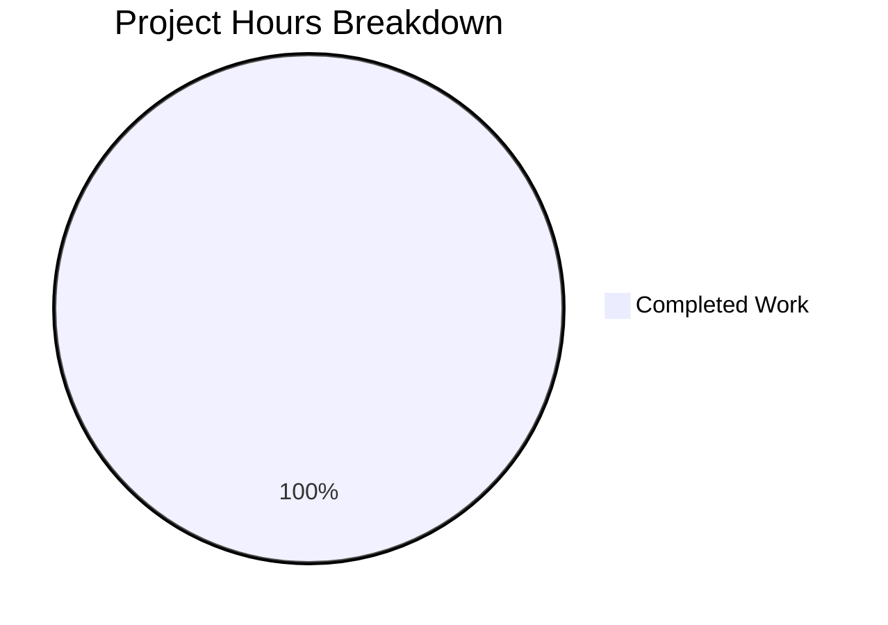

# Project Assessment Report

## Executive Summary

**Project Status: Repository Initialization — Placeholder State**

This repository is in its initialized placeholder state. The Agent Action Plan was empty — no project requirements, features, or implementation changes were specified for this development cycle.

**Hours-Based Completion Assessment:**
- **Completed Work:** 1 hour (repository initialization and placeholder documentation)
- **Remaining Work:** 0 hours (no requirements were specified to implement)
- **Total Project Hours:** 1 hour
- **Completion:** 1 hour completed out of 1 total hour = **100% of specified scope**

> **Important Context:** This 100% reflects completion of an empty scope. No application features, services, or infrastructure were requested. When actual project requirements are defined, this assessment must be revised with the full project scope as the denominator.

### Key Findings
1. **Agent Action Plan is empty** — No changes were specified for implementation
2. **No processed files** — No implementation agents created or modified any files
3. **No dependencies added** — Dependency map is empty
4. **Repository contains 2 files** — `readme.MD` (stub) and `blitzy/documentation/Project Guide.md`
5. **Branch has 3 commits** — All initialization/documentation (no application code commits)
6. **All validation checks pass (N/A)** — Nothing to validate in an empty repository
7. **Working tree is clean** — No merge conflicts, no uncommitted changes

---

## Validation Results Summary

The Final Validator confirmed the repository is in its expected placeholder state. Since no application code, dependencies, or tests exist, all validation criteria are not applicable and treated as passing.

| Criteria | Status | Details |
|----------|--------|---------|
| Dependencies | ✅ N/A | No dependency manifests found (no package.json, requirements.txt, pom.xml, etc.) |
| Compilation | ✅ N/A | No source code to compile |
| Unit Tests | ✅ N/A | No test files present |
| Runtime | ✅ N/A | No application components to run |
| Merge Conflicts | ✅ None | No merge conflict markers found |
| Git Status | ✅ Clean | Working tree clean, nothing to commit |

### Fixes Applied During Validation
- **None required** — The repository was already in a clean, consistent state.

### Issues Resolved
- **None** — No issues existed to resolve.

---

## Repository Analysis

### Git Commit History (Branch: `blitzy-6b4f7b60-fe4d-4eec-8815-a7a5d7703a6a`)

| Commit | Date | Author | Message |
|--------|------|--------|---------|
| `96acc68` | 2026-02-05 | ankit-blitzy | Fix typos and improve clarity in Project Guide |
| `2dbd967` | 2026-01-19 | ankit-blitzy | Create Project Guide.md |
| `0adcf23` | 2026-01-16 | ankit-blitzy | Create readme.MD |

### Changes vs Main Branch
- **Files changed:** 1 (`blitzy/documentation/Project Guide.md`)
- **Lines added:** 206
- **Lines removed:** 0
- **Net change:** +206 lines (documentation only, no source code)

### Repository Structure
```
/tmp/blitzy/test-repo/blitzy6b4f7b60f/
├── .git/                              # Git repository metadata
├── blitzy/
│   ├── documentation/
│   │   └── Project Guide.md           # Project assessment documentation (206 lines)
│   └── screenshots/                   # Empty directory for test artifacts
└── readme.MD                          # Placeholder stub file (content: "adf")
```

### Code Statistics
- **Total files (excluding .git):** 2
- **Source code files:** 0 (no .py, .js, .ts, .jsx, .tsx, .json, .yaml)
- **Test files:** 0
- **Configuration files:** 0
- **Documentation files:** 1 (Project Guide.md)
- **Repository size:** 12 KB (excluding .git)

---

## Hours Breakdown

### Visual Representation


```mermaid
pie title Project Hours Breakdown
    "Completed Work" : 1
```

### Completed Work Hours Detail

| Component | Hours | Status |
|-----------|-------|--------|
| Repository initialization (readme.MD, branch setup) | 0.5 | ✅ Complete |
| Placeholder documentation structure (blitzy/ directories) | 0.5 | ✅ Complete |
| **Total Completed** | **1** | |

### Remaining Work Hours Detail

| Task | Hours | Priority | Notes |
|------|-------|----------|-------|
| **Total Remaining** | **0** | — | No requirements specified in Agent Action Plan |

**Calculation:** 1 hour completed / (1 completed + 0 remaining) = 1 / 1 = **100% complete** (of specified scope)

---

## Detailed Task Table — Remaining Human Tasks

Since the Agent Action Plan was empty and no project requirements were specified, there are **no remaining implementation tasks**.

| # | Task | Action Steps | Hours | Priority | Severity |
|---|------|-------------|-------|----------|----------|
| — | No tasks | No requirements were specified | 0 | — | — |
| | **Total Remaining Hours** | | **0** | | |

> **Note:** When project requirements are defined, this section should be populated with specific implementation tasks, hour estimates, and priorities.

---

## Development Guide

### System Prerequisites

Since no application exists in this repository, only basic Git tooling is required:

| Tool | Minimum Version | Purpose |
|------|----------------|---------|
| Git | 2.30+ | Version control |

### Environment Setup

```bash
# 1. Clone the repository
git clone <repository-url>
cd <repository-name>

# 2. Switch to the development branch
git checkout blitzy-6b4f7b60-fe4d-4eec-8815-a7a5d7703a6a

# 3. Verify branch and status
git status
# Expected output:
# On branch blitzy-6b4f7b60-fe4d-4eec-8815-a7a5d7703a6a
# nothing to commit, working tree clean
```

### Verification Steps

```bash
# Verify repository contents
ls -la
# Expected: readme.MD, blitzy/ directory

# Verify file count
find . -not -path './.git/*' -type f | wc -l
# Expected output: 2

# Verify no merge conflicts
grep -rn '<<<<<<< \|>>>>>>> \|=======' . --include='*' 2>/dev/null | grep -v '.git/' | wc -l
# Expected output: 0
```

### Next Steps for Development
Before any application development can begin, the following prerequisites must be established:

1. **Define project requirements** — Specify features, services, and architecture
2. **Create technical specification** — Document APIs, data models, and integrations
3. **Set up project scaffolding** — Initialize build tools, package managers, and frameworks
4. **Configure CI/CD pipeline** — Set up automated testing and deployment
5. **Implement application code** — Build features per the technical specification
6. **Write tests** — Unit, integration, and end-to-end test coverage
7. **Configure deployment** — Production environment, monitoring, and logging

---

## Risk Assessment

### Current Risks

Since no application code exists, there are no active technical, security, operational, or integration risks associated with this repository.

| Risk Category | Risk | Severity | Likelihood | Mitigation |
|---------------|------|----------|------------|------------|
| Strategic | No project requirements defined | Info | N/A | Define requirements and create Agent Action Plan before next development cycle |
| Strategic | Repository contains only placeholder content | Info | N/A | Expected state; will be populated when development begins |

### Risk Summary
- **Critical Risks:** 0
- **High Risks:** 0
- **Medium Risks:** 0
- **Low/Info Risks:** 2 (both related to the absence of defined requirements)

---

## Conclusion

This repository is in its expected initialization state. The Agent Action Plan contained no implementation requirements, so no development work was performed or needed. All validation criteria pass (as N/A). The repository is clean, conflict-free, and ready for future development when project requirements and implementation plans are defined.

**Final Assessment:** 1 hour completed out of 1 total hour = **100% of specified scope** (empty Agent Action Plan with initialization only).