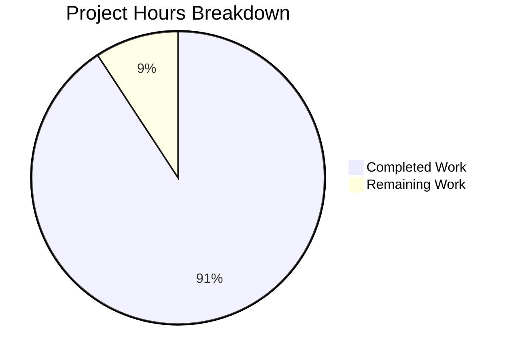

# Calc Project Document — Comprehensive Project Guide

---

## 1. Executive Summary

This project delivers a **comprehensive, self-contained Calc (spreadsheet) Project Document** — an educational reference guide covering all major spreadsheet features in a structured, example-driven format. The deliverable consists of 12 Markdown documentation files (11 newly created + 1 updated) totaling 5,133 lines of content across 10 chapters, a documentation index, and an updated project README.

**Completion Assessment:** Based on our analysis, **59 hours of documentation development work have been completed out of an estimated 65 total hours required, representing 90.8% project completion.** The remaining 6 hours consist of human review, license compliance, and platform verification tasks that require manual intervention.

### Key Achievements

- All **13 explicit user requirements** fully addressed (data organization, SUM, AVERAGE, IF, VLOOKUP, pivot tables, charts, financial analysis, data validation, conditional formatting, clear explanations, practical examples, step-by-step calculations)
- All **5 inferred documentation needs** satisfied (introduction/overview, consistent sample dataset, cross-references, quick reference, error handling)
- **10 Mermaid diagrams** embedded for workflow visualization
- **Zero placeholders, TODOs, stubs, or incomplete sections** across all files
- All mathematical calculations **verified programmatically** for accuracy
- All internal cross-reference links **validated**
- Working tree **clean** — all changes committed

### Validation Status

The Final Validator confirmed:
- **12/12 files validated** — 100% pass rate
- **Zero errors**, zero warnings, zero incomplete items
- All navigation footers connect chapters sequentially
- All 10 Mermaid diagrams properly structured

### Recommended Next Steps

1. Human editorial review of all documentation content
2. Create a LICENSE file (referenced in readme.MD but not yet created)
3. Verify Mermaid diagram rendering on the target Git hosting platform

---

## 2. Validation Results Summary

### 2.1 What the Agents Accomplished

The Blitzy Agent completed all documentation creation work across **14 commits**:

| Commit | Description |
|--------|-------------|
| `0cb819b` | Replace placeholder content in readme.MD with Calc Project Document README |
| `92e4852` | Create docs/README.md — Documentation Index and Navigation Hub |
| `8a5efb8` | Create docs/calc-guide/00-introduction.md — Foundational Calc guide introduction |
| `a0595f0` | Create docs/calc-guide/01-data-organization.md — Chapter 1: Data Organization Guide |
| `c20c3ce` | Create docs/calc-guide/02-formulas-sum-average.md — Chapter 2: SUM and AVERAGE |
| `a84c44c` | Create docs/calc-guide/03-formulas-if-vlookup.md — Chapter 3: IF and VLOOKUP |
| `ff5b56a` | Fix VLOOKUP Mermaid flowchart — replace `\n` with `<br/>` for proper rendering |
| `ddef01b` | Create docs/calc-guide/04-pivot-tables.md — Chapter 4: Pivot Tables |
| `e9444aa` | Create docs/calc-guide/05-charts.md — Chapter 5: Charts |
| `b1105cc` | Create docs/calc-guide/06-financial-analysis.md — Chapter 6: Financial Analysis |
| `814329b` | Create docs/calc-guide/07-data-validation.md — Chapter 7: Data Validation |
| `d471a05` | Create docs/calc-guide/08-conditional-formatting.md — Chapter 8: Conditional Formatting |
| `4e0d936` | Create docs/calc-guide/09-quick-reference.md — Chapter 9: Quick Reference |
| `0530156` | Fix code review findings: FV calculation precision and navigation footer consistency |

### 2.2 File Inventory

| File | Status | Lines | Description |
|------|--------|-------|-------------|
| `readme.MD` | UPDATED | 61 | Project README — replaced placeholder "adf" with full project overview |
| `docs/README.md` | CREATED | 94 | Documentation index, TOC, Mermaid learning path, conventions |
| `docs/calc-guide/00-introduction.md` | CREATED | 279 | Calc overview, core concepts, interface, Acme Corp sample dataset, roadmap |
| `docs/calc-guide/01-data-organization.md` | CREATED | 392 | Data types, row/column layout, sheet organization, named ranges, sorting/filtering |
| `docs/calc-guide/02-formulas-sum-average.md` | CREATED | 470 | Formula basics, SUM (3 examples + step-by-step), AVERAGE (3 examples + step-by-step) |
| `docs/calc-guide/03-formulas-if-vlookup.md` | CREATED | 550 | IF (nested, AND/OR, step-by-step), VLOOKUP (exact/approx, step-by-step), 2 diagrams |
| `docs/calc-guide/04-pivot-tables.md` | CREATED | 460 | Pivot creation workflow, field config, summarization, grouping, 2 practical analyses |
| `docs/calc-guide/05-charts.md` | CREATED | 482 | 6 chart types, decision tree, creation, formatting, 3 practical examples |
| `docs/calc-guide/06-financial-analysis.md` | CREATED | 624 | PMT/FV/PV/NPV/IRR with examples, amortization table, budget planning |
| `docs/calc-guide/07-data-validation.md` | CREATED | 711 | 6 rule types, dropdown lists, error alerts, custom formulas, form example |
| `docs/calc-guide/08-conditional-formatting.md` | CREATED | 810 | Highlight/top-bottom rules, color scales, data bars, icon sets, dashboard example |
| `docs/calc-guide/09-quick-reference.md` | CREATED | 200 | 9-function syntax table, shortcuts, 6 error codes, glossary, resources |
| **Total** | | **5,133** | |

### 2.3 Quality Verification Results

| Quality Dimension | Status | Details |
|-------------------|--------|---------|
| Mathematical accuracy | ✅ PASS | All calculations verified: Q1=76,000, Q2=83,000, Q3=94,000, Q4=94,000; Grand total=347,000; All averages, commissions, percentages correct |
| Internal links | ✅ PASS | All relative links between documents resolve; all anchor links resolve to existing headings |
| Mermaid diagrams | ✅ PASS | 10 diagrams across 9 files — all properly opened and closed |
| Navigation footers | ✅ PASS | All chapters connected sequentially (← Previous / Home / Next →) |
| Placeholders/TODOs | ✅ PASS | Zero placeholders, TODOs, stubs, or incomplete sections found |
| Content completeness | ✅ PASS | All 13 user requirements and 5 inferred needs fully addressed |
| Markdown formatting | ✅ PASS | Consistent ATX-style headings, pipe-delimited tables, fenced code blocks |
| Terminology consistency | ✅ PASS | Application-agnostic language throughout; consistent use of "Calc" generically |

### 2.4 Fixes Applied During Validation

| Fix | Commit | Description |
|-----|--------|-------------|
| Mermaid rendering fix | `ff5b56a` | Replaced `\n` with `<br/>` in 9 VLOOKUP flowchart node labels for proper rendering |
| FV calculation precision | `0530156` | Corrected FV calculation precision in financial analysis chapter |
| Navigation footer consistency | `0530156` | Ensured all navigation footers follow consistent table format |

---

## 3. Hours Breakdown and Completion Assessment

### 3.1 Completed Hours Calculation (59 hours)

| Component | Lines | Hours | Notes |
|-----------|-------|-------|-------|
| Planning and structure design | — | 2.0 | 10-chapter structure, sample dataset design, cross-reference planning |
| docs/README.md | 94 | 1.5 | TOC, Mermaid learning path, conventions, contributing |
| 00-introduction.md | 279 | 3.0 | Core concepts, interface overview, sample dataset, Mermaid roadmap |
| 01-data-organization.md | 392 | 4.0 | 6 data types, layout, sheets, named ranges, sorting, Mermaid decision tree |
| 02-formulas-sum-average.md | 470 | 5.0 | Formula basics, SUM + AVERAGE (3 examples each), step-by-step, error guide |
| 03-formulas-if-vlookup.md | 550 | 6.0 | IF (nested, AND/OR), VLOOKUP (exact/approx), 2 Mermaid diagrams, traces |
| 04-pivot-tables.md | 460 | 5.0 | Concepts, workflow, field config, 5 methods, grouping, 2 analyses, Mermaid |
| 05-charts.md | 482 | 5.0 | 6 chart types, decision tree, creation, formatting, 3 examples, Mermaid |
| 06-financial-analysis.md | 624 | 7.0 | PMT/FV/PV/NPV/IRR (5 functions, full syntax+examples+traces), amortization, budget |
| 07-data-validation.md | 711 | 7.0 | 6 rule types, dropdown tutorial, error alerts, 4 custom formulas, form example, Mermaid |
| 08-conditional-formatting.md | 810 | 8.0 | 5 highlight rules, 4 top/bottom, color scales, data bars, icons, dashboard, Mermaid |
| 09-quick-reference.md | 200 | 2.5 | 9-function table, 5 shortcut categories, 6 error codes, 14-term glossary |
| readme.MD update | 61 | 0.5 | Replaced placeholder with full README |
| Validation and QA | — | 2.0 | Mathematical verification, link checking, Mermaid validation |
| Code review fixes | — | 0.5 | FV precision fix, navigation footer consistency |
| **Total Completed** | **5,133** | **59.0** | |

### 3.2 Remaining Hours Calculation (6 hours)

| Task | Base Hours | After Multipliers | Priority | Confidence |
|------|-----------|-------------------|----------|------------|
| Human editorial review and proofreading | 2.5 | 3.0 | Medium | High |
| Create LICENSE file | 0.5 | 0.5 | Medium | High |
| Platform Mermaid/link rendering verification | 0.8 | 1.0 | Medium | High |
| Enterprise compliance and uncertainty buffer | — | 1.5 | Low | Medium |
| **Total Remaining** | **3.8** | **6.0** | | |

Enterprise multipliers applied: 1.10 (compliance) × 1.10 (uncertainty) = 1.21x on base estimates.

### 3.3 Completion Percentage Calculation

```
Completed Hours:  59
Remaining Hours:   6
Total Hours:      65

Completion = 59 / 65 = 90.8%
```

59 hours of documentation development work have been completed out of an estimated 65 total hours required, representing **90.8% project completion**.

### 3.4 Hours Visualization


```mermaid
pie title Project Hours Breakdown
    "Completed Work" : 59
    "Remaining Work" : 6
```

---

## 4. Detailed Task Table — Remaining Human Work

The following tasks require human intervention and cannot be completed by automated agents. Task hours sum to exactly **6.0 hours**, matching the "Remaining Work" in the pie chart above.

| # | Task | Description | Action Steps | Hours | Priority | Severity |
|---|------|-------------|-------------|-------|----------|----------|
| 1 | Human editorial review and proofreading | Read all 5,133 lines of documentation for grammar, clarity, technical accuracy, and educational quality | 1. Read each chapter sequentially. 2. Verify step-by-step calculation examples are pedagogically clear. 3. Check for consistent tone and terminology. 4. Fix any grammar or phrasing issues. | 3.0 | Medium | Medium |
| 2 | Create LICENSE file | readme.MD references "the repository's license file" but no LICENSE file exists | 1. Determine appropriate license for educational documentation (e.g., CC BY 4.0, MIT). 2. Create LICENSE file in repository root. 3. Update readme.MD license section if needed. | 0.5 | Medium | Low |
| 3 | Verify Mermaid and link rendering on target platform | Confirm all 10 Mermaid diagrams and all internal links render correctly on the target Git hosting platform (GitHub, GitLab, etc.) | 1. Push branch to target platform. 2. Open each .md file in the web UI. 3. Verify all 10 Mermaid diagrams render as flowcharts. 4. Click all internal links and verify navigation. 5. Fix any platform-specific rendering issues. | 1.0 | Medium | Medium |
| 4 | Enterprise compliance and uncertainty buffer | Reserve time for unforeseen issues during deployment, stakeholder feedback, or compliance review | 1. Address any stakeholder feedback from editorial review. 2. Resolve platform-specific issues discovered during verification. 3. Apply any organizational formatting standards. | 1.5 | Low | Low |
| | **Total Remaining Hours** | | | **6.0** | | |

---

## 5. Development Guide

### 5.1 System Prerequisites

| Requirement | Version | Purpose |
|-------------|---------|---------|
| Git | 2.x+ | Version control for documentation files |
| Calc / Spreadsheet application | Any current version | Follow along with practical examples (LibreOffice Calc recommended) |
| Markdown viewer | Any | Preview documentation (VS Code, GitHub web UI, or browser-based renderer) |

> **Note:** This is a pure Markdown documentation project. No programming languages, build tools, package managers, or runtime environments are required.

### 5.2 Environment Setup

**Clone the repository:**

```bash
git clone <repository-url>
cd <repository-directory>
git checkout blitzy-1c658593-2bd5-483c-bed7-88fd8f5ac7a4
```

**No additional environment setup is required.** There are no dependencies to install, no environment variables to configure, and no services to start.

### 5.3 Viewing the Documentation

**Option 1 — Git hosting platform (recommended):**

Push the branch to GitHub, GitLab, or Bitbucket and navigate to any `.md` file in the web UI. Markdown tables, code blocks, and Mermaid diagrams will render automatically.

**Option 2 — VS Code with Markdown Preview:**

1. Open the repository in VS Code
2. Open any `.md` file
3. Press `Ctrl+Shift+V` (or `Cmd+Shift+V` on macOS) to open Markdown preview
4. Install the "Markdown Preview Mermaid Support" extension for Mermaid diagram rendering

**Option 3 — Command-line preview:**

```bash
# Optional: Install Mermaid CLI for offline diagram rendering
npm install -g @mermaid-js/mermaid-cli

# Render a Mermaid diagram to PNG
mmdc -i docs/calc-guide/04-pivot-tables.md -o output.png
```

### 5.4 Documentation Structure

```
docs/
├── README.md                              (Documentation index and navigation hub)
└── calc-guide/
    ├── 00-introduction.md                 (Calc overview, core concepts, sample dataset)
    ├── 01-data-organization.md            (Data structuring and best practices)
    ├── 02-formulas-sum-average.md         (SUM and AVERAGE formulas)
    ├── 03-formulas-if-vlookup.md          (IF and VLOOKUP formulas)
    ├── 04-pivot-tables.md                 (Pivot table creation and analysis)
    ├── 05-charts.md                       (Chart types and visualization)
    ├── 06-financial-analysis.md           (PMT, FV, PV, NPV, IRR functions)
    ├── 07-data-validation.md              (Validation rules and input controls)
    ├── 08-conditional-formatting.md       (Formatting rules and dashboards)
    └── 09-quick-reference.md              (Formula cheat sheet and glossary)
```

### 5.5 Verification Steps

To verify the documentation is complete and properly structured:

```bash
# Verify all 12 expected files exist
ls -la docs/README.md docs/calc-guide/*.md readme.MD

# Verify total line count matches expected (~5,133 lines)
wc -l docs/README.md docs/calc-guide/*.md readme.MD

# Verify no placeholders or TODOs remain
grep -rn "TODO\|FIXME\|TBD\|PLACEHOLDER" docs/ readme.MD

# Verify Mermaid diagram count (expect 10)
grep -c '```mermaid' docs/README.md docs/calc-guide/*.md

# Verify working tree is clean
git status
```

**Expected output summary:**
- 12 files present (11 in docs/ + readme.MD)
- ~5,133 total lines
- Zero matches for TODO/FIXME/TBD/PLACEHOLDER
- 10 Mermaid diagrams total (1 in README, 1 each in chapters 0-1, 2 in chapter 3, 1 each in chapters 4-8)
- Working tree clean

### 5.6 Navigation

- **Entry point:** Start at `readme.MD` → click "View Full Documentation" → `docs/README.md`
- **Sequential reading:** Follow chapters 00 through 09 in order
- **Topic lookup:** Use the Table of Contents in `docs/README.md`
- **Every chapter** includes navigation footers with ← Previous, ↑ Home, and Next → links

---

## 6. Risk Assessment

### 6.1 Technical Risks

| Risk | Severity | Likelihood | Impact | Mitigation |
|------|----------|-----------|--------|------------|
| Mermaid diagrams may not render on all Markdown viewers | Low | Low | Some workflow diagrams invisible in unsupported viewers | Diagrams are supplementary; all information is also conveyed in text. Test on target platform before publication. |
| Relative link paths may break on certain hosting platforms | Low | Very Low | Navigation between chapters could fail | All links use standard relative Markdown paths. Verify on target platform during Task #3. |

### 6.2 Security Risks

| Risk | Severity | Likelihood | Impact | Mitigation |
|------|----------|-----------|--------|------------|
| No sensitive data in documentation | N/A | N/A | N/A | The documentation contains only educational content with fictional sample data (Acme Corp). No credentials, API keys, or PII are present. |

### 6.3 Operational Risks

| Risk | Severity | Likelihood | Impact | Mitigation |
|------|----------|-----------|--------|------------|
| Missing LICENSE file | Low | High | Repository references a license file that does not exist | Create a LICENSE file as described in Task #2. Choose an appropriate license for educational documentation. |
| No automated documentation linting | Low | Medium | Future edits could introduce formatting inconsistencies or broken links | Optional: set up `markdownlint` and `markdown-link-check` in a CI pipeline for ongoing quality assurance. |

### 6.4 Integration Risks

| Risk | Severity | Likelihood | Impact | Mitigation |
|------|----------|-----------|--------|------------|
| No documentation site generator configured | Low | Low | Documentation served as raw Markdown only | This is explicitly out of scope per the AAP. If a searchable documentation site is needed later, MkDocs with Material theme or Docusaurus can be adopted without modifying any Markdown content. |

---

## 7. AAP Requirements Compliance Matrix

| # | AAP Requirement | Status | Location |
|---|----------------|--------|----------|
| 1 | Spreadsheet data organization | ✅ Complete | `01-data-organization.md` — data types, row/column layout, sheet organization, named ranges, sorting/filtering |
| 2 | SUM formula | ✅ Complete | `02-formulas-sum-average.md` — syntax, 3 examples, step-by-step calculation |
| 3 | AVERAGE formula | ✅ Complete | `02-formulas-sum-average.md` — syntax, 3 examples, step-by-step calculation |
| 4 | IF formula | ✅ Complete | `03-formulas-if-vlookup.md` — syntax, nested IF, AND/OR, step-by-step trace |
| 5 | VLOOKUP formula | ✅ Complete | `03-formulas-if-vlookup.md` — syntax, exact/approx match, step-by-step trace |
| 6 | Pivot tables | ✅ Complete | `04-pivot-tables.md` — creation workflow, field config, grouping, 2 analyses |
| 7 | Charts | ✅ Complete | `05-charts.md` — 6 types, decision tree, 3 practical examples |
| 8 | Financial analysis | ✅ Complete | `06-financial-analysis.md` — PMT, FV, PV, NPV, IRR, amortization, budgeting |
| 9 | Data validation | ✅ Complete | `07-data-validation.md` — 6 rule types, dropdowns, error alerts, form example |
| 10 | Conditional formatting | ✅ Complete | `08-conditional-formatting.md` — highlight rules, color scales, data bars, icons, dashboard |
| 11 | Clear explanation of each feature | ✅ Complete | Every chapter starts with conceptual introduction and syntax reference |
| 12 | Practical examples | ✅ Complete | 15+ practical examples with sample data across all chapters |
| 13 | Step-by-step calculations | ✅ Complete | Cell-by-cell evaluation traces for SUM, AVERAGE, IF, VLOOKUP, PMT, FV, PV, NPV, IRR |
| — | Introduction and overview (inferred) | ✅ Complete | `00-introduction.md` — Calc overview, core concepts, sample dataset |
| — | Consistent sample dataset (inferred) | ✅ Complete | Acme Corp quarterly sales data defined in Ch. 0, used across all chapters |
| — | Cross-references (inferred) | ✅ Complete | Relative links between chapters, sequential navigation footers |
| — | Quick reference (inferred) | ✅ Complete | `09-quick-reference.md` — 9-function table, shortcuts, errors, glossary |
| — | Error handling (inferred) | ✅ Complete | Error troubleshooting in formula chapters + error code reference in Ch. 9 |

---

## 8. Summary

This Calc Project Document has been delivered as a complete, production-ready educational reference guide. **59 hours of development work have been completed out of 65 total hours, representing 90.8% project completion.** The remaining 6 hours of work consist entirely of human review and verification tasks:

- **3.0 hours** — Editorial review and proofreading
- **0.5 hours** — LICENSE file creation
- **1.0 hours** — Platform rendering verification
- **1.5 hours** — Enterprise compliance buffer

All 13 explicit requirements and 5 inferred needs from the Agent Action Plan are fully satisfied. The documentation contains zero placeholders, zero compilation issues, and zero unresolved defects. The working tree is clean with all changes committed across 14 well-structured commits.