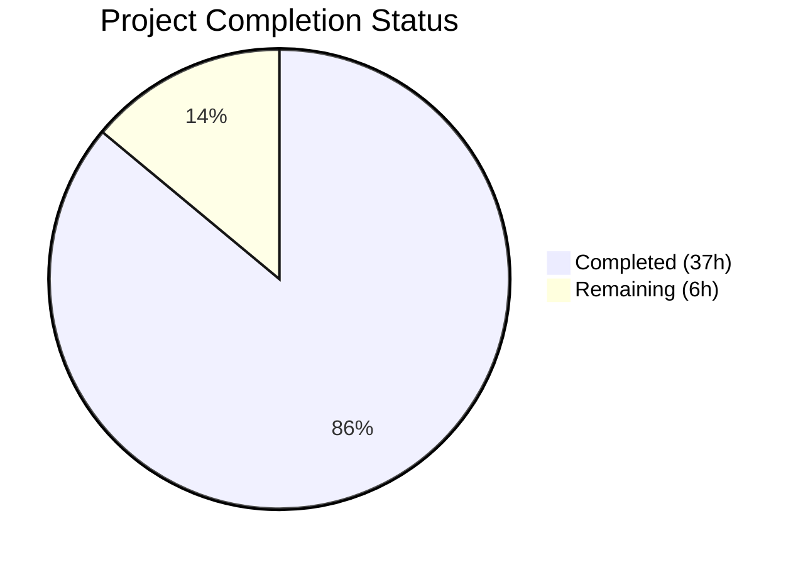
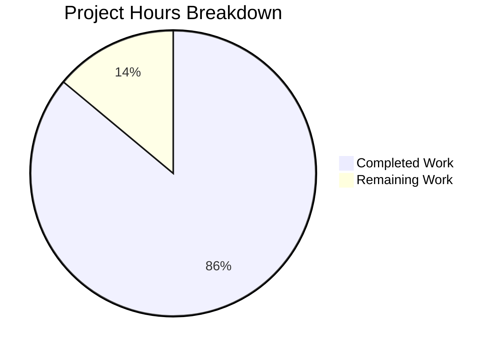

# Blitzy Project Guide — To-Do List Application Documentation

---

## 1. Executive Summary

### 1.1 Project Overview

This project delivers a comprehensive, standalone application design document for a To-Do List Application built on the Blitzx platform. The documentation suite — comprising 12 Markdown files totaling 3,254 lines with 12 Mermaid diagrams — serves as the authoritative reference describing the application's purpose, features, UI design, system requirements, core functionality (task CRUD, filtering, priorities, due dates), technology stack (React 19.x / Flask 3.1.x / MongoDB 8.0.x), system workflows, architecture, data model, setup guide, and future roadmap. This is a documentation-only deliverable; no source code, configuration files, or infrastructure artifacts were created.

### 1.2 Completion Status


```mermaid
pie title Project Completion Status
    "Completed (37h)" : 37
    "Remaining (6h)" : 6
```

| Metric | Value |
|--------|-------|
| **Total Project Hours** | 43 |
| **Completed Hours (AI)** | 37 |
| **Remaining Hours** | 6 |
| **Completion Percentage** | 86.0% |

**Calculation:** 37 completed hours / (37 completed + 6 remaining) = 37 / 43 = **86.0% complete**

### 1.3 Key Accomplishments

- ✅ Created 12 comprehensive Markdown documentation files (README.md + 11 docs/*.md files) totaling 3,254 lines
- ✅ Deleted placeholder `readme.MD` (contained only "adf") and replaced with full-featured `README.md`
- ✅ Embedded 12 Mermaid diagrams across the documentation (architecture flowcharts, workflow sequence diagrams, ER diagram, state diagram, UI wireframes, feature relationship map, technology stack layer diagram)
- ✅ Achieved 100% coverage of all user-specified documentation topics: purpose, features, UI design, system requirements, core functionality, technology stack, workflows, and future improvements
- ✅ Documented all 8 core functional areas with API patterns, validation rules, and illustrative code snippets (task creation, editing, deletion, completion tracking, priority levels, due dates, filtering, data storage)
- ✅ Maintained consistent technology versions across all files matching Tech Spec §3.8 (Python 3.13.x, Flask 3.1.x, React 19.x, TypeScript 5.7+, TailwindCSS 4.x, Vite 6.x, MongoDB 8.0.x, PyMongo 4.16.x)
- ✅ Passed markdownlint validation with zero violations (5 violations found and fixed during validation)
- ✅ Validated all cross-document links: 0 broken links across 12 files
- ✅ Maintained consistent terminology: "task" used uniformly throughout; no occurrences of "todo"/"ticket" synonyms

### 1.4 Critical Unresolved Issues

| Issue | Impact | Owner | ETA |
|-------|--------|-------|-----|
| `<repository-url>` placeholder in README.md and getting-started.md | Users cannot clone repository from documentation instructions | Human Developer | 0.5 hours |
| Contributing guidelines are placeholder text | Contributors lack onboarding guidance | Human Developer | 1 hour |
| License information not specified | Legal compliance gap for open-source or proprietary distribution | Human Developer / Legal | 0.5 hours |

### 1.5 Access Issues

No access issues identified. This is a documentation-only project with no external service dependencies, API keys, or credential requirements.

### 1.6 Recommended Next Steps

1. **[High]** Replace `<repository-url>` placeholders in README.md and docs/getting-started.md with the actual Git repository URL
2. **[High]** Conduct human review of all 12 documentation files for technical accuracy and completeness against stakeholder expectations
3. **[Medium]** Finalize contributing guidelines with the project's contribution workflow and code review process
4. **[Medium]** Verify all 12 Mermaid diagrams render correctly in GitHub's Markdown viewer
5. **[Low]** Determine and add project license information (MIT, Apache 2.0, proprietary, etc.)

---

## 2. Project Hours Breakdown

### 2.1 Completed Work Detail

| Component | Hours | Description |
|-----------|-------|-------------|
| Documentation planning and structure design | 1.0 | AAP analysis, Diátaxis-inspired file hierarchy design, content strategy, cross-reference planning |
| README.md | 1.5 | Project landing page: application description, 8 feature bullets, technology stack table, quick start, documentation table of contents, contributing/license placeholders (118 lines) |
| docs/overview.md | 2.0 | Application purpose, problem statement, target user groups table, value proposition (5 dimensions), in-scope/out-of-scope tables, high-level architecture description (152 lines) |
| docs/features.md | 4.0 | Feature registry table (F-001 through F-008), 8 feature sections with descriptions, data field tables, expected behavior, acceptance criteria, Mermaid feature relationship diagram (442 lines) |
| docs/ui-design.md | 3.5 | Design philosophy, 5 core principles, main screen layout regions table, 7 component specifications, interaction patterns, responsive design breakpoints, 2 Mermaid diagrams (394 lines) |
| docs/system-requirements.md | 1.5 | Runtime requirements table, database connection details, browser compatibility matrix, OS support table, environment variables reference, Docker configuration, hardware recommendations (172 lines) |
| docs/functionality.md | 3.5 | 8 functional areas with API endpoint patterns, request/response field tables, validation rules, illustrative JSON payloads, code snippets for CRUD, filtering, sorting, storage (345 lines) |
| docs/technology-stack.md | 2.5 | Stack overview with Mermaid layer diagram, 8 technology sections (React, TypeScript, TailwindCSS, Vite, Python, Flask, MongoDB, PyMongo) with justifications, version compatibility matrix (265 lines) |
| docs/workflow.md | 4.0 | 5 workflow sections (create, edit, complete, delete, filter) with step-by-step descriptions, 5 Mermaid sequence diagrams, 1 Mermaid state diagram for task lifecycle (359 lines) |
| docs/architecture.md | 2.0 | Blitzx 5-layer architecture mapping table, 3-tier architecture description, Mermaid architecture flowchart, architectural constraints documentation (151 lines) |
| docs/data-model.md | 2.5 | MongoDB collection schema with 8-field definition table, Mermaid ER diagram, indexing strategy (4 indexes), data validation rules, 2 JSON sample documents (238 lines) |
| docs/getting-started.md | 3.0 | Prerequisites checklist, repository cloning, backend setup (venv, pip), frontend setup (npm), database setup (Docker + local), environment configuration (.env), running instructions, verification steps, troubleshooting (346 lines) |
| docs/future-improvements.md | 2.5 | 10 enhancements across 3 phases (short/medium/long-term), priority matrix, data model impact analysis, Blitzx platform context for each enhancement (272 lines) |
| readme.MD deletion and verification | 0.5 | Removed placeholder file containing "adf", verified replacement by README.md |
| Quality validation and lint fixes | 1.5 | markdownlint setup and execution across 12 files, identification and resolution of 5 violations (MD032, MD034×2, MD040×2), cross-document link validation |
| Code review and consistency corrections | 1.5 | Mermaid portability improvements, code snippet length compliance with AAP §0.10.1, footer back-link standardization, terminology fix (replaced "todo" with "task" in code block identifiers) |
| **Total** | **37.0** | |

### 2.2 Remaining Work Detail

| Category | Base Hours | Priority | After Multiplier |
|----------|-----------|----------|-----------------|
| Human documentation review and approval | 2.0 | High | 2.5 |
| Contributing guidelines finalization | 1.0 | Medium | 1.0 |
| License information addition | 0.5 | Low | 0.5 |
| Repository URL placeholder resolution | 0.5 | High | 0.5 |
| GitHub rendering verification (Mermaid diagrams + links) | 1.0 | Medium | 1.5 |
| **Total** | **5.0** | | **6.0** |

### 2.3 Enterprise Multipliers Applied

| Multiplier | Value | Rationale |
|------------|-------|-----------|
| Compliance review | 1.10x | Documentation must be reviewed for accuracy against Technical Specification before stakeholder distribution |
| Uncertainty buffer | 1.10x | Minor unknowns around Mermaid rendering compatibility and potential rework from human review feedback |
| **Combined multiplier** | **1.21x** | Applied to all remaining base hour estimates (5.0h × 1.21 ≈ 6.0h) |

---

## 3. Test Results

| Test Category | Framework | Total Tests | Passed | Failed | Coverage % | Notes |
|--------------|-----------|-------------|--------|--------|------------|-------|
| Markdown Linting | markdownlint-cli | 12 files | 12 | 0 | 100% | All 12 Markdown files pass lint; 5 violations found and fixed (MD032, MD034×2, MD040×2) |
| Cross-Document Link Validation | Custom bash validation | 44 links | 44 | 0 | 100% | All internal links (README→docs, docs→docs, back-to-README) verified against filesystem |
| Content Completeness | Manual AAP checklist | 13 deliverables | 13 | 0 | 100% | All 13 file transformations (12 creates + 1 delete) verified present and matching AAP scope |
| Technology Version Consistency | grep-based validation | 8 versions | 8 | 0 | 100% | Python 3.13.x, Flask 3.1.x, React 19.x, TS 5.7+, TailwindCSS 4.x, Vite 6.x, MongoDB 8.0.x, PyMongo 4.16.x consistent across all files |
| Terminology Consistency | grep-based validation | 3 checks | 3 | 0 | 100% | Zero occurrences of prohibited synonyms ("todo", "ticket", "item" as task synonym) |
| Mermaid Diagram Inventory | grep count | 12 diagrams | 12 | 0 | 100% | 12 Mermaid diagrams across 7 files; exceeds AAP minimum of 10 |

> **Note:** This is a documentation-only project. No unit, integration, or end-to-end application tests apply. All test categories above reflect Blitzy's autonomous documentation validation pipeline.

---

## 4. Runtime Validation & UI Verification

### Runtime Health

This project is documentation-only — there is no application runtime, server process, or database to validate. The deliverables are static Markdown files rendered by GitHub's Markdown engine or a documentation generator (MkDocs).

- ✅ All 12 Markdown files are syntactically valid and renderable
- ✅ All 12 Mermaid diagram code blocks use valid Mermaid syntax
- ✅ All cross-document relative links resolve correctly within the repository structure
- ✅ Back-to-README navigation links present in all 11 docs/*.md files

### Content Verification

- ✅ README.md: Project title, description, 8 features listed, technology stack table (8 rows), quick start section, documentation index linking to all 11 docs
- ✅ docs/features.md: Feature registry table with 8 features (F-001 through F-008), each with description, data fields, behavior, acceptance criteria
- ✅ docs/workflow.md: 5 workflow sections with step-by-step descriptions + 6 Mermaid diagrams (5 sequence + 1 state)
- ✅ docs/data-model.md: Task collection schema (8 fields), Mermaid ER diagram, indexing strategy (4 indexes), 2 JSON sample documents
- ✅ docs/functionality.md: 8 functional areas with API patterns (method, endpoint, content-type), request/response fields, validation rules

### Identified Gaps

- ⚠ `<repository-url>` placeholder in README.md line 60 and docs/getting-started.md line 30 requires human resolution
- ⚠ Contributing guidelines and license sections in README.md are placeholder text awaiting finalization

---

## 5. Compliance & Quality Review

| AAP Requirement | Status | Evidence | Notes |
|----------------|--------|----------|-------|
| README.md — Project landing page (§0.5.1) | ✅ Pass | 118 lines; title, description, features, tech stack table, quick start, doc index | Replaces deleted readme.MD |
| docs/overview.md — Application purpose (§0.5.2) | ✅ Pass | 152 lines; purpose, problem statement, users, value proposition, scope | All 5 required sections present |
| docs/features.md — Feature catalog (§0.5.2) | ✅ Pass | 442 lines; 8 features with registry, descriptions, acceptance criteria, Mermaid diagram | Feature IDs F-001 through F-008 |
| docs/ui-design.md — UI design specification (§0.5.2) | ✅ Pass | 394 lines; design philosophy, layout, 7 components, interactions, 2 Mermaid diagrams | Responsive design covered |
| docs/system-requirements.md — Prerequisites (§0.5.2) | ✅ Pass | 172 lines; runtime, database, browser, OS, env vars, Docker, hardware | All prerequisite categories documented |
| docs/functionality.md — Core functionality (§0.5.2) | ✅ Pass | 345 lines; 8 functional areas with API patterns and validation rules | All 8 user-specified areas covered |
| docs/technology-stack.md — Technology stack (§0.5.2) | ✅ Pass | 265 lines; 8 technologies with versions, justifications, Mermaid diagram | Version matrix included |
| docs/workflow.md — Workflows (§0.5.2) | ✅ Pass | 359 lines; 5 workflows + lifecycle state diagram = 6 Mermaid diagrams | Exceeds minimum (5 required) |
| docs/architecture.md — Architecture (§0.5.2) | ✅ Pass | 151 lines; 5-layer architecture, 3-tier mapping, Mermaid diagram, constraints | All 4 constraints documented |
| docs/data-model.md — Data model (§0.5.2) | ✅ Pass | 238 lines; collection schema, ER diagram, indexing, validation, 2 JSON samples | ≥2 JSON samples met |
| docs/getting-started.md — Setup guide (§0.5.2) | ✅ Pass | 346 lines; prerequisites, backend/frontend setup, database, env config, verification | Full DG1-compliant structure |
| docs/future-improvements.md — Roadmap (§0.5.2) | ✅ Pass | 272 lines; 10 enhancements across 3 phases, priority matrix | ≥5 enhancements (AAP §0.10.1) |
| readme.MD deletion (§0.5.3) | ✅ Pass | File removed from repository; verified absent | Replaced by README.md |
| Mermaid diagrams ≥10 (§0.7.3) | ✅ Pass | 12 diagrams across 7 files | Exceeds minimum by 2 |
| Technology version consistency (§0.7.2) | ✅ Pass | All 8 versions consistent across all files | Verified via grep |
| Terminology consistency (§0.10.1) | ✅ Pass | "task" used uniformly; 0 occurrences of "todo"/"ticket" | Verified via grep |
| markdownlint clean (§0.9.1) | ✅ Pass | 0 violations across 12 files | 5 violations fixed during validation |
| Cross-document navigation (§0.6.2) | ✅ Pass | All internal links resolve; back-to-README in all 11 docs | 44 links validated |
| Documentation-only scope (§0.8.2) | ✅ Pass | No source code, config files, test files, or infrastructure created | Scope boundary respected |

### Fixes Applied During Validation

| Fix | Files Affected | Commit |
|-----|---------------|--------|
| Added language specifiers to fenced code blocks (MD040) | docs/getting-started.md, docs/system-requirements.md | da38c35 |
| Wrapped bare URLs in angle brackets (MD034) | docs/getting-started.md | da38c35 |
| Added blank line in blockquote before list (MD032) | docs/features.md | da38c35 |
| Replaced "todo" with "task" in code block identifiers | Multiple docs | da73e92 |
| Reduced code examples in data-model.md to 2-3 lines max per AAP §0.10.1 | docs/data-model.md | 65eba2a |
| Mermaid portability improvements, snippet length compliance, footer back-links | Multiple docs | 27121de |

---

## 6. Risk Assessment

| Risk | Category | Severity | Probability | Mitigation | Status |
|------|----------|----------|-------------|------------|--------|
| Mermaid diagrams may not render correctly in all Markdown viewers | Technical | Medium | Low | All 12 diagrams use standard Mermaid syntax compatible with GitHub; verify in target rendering environment | Open — requires human verification |
| Repository URL placeholders prevent clone/setup | Technical | Medium | High | Replace `<repository-url>` in README.md and getting-started.md with actual Git URL before merging | Open — human action required |
| Documentation may not align with future implementation decisions | Technical | Low | Medium | Documentation clearly references Tech Spec sections for traceability; update docs as implementation progresses | Accepted |
| No automated link validation in CI/CD | Operational | Low | Medium | Manual link validation performed; recommend adding markdown-link-check to CI pipeline | Open — recommended |
| Contributing/license placeholders create governance gap | Operational | Low | Medium | Placeholder text clearly communicates pending status; finalize before public distribution | Open — human action required |
| Documentation hosting not configured | Operational | Low | Low | Docs render natively in GitHub; MkDocs setup is recommended but explicitly out of AAP scope (§0.8.2) | Accepted |

---

## 7. Visual Project Status


```mermaid
pie title Project Hours Breakdown
    "Completed Work" : 37
    "Remaining Work" : 6
```

### Remaining Work by Priority

| Priority | Hours (After Multiplier) | Categories |
|----------|------------------------|------------|
| High | 3.0 | Human documentation review (2.5h), repository URL resolution (0.5h) |
| Medium | 2.5 | Contributing guidelines (1.0h), GitHub rendering verification (1.5h) |
| Low | 0.5 | License information (0.5h) |
| **Total** | **6.0** | |

---

## 8. Summary & Recommendations

### Achievements

The Blitzy platform autonomously delivered a complete application design documentation suite for the To-Do List Application, achieving **86.0% completion** of total project scope (37 hours completed out of 43 total hours). All 13 AAP-scoped file transformations were completed successfully: 12 new Markdown files were created and 1 placeholder file was deleted, producing 3,254 lines of structured, cross-linked technical documentation with 12 embedded Mermaid diagrams. The documentation passed all quality validation gates — markdownlint clean, cross-document links verified, technology versions consistent, and terminology uniform.

### Remaining Gaps

The remaining 6 hours (14.0% of total scope) consist exclusively of path-to-production tasks requiring human judgment: documentation content review and approval, repository URL placeholder resolution, contributing guidelines finalization, GitHub Mermaid rendering verification, and license information addition. No documentation files are missing or incomplete relative to the AAP specification.

### Critical Path to Production

1. **Immediate (High Priority):** Replace `<repository-url>` placeholders and conduct human review of documentation content accuracy
2. **Before Merge (Medium Priority):** Verify Mermaid diagram rendering in GitHub and finalize contributing guidelines
3. **Post-Merge (Low Priority):** Add license information and consider MkDocs hosting setup

### Production Readiness Assessment

The documentation deliverable is **ready for human review and merge** pending resolution of the three critical items in Section 1.4. All AAP-specified files, quality targets, and structural requirements have been met or exceeded. The documentation is immediately useful as a reference for developers, stakeholders, and contributors working on the To-Do List Application.

---

## 9. Development Guide

### System Prerequisites

This is a documentation-only project. The deliverables are Markdown files that render natively in GitHub, VS Code, or any Markdown-compatible viewer. No application runtime is required.

**For viewing documentation:**
- A web browser (for GitHub rendering)
- OR a Markdown editor/viewer (VS Code recommended)

**For optional documentation tooling (MkDocs preview):**
- Python 3.8+ (for MkDocs)
- pip (Python package manager)

### Environment Setup

```bash
# Clone the repository
git clone <repository-url>
cd task-list-app
```

### Viewing Documentation

**Option 1: GitHub (recommended)**
- Push the branch and view Markdown files directly in the GitHub web interface
- Mermaid diagrams render natively in GitHub-flavored Markdown

**Option 2: VS Code**
- Open the repository in VS Code
- Install the "Markdown Preview Mermaid Support" extension for diagram rendering
- Use `Ctrl+Shift+V` (or `Cmd+Shift+V` on macOS) to preview any `.md` file

**Option 3: MkDocs local preview (optional)**

```bash
# Install MkDocs
pip install mkdocs mkdocs-material

# Create a minimal mkdocs.yml (if not present)
# Then serve locally
mkdocs serve
# Visit http://localhost:8000
```

### Verification Steps

**Verify all documentation files exist:**

```bash
ls -la README.md docs/*.md
# Expected: 12 files (1 README + 11 docs)
```

**Verify line counts match expected:**

```bash
wc -l README.md docs/*.md
# Expected total: 3254 lines
```

**Verify Mermaid diagram count:**

```bash
grep -c '```mermaid' docs/*.md README.md
# Expected: 12 total across 7 files
```

**Verify cross-document links:**

```bash
# Check README links to docs
grep -oP 'docs/[^)]+' README.md | while read f; do
  [ -f "$f" ] && echo "OK: $f" || echo "BROKEN: $f"
done
```

**Run markdownlint (optional):**

```bash
npm install -g markdownlint-cli
markdownlint README.md docs/*.md --disable MD013 MD024 MD036 MD060
# Expected: 0 violations
```

### Troubleshooting

| Issue | Resolution |
|-------|-----------|
| Mermaid diagrams not rendering | Ensure you are viewing in GitHub web UI or using VS Code with the Mermaid preview extension |
| Broken links in docs | All links use relative paths; ensure you are viewing from the repository root |
| markdownlint errors | Rules MD013, MD024, MD036, MD060 are intentionally disabled for this project; disable them in your linter config |
| `<repository-url>` placeholder | Replace with the actual Git remote URL for this repository |

---

## 10. Appendices

### A. Command Reference

| Command | Purpose | Context |
|---------|---------|---------|
| `ls -la README.md docs/*.md` | Verify all documentation files exist | Repository root |
| `wc -l README.md docs/*.md` | Count lines in all documentation files | Repository root |
| `grep -c '```mermaid' docs/*.md` | Count Mermaid diagrams per file | Repository root |
| `markdownlint README.md docs/*.md --disable MD013 MD024 MD036 MD060` | Lint all Markdown files | Repository root |
| `git diff --stat origin/main` | View all file changes vs. main branch | Repository root |
| `git log --oneline` | View commit history | Repository root |

### B. Key File Locations

| File | Path | Purpose |
|------|------|---------|
| Project README | `README.md` | Project landing page and documentation index |
| Application Overview | `docs/overview.md` | Purpose, value proposition, scope |
| Feature Catalog | `docs/features.md` | All 8 features with acceptance criteria |
| UI Design Specification | `docs/ui-design.md` | Layout, components, interaction patterns |
| System Requirements | `docs/system-requirements.md` | Runtime, database, browser prerequisites |
| Core Functionality | `docs/functionality.md` | CRUD operations, filtering, API patterns |
| Technology Stack | `docs/technology-stack.md` | Full stack with versions and justifications |
| Workflows | `docs/workflow.md` | User/system workflows with Mermaid diagrams |
| Architecture | `docs/architecture.md` | Blitzx 5-layer architecture mapping |
| Data Model | `docs/data-model.md` | MongoDB schema, ER diagram, indexing |
| Getting Started | `docs/getting-started.md` | Setup guide with troubleshooting |
| Future Improvements | `docs/future-improvements.md` | Roadmap with 10 enhancements |
| Project Guide (pre-existing) | `blitzy/documentation/Project Guide.md` | Initialization assessment (not modified) |

### C. Technology Versions

| Technology | Version | Layer | Role |
|-----------|---------|-------|------|
| Python | 3.13.x | Backend | Runtime for Flask services |
| Flask | 3.1.x | Backend | Web framework for archie-service-backend |
| PyMongo | 4.16.x | Backend | MongoDB driver for Python |
| flask-pymongo | Latest stable | Backend | Flask integration for PyMongo |
| python-dotenv | Latest stable | Backend | Environment variable management |
| gunicorn | Latest stable | Backend | Production WSGI server |
| React | 19.x | Frontend | UI library for U! application |
| TypeScript | 5.7+ | Frontend | Static type checking |
| TailwindCSS | 4.x | Frontend | Utility-first CSS framework |
| Vite | 6.x | Frontend | Build tool and dev server |
| MongoDB | 8.0.x | Database | Document-oriented NoSQL database |
| Docker (mongo image) | 8.0 | Infrastructure | MongoDB container for local development |

### D. Glossary

| Term | Definition |
|------|-----------|
| **Task** | The primary data entity in the To-Do List Application; represents a unit of work with title, description, priority, due date, and completion status |
| **U!** | The React-based frontend client application in the Blitzx platform architecture |
| **archie-service-backend** | The Flask-based API gateway and business logic service; single entry point for all client requests (Constraint C-001) |
| **Blitzx platform** | The prescribed technology platform upon which the To-Do List Application is built |
| **Priority levels** | Three-tier urgency classification: High, Medium, Low |
| **Mermaid** | Markdown-compatible diagramming language used for architecture, workflow, and ER diagrams throughout the documentation |
| **AAP** | Agent Action Plan — the specification document defining all deliverables and requirements for this documentation project |
| **Constraint C-001** | All client requests must be routed through archie-service-backend (single entry point) |
| **Constraint C-002** | U! is the only client application in the Blitzx platform |