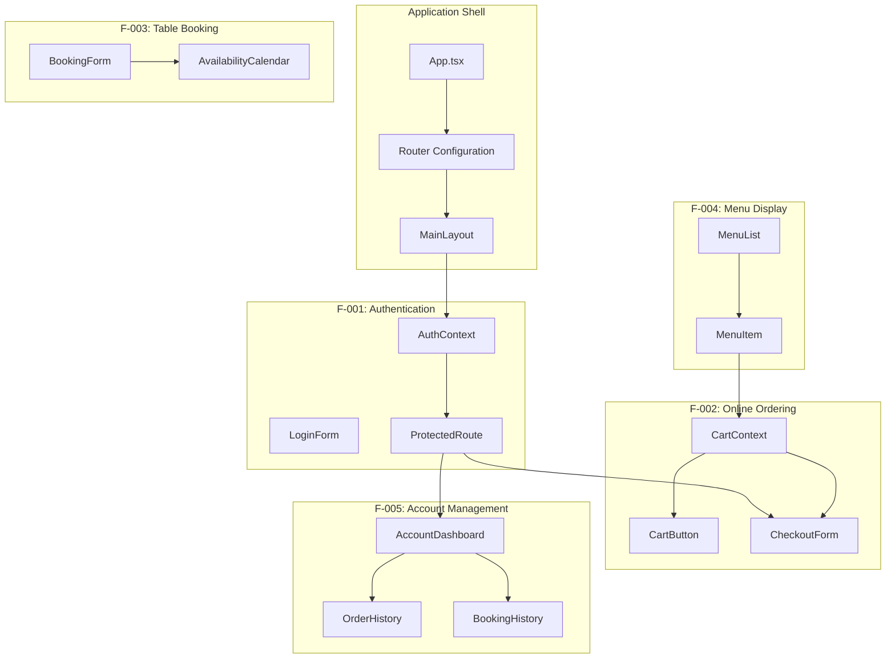
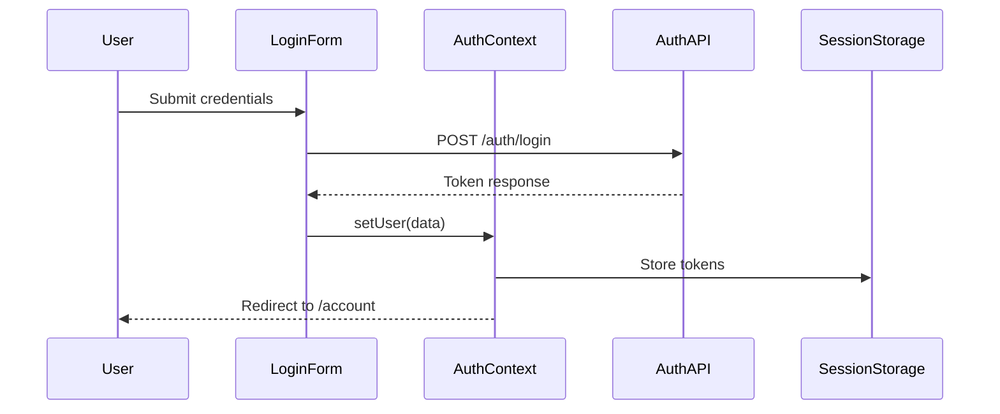
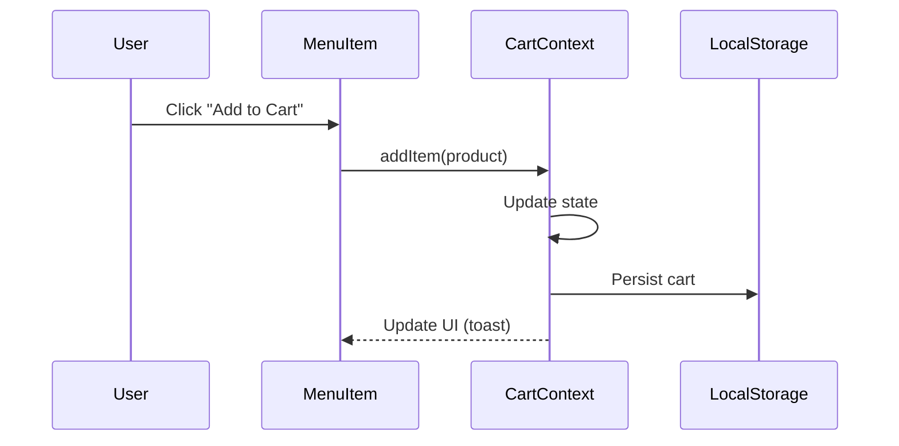
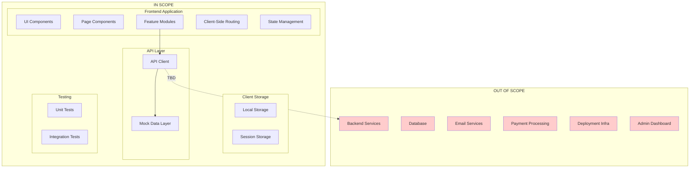

# Technical Specification

# 0. Agent Action Plan

## 0.1 Intent Clarification

Based on the prompt, the Blitzy platform understands that the new feature requirement is to build a complete **Burger Restaurant Web Application** from scratch—a greenfield project that enables customers to authenticate, browse menus, place online orders, and book tables for dine-in dining experiences. The application must be built using **Vite.js** as the build tool and **TypeScript** for type-safe development.

### 0.1.1 Core Feature Objectives

| Feature ID | Feature Name | Description | Priority |
|------------|--------------|-------------|----------|
| F-001 | User Authentication System | Secure user registration, login, session management, and logout functionality | Critical |
| F-002 | Online Ordering System | Digital menu browsing, shopping cart management, and order submission for pickup | Critical |
| F-003 | Table Booking System | Real-time availability checking, reservation creation, and booking management | Critical |
| F-004 | Menu Display Module | Category-organized digital menu with item details, pricing, and images | Critical |
| F-005 | User Account Management | User dashboard with profile settings, order history, and reservation history | High |

### 0.1.2 Implicit Requirements Detected

The Blitzy platform has identified the following implicit requirements based on the user's request:

- **Single Page Application (SPA) Architecture**: The request for Vite.js implies a modern, client-side rendered application with fast Hot Module Replacement (HMR)
- **Responsive Design**: A customer-facing web application requires mobile-first responsive layouts
- **Type Safety**: TypeScript usage mandates strict type definitions for all data models, API contracts, and component props
- **Component-Based Structure**: React with TypeScript implies a modular, reusable component architecture
- **Client-Side State Management**: Cart persistence, session handling, and form state management are required
- **API Integration Layer**: RESTful API communication patterns for future backend integration (currently TBD)
- **Modern Browser Support**: Vite 7 targets baseline-widely-available browsers (Chrome 107+, Firefox 104+, Safari 16.4+)

### 0.1.3 Special Instructions and Constraints

**Mandatory Technology Constraints:**

| Constraint ID | Constraint | Implementation Impact |
|---------------|------------|----------------------|
| C-001 | Vite.js Build Tool | Must use Vite 7.3.x for development server and production builds |
| C-002 | TypeScript Language | TypeScript 5.9.x with strict mode enabled throughout |
| C-003 | Node.js Runtime | Node.js 20.19+ or 22.12+ required for Vite 7 |

**Architectural Requirements:**

- Follow React component-based architecture with feature-based organization
- Implement layered architecture: UI Layer → State Management Layer → API Integration Layer
- Use utility-first CSS with Tailwind CSS 4.1.x
- Ensure TypeScript strict mode compliance with 100% type coverage target

### 0.1.4 Technical Interpretation

These feature requirements translate to the following technical implementation strategy:

**To implement User Authentication (F-001)**, we will:
- Create authentication components (LoginForm, RegisterForm, LogoutButton)
- Implement React Context for session state management
- Store tokens in Session Storage for tab-scoped security
- Build protected route wrappers using React Router

**To implement Online Ordering (F-002)**, we will:
- Create menu browsing components integrated with F-004
- Build shopping cart state with Local Storage persistence
- Implement cart management hooks (add, update, remove items)
- Create checkout flow components with validation

**To implement Table Booking (F-003)**, we will:
- Build availability search components with date/time/party size inputs
- Implement reservation state management
- Create booking confirmation and management interfaces
- Handle slot locking logic on the client side

**To implement Menu Display (F-004)**, we will:
- Create category navigation components
- Build menu item cards with responsive image handling
- Implement lazy loading for performance optimization
- Design reusable card and grid components

**To implement Account Management (F-005)**, we will:
- Create user dashboard with aggregated data views
- Build profile settings components
- Implement order and reservation history views
- Create quick action components for common tasks

## 0.2 Repository Scope Discovery

### 0.2.1 Comprehensive Repository Analysis

The repository analysis reveals this is a **greenfield project** with no existing source code. The repository currently contains only:

| File Path | Type | Content | Action Required |
|-----------|------|---------|-----------------|
| `readme.MD` | File | Placeholder text ("adf") | REPLACE with comprehensive documentation |

**Repository Status**: Empty - All source files must be created from scratch.

### 0.2.2 New File Requirements - Complete File Structure

The following comprehensive file structure must be created to implement all features:

**Root Configuration Files:**

| File Path | Purpose | Priority |
|-----------|---------|----------|
| `package.json` | NPM package manifest with all dependencies | Critical |
| `tsconfig.json` | TypeScript compiler configuration | Critical |
| `vite.config.ts` | Vite build and dev server configuration | Critical |
| `tailwind.config.ts` | Tailwind CSS configuration (optional in v4) | High |
| `.env.example` | Environment variable template | High |
| `.gitignore` | Git ignore patterns | Medium |
| `index.html` | HTML entry point | Critical |

**Source Directory Structure (`src/**/*.{ts,tsx}`):**

```
src/
├── main.tsx                          # Application entry point
├── App.tsx                           # Root application component
├── vite-env.d.ts                     # Vite type declarations
├── index.css                         # Global styles and Tailwind imports
├── assets/                           # Static assets
│   └── images/                       # Image assets (logo, icons)
├── components/                       # Reusable UI components
│   ├── ui/                           # Base UI components
│   │   ├── Button.tsx
│   │   ├── Input.tsx
│   │   ├── Card.tsx
│   │   ├── Modal.tsx
│   │   ├── Loader.tsx
│   │   └── index.ts
│   ├── layout/                       # Layout components
│   │   ├── Header.tsx
│   │   ├── Footer.tsx
│   │   ├── Sidebar.tsx
│   │   ├── MainLayout.tsx
│   │   └── index.ts
│   └── common/                       # Shared feature components
│       ├── Logo.tsx
│       ├── Navigation.tsx
│       └── index.ts
├── features/                         # Feature modules
│   ├── auth/                         # F-001: Authentication
│   │   ├── components/
│   │   │   ├── LoginForm.tsx
│   │   │   ├── RegisterForm.tsx
│   │   │   ├── LogoutButton.tsx
│   │   │   └── ProtectedRoute.tsx
│   │   ├── hooks/
│   │   │   └── useAuth.ts
│   │   ├── context/
│   │   │   └── AuthContext.tsx
│   │   ├── types/
│   │   │   └── auth.types.ts
│   │   └── index.ts
│   ├── menu/                         # F-004: Menu Display
│   │   ├── components/
│   │   │   ├── MenuList.tsx
│   │   │   ├── MenuItem.tsx
│   │   │   ├── CategoryNav.tsx
│   │   │   └── MenuItemDetail.tsx
│   │   ├── hooks/
│   │   │   └── useMenu.ts
│   │   ├── types/
│   │   │   └── menu.types.ts
│   │   └── index.ts
│   ├── cart/                         # F-002: Online Ordering (Cart)
│   │   ├── components/
│   │   │   ├── CartButton.tsx
│   │   │   ├── CartDrawer.tsx
│   │   │   ├── CartItem.tsx
│   │   │   └── CartSummary.tsx
│   │   ├── hooks/
│   │   │   └── useCart.ts
│   │   ├── context/
│   │   │   └── CartContext.tsx
│   │   ├── types/
│   │   │   └── cart.types.ts
│   │   └── index.ts
│   ├── checkout/                     # F-002: Online Ordering (Checkout)
│   │   ├── components/
│   │   │   ├── CheckoutForm.tsx
│   │   │   ├── OrderSummary.tsx
│   │   │   └── PaymentSection.tsx
│   │   ├── hooks/
│   │   │   └── useCheckout.ts
│   │   ├── types/
│   │   │   └── checkout.types.ts
│   │   └── index.ts
│   ├── booking/                      # F-003: Table Booking
│   │   ├── components/
│   │   │   ├── BookingForm.tsx
│   │   │   ├── AvailabilityCalendar.tsx
│   │   │   ├── TimeSlotPicker.tsx
│   │   │   └── BookingConfirmation.tsx
│   │   ├── hooks/
│   │   │   └── useBooking.ts
│   │   ├── types/
│   │   │   └── booking.types.ts
│   │   └── index.ts
│   └── account/                      # F-005: Account Management
│       ├── components/
│       │   ├── ProfileForm.tsx
│       │   ├── OrderHistory.tsx
│       │   ├── BookingHistory.tsx
│       │   └── AccountDashboard.tsx
│       ├── hooks/
│       │   └── useAccount.ts
│       ├── types/
│       │   └── account.types.ts
│       └── index.ts
├── pages/                            # Page components (routes)
│   ├── HomePage.tsx
│   ├── MenuPage.tsx
│   ├── LoginPage.tsx
│   ├── RegisterPage.tsx
│   ├── CartPage.tsx
│   ├── CheckoutPage.tsx
│   ├── BookingPage.tsx
│   ├── AccountPage.tsx
│   ├── OrderConfirmationPage.tsx
│   └── NotFoundPage.tsx
├── services/                         # API and external service integrations
│   ├── api/
│   │   ├── client.ts                 # Axios/fetch client configuration
│   │   ├── auth.api.ts
│   │   ├── menu.api.ts
│   │   ├── order.api.ts
│   │   └── booking.api.ts
│   └── storage/
│       ├── localStorage.ts
│       └── sessionStorage.ts
├── types/                            # Shared type definitions
│   ├── common.types.ts
│   ├── api.types.ts
│   └── index.ts
├── utils/                            # Utility functions
│   ├── validation.ts
│   ├── formatters.ts
│   ├── constants.ts
│   └── helpers.ts
├── hooks/                            # Shared hooks
│   ├── useLocalStorage.ts
│   ├── useSessionStorage.ts
│   └── index.ts
└── router/                           # Routing configuration
    ├── routes.tsx
    └── index.ts
```

### 0.2.3 Test File Requirements (`tests/**/*.test.{ts,tsx}`)

```
tests/
├── setup.ts                          # Test environment setup
├── unit/
│   ├── components/
│   │   ├── Button.test.tsx
│   │   ├── Input.test.tsx
│   │   └── Card.test.tsx
│   ├── features/
│   │   ├── auth/
│   │   │   ├── LoginForm.test.tsx
│   │   │   └── useAuth.test.ts
│   │   ├── cart/
│   │   │   ├── CartDrawer.test.tsx
│   │   │   └── useCart.test.ts
│   │   └── booking/
│   │       └── BookingForm.test.tsx
│   └── utils/
│       ├── validation.test.ts
│       └── formatters.test.ts
└── integration/
    ├── auth.integration.test.tsx
    ├── ordering.integration.test.tsx
    └── booking.integration.test.tsx
```

### 0.2.4 Documentation Files

| File Path | Purpose | Priority |
|-----------|---------|----------|
| `README.md` | Project overview and setup instructions | Critical |
| `docs/ARCHITECTURE.md` | Architecture documentation | Medium |
| `docs/API.md` | API integration documentation | Medium |
| `docs/COMPONENTS.md` | Component library documentation | Low |

### 0.2.5 Web Search Research Conducted

Best practices research was conducted for implementing this feature set:

| Topic | Key Findings |
|-------|--------------|
| Vite 7.x Configuration | Vite 7.3.x requires Node.js 20.19+ or 22.12+; includes native ESM support |
| React 19 Patterns | React 19.2.x introduces Activity API and enhanced Suspense; forwardRef deprecated |
| Tailwind CSS 4.1 | CSS-first configuration via @theme directive; first-party @tailwindcss/vite plugin |
| TypeScript 5.9 | Strict mode enforcement; enhanced inference patterns |
| Vitest Testing | Vitest 3.2+ required for Vite 7 compatibility |
| Form Validation | react-hook-form with zod for schema validation is recommended |
| Client Storage | Session Storage for auth tokens; Local Storage for cart persistence |

## 0.3 Dependency Inventory

### 0.3.1 Public Packages

The following public packages are required for implementing the Burger Restaurant Web Application:

**Production Dependencies:**

| Package Registry | Package Name | Version | Purpose |
|------------------|--------------|---------|---------|
| npm | `react` | ^19.2.3 | Core React library for building user interfaces |
| npm | `react-dom` | ^19.2.3 | React DOM renderer for web applications |
| npm | `react-router` | ^7.6.2 | Declarative routing for React SPAs |
| npm | `axios` | ^1.9.0 | HTTP client for API communication |
| npm | `react-hook-form` | ^7.57.0 | Performant form handling with minimal re-renders |
| npm | `zod` | ^3.25.56 | TypeScript-first schema validation |
| npm | `@hookform/resolvers` | ^5.0.1 | Form validation resolver for zod integration |
| npm | `clsx` | ^2.1.1 | Utility for constructing className strings |
| npm | `date-fns` | ^4.1.0 | Modern JavaScript date utility library |

**Development Dependencies:**

| Package Registry | Package Name | Version | Purpose |
|------------------|--------------|---------|---------|
| npm | `vite` | ^7.3.1 | Next-generation frontend build tool |
| npm | `typescript` | ^5.9.3 | TypeScript language compiler |
| npm | `tailwindcss` | ^4.1.18 | Utility-first CSS framework |
| npm | `@tailwindcss/vite` | ^4.1.18 | First-party Vite plugin for Tailwind CSS |
| npm | `@vitejs/plugin-react` | ^4.4.1 | Official React plugin for Vite |
| npm | `vitest` | ^3.2.3 | Vite-native testing framework |
| npm | `@testing-library/react` | ^16.3.0 | React testing utilities |
| npm | `@testing-library/jest-dom` | ^6.6.3 | Custom jest matchers for DOM testing |
| npm | `jsdom` | ^26.1.0 | DOM implementation for Node.js (Vitest) |
| npm | `@types/react` | ^19.2.5 | TypeScript definitions for React |
| npm | `@types/react-dom` | ^19.2.4 | TypeScript definitions for React DOM |
| npm | `eslint` | ^9.29.0 | JavaScript/TypeScript linter |
| npm | `@eslint/js` | ^9.29.0 | ESLint core rules |
| npm | `typescript-eslint` | ^8.33.1 | TypeScript ESLint parser and rules |
| npm | `eslint-plugin-react-hooks` | ^6.1.0 | ESLint plugin for React Hooks rules |

### 0.3.2 Private Packages

No private packages are required for this project. All dependencies are sourced from the public npm registry.

### 0.3.3 package.json Configuration

The following `package.json` manifest should be created:

```json
{
  "name": "burger-restaurant-app",
  "private": true,
  "version": "0.1.0",
  "type": "module",
  "scripts": {
    "dev": "vite",
    "build": "tsc -b && vite build",
    "lint": "eslint .",
    "test": "vitest run",
    "test:watch": "vitest",
    "preview": "vite preview"
  }
}
```

### 0.3.4 Import Requirements and Module Organization

**Feature Module Imports:**

Each feature module will use barrel exports for clean imports:

```typescript
// src/features/auth/index.ts (barrel export)
export * from './components/LoginForm';
export * from './hooks/useAuth';
```

**Path Alias Configuration:**

TypeScript path aliases should be configured for cleaner imports:

| Alias | Target Path |
|-------|-------------|
| `@/*` | `./src/*` |
| `@components/*` | `./src/components/*` |
| `@features/*` | `./src/features/*` |
| `@services/*` | `./src/services/*` |
| `@types/*` | `./src/types/*` |
| `@utils/*` | `./src/utils/*` |
| `@hooks/*` | `./src/hooks/*` |

### 0.3.5 External Reference Updates

Since this is a greenfield project, no external references require updates. However, the following configuration files must be properly created:

**vite.config.ts Dependencies:**

```typescript
import { defineConfig } from 'vite';
import react from '@vitejs/plugin-react';
import tailwindcss from '@tailwindcss/vite';
```

**tsconfig.json Dependencies:**

```json
{
  "compilerOptions": {
    "lib": ["ES2022", "DOM", "DOM.Iterable"],
    "jsx": "react-jsx",
    "moduleResolution": "bundler"
  }
}
```

### 0.3.6 Node.js Runtime Requirements

| Requirement | Version | Rationale |
|-------------|---------|-----------|
| Node.js | 20.19+ or 22.12+ | Required by Vite 7.x for ESM support |
| npm | 10.x+ | Package management |

**Environment Verification Command:**
```bash
node --version  # Must output v20.19.x+ or v22.12.x+
```

## 0.4 Integration Analysis

### 0.4.1 Existing Code Touchpoints

Since this is a greenfield project, there are no existing code touchpoints to modify. All integrations will be established through the creation of new files.

### 0.4.2 Feature Integration Points

The following diagram illustrates how the five core features integrate with each other:



### 0.4.3 Context Provider Integration

The application requires a nested Context Provider structure for state management:

| Provider | Purpose | Dependencies |
|----------|---------|--------------|
| `AuthProvider` | Session state, user data, auth methods | None (top-level) |
| `CartProvider` | Cart state, item management | Requires AuthProvider (for user association) |

**Provider Hierarchy in App.tsx:**

```tsx
<AuthProvider>
  <CartProvider>
    <RouterProvider router={router} />
  </CartProvider>
</AuthProvider>
```

### 0.4.4 Route Integration Points

Routes integrate features with the navigation system:

| Route Path | Page Component | Feature | Auth Required |
|------------|----------------|---------|---------------|
| `/` | `HomePage` | Landing | No |
| `/menu` | `MenuPage` | F-004 | No |
| `/login` | `LoginPage` | F-001 | No |
| `/register` | `RegisterPage` | F-001 | No |
| `/cart` | `CartPage` | F-002 | No |
| `/checkout` | `CheckoutPage` | F-002 | Yes |
| `/booking` | `BookingPage` | F-003 | No |
| `/account` | `AccountPage` | F-005 | Yes |
| `/account/orders` | `OrderHistoryPage` | F-005 | Yes |
| `/account/bookings` | `BookingHistoryPage` | F-005 | Yes |
| `/confirmation/:orderId` | `OrderConfirmationPage` | F-002 | Yes |
| `*` | `NotFoundPage` | Error | No |

### 0.4.5 API Integration Layer

Although backend services are TBD, the API integration layer must be structured for future implementation:

**API Client Integration:**

| API Module | Base Endpoint | Methods | Used By |
|------------|---------------|---------|---------|
| `auth.api.ts` | `/api/auth` | login, register, logout, refresh | F-001 |
| `menu.api.ts` | `/api/menu` | getCategories, getItems, getItemById | F-004 |
| `order.api.ts` | `/api/orders` | create, get, getHistory | F-002 |
| `booking.api.ts` | `/api/bookings` | checkAvailability, create, cancel | F-003 |

**API Client Configuration:**

```typescript
// services/api/client.ts - Integration point
const apiClient = axios.create({
  baseURL: import.meta.env.VITE_API_URL || '/api',
  timeout: 10000,
});
```

### 0.4.6 Storage Integration

Client-side storage integrates with features for persistence:

| Storage Type | Key Pattern | Data | Feature |
|--------------|-------------|------|---------|
| Session Storage | `auth_token` | JWT access token | F-001 |
| Session Storage | `refresh_token` | JWT refresh token | F-001 |
| Local Storage | `cart_items` | Serialized cart array | F-002 |
| Local Storage | `user_preferences` | Theme, language settings | F-005 |

### 0.4.7 Component Integration Matrix

| Component | Imports From | Exports To |
|-----------|--------------|------------|
| `Header` | AuthContext, CartContext, Navigation | MainLayout |
| `LoginForm` | useAuth hook, validation utils | LoginPage |
| `MenuItem` | CartContext (add to cart) | MenuList |
| `CartButton` | CartContext (item count) | Header |
| `BookingForm` | useBooking hook, date-fns | BookingPage |
| `ProtectedRoute` | AuthContext | Router config |

### 0.4.8 Event Flow Integration

**Authentication Event Flow:**



**Add to Cart Event Flow:**



## 0.5 Technical Implementation

### 0.5.1 File-by-File Execution Plan

Every file listed below **MUST** be created for complete implementation:

**Group 1 - Project Foundation (Critical Path)**

| Action | File Path | Purpose |
|--------|-----------|---------|
| CREATE | `package.json` | NPM manifest with dependencies and scripts |
| CREATE | `tsconfig.json` | TypeScript compiler configuration |
| CREATE | `tsconfig.node.json` | TypeScript config for Node.js tooling |
| CREATE | `vite.config.ts` | Vite build and dev server configuration |
| CREATE | `index.html` | HTML entry point with root element |
| CREATE | `.env.example` | Environment variable template |
| CREATE | `.gitignore` | Git ignore patterns for Node.js/Vite projects |
| CREATE | `eslint.config.js` | ESLint flat configuration |
| REPLACE | `README.md` | Comprehensive project documentation |

**Group 2 - Application Core (`src/`)**

| Action | File Path | Purpose |
|--------|-----------|---------|
| CREATE | `src/main.tsx` | Application entry point, provider setup |
| CREATE | `src/App.tsx` | Root component with router integration |
| CREATE | `src/vite-env.d.ts` | Vite environment type declarations |
| CREATE | `src/index.css` | Global styles, Tailwind CSS imports |

**Group 3 - Routing (`src/router/`)**

| Action | File Path | Purpose |
|--------|-----------|---------|
| CREATE | `src/router/routes.tsx` | Route definitions with lazy loading |
| CREATE | `src/router/index.ts` | Router configuration export |

**Group 4 - UI Components (`src/components/ui/`)**

| Action | File Path | Purpose |
|--------|-----------|---------|
| CREATE | `src/components/ui/Button.tsx` | Reusable button with variants |
| CREATE | `src/components/ui/Input.tsx` | Form input with validation states |
| CREATE | `src/components/ui/Card.tsx` | Content card container |
| CREATE | `src/components/ui/Modal.tsx` | Overlay modal dialog |
| CREATE | `src/components/ui/Loader.tsx` | Loading spinner component |
| CREATE | `src/components/ui/Badge.tsx` | Status badge component |
| CREATE | `src/components/ui/Alert.tsx` | Alert/notification component |
| CREATE | `src/components/ui/index.ts` | Barrel export for UI components |

**Group 5 - Layout Components (`src/components/layout/`)**

| Action | File Path | Purpose |
|--------|-----------|---------|
| CREATE | `src/components/layout/Header.tsx` | App header with navigation |
| CREATE | `src/components/layout/Footer.tsx` | App footer with links |
| CREATE | `src/components/layout/MainLayout.tsx` | Page layout wrapper |
| CREATE | `src/components/layout/index.ts` | Barrel export for layout |

**Group 6 - Authentication Feature (`src/features/auth/`)**

| Action | File Path | Purpose |
|--------|-----------|---------|
| CREATE | `src/features/auth/context/AuthContext.tsx` | Authentication state management |
| CREATE | `src/features/auth/hooks/useAuth.ts` | Authentication hook interface |
| CREATE | `src/features/auth/components/LoginForm.tsx` | User login form with validation |
| CREATE | `src/features/auth/components/RegisterForm.tsx` | User registration form |
| CREATE | `src/features/auth/components/LogoutButton.tsx` | Logout action button |
| CREATE | `src/features/auth/components/ProtectedRoute.tsx` | Route guard for authenticated routes |
| CREATE | `src/features/auth/types/auth.types.ts` | Authentication type definitions |
| CREATE | `src/features/auth/index.ts` | Feature barrel export |

**Group 7 - Menu Feature (`src/features/menu/`)**

| Action | File Path | Purpose |
|--------|-----------|---------|
| CREATE | `src/features/menu/components/MenuList.tsx` | Menu items grid display |
| CREATE | `src/features/menu/components/MenuItem.tsx` | Single menu item card |
| CREATE | `src/features/menu/components/CategoryNav.tsx` | Category filter navigation |
| CREATE | `src/features/menu/components/MenuItemDetail.tsx` | Item detail view |
| CREATE | `src/features/menu/hooks/useMenu.ts` | Menu data fetching hook |
| CREATE | `src/features/menu/types/menu.types.ts` | Menu type definitions |
| CREATE | `src/features/menu/index.ts` | Feature barrel export |

**Group 8 - Cart Feature (`src/features/cart/`)**

| Action | File Path | Purpose |
|--------|-----------|---------|
| CREATE | `src/features/cart/context/CartContext.tsx` | Cart state management |
| CREATE | `src/features/cart/hooks/useCart.ts` | Cart operations hook |
| CREATE | `src/features/cart/components/CartButton.tsx` | Cart icon with badge |
| CREATE | `src/features/cart/components/CartDrawer.tsx` | Slide-out cart panel |
| CREATE | `src/features/cart/components/CartItem.tsx` | Cart line item component |
| CREATE | `src/features/cart/components/CartSummary.tsx` | Cart total summary |
| CREATE | `src/features/cart/types/cart.types.ts` | Cart type definitions |
| CREATE | `src/features/cart/index.ts` | Feature barrel export |

**Group 9 - Checkout Feature (`src/features/checkout/`)**

| Action | File Path | Purpose |
|--------|-----------|---------|
| CREATE | `src/features/checkout/components/CheckoutForm.tsx` | Checkout details form |
| CREATE | `src/features/checkout/components/OrderSummary.tsx` | Order summary display |
| CREATE | `src/features/checkout/components/PaymentSection.tsx` | Payment method selection |
| CREATE | `src/features/checkout/hooks/useCheckout.ts` | Checkout process hook |
| CREATE | `src/features/checkout/types/checkout.types.ts` | Checkout type definitions |
| CREATE | `src/features/checkout/index.ts` | Feature barrel export |

**Group 10 - Booking Feature (`src/features/booking/`)**

| Action | File Path | Purpose |
|--------|-----------|---------|
| CREATE | `src/features/booking/components/BookingForm.tsx` | Reservation form |
| CREATE | `src/features/booking/components/AvailabilityCalendar.tsx` | Date picker for reservations |
| CREATE | `src/features/booking/components/TimeSlotPicker.tsx` | Time slot selection |
| CREATE | `src/features/booking/components/BookingConfirmation.tsx` | Confirmation display |
| CREATE | `src/features/booking/hooks/useBooking.ts` | Booking operations hook |
| CREATE | `src/features/booking/types/booking.types.ts` | Booking type definitions |
| CREATE | `src/features/booking/index.ts` | Feature barrel export |

**Group 11 - Account Feature (`src/features/account/`)**

| Action | File Path | Purpose |
|--------|-----------|---------|
| CREATE | `src/features/account/components/AccountDashboard.tsx` | Account overview page |
| CREATE | `src/features/account/components/ProfileForm.tsx` | Profile edit form |
| CREATE | `src/features/account/components/OrderHistory.tsx` | Past orders list |
| CREATE | `src/features/account/components/BookingHistory.tsx` | Past reservations list |
| CREATE | `src/features/account/hooks/useAccount.ts` | Account data hook |
| CREATE | `src/features/account/types/account.types.ts` | Account type definitions |
| CREATE | `src/features/account/index.ts` | Feature barrel export |

**Group 12 - Pages (`src/pages/`)**

| Action | File Path | Purpose |
|--------|-----------|---------|
| CREATE | `src/pages/HomePage.tsx` | Landing page with featured items |
| CREATE | `src/pages/MenuPage.tsx` | Full menu display page |
| CREATE | `src/pages/LoginPage.tsx` | Login page wrapper |
| CREATE | `src/pages/RegisterPage.tsx` | Registration page wrapper |
| CREATE | `src/pages/CartPage.tsx` | Cart review page |
| CREATE | `src/pages/CheckoutPage.tsx` | Checkout flow page |
| CREATE | `src/pages/BookingPage.tsx` | Table booking page |
| CREATE | `src/pages/AccountPage.tsx` | Account dashboard page |
| CREATE | `src/pages/OrderConfirmationPage.tsx` | Order success page |
| CREATE | `src/pages/NotFoundPage.tsx` | 404 error page |

**Group 13 - Services (`src/services/`)**

| Action | File Path | Purpose |
|--------|-----------|---------|
| CREATE | `src/services/api/client.ts` | Axios client configuration |
| CREATE | `src/services/api/auth.api.ts` | Authentication API methods |
| CREATE | `src/services/api/menu.api.ts` | Menu API methods |
| CREATE | `src/services/api/order.api.ts` | Order API methods |
| CREATE | `src/services/api/booking.api.ts` | Booking API methods |
| CREATE | `src/services/storage/localStorage.ts` | Local storage utilities |
| CREATE | `src/services/storage/sessionStorage.ts` | Session storage utilities |

**Group 14 - Shared Utilities (`src/utils/`, `src/types/`, `src/hooks/`)**

| Action | File Path | Purpose |
|--------|-----------|---------|
| CREATE | `src/utils/validation.ts` | Zod validation schemas |
| CREATE | `src/utils/formatters.ts` | Number/date formatting |
| CREATE | `src/utils/constants.ts` | Application constants |
| CREATE | `src/utils/helpers.ts` | General utility functions |
| CREATE | `src/types/common.types.ts` | Shared type definitions |
| CREATE | `src/types/api.types.ts` | API response types |
| CREATE | `src/types/index.ts` | Types barrel export |
| CREATE | `src/hooks/useLocalStorage.ts` | Local storage hook |
| CREATE | `src/hooks/useSessionStorage.ts` | Session storage hook |
| CREATE | `src/hooks/index.ts` | Hooks barrel export |

**Group 15 - Test Suite (`tests/`)**

| Action | File Path | Purpose |
|--------|-----------|---------|
| CREATE | `tests/setup.ts` | Vitest test setup |
| CREATE | `tests/unit/components/Button.test.tsx` | Button component tests |
| CREATE | `tests/unit/features/auth/useAuth.test.ts` | Auth hook tests |
| CREATE | `tests/unit/features/cart/useCart.test.ts` | Cart hook tests |
| CREATE | `tests/integration/auth.integration.test.tsx` | Auth flow integration tests |

### 0.5.2 Implementation Approach Summary

**Phase 1: Foundation Setup**
- Establish project foundation by creating configuration files
- Set up build tooling (Vite, TypeScript, Tailwind CSS)
- Configure path aliases and ESLint

**Phase 2: Core Infrastructure**
- Create shared UI component library
- Build layout structure with Header, Footer, MainLayout
- Set up routing infrastructure with React Router

**Phase 3: Feature Implementation**
- Implement Authentication (F-001) with context and protected routes
- Implement Menu Display (F-004) with category navigation
- Implement Cart/Ordering (F-002) with local storage persistence
- Implement Table Booking (F-003) with date/time selection
- Implement Account Management (F-005) with history views

**Phase 4: Integration and Testing**
- Connect all features through proper context wiring
- Implement API service layer for future backend integration
- Create comprehensive test suite with Vitest

### 0.5.3 User Interface Design Notes

No Figma URLs were provided for this project. The UI implementation will follow:

- **Design System**: Tailwind CSS 4.1.x utility classes with @theme customization
- **Color Scheme**: Restaurant-appropriate warm colors (to be defined in Tailwind theme)
- **Typography**: System font stack with consistent heading hierarchy
- **Responsiveness**: Mobile-first breakpoints (sm: 640px, md: 768px, lg: 1024px, xl: 1280px)

## 0.6 Scope Boundaries

### 0.6.1 Exhaustively In Scope

The following items are **fully within scope** and will be implemented:

**All Feature Source Files:**

| Pattern | Description | Feature |
|---------|-------------|---------|
| `src/features/auth/**/*.{ts,tsx}` | All authentication feature code | F-001 |
| `src/features/menu/**/*.{ts,tsx}` | All menu display feature code | F-004 |
| `src/features/cart/**/*.{ts,tsx}` | All cart feature code | F-002 |
| `src/features/checkout/**/*.{ts,tsx}` | All checkout feature code | F-002 |
| `src/features/booking/**/*.{ts,tsx}` | All table booking feature code | F-003 |
| `src/features/account/**/*.{ts,tsx}` | All account management feature code | F-005 |

**All Test Files:**

| Pattern | Description |
|---------|-------------|
| `tests/unit/**/*.test.{ts,tsx}` | Unit tests for components and hooks |
| `tests/integration/**/*.test.{ts,tsx}` | Integration tests for feature flows |

**Integration Points:**

| File | Lines/Sections | Purpose |
|------|----------------|---------|
| `src/main.tsx` | Provider initialization (lines 1-20) | Context provider setup |
| `src/App.tsx` | Router integration (lines 1-15) | App shell configuration |
| `src/router/routes.tsx` | Route definitions (all) | Navigation configuration |
| `src/components/layout/Header.tsx` | Navigation integration | Auth state, cart badge |
| `src/components/layout/MainLayout.tsx` | Layout composition | Page structure |

**Configuration Files:**

| Pattern | Description |
|---------|-------------|
| `package.json` | Complete dependency manifest |
| `tsconfig.json` | TypeScript configuration |
| `vite.config.ts` | Build and dev server config |
| `eslint.config.js` | Linting rules configuration |
| `.env.example` | Environment variable template |
| `.gitignore` | Git ignore patterns |

**Documentation Files:**

| Pattern | Description |
|---------|-------------|
| `README.md` | Project documentation |
| `docs/**/*.md` | Additional documentation |

**UI Component Library:**

| Pattern | Description |
|---------|-------------|
| `src/components/ui/**/*.tsx` | Base UI components |
| `src/components/layout/**/*.tsx` | Layout components |
| `src/components/common/**/*.tsx` | Common components |

**Service Layer:**

| Pattern | Description |
|---------|-------------|
| `src/services/api/**/*.ts` | API integration modules |
| `src/services/storage/**/*.ts` | Storage utilities |

**Shared Utilities:**

| Pattern | Description |
|---------|-------------|
| `src/utils/**/*.ts` | Utility functions |
| `src/types/**/*.ts` | Type definitions |
| `src/hooks/**/*.ts` | Shared hooks |

**Page Components:**

| Pattern | Description |
|---------|-------------|
| `src/pages/**/*.tsx` | All page-level components |

### 0.6.2 Explicitly Out of Scope

The following items are **NOT in scope** for this implementation:

| Category | Item | Rationale |
|----------|------|-----------|
| **Backend** | Server-side API implementation | Backend services are TBD per spec |
| **Backend** | Database setup and migrations | No database requirements defined |
| **Backend** | Authentication server | Using mock/localStorage approach |
| **Payment** | Real payment processing | Payment gateway integration TBD |
| **Payment** | PCI compliance implementation | Requires backend infrastructure |
| **Email** | Transactional email service | Requires backend integration |
| **Email** | Order confirmation emails | Requires email service |
| **DevOps** | Production deployment configuration | Infrastructure decisions TBD |
| **DevOps** | CI/CD pipeline setup | Out of current scope |
| **DevOps** | Docker containerization | Deployment strategy TBD |
| **Analytics** | User analytics integration | Third-party service decisions TBD |
| **Analytics** | Event tracking implementation | Requires analytics platform |
| **Internationalization** | Multi-language support | English-only for initial release |
| **Internationalization** | Currency localization | USD-only for initial release |
| **Performance** | Service Worker / PWA features | Future enhancement |
| **Performance** | Image CDN configuration | Requires infrastructure decisions |
| **Security** | Rate limiting implementation | Requires backend |
| **Security** | CSRF protection | Requires backend |
| **Third-Party** | Social login integration | OAuth setup TBD |
| **Third-Party** | Google Maps integration | Location services TBD |
| **Features** | Admin dashboard | Administrative features not requested |
| **Features** | Inventory management | Backend-dependent feature |
| **Features** | Promotions/coupons system | Not specified in requirements |
| **Features** | Loyalty program | Not specified in requirements |
| **Mobile** | Native mobile application | Web-only per requirements |
| **Mobile** | React Native implementation | Web-only per requirements |

### 0.6.3 Scope Boundaries Diagram



### 0.6.4 Scope Clarifications

| Item | Status | Notes |
|------|--------|-------|
| Mock data for development | IN SCOPE | Required for frontend development |
| Form validation (client-side) | IN SCOPE | Using zod schemas |
| Form validation (server-side) | OUT OF SCOPE | Requires backend |
| TypeScript type definitions | IN SCOPE | Full type coverage |
| API types for future integration | IN SCOPE | Prepared interfaces |
| Responsive design | IN SCOPE | Mobile-first approach |
| Accessibility (basic ARIA) | IN SCOPE | WCAG 2.1 AA target |
| Dark mode | OUT OF SCOPE | Future enhancement |
| Print stylesheets | OUT OF SCOPE | Not required |

## 0.7 Rules for Feature Addition

### 0.7.1 Technology-Specific Rules

**Vite.js Requirements:**

| Rule ID | Rule | Implementation |
|---------|------|----------------|
| V-001 | Use Vite 7.3.x as the build tool | Install `vite@^7.3.1` |
| V-002 | Require Node.js 20.19+ or 22.12+ | Validate in package.json engines |
| V-003 | Use @vitejs/plugin-react | Configure in vite.config.ts |
| V-004 | Use @tailwindcss/vite plugin | Configure CSS processing through Vite |
| V-005 | Leverage Vite's HMR capabilities | No additional configuration needed |
| V-006 | Use `import.meta.env` for environment variables | Prefix env vars with `VITE_` |

**TypeScript Requirements:**

| Rule ID | Rule | Implementation |
|---------|------|----------------|
| TS-001 | Use TypeScript 5.9.x | Install `typescript@^5.9.3` |
| TS-002 | Enable strict mode | Set `"strict": true` in tsconfig.json |
| TS-003 | No implicit any | Set `"noImplicitAny": true` |
| TS-004 | Target ES2022 | Set `"target": "ES2022"` |
| TS-005 | Use bundler module resolution | Set `"moduleResolution": "bundler"` |
| TS-006 | Define all component props | Use interface/type for all props |
| TS-007 | Type all API responses | Create response type definitions |

**React Requirements:**

| Rule ID | Rule | Implementation |
|---------|------|----------------|
| R-001 | Use React 19.2.x | Install `react@^19.2.3` |
| R-002 | Use functional components only | No class components |
| R-003 | Use hooks for state and effects | useState, useEffect, useContext |
| R-004 | No forwardRef (deprecated in 19) | Use ref prop directly |
| R-005 | Use React Router 7.x | Install `react-router@^7.6.2` |
| R-006 | Implement error boundaries | Wrap major routes with boundaries |

**Tailwind CSS Requirements:**

| Rule ID | Rule | Implementation |
|---------|------|----------------|
| TW-001 | Use Tailwind CSS 4.1.x | Install `tailwindcss@^4.1.18` |
| TW-002 | Use CSS-first configuration | @import "tailwindcss" in CSS |
| TW-003 | Use @theme directive for customization | Define design tokens in CSS |
| TW-004 | Use utility-first approach | Minimize custom CSS |
| TW-005 | Use clsx for conditional classes | Install `clsx@^2.1.1` |

### 0.7.2 Architectural Rules

**Component Architecture:**

| Rule ID | Rule | Example |
|---------|------|---------|
| CA-001 | One component per file | `Button.tsx` contains only Button |
| CA-002 | Feature-based folder structure | `src/features/{feature}/` |
| CA-003 | Barrel exports for features | `index.ts` exports all public APIs |
| CA-004 | Colocate related files | Types, hooks, components together |
| CA-005 | Separate UI from business logic | Hooks for logic, components for UI |

**State Management Rules:**

| Rule ID | Rule | Implementation |
|---------|------|----------------|
| SM-001 | Use Context for global state | AuthContext, CartContext |
| SM-002 | Use local state for component state | useState within components |
| SM-003 | Persist cart to Local Storage | localStorage wrapper utility |
| SM-004 | Store tokens in Session Storage | sessionStorage wrapper utility |
| SM-005 | No external state libraries | Use React built-in state |

**API Integration Rules:**

| Rule ID | Rule | Implementation |
|---------|------|----------------|
| API-001 | Use axios for HTTP requests | Configure axios client |
| API-002 | Create service modules per domain | auth.api.ts, menu.api.ts |
| API-003 | Type all request/response data | Use generics with axios |
| API-004 | Handle errors consistently | Create error handling utilities |
| API-005 | Use interceptors for auth | Attach token via axios interceptor |

### 0.7.3 Code Quality Rules

**Naming Conventions:**

| Element | Convention | Example |
|---------|------------|---------|
| Components | PascalCase | `LoginForm.tsx` |
| Hooks | camelCase with use prefix | `useAuth.ts` |
| Types/Interfaces | PascalCase with descriptive suffix | `AuthContextType` |
| Constants | SCREAMING_SNAKE_CASE | `API_BASE_URL` |
| Files | PascalCase for components, camelCase for utilities | `Button.tsx`, `formatters.ts` |
| CSS classes | Tailwind utilities or kebab-case | `bg-primary`, `card-header` |

**Testing Rules:**

| Rule ID | Rule | Implementation |
|---------|------|----------------|
| TEST-001 | Use Vitest for testing | Install `vitest@^3.2.3` |
| TEST-002 | Use React Testing Library | Install `@testing-library/react` |
| TEST-003 | Test component behavior, not implementation | Focus on user interactions |
| TEST-004 | Create test setup file | Configure jsdom, matchers |
| TEST-005 | Colocate integration tests | tests/integration/ folder |

### 0.7.4 Security Rules

| Rule ID | Rule | Implementation |
|---------|------|----------------|
| SEC-001 | Never store sensitive data in Local Storage | Use Session Storage for tokens |
| SEC-002 | Sanitize user inputs | Validate with zod before submission |
| SEC-003 | Use HTTPS URLs only | Configure API_URL with https:// |
| SEC-004 | Implement CSRF protection readiness | Include CSRF token in requests when backend available |
| SEC-005 | Clear tokens on logout | Remove from Session Storage |

### 0.7.5 Performance Rules

| Rule ID | Rule | Implementation |
|---------|------|----------------|
| PERF-001 | Lazy load routes | Use React.lazy() for pages |
| PERF-002 | Optimize images | Use appropriate formats, sizes |
| PERF-003 | Minimize bundle size | Tree-shaking via Vite |
| PERF-004 | Use Suspense boundaries | Wrap lazy components |
| PERF-005 | Memoize expensive computations | Use useMemo where appropriate |

### 0.7.6 User-Specified Rules

Based on the user's requirements, the following explicit rules apply:

| Rule | Requirement | Implementation |
|------|-------------|----------------|
| Build Tool | "make it with vite js" | Vite 7.3.x is the mandatory build tool |
| Language | "and type script" | TypeScript 5.9.x is required throughout |
| Authentication | "user can login" | Full login/logout/register flow required |
| Ordering | "order online" | Complete cart and checkout implementation |
| Booking | "book tables for dine-in" | Table reservation system required |
| Theme | "website of burger" | Restaurant/burger-themed visual design |

### 0.7.7 Integration Requirements

| Rule ID | Rule | Feature Dependencies |
|---------|------|---------------------|
| INT-001 | Auth must integrate with protected routes | F-001 → Router |
| INT-002 | Menu items must allow add-to-cart | F-004 → F-002 |
| INT-003 | Checkout requires authentication | F-002 → F-001 |
| INT-004 | Account shows order history | F-005 → F-002 |
| INT-005 | Account shows booking history | F-005 → F-003 |
| INT-006 | Cart persists across sessions | F-002 → Local Storage |
| INT-007 | Auth tokens persist per tab | F-001 → Session Storage |

## 0.8 References

### 0.8.1 Repository Files and Folders Searched

The following repository locations were analyzed during the context gathering phase:

| Path | Type | Findings |
|------|------|----------|
| `/` (root) | Folder | Contains only `readme.MD` - greenfield project |
| `readme.MD` | File | Placeholder content ("adf") - requires replacement |

**Repository Status:** Empty greenfield project with no existing source code, configuration files, or dependencies.

### 0.8.2 Technical Specification Sections Retrieved

The following sections from the Technical Specification document informed this Agent Action Plan:

| Section | Key Information Extracted |
|---------|--------------------------|
| 1.1 Executive Summary | Project is a Burger Restaurant Web Application built with Vite.js and TypeScript |
| 2.1 Feature Catalog | Five core features identified: F-001 (Auth), F-002 (Ordering), F-003 (Booking), F-004 (Menu), F-005 (Account) |
| 3.1 Programming Languages | TypeScript 5.9.x as primary language with strict mode |
| 3.2 Frameworks & Libraries | Vite 7.3.x, React 19.2.x, React Router 7.x, Tailwind CSS 4.1.x |
| 3.3 Open Source Dependencies | react-hook-form, zod, axios, vitest identified as key dependencies |
| 3.6 Development & Deployment | Node.js 20.19+/22.12+ required, static site deployment targets |
| 5.1 High-Level Architecture | Component-Based SPA architecture confirmed |
| 5.2 Component Details | Layered architecture: UI Layer, State Management, API Integration |
| 6.2 Database Design | Backend TBD; client-side storage (Session Storage, Local Storage) for persistence |
| 7.3 UI Architecture | Layered component hierarchy: Page → Feature → UI → Layout |
| 7.4 Application Screens | Screen inventory: Public (Home, Menu, Login) and Protected (Cart, Booking, Account) |

### 0.8.3 External Research Conducted

Web searches were performed to verify current package versions and best practices:

| Search Query | Key Findings |
|--------------|--------------|
| "vite 7.3 latest version 2025" | Vite 7.3.1 is the latest stable release; requires Node.js 20.19+ or 22.12+; Vitest 3.2+ required |
| "react 19 latest version npm 2025" | React 19.2.3 is the latest version (December 2025); forwardRef deprecated |
| "tailwindcss 4.1 npm latest version 2025" | Tailwind CSS 4.1.18 is latest; first-party @tailwindcss/vite plugin available |

### 0.8.4 Attachments Provided

**No attachments were provided for this project.**

| Attachment Type | Status |
|-----------------|--------|
| Figma URLs | Not provided |
| Design files | Not provided |
| Documentation files | Not provided |
| Data files | Not provided |

### 0.8.5 Environment Configuration

| Item | Status |
|------|--------|
| Setup Instructions | None provided |
| Environment Variables | None provided |
| Secrets | None provided |
| Internal Packages | None identified |

### 0.8.6 User Requirements Reference

The original user requirement that forms the basis of this Agent Action Plan:

> "make a website of burger, user can login, order online or book tables for dine-in and make it with vite js and type script"

**Requirement Decomposition:**

| Phrase | Extracted Requirement |
|--------|----------------------|
| "website of burger" | Burger restaurant web application |
| "user can login" | User authentication system (F-001) |
| "order online" | Online ordering system (F-002) |
| "book tables for dine-in" | Table booking/reservation system (F-003) |
| "make it with vite js" | Vite.js as build tool |
| "and type script" | TypeScript as programming language |

### 0.8.7 Version Compatibility Matrix

| Package | Specified Version | Verified Latest | Compatibility Notes |
|---------|-------------------|-----------------|---------------------|
| Node.js | 20.19+ or 22.12+ | 22.12+ | LTS recommended |
| Vite | 7.3.x | 7.3.1 | Requires Node.js 20.19+/22.12+ |
| TypeScript | 5.9.x | 5.9.3 | Bundler resolution mode |
| React | 19.2.x | 19.2.3 | forwardRef deprecated |
| React DOM | 19.2.x | 19.2.3 | Matches React version |
| React Router | 7.x | 7.6.2 | Data router pattern |
| Tailwind CSS | 4.1.x | 4.1.18 | CSS-first configuration |
| @tailwindcss/vite | 4.1.x | 4.1.18 | First-party Vite plugin |
| Vitest | 3.2+ | 3.2.3 | Required for Vite 7 |
| axios | 1.x | 1.9.0 | HTTP client |
| zod | 3.x | 3.25.56 | Schema validation |
| react-hook-form | 7.x | 7.57.0 | Form management |

### 0.8.8 .blitzyignore Status

**No `.blitzyignore` files were found in the repository.**

Search performed: `find / -name ".blitzyignore" 2>/dev/null`
Result: No files found

