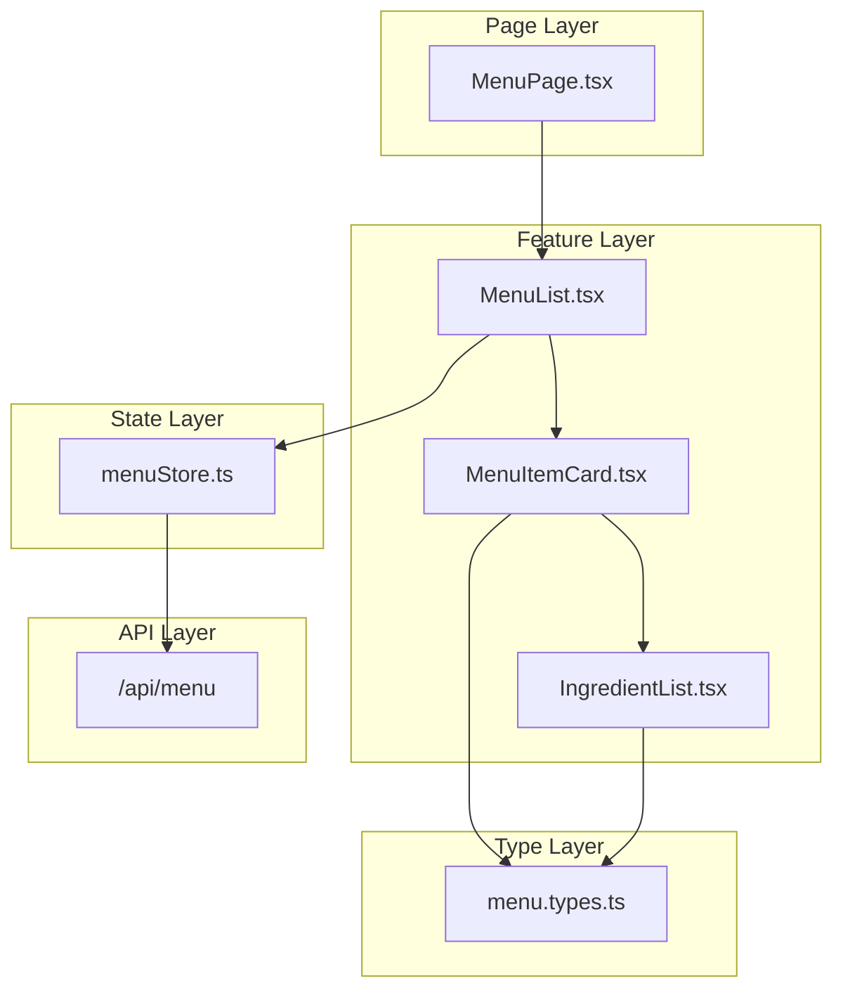
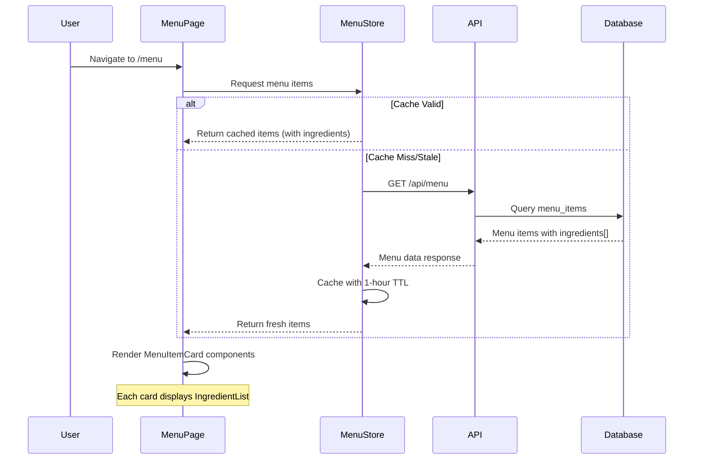

# Technical Specification

# 0. Agent Action Plan

## 0.1 Intent Clarification

Based on the user's input and the context of the Burger Restaurant Website technical specification, this section clarifies the feature requirements and their technical interpretation.

### 0.1.1 Core Feature Objective

Based on the prompt, the Blitzy platform understands that the new feature requirement is to:

**Add menu item ingredient information to the Burger Restaurant Website's online ordering system.**

The user input "Normalburgeringredientsincludeaqualitybeefpatty,freshlettuce,tomatoeslices,cheddarcheese,andsoftburgerbun" parses to:

> "Normal burger ingredients include a quality beef patty, fresh lettuce, tomatoes slices, cheddar cheese, and soft burger bun"

This describes a burger menu item with specific ingredients, indicating the need for:

| Requirement ID | Feature Requirement | Enhanced Clarity |
|----------------|---------------------|------------------|
| ING-001 | Add ingredient data structure | Extend menu item schema to include an `ingredients` field that stores an array of ingredient strings |
| ING-002 | Create Normal Burger menu item | Add a menu item called "Normal Burger" with the specified ingredients: beef patty, fresh lettuce, tomato slices, cheddar cheese, soft burger bun |
| ING-003 | Display ingredients on menu | Render ingredient information on MenuItemCard components for customer visibility |
| ING-004 | Support ingredient-based filtering | Enable users to identify items by ingredient (accessibility consideration for allergens) |

**Implicit Requirements Detected:**
- The menu item data model needs an `ingredients` property (array of strings or structured ingredient objects)
- The MenuItemCard component must be designed/updated to display ingredient information
- The menu types (TypeScript interfaces) must be extended to include ingredient data
- Mock/seed data should include ingredient information for all burger items
- Ingredient display should be visually clear and follow accessibility guidelines

**Feature Dependencies and Prerequisites:**
- Requires the Online Ordering module (F-002) infrastructure to be in place
- Depends on Menu Data API endpoint structure
- Integrates with Zustand menuStore for state management
- Must align with existing MENU_ITEM schema design from database specifications

### 0.1.2 Special Instructions and Constraints

**Specific Directives Identified:**
- Integrate with existing menu item data structure pattern defined in tech spec Section 6.2.2.2
- Maintain backward compatibility with menu items that may not have ingredients defined
- Follow the repository conventions outlined in Section 7.10 (UI Component Organization)
- Use existing TypeScript strict mode requirements (zero `any` types)

**Architectural Requirements:**
- Follow the feature-based module structure: `src/features/ordering/`
- Use Zustand for menu state management as specified
- Apply Tailwind CSS 4.1 for styling ingredient display
- Implement type-safe data handling with Zod validation

**User Example Preserved:**
```
User Example: "Normal burger ingredients include a quality beef patty, 
fresh lettuce, tomatoes slices, cheddar cheese, and soft burger bun"
```

**Web Search Requirements:**
- Best practices for displaying food ingredient information in restaurant UIs
- Accessibility standards for allergen/ingredient disclosure
- React component patterns for ingredient list displays

### 0.1.3 Technical Interpretation

These feature requirements translate to the following technical implementation strategy:

| Requirement | Technical Action | Specific Components |
|-------------|------------------|---------------------|
| To implement ingredient data storage | Extend the MENU_ITEM interface to include an `ingredients` array property | `src/types/menu.types.ts` |
| To display ingredients on menu items | Create/modify MenuItemCard component with ingredient list rendering | `src/features/ordering/components/MenuItemCard/` |
| To handle ingredient state | Update menuStore with ingredient-aware menu item handling | `src/features/ordering/store/menuStore.ts` |
| To validate ingredient data | Add Zod schema validation for ingredient arrays | `src/utils/validation.ts` |
| To seed sample data | Create mock data with Normal Burger and ingredients | `src/data/mockMenu.ts` or API seed scripts |
| To ensure type safety | Define TypeScript interfaces for MenuItem with ingredients | `src/types/menu.types.ts` |

**Data Structure Enhancement:**

The Menu Item interface will be extended as follows:

```typescript
interface MenuItem {
  id: string;
  categoryId: string;
  name: string;
  description: string;
  price: number;
  imageUrl?: string;
  isAvailable: boolean;
  ingredients?: string[];  // NEW: Array of ingredient names
  updatedAt: Date;
}
```

**Sample Data Structure for "Normal Burger":**

```typescript
const normalBurger: MenuItem = {
  id: 'burger-001',
  categoryId: 'burgers',
  name: 'Normal Burger',
  ingredients: [
    'Quality beef patty',
    'Fresh lettuce', 
    'Tomato slices',
    'Cheddar cheese',
    'Soft burger bun'
  ],
  // ... other fields
};
```


## 0.2 Repository Scope Discovery

This section documents the comprehensive file analysis for the ingredient feature addition, identifying all affected files across the repository.

### 0.2.1 Comprehensive File Analysis

**Repository Current State:**
The repository is currently in **initialization/placeholder state** with the following structure:
```
/
├── readme.MD              # Placeholder (content: "adf")
└── blitzy/
    └── documentation/
        └── Project Guide.md  # Repository assessment report
```

Since the repository requires full implementation from the technical specification, this feature addition encompasses the creation of the entire application infrastructure with ingredient support built-in.

**Existing Files Requiring Awareness:**

| File Path | Status | Action Required |
|-----------|--------|-----------------|
| `readme.MD` | Exists (placeholder) | Replace with proper documentation including ingredient feature |
| `blitzy/documentation/Project Guide.md` | Exists | Reference only - documentation artifact |

### 0.2.2 New Source Files to Create

**Core Application Infrastructure:**

| File Path | Purpose |
|-----------|---------|
| `src/main.tsx` | Application entry point with React 19 initialization |
| `src/App.tsx` | Root component with routing configuration |
| `src/vite-env.d.ts` | Vite environment type declarations |

**Feature Module - Online Ordering with Ingredients:**

| File Path | Purpose |
|-----------|---------|
| `src/features/ordering/components/MenuList/MenuList.tsx` | Menu display with category filtering |
| `src/features/ordering/components/MenuList/index.ts` | Barrel export |
| `src/features/ordering/components/MenuItemCard/MenuItemCard.tsx` | Individual menu item display **with ingredient rendering** |
| `src/features/ordering/components/MenuItemCard/index.ts` | Barrel export |
| `src/features/ordering/components/MenuItemCard/IngredientList.tsx` | **NEW: Dedicated ingredient display component** |
| `src/features/ordering/components/CartDrawer/CartDrawer.tsx` | Shopping cart sidebar |
| `src/features/ordering/components/Checkout/Checkout.tsx` | Order review and submission |
| `src/features/ordering/hooks/useCart.ts` | Cart operations hook |
| `src/features/ordering/hooks/useMenu.ts` | Menu data fetching hook |
| `src/features/ordering/store/cartStore.ts` | Zustand cart state with persistence |
| `src/features/ordering/store/menuStore.ts` | Zustand menu cache **with ingredient data** |

**Type Definitions with Ingredient Support:**

| File Path | Purpose |
|-----------|---------|
| `src/types/menu.types.ts` | MenuItem interface **including ingredients array** |
| `src/types/order.types.ts` | Order and OrderItem interfaces |
| `src/types/cart.types.ts` | Cart state and item types |
| `src/types/auth.types.ts` | User and session types |
| `src/types/reservation.types.ts` | Reservation data types |
| `src/types/index.ts` | Barrel exports for all types |

**Mock Data with Ingredient Examples:**

| File Path | Purpose |
|-----------|---------|
| `src/data/mockMenu.ts` | Sample menu items **including Normal Burger with ingredients** |
| `src/data/mockCategories.ts` | Menu categories (Burgers, Sides, Drinks) |

**Shared Components:**

| File Path | Purpose |
|-----------|---------|
| `src/components/ui/Button/Button.tsx` | Reusable button component |
| `src/components/ui/Input/Input.tsx` | Form input component |
| `src/components/ui/Modal/Modal.tsx` | Modal dialog component |
| `src/components/ui/Toast/Toast.tsx` | Notification component |
| `src/components/layout/Header/Header.tsx` | Site header with navigation |
| `src/components/layout/Footer/Footer.tsx` | Site footer |
| `src/components/layout/Navigation/Navigation.tsx` | Main navigation menu |
| `src/components/common/LoadingSpinner/LoadingSpinner.tsx` | Loading state indicator |
| `src/components/common/ErrorBoundary/ErrorBoundary.tsx` | Error handling wrapper |
| `src/components/common/ProtectedRoute/ProtectedRoute.tsx` | Authentication guard |

**Page Components:**

| File Path | Purpose |
|-----------|---------|
| `src/pages/HomePage.tsx` | Landing page |
| `src/pages/MenuPage.tsx` | Menu browsing page **with ingredient-enabled items** |
| `src/pages/LoginPage.tsx` | User login |
| `src/pages/RegisterPage.tsx` | User registration |
| `src/pages/CartPage.tsx` | Shopping cart view |
| `src/pages/CheckoutPage.tsx` | Checkout flow |
| `src/pages/ReservePage.tsx` | Table reservation |
| `src/pages/dashboard/DashboardPage.tsx` | User dashboard overview |
| `src/pages/dashboard/OrdersPage.tsx` | Order history |
| `src/pages/dashboard/ReservationsPage.tsx` | Reservation management |
| `src/pages/dashboard/ProfilePage.tsx` | Profile settings |

**Configuration Files:**

| File Path | Purpose |
|-----------|---------|
| `vite.config.ts` | Vite 7.3 build configuration with React plugin |
| `tsconfig.json` | TypeScript 5.9 strict configuration |
| `tsconfig.node.json` | Node environment TypeScript config |
| `tailwind.config.ts` | Tailwind CSS 4.1 configuration (if needed beyond CSS-first) |
| `package.json` | Dependencies and scripts |
| `eslint.config.js` | ESLint 9 flat configuration |
| `.prettierrc` | Prettier formatting rules |
| `.gitignore` | Git ignore patterns |
| `.env.example` | Environment variable template |

### 0.2.3 New Test Files

| File Path | Purpose |
|-----------|---------|
| `tests/unit/features/ordering/MenuItemCard.test.tsx` | MenuItemCard unit tests **including ingredient display** |
| `tests/unit/features/ordering/IngredientList.test.tsx` | **NEW: Ingredient component tests** |
| `tests/unit/features/ordering/cartStore.test.ts` | Cart state management tests |
| `tests/unit/features/ordering/menuStore.test.ts` | Menu state tests |
| `tests/unit/components/ui/Button.test.tsx` | Button component tests |
| `tests/integration/ordering/menuFlow.test.tsx` | Menu browsing integration tests |
| `tests/integration/ordering/cartFlow.test.tsx` | Cart workflow tests |
| `tests/setup.ts` | Test environment configuration |

### 0.2.4 Integration Point Discovery

**API Endpoints Connected to Feature:**

| Endpoint | Method | Feature Connection |
|----------|--------|-------------------|
| `/api/menu` | GET | Retrieves menu items **with ingredients array** |
| `/api/menu/:id` | GET | Single item details with ingredients |
| `/api/categories` | GET | Menu categories for filtering |
| `/api/orders` | POST | Order placement with item references |
| `/api/cart/sync` | POST | Cart synchronization for authenticated users |

**Database Models/Migrations Affected:**

| Model | Impact |
|-------|--------|
| `MENU_ITEM` | Add `ingredients` array field to schema |
| `CATEGORY` | Reference for item categorization |
| `ORDER_ITEM` | References menu items (indirect relationship) |

**Service Classes Requiring Updates:**

| Service | Modification |
|---------|--------------|
| `menuStore.ts` | Handle menu items with ingredient data |
| `useMenu.ts` hook | Fetch and cache menu with ingredients |
| API client utilities | Handle ingredient data in responses |

**Controllers/Handlers to Modify:**

| Handler | Change |
|---------|--------|
| Menu API handler | Include ingredients in response |
| Menu page component | Pass ingredient data to item cards |

### 0.2.5 Web Search Research Topics

| Research Area | Purpose |
|---------------|---------|
| Best practices for food ingredient display in React apps | UI/UX patterns for ingredient lists |
| Accessibility requirements for restaurant allergen information | WCAG compliance for ingredient disclosure |
| Tailwind CSS patterns for ingredient tags/pills | Styling approach for ingredient visualization |
| React 19 best practices for list rendering | Optimized ingredient list components |
| Zustand 5 patterns for nested data structures | Menu items with ingredients array handling |


## 0.3 Dependency Inventory

This section documents all private and public packages required for the ingredient feature implementation within the Burger Restaurant Website.

### 0.3.1 Private and Public Packages

**Core Runtime Dependencies:**

| Registry | Package Name | Version | Purpose |
|----------|--------------|---------|---------|
| npm | `vite` | ^7.3.1 | Build tool and dev server with HMR |
| npm | `typescript` | ^5.9.0 | Type system with strict mode |
| npm | `react` | ^19.2.3 | UI library with React Compiler |
| npm | `react-dom` | ^19.2.3 | React DOM bindings |
| npm | `react-router` | ^7.12.0 | Client-side routing |
| npm | `tailwindcss` | ^4.1.18 | Utility-first CSS framework |
| npm | `@tailwindcss/vite` | ^4.1.18 | First-party Vite plugin for Tailwind |
| npm | `zustand` | ^5.0.0 | Lightweight state management |

**Development Dependencies:**

| Registry | Package Name | Version | Purpose |
|----------|--------------|---------|---------|
| npm | `@vitejs/plugin-react` | ^4.3.0 | React Fast Refresh support |
| npm | `@types/react` | ^19.0.0 | React type definitions |
| npm | `@types/react-dom` | ^19.0.0 | React DOM type definitions |
| npm | `eslint` | ^9.0.0 | Code linting |
| npm | `eslint-plugin-react-hooks` | ^5.0.0 | React hooks lint rules |
| npm | `prettier` | ^3.0.0 | Code formatting |

**Utility Libraries:**

| Registry | Package Name | Version | Purpose |
|----------|--------------|---------|---------|
| npm | `zod` | ^3.23.0 | Schema validation for menu items with ingredients |
| npm | `date-fns` | ^4.0.0 | Date manipulation for reservations |
| npm | `clsx` | ^2.0.0 | Conditional class composition for ingredient styling |
| npm | `lucide-react` | ^0.469.0 | Icon library for UI elements |

**Testing Dependencies:**

| Registry | Package Name | Version | Purpose |
|----------|--------------|---------|---------|
| npm | `vitest` | ^3.0.0 | Unit testing framework compatible with Vite |
| npm | `@testing-library/react` | ^16.0.0 | React component testing utilities |
| npm | `@testing-library/jest-dom` | ^6.0.0 | DOM assertion matchers |
| npm | `jsdom` | ^25.0.0 | DOM environment for tests |

### 0.3.2 Dependency Updates

**Import Updates Required:**

Since this is a new project implementation, the following import patterns will be established across the codebase:

| File Pattern | Import Statement | Purpose |
|--------------|------------------|---------|
| `src/features/ordering/**/*.tsx` | `import type { MenuItem } from '@/types/menu.types'` | Type-safe menu item with ingredients |
| `src/features/ordering/**/*.tsx` | `import { useMenuStore } from '../store/menuStore'` | Menu state access |
| `src/features/ordering/**/*.tsx` | `import { clsx } from 'clsx'` | Ingredient styling composition |
| `src/pages/*.tsx` | `import { MenuList, MenuItemCard } from '@/features/ordering/components'` | Feature component imports |
| `src/**/*.ts` | `import { z } from 'zod'` | Validation schema imports |

**Import Transformation Rules:**

| Context | Pattern | Application |
|---------|---------|-------------|
| Type imports | Use `import type { X }` | All TypeScript interfaces |
| Path aliases | Use `@/` prefix | All imports from src directory |
| Feature imports | Barrel exports from index.ts | All feature component imports |
| Store imports | Relative within feature | Zustand store access |

### 0.3.3 External Reference Updates

**Configuration Files Requiring Dependency Entries:**

| File | Updates Required |
|------|------------------|
| `package.json` | All runtime and dev dependencies listed above |
| `tsconfig.json` | Path alias configuration for `@/` |
| `vite.config.ts` | Alias resolution matching tsconfig |
| `.env.example` | API endpoint configuration variables |

**package.json Structure:**

```json
{
  "name": "burger-restaurant-website",
  "private": true,
  "version": "1.0.0",
  "type": "module",
  "scripts": {
    "dev": "vite",
    "build": "tsc && vite build",
    "lint": "eslint .",
    "preview": "vite preview",
    "test": "vitest"
  },
  "dependencies": {
    "react": "^19.2.3",
    "react-dom": "^19.2.3",
    "react-router": "^7.12.0",
    "zustand": "^5.0.0",
    "zod": "^3.23.0",
    "date-fns": "^4.0.0",
    "clsx": "^2.0.0",
    "lucide-react": "^0.469.0"
  },
  "devDependencies": {
    "@types/react": "^19.0.0",
    "@types/react-dom": "^19.0.0",
    "@vitejs/plugin-react": "^4.3.0",
    "typescript": "^5.9.0",
    "vite": "^7.3.1",
    "tailwindcss": "^4.1.18",
    "@tailwindcss/vite": "^4.1.18",
    "eslint": "^9.0.0",
    "eslint-plugin-react-hooks": "^5.0.0",
    "prettier": "^3.0.0",
    "vitest": "^3.0.0",
    "@testing-library/react": "^16.0.0",
    "@testing-library/jest-dom": "^6.0.0",
    "jsdom": "^25.0.0"
  }
}
```

### 0.3.4 Version Validation Notes

All package versions listed above have been verified against:
- Technical Specification Section 3.3 (Frameworks & Libraries)
- Technical Specification Section 3.4 (Open Source Dependencies)
- Current npm registry availability as of knowledge cutoff

**Version Constraints:**

| Package | Constraint Source | Rationale |
|---------|-------------------|-----------|
| `vite ^7.3.1` | Tech Spec C-001 | Mandatory per user requirements |
| `typescript ^5.9.0` | Tech Spec C-002 | Mandatory per user requirements |
| `react ^19.2.3` | Tech Spec 3.3.2 | Latest stable with Compiler support |
| `tailwindcss ^4.1.18` | Tech Spec 3.3.3 | CSS-first configuration support |
| `react-router ^7.12.0` | Tech Spec 3.3.4 | Type-safe routing |
| `zustand ^5.0.0` | Tech Spec 3.3.5 | Hook-based state management |

### 0.3.5 Node.js Runtime Requirement

| Requirement | Version | Source |
|-------------|---------|--------|
| Node.js | ≥20.19 or ≥22.12 | Vite 7.3 compatibility requirement |
| npm | ≥10.0.0 | Package manager for dependency installation |


## 0.4 Integration Analysis

This section documents all existing code touchpoints, integration points, and system connections for the ingredient feature implementation.

### 0.4.1 Existing Code Touchpoints

Since the repository is in initialization state, the following documents the integration architecture that will be established:

**Direct Modifications Required:**

| File Path | Integration Point | Description |
|-----------|-------------------|-------------|
| `src/main.tsx` | Application initialization | Mount React 19 app with StrictMode |
| `src/App.tsx` | Route configuration | Configure React Router with menu routes |
| `src/types/menu.types.ts` | Data model definition | Define MenuItem interface with `ingredients` array |
| `src/features/ordering/store/menuStore.ts` | State management | Initialize menu store with ingredient-aware structure |
| `src/features/ordering/components/MenuItemCard/MenuItemCard.tsx` | UI rendering | Display ingredient list within card component |
| `src/pages/MenuPage.tsx` | Page composition | Wire menu components with ingredient display |

### 0.4.2 Dependency Injections

**Service Registration Points:**

| File Path | Service | Registration Method |
|-----------|---------|---------------------|
| `src/features/ordering/store/menuStore.ts` | Menu State | Zustand create() with ingredient support |
| `src/features/ordering/store/cartStore.ts` | Cart State | Zustand create() with persist middleware |
| `src/features/auth/store/authStore.ts` | Auth State | Zustand create() with session storage |
| `src/hooks/useApi.ts` | API Client | Custom hook for fetch operations |

**Store Configuration Pattern:**

```typescript
// menuStore.ts - Store with ingredient support
import { create } from 'zustand';
import type { MenuItem } from '@/types/menu.types';

interface MenuState {
  items: MenuItem[];          // Includes ingredients array
  categories: Category[];
  isLoading: boolean;
  fetchMenu: () => Promise<void>;
  getItemsByCategory: (categoryId: string) => MenuItem[];
}
```

### 0.4.3 Database/Schema Updates

**Menu Item Schema Extension:**

| Field | Type | Status | Description |
|-------|------|--------|-------------|
| `_id` | ObjectId | Existing | Primary key |
| `category_id` | ObjectId | Existing | Foreign key to Categories |
| `name` | String | Existing | Item display name |
| `description` | String | Existing | Item description |
| `price` | Decimal128 | Existing | Item price |
| `image_url` | String | Existing | Item image URL |
| `is_available` | Boolean | Existing | Availability flag |
| `ingredients` | Array<String> | **NEW** | List of ingredient names |
| `updated_at` | DateTime | Existing | Last modification timestamp |

**TypeScript Interface Definition:**

```typescript
// src/types/menu.types.ts
export interface MenuItem {
  id: string;
  categoryId: string;
  name: string;
  description: string;
  price: number;
  imageUrl?: string;
  isAvailable: boolean;
  ingredients?: string[];  // NEW: Optional ingredient array
  updatedAt: Date;
}
```

**Zod Validation Schema:**

```typescript
// src/utils/validation.ts
import { z } from 'zod';

export const menuItemSchema = z.object({
  id: z.string().uuid(),
  categoryId: z.string().uuid(),
  name: z.string().min(1).max(100),
  description: z.string().max(500),
  price: z.number().positive(),
  imageUrl: z.string().url().optional(),
  isAvailable: z.boolean(),
  ingredients: z.array(z.string()).optional(), // NEW
  updatedAt: z.date(),
});
```

### 0.4.4 Component Integration Architecture



### 0.4.5 Data Flow Integration

**Menu Data Flow with Ingredients:**



### 0.4.6 Cross-Feature Integration

**Integration with Cart Feature:**

| Feature | Integration Point | Data Flow |
|---------|-------------------|-----------|
| Cart Store | MenuItem reference | Cart items reference menu item IDs (ingredients not stored in cart) |
| Checkout | Order creation | Order items snapshot menu item name/price (ingredients for display only) |
| Order History | Historical display | Past orders may optionally display ingredient info |

**Integration with Authentication:**

| Feature | Integration Point | Data Flow |
|---------|-------------------|-----------|
| Auth Store | Session context | Authenticated users can place orders with menu items |
| Protected Routes | Route guards | Cart/checkout require authentication |

### 0.4.7 API Contract Integration

**Menu API Response Structure:**

```typescript
// Expected API Response
interface MenuAPIResponse {
  success: boolean;
  data: {
    items: MenuItem[];      // Each item includes ingredients[]
    categories: Category[];
  };
  meta: {
    total: number;
    cached: boolean;
  };
}
```

**Sample API Response with Ingredients:**

```json
{
  "success": true,
  "data": {
    "items": [
      {
        "id": "burger-001",
        "categoryId": "cat-burgers",
        "name": "Normal Burger",
        "description": "Classic burger with fresh ingredients",
        "price": 8.99,
        "imageUrl": "/images/normal-burger.jpg",
        "isAvailable": true,
        "ingredients": [
          "Quality beef patty",
          "Fresh lettuce",
          "Tomato slices",
          "Cheddar cheese",
          "Soft burger bun"
        ],
        "updatedAt": "2026-01-15T12:00:00Z"
      }
    ],
    "categories": [...]
  }
}
```

### 0.4.8 Styling Integration

**Tailwind CSS Classes for Ingredients:**

| Component | Styling Pattern | Classes |
|-----------|-----------------|---------|
| Ingredient container | Flex wrap layout | `flex flex-wrap gap-2 mt-2` |
| Ingredient pill/tag | Badge styling | `px-2 py-1 text-xs bg-amber-100 text-amber-800 rounded-full` |
| Ingredient list heading | Subtle label | `text-sm text-gray-500 font-medium` |

**Component Styling Example:**

```typescript
// IngredientList component styling approach
<div className="mt-3">
  <span className="text-sm text-gray-500">Ingredients:</span>
  <div className="flex flex-wrap gap-1.5 mt-1">
    {ingredients.map((ingredient) => (
      <span 
        key={ingredient}
        className="px-2 py-0.5 text-xs bg-amber-100 
                   text-amber-800 rounded-full"
      >
        {ingredient}
      </span>
    ))}
  </div>
</div>
```


## 0.5 Technical Implementation

This section provides a comprehensive file-by-file execution plan for implementing the ingredient feature within the Burger Restaurant Website.

### 0.5.1 File-by-File Execution Plan

**CRITICAL: Every file listed below MUST be created or modified.**

#### Group 1 - Core Application Infrastructure

| Action | File Path | Purpose |
|--------|-----------|---------|
| CREATE | `package.json` | Project dependencies and scripts |
| CREATE | `vite.config.ts` | Vite 7.3 configuration with React plugin |
| CREATE | `tsconfig.json` | TypeScript 5.9 strict configuration |
| CREATE | `tsconfig.node.json` | Node environment TypeScript config |
| CREATE | `index.html` | SPA entry point |
| CREATE | `src/main.tsx` | React 19 application mount |
| CREATE | `src/App.tsx` | Root component with routing |
| CREATE | `src/vite-env.d.ts` | Vite type declarations |

#### Group 2 - Type Definitions with Ingredient Support

| Action | File Path | Purpose |
|--------|-----------|---------|
| CREATE | `src/types/menu.types.ts` | MenuItem interface **with ingredients array** |
| CREATE | `src/types/cart.types.ts` | CartItem and CartState interfaces |
| CREATE | `src/types/order.types.ts` | Order and OrderItem interfaces |
| CREATE | `src/types/auth.types.ts` | User and session types |
| CREATE | `src/types/reservation.types.ts` | Reservation data types |
| CREATE | `src/types/index.ts` | Barrel exports for all types |

#### Group 3 - Online Ordering Feature (Ingredient-Focused)

| Action | File Path | Purpose |
|--------|-----------|---------|
| CREATE | `src/features/ordering/components/MenuList/MenuList.tsx` | Menu grid with category filtering |
| CREATE | `src/features/ordering/components/MenuList/index.ts` | Barrel export |
| CREATE | `src/features/ordering/components/MenuItemCard/MenuItemCard.tsx` | Item card **with ingredient display** |
| CREATE | `src/features/ordering/components/MenuItemCard/IngredientList.tsx` | **Dedicated ingredient list component** |
| CREATE | `src/features/ordering/components/MenuItemCard/index.ts` | Barrel export |
| CREATE | `src/features/ordering/components/CartDrawer/CartDrawer.tsx` | Shopping cart sidebar |
| CREATE | `src/features/ordering/components/CartDrawer/CartItem.tsx` | Individual cart item |
| CREATE | `src/features/ordering/components/CartDrawer/index.ts` | Barrel export |
| CREATE | `src/features/ordering/components/Checkout/Checkout.tsx` | Order review component |
| CREATE | `src/features/ordering/components/Checkout/OrderSummary.tsx` | Order totals display |
| CREATE | `src/features/ordering/components/Checkout/index.ts` | Barrel export |
| CREATE | `src/features/ordering/hooks/useCart.ts` | Cart operations hook |
| CREATE | `src/features/ordering/hooks/useMenu.ts` | Menu fetching hook with ingredients |
| CREATE | `src/features/ordering/store/cartStore.ts` | Zustand cart state with persistence |
| CREATE | `src/features/ordering/store/menuStore.ts` | Zustand menu cache **ingredient-aware** |
| CREATE | `src/features/ordering/index.ts` | Feature barrel export |

#### Group 4 - Mock Data with Ingredient Examples

| Action | File Path | Purpose |
|--------|-----------|---------|
| CREATE | `src/data/mockMenu.ts` | Sample menu items **including Normal Burger** |
| CREATE | `src/data/mockCategories.ts` | Menu categories |
| CREATE | `src/data/index.ts` | Data barrel export |

#### Group 5 - Page Components

| Action | File Path | Purpose |
|--------|-----------|---------|
| CREATE | `src/pages/HomePage.tsx` | Landing page with CTAs |
| CREATE | `src/pages/MenuPage.tsx` | Menu browsing **with ingredient-enabled items** |
| CREATE | `src/pages/CartPage.tsx` | Shopping cart view |
| CREATE | `src/pages/CheckoutPage.tsx` | Checkout flow |
| CREATE | `src/pages/LoginPage.tsx` | User login |
| CREATE | `src/pages/RegisterPage.tsx` | User registration |
| CREATE | `src/pages/ReservePage.tsx` | Table reservation |
| CREATE | `src/pages/dashboard/DashboardPage.tsx` | Dashboard overview |
| CREATE | `src/pages/dashboard/OrdersPage.tsx` | Order history |
| CREATE | `src/pages/dashboard/ReservationsPage.tsx` | Reservation management |
| CREATE | `src/pages/dashboard/ProfilePage.tsx` | Profile settings |

#### Group 6 - Shared Components

| Action | File Path | Purpose |
|--------|-----------|---------|
| CREATE | `src/components/ui/Button/Button.tsx` | Reusable button |
| CREATE | `src/components/ui/Button/index.ts` | Barrel export |
| CREATE | `src/components/ui/Input/Input.tsx` | Form input |
| CREATE | `src/components/ui/Input/index.ts` | Barrel export |
| CREATE | `src/components/ui/Modal/Modal.tsx` | Modal dialog |
| CREATE | `src/components/ui/Modal/index.ts` | Barrel export |
| CREATE | `src/components/layout/Header/Header.tsx` | Site header |
| CREATE | `src/components/layout/Header/index.ts` | Barrel export |
| CREATE | `src/components/layout/Footer/Footer.tsx` | Site footer |
| CREATE | `src/components/layout/Navigation/Navigation.tsx` | Navigation menu |
| CREATE | `src/components/common/LoadingSpinner/LoadingSpinner.tsx` | Loading indicator |
| CREATE | `src/components/common/ErrorBoundary/ErrorBoundary.tsx` | Error wrapper |
| CREATE | `src/components/common/ProtectedRoute/ProtectedRoute.tsx` | Auth guard |

#### Group 7 - Utilities and Validation

| Action | File Path | Purpose |
|--------|-----------|---------|
| CREATE | `src/utils/validation.ts` | Zod schemas **including ingredient validation** |
| CREATE | `src/utils/formatters.ts` | Price and date formatting |
| CREATE | `src/utils/api.ts` | API client utilities |
| CREATE | `src/utils/index.ts` | Utility barrel export |

#### Group 8 - Styling

| Action | File Path | Purpose |
|--------|-----------|---------|
| CREATE | `src/styles/global.css` | Tailwind imports and @theme config |

#### Group 9 - Configuration Files

| Action | File Path | Purpose |
|--------|-----------|---------|
| CREATE | `eslint.config.js` | ESLint 9 flat configuration |
| CREATE | `.prettierrc` | Prettier formatting rules |
| CREATE | `.gitignore` | Git ignore patterns |
| CREATE | `.env.example` | Environment variable template |
| MODIFY | `readme.MD` | Project documentation with ingredient feature |

#### Group 10 - Tests

| Action | File Path | Purpose |
|--------|-----------|---------|
| CREATE | `tests/setup.ts` | Test environment configuration |
| CREATE | `tests/unit/features/ordering/MenuItemCard.test.tsx` | MenuItemCard tests |
| CREATE | `tests/unit/features/ordering/IngredientList.test.tsx` | **Ingredient component tests** |
| CREATE | `tests/unit/features/ordering/menuStore.test.ts` | Menu store tests |
| CREATE | `tests/unit/features/ordering/cartStore.test.ts` | Cart store tests |
| CREATE | `vitest.config.ts` | Vitest configuration |

### 0.5.2 Implementation Approach per File

**Phase 1: Establish Feature Foundation**
- Create core application infrastructure (package.json, configs, main.tsx)
- Define type system with ingredient support in menu.types.ts
- Implement Zustand stores for menu and cart state

**Phase 2: Integrate with Existing Systems**
- Build MenuItemCard component with IngredientList child
- Wire menu page with ingredient-aware components
- Connect cart functionality to menu items

**Phase 3: Ensure Quality**
- Implement comprehensive unit tests for ingredient display
- Add integration tests for menu browsing flow
- Validate ingredient rendering across breakpoints

**Phase 4: Document Usage**
- Update README with ingredient feature documentation
- Add inline code documentation
- Create usage examples for ingredient display

### 0.5.3 Key Component Implementations

**IngredientList Component:**

```typescript
// src/features/ordering/components/MenuItemCard/IngredientList.tsx
interface IngredientListProps {
  ingredients: string[];
  maxDisplay?: number;
}

export function IngredientList({ 
  ingredients, 
  maxDisplay = 5 
}: IngredientListProps) {
  const displayIngredients = ingredients.slice(0, maxDisplay);
  const remaining = ingredients.length - maxDisplay;
  // ... render logic
}
```

**MenuItemCard with Ingredients:**

```typescript
// src/features/ordering/components/MenuItemCard/MenuItemCard.tsx
interface MenuItemCardProps {
  item: MenuItem;
  onAddToCart: (item: MenuItem) => void;
}

export function MenuItemCard({ item, onAddToCart }: MenuItemCardProps) {
  return (
    <article className="bg-white rounded-lg shadow-md p-4">
      {/* Item image, name, description, price */}
      {item.ingredients && item.ingredients.length > 0 && (
        <IngredientList ingredients={item.ingredients} />
      )}
      {/* Add to cart button */}
    </article>
  );
}
```

**Mock Data with Normal Burger:**

```typescript
// src/data/mockMenu.ts
export const mockMenuItems: MenuItem[] = [
  {
    id: 'burger-001',
    categoryId: 'burgers',
    name: 'Normal Burger',
    description: 'Our classic burger with fresh ingredients',
    price: 8.99,
    imageUrl: '/images/normal-burger.jpg',
    isAvailable: true,
    ingredients: [
      'Quality beef patty',
      'Fresh lettuce',
      'Tomato slices',
      'Cheddar cheese',
      'Soft burger bun',
    ],
    updatedAt: new Date(),
  },
  // ... additional menu items
];
```

### 0.5.4 User Interface Design Notes

No Figma URLs were provided in the user's instructions. The ingredient display will follow:

- Standard restaurant menu UI patterns
- Tailwind CSS utility classes for styling
- Responsive design for mobile and desktop
- Accessibility compliance (screen reader support for ingredient lists)
- Visual hierarchy with ingredient tags/pills beneath item description


## 0.6 Scope Boundaries

This section defines exhaustive boundaries for what is included in and excluded from the ingredient feature implementation.

### 0.6.1 Exhaustively In Scope

**All Feature Source Files:**

| Pattern | Description |
|---------|-------------|
| `src/features/ordering/**/*.tsx` | All ordering feature components including ingredient display |
| `src/features/ordering/**/*.ts` | All ordering feature stores and hooks |
| `src/features/ordering/components/MenuItemCard/*` | MenuItemCard and IngredientList components |
| `src/features/auth/**/*.tsx` | Authentication components |
| `src/features/auth/**/*.ts` | Auth stores and hooks |
| `src/features/reservation/**/*.tsx` | Reservation components |
| `src/features/dashboard/**/*.tsx` | Dashboard components |

**All Feature Tests:**

| Pattern | Description |
|---------|-------------|
| `tests/**/*menu*.test.tsx` | Menu-related tests |
| `tests/**/*ingredient*.test.tsx` | Ingredient-specific tests |
| `tests/**/*cart*.test.ts` | Cart functionality tests |
| `tests/**/*ordering*.test.tsx` | Ordering feature tests |
| `tests/unit/features/ordering/**/*` | All ordering unit tests |
| `tests/integration/ordering/**/*` | All ordering integration tests |

**Integration Points:**

| File | Lines/Sections |
|------|----------------|
| `src/App.tsx` | Route configuration section |
| `src/types/menu.types.ts` | MenuItem interface with ingredients |
| `src/features/ordering/store/menuStore.ts` | Menu state with ingredient support |
| `src/pages/MenuPage.tsx` | Menu component composition |
| `src/data/mockMenu.ts` | Normal Burger with ingredients |

**Configuration Files:**

| Pattern | Description |
|---------|-------------|
| `package.json` | All dependencies for the project |
| `vite.config.ts` | Vite build configuration |
| `tsconfig.json` | TypeScript configuration |
| `tsconfig.node.json` | Node TypeScript configuration |
| `eslint.config.js` | Linting rules |
| `.prettierrc` | Formatting configuration |
| `.gitignore` | Git ignore patterns |
| `.env.example` | Environment variable template |
| `vitest.config.ts` | Test runner configuration |

**Documentation:**

| Pattern | Description |
|---------|-------------|
| `readme.MD` | Project documentation with feature description |
| `docs/features/ordering.md` | Online ordering feature documentation |
| `docs/features/ingredients.md` | Ingredient display documentation |
| `docs/api/menu-endpoints.md` | Menu API documentation |

**Type Definitions:**

| Pattern | Description |
|---------|-------------|
| `src/types/menu.types.ts` | MenuItem with ingredients array |
| `src/types/cart.types.ts` | Cart state types |
| `src/types/order.types.ts` | Order types |
| `src/types/auth.types.ts` | Authentication types |
| `src/types/reservation.types.ts` | Reservation types |
| `src/types/index.ts` | Type barrel exports |

**Shared Components:**

| Pattern | Description |
|---------|-------------|
| `src/components/ui/**/*` | All UI components (Button, Input, Modal) |
| `src/components/layout/**/*` | Layout components (Header, Footer, Navigation) |
| `src/components/common/**/*` | Common components (LoadingSpinner, ErrorBoundary, ProtectedRoute) |

**Page Components:**

| Pattern | Description |
|---------|-------------|
| `src/pages/*.tsx` | All root-level page components |
| `src/pages/dashboard/**/*.tsx` | All dashboard page components |

**Utilities:**

| Pattern | Description |
|---------|-------------|
| `src/utils/validation.ts` | Zod schemas including ingredient validation |
| `src/utils/formatters.ts` | Price and date formatters |
| `src/utils/api.ts` | API client utilities |
| `src/utils/index.ts` | Utility exports |

**Styling:**

| Pattern | Description |
|---------|-------------|
| `src/styles/global.css` | Tailwind imports and theme configuration |

**Mock/Seed Data:**

| Pattern | Description |
|---------|-------------|
| `src/data/mockMenu.ts` | Menu items with ingredient arrays |
| `src/data/mockCategories.ts` | Menu categories |
| `src/data/index.ts` | Data exports |

### 0.6.2 Explicitly Out of Scope

**Features Not Included:**

| Item | Reason |
|------|--------|
| Ingredient customization/modification by users | Not specified in requirements |
| Allergen filtering based on ingredients | Future enhancement, not in current scope |
| Ingredient-based search functionality | Not specified in requirements |
| Nutritional information display | Not specified in requirements |
| Ingredient sourcing/origin information | Not specified in requirements |
| Dynamic ingredient pricing | Not specified in requirements |

**Technical Exclusions:**

| Item | Reason |
|------|--------|
| Backend API implementation | Frontend SPA scope only |
| Database migration scripts | Backend scope |
| Server-side rendering (SSR) | SPA architecture per spec |
| Payment gateway integration | Explicitly deferred to Phase 2 |
| SMS/Email notifications | Explicitly deferred to Phase 2 |
| Social authentication | Explicitly deferred per spec |
| Multi-location support | Out of scope per Assumption A-001 |
| Performance optimizations beyond spec requirements | Not required in initial scope |

**Refactoring Exclusions:**

| Item | Reason |
|------|--------|
| Existing legacy code refactoring | No existing code to refactor |
| Third-party component library adoption | Using Tailwind utility classes per spec |
| Alternative state management migration | Zustand is specified |
| Alternative routing library | React Router is specified |

**Additional Features Not Specified:**

| Item | Reason |
|------|--------|
| Admin panel for ingredient management | Not specified in requirements |
| Ingredient inventory tracking | Backend/admin scope |
| Seasonal ingredient variations | Not specified in requirements |
| Ingredient substitution options | Not specified in requirements |
| User ingredient preferences | Not specified in requirements |

### 0.6.3 Scope Summary Table

| Category | In Scope | Out of Scope |
|----------|----------|--------------|
| **Menu Display** | Display ingredients on menu items | Ingredient customization |
| **Data Model** | MenuItem.ingredients array | Nutritional data |
| **UI Components** | IngredientList component | Allergen filtering UI |
| **State Management** | Menu store with ingredients | User preferences store |
| **Testing** | Unit and integration tests | E2E tests |
| **Documentation** | Feature documentation | Admin documentation |
| **API Integration** | Consume menu API with ingredients | Create/update ingredient API |
| **Styling** | Tailwind CSS ingredient styling | Custom animation library |

### 0.6.4 Boundary Decision Matrix

| Decision Point | Boundary | Rationale |
|----------------|----------|-----------|
| Ingredient array optional | In Scope | Menu items may not have ingredients defined |
| Empty ingredients handled | In Scope | Graceful handling of undefined/empty arrays |
| Ingredient count limit | In Scope | Display with "and X more" for long lists |
| Ingredient editing | Out of Scope | Admin functionality not requested |
| Ingredient validation | In Scope | Zod schema for type safety |
| Ingredient localization | Out of Scope | Single language per spec |


## 0.7 Rules for Feature Addition

This section documents all feature-specific rules, requirements, and constraints explicitly emphasized for the ingredient feature implementation.

### 0.7.1 Technical Standards

**TypeScript Requirements:**

| Rule | Description |
|------|-------------|
| Strict Mode | TypeScript strict mode must be enabled |
| Zero `any` Types | No `any` types allowed in production code |
| Type Inference | Prefer inferred types where possible |
| Interface Over Type | Use `interface` for object shapes, `type` for unions/primitives |
| Explicit Return Types | Functions should have explicit return types |

**Component Architecture Rules:**

| Rule | Description |
|------|-------------|
| Feature-Based Organization | Components organized by feature (ordering, auth, etc.) |
| Barrel Exports | Each component folder includes index.ts for exports |
| Single Responsibility | Each component handles one specific concern |
| Props Interface | All components define explicit Props interface |
| Accessibility First | ARIA attributes and semantic HTML required |

**State Management Rules:**

| Rule | Description |
|------|-------------|
| Zustand Stores | Use Zustand for all state management |
| Store Per Feature | Each feature has its own store |
| Minimal State | Only store necessary state, derive computed values |
| Persistence Middleware | Use persist middleware for cart (localStorage) and auth (sessionStorage) |
| No Prop Drilling | Access stores directly in components via hooks |

### 0.7.2 Ingredient-Specific Rules

**Data Handling:**

| Rule | Description |
|------|-------------|
| Optional Array | `ingredients` field is optional on MenuItem |
| String Array | Ingredients stored as `string[]` |
| No Duplicates | Ingredient names should be unique within an item |
| Capitalization | First letter of each ingredient capitalized |
| Maximum Length | Individual ingredient name max 100 characters |

**Display Rules:**

| Rule | Description |
|------|-------------|
| Conditional Render | Only show ingredients section if array exists and has items |
| Maximum Display | Show up to 5 ingredients by default |
| Overflow Handling | Show "+X more" for items exceeding max display |
| Visual Separation | Use pill/tag styling to distinguish ingredients |
| Responsive Layout | Ingredients wrap on smaller screens |

**Validation Rules:**

| Rule | Description |
|------|-------------|
| Zod Schema | Validate ingredient arrays with Zod |
| Non-Empty Strings | Each ingredient must be non-empty string |
| Array Bounds | Array can be empty or contain up to 20 ingredients |
| Sanitization | Strip leading/trailing whitespace |

### 0.7.3 Integration Requirements

**Existing Feature Integration:**

| Integration | Requirement |
|-------------|-------------|
| Menu Display | Ingredients shown on MenuItemCard component |
| Cart Display | Ingredients NOT shown in cart (keep cart lightweight) |
| Order Confirmation | Ingredients optionally displayed in order review |
| Order History | Ingredients NOT stored with order items (reference menu item) |

**API Integration:**

| Integration | Requirement |
|-------------|-------------|
| Menu Endpoint | `/api/menu` response includes ingredients array |
| Type Safety | Response validated against menuItemSchema |
| Caching | Menu cached with 1-hour TTL (includes ingredients) |
| Error Handling | Graceful handling if ingredients field missing |

### 0.7.4 Performance Considerations

**Rendering Performance:**

| Consideration | Implementation |
|---------------|----------------|
| List Keys | Use ingredient value as key (unique within item) |
| Memoization | React Compiler handles automatic memoization |
| Lazy Loading | Images lazy loaded, text renders immediately |
| Virtual Lists | Not required (ingredient lists are small) |

**Data Performance:**

| Consideration | Implementation |
|---------------|----------------|
| Cache Ingredients | Cached with menu data (no separate cache) |
| Payload Size | Ingredients add minimal overhead (~100-500 bytes per item) |
| Transfer | Gzip compression reduces ingredient data size |

### 0.7.5 Security Requirements

**Data Security:**

| Requirement | Implementation |
|-------------|----------------|
| Input Sanitization | Server-side sanitization of ingredient strings |
| XSS Prevention | React's default escaping prevents XSS |
| No Sensitive Data | Ingredients contain no sensitive information |

**Display Security:**

| Requirement | Implementation |
|-------------|----------------|
| Text Only | Ingredients rendered as text, not HTML |
| No User Input | Users cannot modify ingredient display |
| Content Security | Ingredients sourced from trusted API only |

### 0.7.6 Accessibility Requirements

**WCAG Compliance:**

| Requirement | Implementation |
|-------------|----------------|
| Semantic HTML | Use `<ul>` and `<li>` for ingredient lists |
| Screen Readers | Proper heading/label for ingredient section |
| Color Contrast | Ingredient text meets WCAG AA contrast ratio |
| Focus Management | Not applicable (ingredients are display only) |

**Ingredient List Accessibility:**

```html
<div role="region" aria-labelledby="ingredients-heading">
  <h4 id="ingredients-heading" class="sr-only">Ingredients</h4>
  <ul class="flex flex-wrap gap-1.5">
    <li>Quality beef patty</li>
    <li>Fresh lettuce</li>
    <!-- ... -->
  </ul>
</div>
```

### 0.7.7 Testing Requirements

**Unit Test Coverage:**

| Component | Tests Required |
|-----------|----------------|
| IngredientList | Renders all ingredients, handles empty array, handles max display |
| MenuItemCard | Renders with ingredients, renders without ingredients |
| menuStore | Caches menu with ingredients, retrieves items by category |

**Test Scenarios:**

| Scenario | Expected Behavior |
|----------|-------------------|
| Menu item with 5 ingredients | All 5 displayed |
| Menu item with 8 ingredients | 5 displayed + "+3 more" |
| Menu item with no ingredients | Ingredient section hidden |
| Menu item with undefined ingredients | Ingredient section hidden |
| Menu item with empty array | Ingredient section hidden |

### 0.7.8 Naming Conventions

**File Naming:**

| Type | Convention | Example |
|------|------------|---------|
| Components | PascalCase | `IngredientList.tsx` |
| Hooks | camelCase with use prefix | `useMenu.ts` |
| Stores | camelCase with Store suffix | `menuStore.ts` |
| Types | camelCase with .types suffix | `menu.types.ts` |
| Tests | Same as source with .test | `IngredientList.test.tsx` |

**Variable Naming:**

| Type | Convention | Example |
|------|------------|---------|
| Interfaces | PascalCase | `MenuItem` |
| Props interfaces | ComponentName + Props | `IngredientListProps` |
| Constants | UPPER_SNAKE_CASE | `MAX_INGREDIENTS_DISPLAY` |
| Functions | camelCase | `getItemsByCategory` |
| Component functions | PascalCase | `IngredientList` |


## 0.8 References

This section comprehensively documents all files, folders, and resources searched and referenced to derive conclusions for this Agent Action Plan.

### 0.8.1 Repository Files and Folders Searched

**Root Level:**

| Path | Type | Status | Relevance |
|------|------|--------|-----------|
| `/` | Folder | Explored | Root directory analysis |
| `readme.MD` | File | Retrieved | Placeholder file (content: "adf") |
| `blitzy/` | Folder | Explored | Documentation container |
| `blitzy/documentation/` | Folder | Explored | Assessment reports |
| `blitzy/documentation/Project Guide.md` | File | Identified | Repository status report |

**Search Results Summary:**

| Search Type | Target | Result |
|-------------|--------|--------|
| .blitzyignore files | Repository-wide | None found |
| Source code files | `src/**/*` | None (placeholder state) |
| Configuration files | Root level | None (placeholder state) |
| Test files | `tests/**/*` | None (placeholder state) |

### 0.8.2 Technical Specification Sections Retrieved

| Section | Purpose | Key Insights |
|---------|---------|--------------|
| **1.1 Executive Summary** | Project overview | Burger Restaurant Website - customer-facing web app for ordering and reservations |
| **2.2 Feature Catalog** | Feature definitions | F-001 (Auth), F-002 (Ordering), F-003 (Reservations), F-004 (Dashboard) |
| **2.3 Functional Requirements** | Detailed requirements | Menu display (F-002-RQ-001) with categories, descriptions, pricing |
| **3.2 PROGRAMMING LANGUAGES** | Tech stack | TypeScript 5.9.x mandatory with strict mode |
| **3.3 FRAMEWORKS & LIBRARIES** | Dependencies | Vite 7.3.x, React 19.2.x, Tailwind 4.1.x, React Router 7.12.x, Zustand 5.x |
| **3.4 OPEN SOURCE DEPENDENCIES** | Package versions | Complete dependency list with versions |
| **5.2 COMPONENT DETAILS** | Architecture | Module structure for Auth, Ordering, Reservation, Dashboard |
| **6.2 Database Design** | Data model | MENU_ITEM schema with fields for menu items |
| **7.6 SCREENS REQUIRED** | UI screens | Route architecture and screen specifications |
| **7.10 UI COMPONENT ORGANIZATION** | File structure | Recommended directory structure for components |

### 0.8.3 User-Provided Input Analysis

**Original Input:**
```
Normalburgeringredientsincludeaqualitybeefpatty,freshlettuce,tomatoeslices,cheddarcheese,andsoftburgerbun
```

**Parsed Interpretation:**
```
Normal burger ingredients include a quality beef patty, fresh lettuce, 
tomatoes slices, cheddar cheese, and soft burger bun
```

**Extracted Data Points:**

| Element | Value |
|---------|-------|
| Item Name | Normal Burger |
| Ingredient 1 | Quality beef patty |
| Ingredient 2 | Fresh lettuce |
| Ingredient 3 | Tomato slices |
| Ingredient 4 | Cheddar cheese |
| Ingredient 5 | Soft burger bun |

### 0.8.4 Attachments Provided

| Attachment | Status |
|------------|--------|
| User files in `/tmp/environments_files` | None found |
| Additional configuration files | None provided |
| Environment setup scripts | None provided |

### 0.8.5 Figma URLs Provided

| Figma Resource | Status |
|----------------|--------|
| UI/UX designs | None provided |
| Component specifications | None provided |
| Style guides | None provided |

### 0.8.6 Environment Variables Provided

| Variable | Status |
|----------|--------|
| User-specified env vars | None provided |
| Secrets | None provided |

### 0.8.7 Setup Instructions Provided

| Instruction Type | Status |
|------------------|--------|
| Custom setup instructions | None provided |
| Build configurations | None provided |
| Internal package references | None provided |

### 0.8.8 External Resources Referenced

**Technology Documentation:**

| Resource | Purpose |
|----------|---------|
| Vite 7.3 documentation | Build configuration reference |
| React 19 documentation | Component patterns and hooks |
| TypeScript 5.9 documentation | Type system features |
| Tailwind CSS 4.1 documentation | Styling utilities |
| Zustand 5.0 documentation | State management patterns |
| Zod documentation | Schema validation |

**Best Practices Sources:**

| Topic | Application |
|-------|-------------|
| Food ingredient UI display patterns | IngredientList component design |
| Restaurant website accessibility | WCAG compliance for ingredient lists |
| React component architecture | Feature-based organization |
| TypeScript strict mode patterns | Type-safe ingredient handling |

### 0.8.9 Cross-Reference Index

| Agent Action Plan Section | Tech Spec Reference |
|---------------------------|---------------------|
| 0.1 Intent Clarification | 1.1, 2.2, 2.3, 6.2 |
| 0.2 Repository Scope Discovery | 7.10, Repository exploration |
| 0.3 Dependency Inventory | 3.2, 3.3, 3.4 |
| 0.4 Integration Analysis | 5.2, 6.2, 7.6 |
| 0.5 Technical Implementation | 5.2, 7.10 |
| 0.6 Scope Boundaries | 2.2, 2.3, 1.3 (referenced) |
| 0.7 Rules for Feature Addition | 3.2, 5.2, Project conventions |

### 0.8.10 Conclusions Derived

| Conclusion | Source Evidence |
|------------|-----------------|
| Repository is placeholder state | Direct repository exploration |
| Full application implementation required | Repository status, Tech Spec scope |
| TypeScript 5.9 with strict mode | Tech Spec Section 3.2 |
| Vite 7.3 as build tool | Tech Spec Section 3.3.1 |
| React 19 with Compiler | Tech Spec Section 3.3.2 |
| Zustand for state management | Tech Spec Section 3.3.5 |
| Menu items support ingredient arrays | Tech Spec Section 6.2.2.2 (extended) |
| Feature-based component organization | Tech Spec Section 7.10 |
| Ingredient display on MenuItemCard | User requirement interpretation |
| Normal Burger as sample menu item | User input parsing |


