# Technical Specification

# 0. Agent Action Plan

## 0.1 Intent Clarification

Based on the prompt, the Blitzy platform understands that the new feature requirement is to **add ingredient information display functionality to the Burger Restaurant Website's menu system**.

### 0.1.1 Core Feature Objective

The user's input, when decoded from the concatenated string, reads:

> "Normal burger ingredients include a quality beef patty, fresh lettuce, tomato slices, cheddar cheese, and soft burger bun"

**Interpreted Feature Requirements:**

- Add an `ingredients` data field to menu items in the database schema
- Display ingredient lists on menu item cards and detail views
- Enable customers to view what ingredients are included in each burger
- Support ingredient information for ordering decisions and allergen awareness
- Integrate with the existing Menu Display (F-002-RQ-001) functionality

**Implicit Requirements Detected:**

- TypeScript interfaces must be extended with ingredient data structures
- Menu API responses need to include ingredient arrays
- UI components (MenuItemCard, ItemDetailsModal) require ingredient display sections
- Database schema (MongoDB `menu_items` collection) needs an `ingredients` field
- Zustand menu store must handle ingredient data in cached items
- Responsive design for ingredient lists across all device sizes

### 0.1.2 Special Instructions and Constraints

**Architectural Requirements:**

- Must use Vite.js 7.3.x build tool (per constraint C-001)
- Must implement in TypeScript 5.9.x with strict mode (per constraint C-002)
- Must follow the existing component-based architecture pattern
- Must integrate with Zustand state management for menu data
- Must use Tailwind CSS 4.1.x for ingredient list styling
- Must support modern browsers only (Safari 16.4+, Chrome 111+, Firefox 128+)

**Integration Requirements:**

- Integrate with existing Menu Data API structure
- Follow the established `src/features/ordering/` module organization
- Maintain backward compatibility with existing menu item display
- Preserve type safety with zero `any` type usage

**User-Provided Example:**

The user explicitly provided example ingredient data:
- Quality beef patty
- Fresh lettuce
- Tomato slices
- Cheddar cheese
- Soft burger bun

This example establishes the data model pattern: ingredients are individual string entries that can be displayed as a list.

### 0.1.3 Technical Interpretation

These feature requirements translate to the following technical implementation strategy:

| Requirement | Technical Action | Component(s) Affected |
|-------------|-----------------|----------------------|
| Store ingredient data | Extend `MENU_ITEM` schema with `ingredients: string[]` array | Database schema, TypeScript types |
| Display ingredients on menu | Create `IngredientList` component with Tailwind styling | `src/features/ordering/components/` |
| Show in item cards | Integrate ingredient preview in `MenuItemCard` | `MenuItemCard.tsx` |
| Show in item details | Display full ingredient list in `ItemDetailsModal` | `ItemDetailsModal.tsx` |
| Cache ingredient data | Ensure menu store handles ingredients in item objects | `menuStore.ts` |
| API data structure | Extend Menu API response type with ingredients | `menu.types.ts` |

**Implementation Approach Summary:**

- To **store ingredient information**, we will **extend** the MongoDB `menu_items` collection schema to include an `ingredients` array field containing individual ingredient strings
- To **display ingredients on the menu**, we will **create** a new `IngredientList` React component that renders ingredients with appropriate styling
- To **integrate with existing UI**, we will **modify** the `MenuItemCard` and `ItemDetailsModal` components to include ingredient display sections
- To **maintain type safety**, we will **extend** the `MenuItem` TypeScript interface with an `ingredients: string[]` property

## 0.2 Repository Scope Discovery

### 0.2.1 Comprehensive File Analysis

**Current Repository State:**

The repository is in a placeholder/initialization state with no implemented source code. The current structure consists of:

| Path | Type | Purpose |
|------|------|---------|
| `readme.MD` | File | Placeholder README (content: "adf") |
| `blitzy/` | Folder | Documentation container |
| `blitzy/documentation/` | Folder | Assessment reports |
| `blitzy/documentation/Project Guide.md` | File | Repository status report |

**Files to be Created for Ingredient Feature:**

Since this is a greenfield implementation, all files must be created. The ingredient feature requires creation within the planned architecture structure.

### 0.2.2 Source Files to Create

| File Path | Purpose | Priority |
|-----------|---------|----------|
| `src/types/menu.types.ts` | TypeScript interfaces for menu items with ingredients | Critical |
| `src/features/ordering/components/IngredientList/IngredientList.tsx` | Ingredient display component | Critical |
| `src/features/ordering/components/IngredientList/index.ts` | Component export | Critical |
| `src/features/ordering/components/MenuItemCard/MenuItemCard.tsx` | Menu card with ingredient preview | Critical |
| `src/features/ordering/components/MenuItemCard/index.ts` | Component export | Critical |
| `src/features/ordering/components/ItemDetailsModal/ItemDetailsModal.tsx` | Full item details with ingredients | Critical |
| `src/features/ordering/components/ItemDetailsModal/index.ts` | Component export | Critical |
| `src/features/ordering/store/menuStore.ts` | Zustand store for menu data with ingredients | Critical |
| `src/features/ordering/hooks/useMenu.ts` | Menu data hook including ingredients | Critical |
| `src/utils/api.ts` | API client for menu data fetching | Critical |
| `src/pages/MenuPage.tsx` | Menu page rendering items with ingredients | Critical |

### 0.2.3 Test Files to Create

| File Path | Purpose |
|-----------|---------|
| `tests/unit/features/ordering/components/IngredientList.test.tsx` | Unit tests for ingredient list component |
| `tests/unit/features/ordering/components/MenuItemCard.test.tsx` | Unit tests for menu item card with ingredients |
| `tests/unit/features/ordering/store/menuStore.test.ts` | Unit tests for menu store with ingredient data |
| `tests/integration/ordering/menu-display.test.tsx` | Integration tests for menu with ingredients |

### 0.2.4 Configuration Files to Create

| File Path | Purpose |
|-----------|---------|
| `package.json` | Project dependencies including React, TypeScript, Zustand |
| `tsconfig.json` | TypeScript configuration with strict mode |
| `vite.config.ts` | Vite build configuration |
| `tailwind.config.ts` | Tailwind CSS configuration (if needed beyond CSS-first) |
| `src/styles/global.css` | Global styles with Tailwind imports and theme |
| `.env.example` | Environment variables including API endpoints |

### 0.2.5 Documentation Files to Create/Modify

| File Path | Purpose |
|-----------|---------|
| `README.md` | Project documentation with ingredient feature overview |
| `docs/features/ingredients.md` | Detailed ingredient feature documentation |
| `docs/api/menu-endpoints.md` | API documentation for menu with ingredients |

### 0.2.6 Database/Schema Files to Create

| File Path | Purpose |
|-----------|---------|
| `migrations/001_initial_schema.js` | Initial database migration including ingredients |
| `src/db/models/menu-item.model.ts` | Menu item model with ingredients field |

### 0.2.7 Integration Point Discovery

**API Endpoints Connecting to Feature:**

| Endpoint | Method | Purpose |
|----------|--------|---------|
| `GET /api/menu` | GET | Retrieve all menu items with ingredients |
| `GET /api/menu/:id` | GET | Retrieve single menu item with full ingredient list |
| `GET /api/menu/categories` | GET | Retrieve categories (unchanged) |

**Database Collections Affected:**

| Collection | Modification |
|------------|--------------|
| `menu_items` | Add `ingredients: string[]` field |

**Service Classes Requiring Updates:**

| Service | Modification |
|---------|--------------|
| Menu Store (Zustand) | Handle ingredients in cached item state |
| API Client | Include ingredients in response types |

**UI Components to Modify/Create:**

| Component | Action |
|-----------|--------|
| `IngredientList` | CREATE - New component for ingredient display |
| `MenuItemCard` | CREATE - Include ingredient preview section |
| `ItemDetailsModal` | CREATE - Include full ingredient list |
| `MenuList` | CREATE - Render cards with ingredient data |
| `MenuPage` | CREATE - Page component orchestrating menu display |

### 0.2.8 Web Search Research Conducted

Research topics for implementation best practices:

- React component patterns for displaying ingredient lists
- Tailwind CSS styling for food ingredient badges/tags
- Zustand store patterns for menu data caching with nested arrays
- TypeScript interfaces for food menu systems with ingredients
- Accessibility best practices for ingredient lists (allergen awareness)
- MongoDB schema design for menu items with ingredient arrays

### 0.2.9 File Discovery Summary

| Category | Count | Status |
|----------|-------|--------|
| Source Files | 11+ | To Create |
| Test Files | 4+ | To Create |
| Configuration Files | 6+ | To Create |
| Documentation Files | 3+ | To Create |
| Database/Schema Files | 2+ | To Create |
| **Total Files** | **26+** | **Required** |

## 0.3 Dependency Inventory

### 0.3.1 Private and Public Packages

Based on the technical specification and the ingredient feature requirements, the following packages are required:

**Core Runtime Dependencies:**

| Registry | Package | Version | Purpose |
|----------|---------|---------|---------|
| npm | `vite` | ^7.3.1 | Build tool and dev server (mandatory per C-001) |
| npm | `typescript` | ^5.9.0 | Type system (mandatory per C-002) |
| npm | `react` | ^19.2.3 | UI library for component rendering |
| npm | `react-dom` | ^19.2.3 | React DOM bindings for browser rendering |
| npm | `react-router` | ^7.12.0 | Client-side routing for menu navigation |
| npm | `tailwindcss` | ^4.1.18 | CSS framework for ingredient list styling |
| npm | `@tailwindcss/vite` | ^4.1.18 | Vite plugin for Tailwind integration |
| npm | `zustand` | ^5.0.0 | State management for menu store with ingredients |

**Development Dependencies:**

| Registry | Package | Version | Purpose |
|----------|---------|---------|---------|
| npm | `@vitejs/plugin-react` | ^4.3.0 | React Fast Refresh support |
| npm | `@types/react` | ^19.0.0 | React type definitions |
| npm | `@types/react-dom` | ^19.0.0 | React DOM type definitions |
| npm | `eslint` | ^9.0.0 | Code linting |
| npm | `eslint-plugin-react-hooks` | ^5.0.0 | React hooks lint rules |
| npm | `prettier` | ^3.0.0 | Code formatting |

**Utility Libraries:**

| Registry | Package | Version | Purpose |
|----------|---------|---------|---------|
| npm | `zod` | ^3.23.0 | Schema validation for ingredient data |
| npm | `clsx` | ^2.0.0 | Dynamic Tailwind class composition for ingredients |
| npm | `lucide-react` | latest | Icons for ingredient list presentation |

**Testing Dependencies:**

| Registry | Package | Version | Purpose |
|----------|---------|---------|---------|
| npm | `vitest` | ^3.0.0 | Unit testing framework |
| npm | `@testing-library/react` | ^16.0.0 | React component testing |
| npm | `@testing-library/jest-dom` | ^6.0.0 | DOM testing matchers |

### 0.3.2 Dependency Updates (If Applicable)

Since this is a greenfield implementation, there are no existing imports to update. All imports will be established fresh.

**Import Structure to Establish:**

```
// Type imports pattern
import type { MenuItem, Ingredient } from '@/types/menu.types';

// Component imports pattern
import { IngredientList } from '@/features/ordering/components/IngredientList';
import { MenuItemCard } from '@/features/ordering/components/MenuItemCard';

// Store imports pattern
import { useMenuStore } from '@/features/ordering/store/menuStore';

// Hook imports pattern
import { useMenu } from '@/features/ordering/hooks/useMenu';
```

**Import Alias Configuration:**

The `@/` path alias will be configured in `tsconfig.json` for clean imports:

| Alias | Target Path |
|-------|-------------|
| `@/*` | `./src/*` |
| `@/types/*` | `./src/types/*` |
| `@/features/*` | `./src/features/*` |
| `@/components/*` | `./src/components/*` |

### 0.3.3 External Reference Updates

**Configuration Files to Create with Dependencies:**

| File | Dependencies Referenced |
|------|------------------------|
| `package.json` | All npm packages listed above |
| `vite.config.ts` | `@vitejs/plugin-react`, `@tailwindcss/vite` |
| `tsconfig.json` | TypeScript compiler options |

**Build Files:**

| File | Purpose |
|------|---------|
| `package.json` | NPM scripts for build, dev, test |
| `vite.config.ts` | Vite plugins and build configuration |

### 0.3.4 Dependency Installation Commands

```bash
# Install core dependencies

npm install vite@^7.3.1 react@^19.2.3 react-dom@^19.2.3 react-router@^7.12.0

#### Install state management and styling

npm install zustand@^5.0.0 tailwindcss@^4.1.18 @tailwindcss/vite@^4.1.18

#### Install utilities

npm install zod@^3.23.0 clsx@^2.0.0 lucide-react

#### Install TypeScript

npm install -D typescript@^5.9.0 @types/react@^19.0.0 @types/react-dom@^19.0.0

#### Install development tools

npm install -D @vitejs/plugin-react@^4.3.0 eslint@^9.0.0 prettier@^3.0.0

#### Install testing dependencies

npm install -D vitest@^3.0.0 @testing-library/react@^16.0.0
```

### 0.3.5 Version Verification Notes

All package versions are sourced from the Technical Specification Section 3.4 (OPEN SOURCE DEPENDENCIES). The versions use caret (^) notation to allow minor version updates while maintaining compatibility.

## 0.4 Integration Analysis

### 0.4.1 Existing Code Touchpoints

Since the repository is in a greenfield state, integration points refer to the architectural connections between the ingredient feature and the planned system components.

**Direct Modifications Required:**

| Component | Integration Point | Modification Description |
|-----------|-------------------|-------------------------|
| `src/App.tsx` | Router configuration | Register `/menu` route with ingredient-enabled page |
| `src/pages/MenuPage.tsx` | Page composition | Orchestrate menu list with ingredient display |
| `src/features/ordering/store/menuStore.ts` | State management | Define menu state including ingredients array |
| `src/features/ordering/hooks/useMenu.ts` | Data fetching | Fetch and return menu items with ingredients |
| `src/utils/api.ts` | API client | Define menu endpoint calls returning ingredient data |

**Dependency Injections:**

| Component | Injection Point | Purpose |
|-----------|-----------------|---------|
| `IngredientList` → `MenuItemCard` | Props injection | Pass ingredients array to list component |
| `IngredientList` → `ItemDetailsModal` | Props injection | Pass full ingredients for detail view |
| `menuStore` → `MenuPage` | Zustand hook | Provide cached menu data with ingredients |
| `useMenu` → Components | Custom hook | Expose menu fetching and ingredient access |

**Database/Schema Integration:**

| Schema | Change | Impact |
|--------|--------|--------|
| `menu_items` collection | Add `ingredients: string[]` | All menu queries return ingredient data |
| Menu API response | Include ingredients in item object | Frontend receives ingredients automatically |

### 0.4.2 Component Integration Diagram


### 0.4.3 Data Flow Integration

**Ingredient Data Flow:**


### 0.4.4 State Integration

**Menu Store State Shape:**

```typescript
interface MenuState {
  items: MenuItem[];        // Menu items including ingredients
  categories: Category[];
  isLoading: boolean;
  error: string | null;
  lastFetched: number | null;
  // Actions
  fetchMenu: () => Promise<void>;
  getItemById: (id: string) => MenuItem | undefined;
  invalidateCache: () => void;
}
```

**MenuItem Type with Ingredients:**

```typescript
interface MenuItem {
  _id: string;
  category_id: string;
  name: string;
  description: string;
  price: number;
  image_url?: string;
  is_available: boolean;
  ingredients: string[];    // NEW: Ingredient array
  updated_at: string;
}
```

### 0.4.5 API Response Integration

**Expected Menu API Response Structure:**

```typescript
interface MenuApiResponse {
  success: boolean;
  data: MenuItem[];
}

// Example response with ingredients:
{
  "success": true,
  "data": [
    {
      "_id": "item_001",
      "category_id": "cat_burgers",
      "name": "Classic Burger",
      "description": "Our signature burger",
      "price": 12.99,
      "image_url": "/images/classic-burger.jpg",
      "is_available": true,
      "ingredients": [
        "Quality beef patty",
        "Fresh lettuce",
        "Tomato slices",
        "Cheddar cheese",
        "Soft burger bun"
      ],
      "updated_at": "2026-01-15T12:00:00Z"
    }
  ]
}
```

### 0.4.6 UI Integration Points

| Integration | Parent Component | Child Component | Props Passed |
|-------------|-----------------|-----------------|--------------|
| Menu grid rendering | `MenuPage` | `MenuList` | `items: MenuItem[]` |
| Item card display | `MenuList` | `MenuItemCard` | `item: MenuItem` |
| Ingredient preview | `MenuItemCard` | `IngredientList` | `ingredients: string[], preview: true` |
| Modal detail view | `MenuPage` | `ItemDetailsModal` | `item: MenuItem` |
| Full ingredient list | `ItemDetailsModal` | `IngredientList` | `ingredients: string[], preview: false` |

### 0.4.7 Route Integration

| Route | Component | Ingredient Access |
|-------|-----------|------------------|
| `/menu` | `MenuPage` | Full menu with ingredients |
| `/menu/:id` (modal) | `ItemDetailsModal` | Single item full ingredients |
| `/cart` | `CartPage` | Items in cart (includes ingredients for reference) |

## 0.5 Technical Implementation

### 0.5.1 File-by-File Execution Plan

**CRITICAL: Every file listed below MUST be created for the ingredient feature to function correctly.**

#### Group 1 - Type Definitions (Foundation)

| Action | File Path | Purpose |
|--------|-----------|---------|
| CREATE | `src/types/menu.types.ts` | Define `MenuItem` interface with `ingredients: string[]` field, `Category` interface, and API response types |
| CREATE | `src/types/index.ts` | Re-export all type definitions for clean imports |

#### Group 2 - State Management Layer

| Action | File Path | Purpose |
|--------|-----------|---------|
| CREATE | `src/features/ordering/store/menuStore.ts` | Zustand store with menu items containing ingredients, caching logic, and fetch actions |
| CREATE | `src/features/ordering/hooks/useMenu.ts` | Custom hook wrapping menu store for component consumption |

#### Group 3 - API Layer

| Action | File Path | Purpose |
|--------|-----------|---------|
| CREATE | `src/utils/api.ts` | Base API client with error handling and retry logic |
| CREATE | `src/features/ordering/api/menuApi.ts` | Menu-specific API calls returning items with ingredients |

#### Group 4 - Core Ingredient Component

| Action | File Path | Purpose |
|--------|-----------|---------|
| CREATE | `src/features/ordering/components/IngredientList/IngredientList.tsx` | Reusable ingredient list display component |
| CREATE | `src/features/ordering/components/IngredientList/index.ts` | Component barrel export |

#### Group 5 - Menu Display Components

| Action | File Path | Purpose |
|--------|-----------|---------|
| CREATE | `src/features/ordering/components/MenuItemCard/MenuItemCard.tsx` | Card component displaying item with ingredient preview |
| CREATE | `src/features/ordering/components/MenuItemCard/index.ts` | Component barrel export |
| CREATE | `src/features/ordering/components/MenuList/MenuList.tsx` | Grid layout rendering multiple MenuItemCards |
| CREATE | `src/features/ordering/components/MenuList/index.ts` | Component barrel export |
| CREATE | `src/features/ordering/components/ItemDetailsModal/ItemDetailsModal.tsx` | Modal showing full item details with complete ingredients |
| CREATE | `src/features/ordering/components/ItemDetailsModal/index.ts` | Component barrel export |

#### Group 6 - Page Components

| Action | File Path | Purpose |
|--------|-----------|---------|
| CREATE | `src/pages/MenuPage.tsx` | Menu page orchestrating list and modal with ingredient data |

#### Group 7 - Configuration Files

| Action | File Path | Purpose |
|--------|-----------|---------|
| CREATE | `package.json` | Project manifest with all required dependencies |
| CREATE | `tsconfig.json` | TypeScript strict mode configuration |
| CREATE | `vite.config.ts` | Vite build with React and Tailwind plugins |
| CREATE | `src/styles/global.css` | Tailwind CSS imports and theme configuration |

#### Group 8 - Tests and Documentation

| Action | File Path | Purpose |
|--------|-----------|---------|
| CREATE | `tests/unit/features/ordering/IngredientList.test.tsx` | Unit tests for ingredient list rendering |
| CREATE | `tests/unit/features/ordering/MenuItemCard.test.tsx` | Unit tests for menu card with ingredients |
| CREATE | `tests/unit/features/ordering/menuStore.test.ts` | Unit tests for store with ingredient handling |
| MODIFY | `README.md` | Add ingredient feature documentation |
| CREATE | `docs/features/ingredients.md` | Detailed ingredient feature guide |

### 0.5.2 Implementation Approach per File

**Phase 1: Establish Feature Foundation**

Create type definitions and state management:

```typescript
// src/types/menu.types.ts - Key interface
interface MenuItem {
  _id: string;
  name: string;
  ingredients: string[]; // Core ingredient field
  // ... other fields
}
```

**Phase 2: Build Core Ingredient Component**

Create the reusable `IngredientList` component:

```typescript
// src/features/ordering/components/IngredientList/IngredientList.tsx
interface IngredientListProps {
  ingredients: string[];
  preview?: boolean;  // true = show first 3
}
```

**Phase 3: Integrate with Menu Components**

Modify menu display to include ingredients:
- `MenuItemCard` shows ingredient preview (first 3 items + "..." if more)
- `ItemDetailsModal` shows complete ingredient list

**Phase 4: Connect State and API**

Wire up data flow:
- `menuStore` fetches and caches menu with ingredients
- `useMenu` hook exposes menu data to components
- API client handles /api/menu endpoint

**Phase 5: Ensure Quality**

Implement comprehensive tests:
- Unit tests for each component
- Integration tests for menu display flow
- Type safety verification

### 0.5.3 Component Implementation Details

**IngredientList Component Specification:**

| Prop | Type | Default | Description |
|------|------|---------|-------------|
| `ingredients` | `string[]` | Required | Array of ingredient names |
| `preview` | `boolean` | `false` | When true, show max 3 items with ellipsis |
| `className` | `string` | `""` | Additional Tailwind classes |

**Rendering Logic:**

- Display ingredients as a comma-separated list or tags
- When `preview=true`: Show first 3 ingredients, append "..." if more exist
- When `preview=false`: Show all ingredients
- Apply accessible ARIA labels for screen readers

**Styling Approach (Tailwind CSS):**

```css
/* Ingredient tag styling */
.ingredient-tag {
  @apply inline-flex items-center px-2 py-1 
         text-sm bg-amber-100 text-amber-800 
         rounded-full mr-1 mb-1;
}

/* Preview text styling */  
.ingredient-preview {
  @apply text-gray-600 text-sm truncate;
}
```

### 0.5.4 Database Schema Implementation

**MongoDB `menu_items` Collection Update:**

```javascript
// Migration: Add ingredients field
db.menu_items.updateMany(
  { ingredients: { $exists: false } },
  { $set: { ingredients: [] } }
);

// Example document with ingredients
{
  "_id": ObjectId("..."),
  "category_id": ObjectId("..."),
  "name": "Classic Burger",
  "description": "Our signature burger",
  "price": NumberDecimal("12.99"),
  "image_url": "/images/classic-burger.jpg",
  "is_available": true,
  "ingredients": [
    "Quality beef patty",
    "Fresh lettuce", 
    "Tomato slices",
    "Cheddar cheese",
    "Soft burger bun"
  ],
  "updated_at": ISODate("2026-01-15T12:00:00Z")
}
```

### 0.5.5 User Interface Design

**Menu Item Card Layout:**

```
┌─────────────────────────────────┐
│  [Image]                        │
│                                 │
│  Classic Burger         $12.99  │
│  Our signature burger...        │
│                                 │
│  🥬 Beef patty, Lettuce, ...    │
│                                 │
│  [Add to Cart]                  │
└─────────────────────────────────┘
```

**Item Details Modal Layout:**

```
┌─────────────────────────────────────────┐
│  [X]                                    │
│  ┌─────────┐                            │
│  │  Image  │  Classic Burger    $12.99  │
│  └─────────┘                            │
│                                         │
│  Our signature burger with premium...   │
│                                         │
│  INGREDIENTS                            │
│  ├─ Quality beef patty                  │
│  ├─ Fresh lettuce                       │
│  ├─ Tomato slices                       │
│  ├─ Cheddar cheese                      │
│  └─ Soft burger bun                     │
│                                         │
│  [Quantity: - 1 +]  [Add to Cart]       │
└─────────────────────────────────────────┘
```

### 0.5.6 Figma/Design References

No Figma URLs were provided by the user. The UI design follows the established component patterns from the Technical Specification Section 7.6 (SCREENS REQUIRED) and Section 7.10 (UI COMPONENT ORGANIZATION).

## 0.6 Scope Boundaries

### 0.6.1 Exhaustively In Scope

**Feature Source Files:**

| Pattern | Description |
|---------|-------------|
| `src/features/ordering/**/*.tsx` | All ordering feature components including ingredient display |
| `src/features/ordering/**/*.ts` | All ordering feature utilities, stores, and hooks |
| `src/features/ordering/components/IngredientList/**/*` | Complete ingredient list component |
| `src/features/ordering/components/MenuItemCard/**/*` | Menu card with ingredient preview |
| `src/features/ordering/components/ItemDetailsModal/**/*` | Item modal with full ingredients |
| `src/features/ordering/components/MenuList/**/*` | Menu list grid component |
| `src/features/ordering/store/menuStore.ts` | Zustand menu store with ingredients |
| `src/features/ordering/hooks/useMenu.ts` | Menu data hook |
| `src/features/ordering/api/menuApi.ts` | Menu API client |

**Type Definitions:**

| Pattern | Description |
|---------|-------------|
| `src/types/menu.types.ts` | MenuItem interface with ingredients field |
| `src/types/index.ts` | Type exports |

**Test Files:**

| Pattern | Description |
|---------|-------------|
| `tests/unit/features/ordering/**/*.test.tsx` | Unit tests for ordering components |
| `tests/unit/features/ordering/**/*.test.ts` | Unit tests for ordering utilities |
| `tests/integration/ordering/**/*.test.tsx` | Integration tests for menu with ingredients |

**Configuration Files:**

| File | Scope |
|------|-------|
| `package.json` | Dependency definitions |
| `tsconfig.json` | TypeScript configuration |
| `vite.config.ts` | Build configuration |
| `src/styles/global.css` | Global styles including ingredient styling |
| `.env.example` | Environment variable template including API URLs |

**Documentation:**

| Pattern | Description |
|---------|-------------|
| `docs/features/ingredients.md` | Ingredient feature documentation |
| `docs/api/menu-endpoints.md` | Menu API documentation |
| `README.md` | Project overview with ingredient feature mention |

**Database/Schema:**

| File | Description |
|------|-------------|
| `migrations/*_add_ingredients.js` | Migration adding ingredients to menu_items |
| `src/db/models/menu-item.model.ts` | Menu item model with ingredients |

**Page Components:**

| File | Description |
|------|-------------|
| `src/pages/MenuPage.tsx` | Menu page displaying items with ingredients |

### 0.6.2 Explicitly Out of Scope

The following items are **NOT** part of this feature implementation:

**Unrelated Features:**

| Item | Reason |
|------|--------|
| User Authentication (F-001) | Separate feature module |
| Table Reservation (F-003) | Separate feature module |
| User Dashboard (F-004) | Separate feature module |
| Cart functionality beyond ingredient display | Different requirement scope |
| Order placement workflow | Different requirement scope |
| Payment processing | Explicitly excluded per spec (Phase 2) |

**Performance Optimizations Beyond Requirements:**

| Item | Reason |
|------|--------|
| Image lazy loading optimization | General performance, not ingredient-specific |
| Service worker caching | Infrastructure concern |
| CDN configuration | Deployment concern |

**Refactoring Unrelated to Integration:**

| Item | Reason |
|------|--------|
| General codebase restructuring | No existing code to refactor |
| Legacy code migration | No legacy code exists |

**Additional Features Not Specified:**

| Item | Reason |
|------|--------|
| Ingredient customization/removal | Not specified in requirements |
| Allergen highlighting/filtering | Not specified in requirements |
| Nutritional information display | Not specified in requirements |
| Ingredient search/filter | Not specified in requirements |
| Admin interface for ingredient management | Not specified in requirements |

### 0.6.3 Scope Boundary Diagram

```mermaid
flowchart TB
    subgraph InScope["✅ IN SCOPE"]
        direction TB
        TypeDefs["Type Definitions<br/>menu.types.ts"]
        IngredientComp["IngredientList<br/>Component"]
        MenuCard["MenuItemCard<br/>with ingredients"]
        MenuList["MenuList<br/>Grid"]
        ItemModal["ItemDetailsModal<br/>with ingredients"]
        MenuStore["menuStore.ts<br/>with ingredients"]
        MenuHook["useMenu.ts<br/>hook"]
        MenuAPI["menuApi.ts<br/>client"]
        MenuPage["MenuPage.tsx"]
        Tests["Unit & Integration<br/>Tests"]
        Docs["Documentation"]
    end
    
    subgraph OutScope["❌ OUT OF SCOPE"]
        direction TB
        Auth["Authentication<br/>Module"]
        Reservation["Reservation<br/>Module"]
        Dashboard["Dashboard<br/>Module"]
        Payment["Payment<br/>Processing"]
        Customization["Ingredient<br/>Customization"]
        Allergens["Allergen<br/>Filtering"]
        Admin["Admin<br/>Interface"]
    end
    
    TypeDefs --> IngredientComp
    IngredientComp --> MenuCard
    IngredientComp --> ItemModal
    MenuCard --> MenuList
    MenuList --> MenuPage
    ItemModal --> MenuPage
    MenuStore --> MenuHook
    MenuHook --> MenuPage
    MenuAPI --> MenuStore
```



### 0.6.4 Scope Decision Rationale

| Decision | Rationale |
|----------|-----------|
| Include `IngredientList` as separate component | Reusability across card and modal views |
| Include full type definitions | Type safety is mandatory per C-002 |
| Include comprehensive tests | Quality assurance requirement |
| Exclude ingredient customization | Not mentioned in user requirements |
| Exclude allergen features | Would require additional data model changes |
| Exclude admin interface | Backend admin is TBD per spec |

## 0.7 Rules for Feature Addition

### 0.7.1 Feature-Specific Rules

Based on the user's requirements and the established technical specification, the following rules MUST be followed for the ingredient feature implementation:

**Mandatory Technology Rules:**

| Rule ID | Rule | Source |
|---------|------|--------|
| R-001 | Must use Vite.js 7.3.x as the build tool | Constraint C-001 |
| R-002 | Must implement entirely in TypeScript 5.9.x | Constraint C-002 |
| R-003 | Must use strict TypeScript mode with zero `any` types | Section 1.2.3.2 |
| R-004 | Must use React 19.2.x for UI components | Section 3.3.2 |
| R-005 | Must use Tailwind CSS 4.1.x for styling | Section 3.3.3 |
| R-006 | Must use Zustand 5.x for state management | Section 3.3.5 |

### 0.7.2 Architectural Patterns to Follow

**Component Organization Rules:**

| Rule | Pattern | Example |
|------|---------|---------|
| Feature-based structure | `src/features/[feature]/` | `src/features/ordering/` |
| Component isolation | Each component in own folder with index.ts | `IngredientList/index.ts` |
| Type co-location | Types in dedicated types folder | `src/types/menu.types.ts` |
| Hook convention | Custom hooks prefixed with `use` | `useMenu.ts` |

**Coding Standards:**

| Standard | Requirement |
|----------|-------------|
| TypeScript strict mode | `"strict": true` in tsconfig.json |
| No any types | All values must be explicitly typed |
| Functional components | Use function declarations with explicit return types |
| Prop interfaces | Define explicit interfaces for all component props |
| Export patterns | Use barrel exports (index.ts) for clean imports |

### 0.7.3 Integration Requirements

**Existing Feature Integration:**

| Requirement | Implementation |
|-------------|----------------|
| Follow existing menu display patterns | Integrate with F-002-RQ-001 (Menu Display) |
| Use established routing conventions | Register routes in React Router configuration |
| Follow state management patterns | Use Zustand store pattern as established |
| Maintain UI consistency | Follow component patterns from Section 7.10 |

**API Integration:**

| Requirement | Implementation |
|-------------|----------------|
| REST API conventions | Use HTTPS/JSON as specified in Section 6.1.3 |
| Error handling | Follow error classification from Section 6.1.4 |
| Caching strategy | Implement 1-hour TTL cache for menu data |

### 0.7.4 Performance Requirements

Based on Technical Specification Section 6.1.6:

| Metric | Target | Relevance to Ingredient Feature |
|--------|--------|--------------------------------|
| Menu Load | < 2 seconds | Complete menu with ingredients must load in time |
| Initial Page Load | < 3 seconds | Page including ingredient data |
| Time to Interactive | < 5 seconds | Interactive menu with ingredient display |

**Performance Rules:**

- Ingredient data MUST be included in initial menu API response (no separate calls)
- Ingredient lists MUST NOT block menu rendering
- Preview mode (showing first 3 ingredients) MUST be used on cards to reduce render complexity

### 0.7.5 Security Requirements

| Requirement | Implementation |
|-------------|----------------|
| No sensitive data exposure | Ingredients are public data, no special handling needed |
| API security | Use HTTPS for all API calls |
| Input validation | Validate ingredient array structure with Zod schema |

### 0.7.6 Accessibility Requirements

| Requirement | Implementation |
|-------------|----------------|
| Screen reader support | Ingredient lists must have proper ARIA labels |
| Semantic HTML | Use `<ul>` and `<li>` elements for ingredient lists |
| Keyboard navigation | Ingredient section must be keyboard navigable |
| Color contrast | Ingredient text must meet WCAG 2.1 AA standards |

### 0.7.7 Testing Requirements

| Test Type | Requirement |
|-----------|-------------|
| Unit tests | Cover IngredientList component rendering scenarios |
| Unit tests | Cover MenuItemCard with ingredient preview |
| Unit tests | Cover menuStore ingredient handling |
| Integration tests | Cover menu page with ingredient display flow |

### 0.7.8 Documentation Requirements

| Document | Content Required |
|----------|-----------------|
| README.md | Ingredient feature overview |
| docs/features/ingredients.md | Detailed implementation guide |
| Code comments | JSDoc comments for component props |
| Type definitions | Self-documenting TypeScript interfaces |

### 0.7.9 User-Specified Rules

The user provided an example of ingredient data structure:

> **User Example:** "Quality beef patty, fresh lettuce, tomato slices, cheddar cheese, soft burger bun"

This establishes:
- Ingredients are **simple string values**
- Ingredients should be **human-readable descriptions**
- Ingredients include **descriptive qualifiers** (e.g., "quality", "fresh", "soft")

**Derived Implementation Rules:**

| Rule | Rationale |
|------|-----------|
| Store ingredients as `string[]` | User example shows simple strings |
| Display ingredients as provided | Preserve descriptive text exactly |
| Support variable ingredient counts | Different items may have different numbers of ingredients |

## 0.8 References

### 0.8.1 Files and Folders Searched

The following codebase locations were analyzed to derive the conclusions in this Agent Action Plan:

**Repository Structure Analysis:**

| Path | Type | Finding |
|------|------|---------|
| `/` (root) | Folder | Contains `readme.MD` and `blitzy/` folder only |
| `readme.MD` | File | Placeholder file with content "adf" |
| `blitzy/` | Folder | Documentation container folder |
| `blitzy/documentation/` | Folder | Assessment reports folder |
| `blitzy/documentation/Project Guide.md` | File | Repository status report documenting placeholder state |

**Repository State Summary:**

The repository is in **initialization/placeholder state** with:
- No source code implemented
- No dependency manifests (package.json, etc.)
- No tests
- No build configuration
- Single commit: `0adcf23` - "Create readme.MD"

### 0.8.2 Technical Specification Sections Referenced

| Section | Title | Relevance |
|---------|-------|-----------|
| 1.1 | Executive Summary | Project context and business requirements |
| 1.2 | System Overview | Architecture decisions, success criteria |
| 2.2 | Feature Catalog | Feature definitions including F-002 (Online Ordering) |
| 2.3 | Functional Requirements | Detailed requirements for Menu Display |
| 3.2 | PROGRAMMING LANGUAGES | TypeScript 5.9.x specification |
| 3.3 | FRAMEWORKS & LIBRARIES | Vite 7.3.x, React 19.2.x, Tailwind CSS 4.1.x, Zustand 5.x |
| 3.4 | OPEN SOURCE DEPENDENCIES | Complete dependency list with versions |
| 6.1 | Core Services Architecture | SPA architecture, state management, API integration |
| 6.2 | Database Design | MongoDB schema including menu_items collection |
| 7.6 | SCREENS REQUIRED | Route architecture and screen specifications |
| 7.10 | UI COMPONENT ORGANIZATION | Directory structure and component design principles |

### 0.8.3 Attachments Provided

| Attachment | Summary |
|------------|---------|
| *None provided* | No file attachments were included with the user's request |

### 0.8.4 Figma URLs Provided

| Frame Name | URL | Description |
|------------|-----|-------------|
| *None provided* | N/A | No Figma design URLs were included with the user's request |

### 0.8.5 User Input Analysis

**Original User Input:**

```
Normalburgeringredientsincludeaqualitybeefpatty,freshlettuce,tomatoeslices,cheddarcheese,andsoftburgerbun
```

**Decoded Interpretation:**

> "Normal burger ingredients include a quality beef patty, fresh lettuce, tomato slices, cheddar cheese, and soft burger bun"

**Extracted Requirements:**

| Component | Value |
|-----------|-------|
| Feature Subject | Burger ingredients |
| Data Type | List of ingredient strings |
| Example Ingredients | Quality beef patty, Fresh lettuce, Tomato slices, Cheddar cheese, Soft burger bun |

### 0.8.6 Environment Analysis

| Environment Variable | Value | Status |
|---------------------|-------|--------|
| User-provided setup instructions | None | Not provided |
| Environment variables | None | Not provided |
| Secrets | None | Not provided |
| Attachment files | None | `/tmp/environments_files` is empty |

### 0.8.7 External Research Topics

The following topics would benefit from web research during implementation:

| Topic | Purpose |
|-------|---------|
| React 19.2 component patterns | Latest React best practices |
| Zustand 5.x persist middleware | Menu caching implementation |
| Tailwind CSS 4.1 food UI patterns | Ingredient tag/badge styling |
| MongoDB ingredient data modeling | Schema optimization |
| Accessibility for food ingredient lists | ARIA patterns for dietary information |

### 0.8.8 Cross-Reference Index

| Document Section | References This Plan |
|------------------|---------------------|
| Section 2 (Feature Requirements) | Feature F-002 (Online Ordering) |
| Section 6 (Backend Architecture) | Database schema, API design |
| Section 7 (Frontend Architecture) | Component organization, screens |

### 0.8.9 Constraint References

| Constraint ID | Description | Impact on Feature |
|---------------|-------------|-------------------|
| C-001 | Must use Vite.js | Build tool selection |
| C-002 | Must use TypeScript | Language selection |
| C-003 | Modern browsers only | No polyfills needed |
| C-004 | No native mobile app | Web-only implementation |
| C-005 | No payment gateway (Phase 1) | Not relevant to ingredients |

### 0.8.10 Assumption References

| Assumption ID | Description | Impact on Feature |
|---------------|-------------|-------------------|
| A-001 | Single restaurant location | Single menu without location variants |
| A-002 | Web browser is primary access | Focus on responsive web display |
| A-003 | Backend API developed concurrently | API structure must be defined |
| A-004 | Menu data is relatively static | 1-hour cache TTL appropriate |

