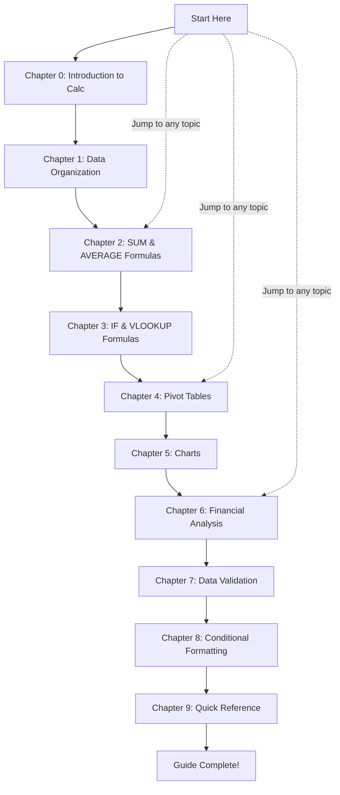

# Calc Project Document

Welcome to the **Calc Project Document** — a comprehensive, self-contained educational reference guide covering all major spreadsheet features in a structured, example-driven format.

Whether you are new to spreadsheets or looking to strengthen your skills, this guide walks you through essential Calc features with clear explanations, practical examples, and step-by-step calculations. Every chapter uses a consistent **Acme Corp quarterly sales sample dataset**, introduced in the first chapter, so examples build on one another and remain coherent throughout.

This guide is designed for **anyone seeking to learn and apply spreadsheet (Calc) features** through hands-on, worked examples — no prior spreadsheet experience is required.

---

## Table of Contents

1. [Introduction to Calc](calc-guide/00-introduction.md) — Calc overview, core concepts (cells, rows, columns, sheets, workbooks), and the sample dataset definition used throughout the guide
2. [Data Organization](calc-guide/01-data-organization.md) — Data structuring, data types (text, numbers, dates, currency), row and column layout, sheet naming, and best practices
3. [SUM and AVERAGE Formulas](calc-guide/02-formulas-sum-average.md) — SUM and AVERAGE functions with syntax references, practical examples, and step-by-step calculations
4. [IF and VLOOKUP Formulas](calc-guide/03-formulas-if-vlookup.md) — IF conditional logic (including nested IF and AND/OR combinations) and VLOOKUP lookup operations with worked calculations
5. [Pivot Tables](calc-guide/04-pivot-tables.md) — Pivot table creation, field configuration (rows, columns, values, filters), grouping, and data analysis
6. [Charts](calc-guide/05-charts.md) — Chart types (bar, column, line, pie, scatter, area), creation workflow, customization, and visualization best practices
7. [Financial Analysis](calc-guide/06-financial-analysis.md) — Financial functions (PMT, FV, PV, NPV, IRR) with realistic examples, loan amortization, and budget planning
8. [Data Validation](calc-guide/07-data-validation.md) — Validation rules (numbers, dates, lists, text length, custom formulas), dropdown lists, input messages, and error alerts
9. [Conditional Formatting](calc-guide/08-conditional-formatting.md) — Highlight rules, top/bottom rules, color scales, data bars, icon sets, and formula-based formatting
10. [Quick Reference](calc-guide/09-quick-reference.md) — Formula cheat sheet, common keyboard shortcuts, error code reference, and glossary of spreadsheet terms

---

## Learning Path

The following diagram shows the recommended reading order. You can follow the chapters sequentially for a progressive learning experience, or jump directly to any topic that interests you.

> **Tip:** If you are a beginner, follow the path from top to bottom. If you already have spreadsheet experience, use the Table of Contents above to jump directly to the chapter you need.

---

## Prerequisites

Before starting this guide, ensure you have the following:

- **Basic computer literacy** — Familiarity with file management, keyboard, and mouse usage
- **A Calc or spreadsheet application installed** — Such as LibreOffice Calc, or any equivalent spreadsheet application
- **No prior spreadsheet experience required** — This guide starts from the fundamentals and builds progressively to advanced topics

---

## How to Use This Guide

This guide supports two approaches depending on your experience level:

### Sequential Reading (Recommended for Beginners)

Start with the [Introduction to Calc](calc-guide/00-introduction.md) and work through each chapter in numbered order. Each chapter builds on concepts from previous chapters, so reading sequentially ensures you have the foundation needed for more advanced topics.

### Topic-Based Lookup (For Experienced Users)

Jump directly to any chapter using the [Table of Contents](#table-of-contents) above. Each chapter is designed to be self-contained, with cross-references to related chapters where additional context may be helpful.

> **Note:** All chapters use a consistent sample dataset — the **Acme Corp quarterly sales data** — which is defined in the [Introduction](calc-guide/00-introduction.md) chapter. If you jump to a later chapter, refer back to the Introduction for the dataset definition.

---

## Conventions Used

Throughout this guide, the following conventions are used to present information consistently:

- **Formula syntax** is displayed in `code blocks` — for example, `=SUM(C2:C6)`
- **Spreadsheet data** is presented in Markdown tables that simulate cell layouts, with column headers matching spreadsheet column labels
- **Multi-step workflows** are illustrated with Mermaid flowchart diagrams embedded directly in the documentation
- **Cross-references** between chapters use relative links — for example, [Introduction](calc-guide/00-introduction.md) — so you can navigate easily
- **Step-by-step calculations** are presented as numbered lists showing each computation stage with intermediate results
- The term **"Calc"** is used generically to refer to spreadsheet applications and is not tied to any specific product

---

## Contributing

Contributions to improve this documentation are welcome. If you find errors, unclear explanations, or have suggestions for additional examples, please open an issue or submit a pull request in this repository. All contributions should follow the conventions and structure established in this guide.
