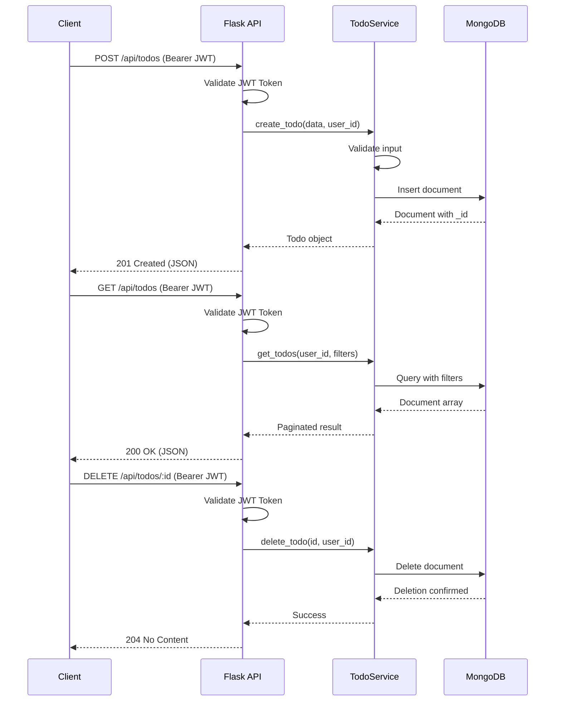

# To-Do Endpoints

Complete REST API reference for creating, reading, updating, and deleting to-do items.

All endpoints in this section are prefixed with `/api/todos`.
Every request to a to-do endpoint requires a valid Bearer JWT token in the `Authorization` header.
See the [API Overview](overview.md) for authentication details, request/response conventions, and error handling patterns.
See [Authentication Endpoints](auth.md) for token acquisition.

*Source: Tech Spec Sections 6.1, 6.2*

## To-Do Resource

The to-do resource represents a single to-do item owned by the authenticated user. All to-do objects share the following JSON structure:

```json
{
  "id": "507f1f77bcf86cd799439011",
  "title": "Review pull request",
  "description": "Review the authentication module PR #42",
  "completed": false,
  "priority": "high",
  "due_date": "2026-04-01T17:00:00Z",
  "tags": ["work", "code-review"],
  "created_at": "2026-03-24T10:30:00Z",
  "updated_at": "2026-03-24T10:30:00Z",
  "user_id": "507f1f77bcf86cd799439012"
}
```

| Field | Type | Description |
| --- | --- | --- |
| `id` | string | Unique identifier (MongoDB ObjectId, 24-character hex) |
| `title` | string | To-do title (required, max 200 characters) |
| `description` | string | Detailed description (optional, max 2000 characters) |
| `completed` | boolean | Completion status (default: `false`) |
| `priority` | string | Priority level: `low`, `medium`, or `high` (default: `medium`) |
| `due_date` | string | Due date in ISO 8601 format (optional) |
| `tags` | array | Array of tag strings (optional) |
| `created_at` | string | Creation timestamp in ISO 8601 format (server-generated) |
| `updated_at` | string | Last update timestamp in ISO 8601 format (server-generated) |
| `user_id` | string | Owner's unique identifier (MongoDB ObjectId, server-generated) |

## Table of Contents

- [Request Flow](#request-flow)
- [Create To-Do](#create-to-do)
- [List To-Dos](#list-to-dos)
- [Get To-Do](#get-to-do)
- [Update To-Do](#update-to-do)
- [Partial Update To-Do](#partial-update-to-do)
- [Delete To-Do](#delete-to-do)
- [Error Responses](#error-responses)

---

## Request Flow

The following sequence diagram illustrates the typical request flow for to-do CRUD operations.
Every request follows the same pattern: the client sends a request with a Bearer JWT token, the Flask API validates the token,
delegates to the TodoService for business logic and input validation, and the TodoService interacts with MongoDB for persistence.



*Source: Tech Spec Sections 6.1, 6.2*

---

## Create To-Do

Creates a new to-do item for the authenticated user. The server generates the `id`, `created_at`, `updated_at`, and `user_id` fields automatically. The `completed` field defaults to `false`.

**Method and URL:**

```text
POST /api/todos
```

**Authentication:** Required — Bearer JWT token

### Request Headers

| Header | Value | Required |
| --- | --- | --- |
| `Authorization` | `Bearer <token>` | Yes |
| `Content-Type` | `application/json` | Yes |

### Request Body

| Field | Type | Required | Description |
| --- | --- | --- | --- |
| `title` | string | Yes | To-do title (max 200 characters) |
| `description` | string | No | Detailed description (max 2000 characters) |
| `priority` | string | No | Priority level: `low`, `medium`, `high` (default: `medium`) |
| `due_date` | string | No | Due date in ISO 8601 format (e.g., `2026-04-01T17:00:00Z`) |
| `tags` | array | No | Array of tag strings |

**Request body example:**

```json
{
  "title": "Review pull request",
  "description": "Review the authentication module PR #42",
  "priority": "high",
  "due_date": "2026-04-01T17:00:00Z",
  "tags": ["work", "code-review"]
}
```

### Response Body (201 Created)

Returns the full to-do object with all server-generated fields:

```json
{
  "id": "507f1f77bcf86cd799439011",
  "title": "Review pull request",
  "description": "Review the authentication module PR #42",
  "completed": false,
  "priority": "high",
  "due_date": "2026-04-01T17:00:00Z",
  "tags": ["work", "code-review"],
  "created_at": "2026-03-24T10:30:00Z",
  "updated_at": "2026-03-24T10:30:00Z",
  "user_id": "507f1f77bcf86cd799439012"
}
```

### Status Codes

| Status Code | Description |
| --- | --- |
| `201 Created` | To-do successfully created |
| `400 Bad Request` | Invalid request body or missing required fields |
| `401 Unauthorized` | Missing or invalid authentication token |
| `422 Unprocessable Entity` | Validation failed (e.g., title exceeds 200 characters) |
| `500 Internal Server Error` | Server-side error |

### Examples

**cURL:**

```bash
curl -X POST http://localhost:5000/api/todos \
  -H "Authorization: Bearer YOUR_ACCESS_TOKEN" \
  -H "Content-Type: application/json" \
  -d '{
    "title": "Review pull request",
    "description": "Review the authentication module PR #42",
    "priority": "high",
    "due_date": "2026-04-01T17:00:00Z",
    "tags": ["work", "code-review"]
  }'
```

**Python:**

```python
import requests

url = "http://localhost:5000/api/todos"
headers = {
    "Authorization": "Bearer YOUR_ACCESS_TOKEN",
    "Content-Type": "application/json"
}
data = {
    "title": "Review pull request",
    "description": "Review the authentication module PR #42",
    "priority": "high",
    "due_date": "2026-04-01T17:00:00Z",
    "tags": ["work", "code-review"]
}

response = requests.post(url, json=data, headers=headers)
print(response.status_code)  # 201
print(response.json())
```

**JavaScript:**

```javascript
const response = await fetch("http://localhost:5000/api/todos", {
  method: "POST",
  headers: {
    "Authorization": "Bearer YOUR_ACCESS_TOKEN",
    "Content-Type": "application/json"
  },
  body: JSON.stringify({
    title: "Review pull request",
    description: "Review the authentication module PR #42",
    priority: "high",
    due_date: "2026-04-01T17:00:00Z",
    tags: ["work", "code-review"]
  })
});

const todo = await response.json();
console.log(todo);
```

---

## List To-Dos

Retrieves a paginated list of to-do items for the authenticated user. Supports filtering by completion status, priority, and tags, as well as sorting and full-text search across titles and descriptions.

**Method and URL:**

```text
GET /api/todos
```

**Authentication:** Required — Bearer JWT token

### Request Headers

| Header | Value | Required |
| --- | --- | --- |
| `Authorization` | `Bearer <token>` | Yes |

### Query Parameters

| Parameter | Type | Required | Default | Description |
| --- | --- | --- | --- | --- |
| `page` | integer | No | `1` | Page number for pagination (1-indexed) |
| `limit` | integer | No | `20` | Items per page (max: 100) |
| `completed` | boolean | No | — | Filter by completion status (`true` or `false`) |
| `priority` | string | No | — | Filter by priority level (`low`, `medium`, `high`) |
| `sort` | string | No | `created_at` | Sort field: `created_at`, `updated_at`, `due_date`, `priority`, `title` |
| `order` | string | No | `desc` | Sort order: `asc` (ascending) or `desc` (descending) |
| `search` | string | No | — | Full-text search in title and description |
| `tags` | string | No | — | Comma-separated tag filter (e.g., `work,urgent`) |

### Response Body (200 OK)

Returns a paginated response containing an array of to-do objects and pagination metadata:

```json
{
  "data": [
    {
      "id": "507f1f77bcf86cd799439011",
      "title": "Review pull request",
      "description": "Review the authentication module PR #42",
      "completed": false,
      "priority": "high",
      "due_date": "2026-04-01T17:00:00Z",
      "tags": ["work", "code-review"],
      "created_at": "2026-03-24T10:30:00Z",
      "updated_at": "2026-03-24T10:30:00Z",
      "user_id": "507f1f77bcf86cd799439012"
    },
    {
      "id": "507f1f77bcf86cd799439013",
      "title": "Write unit tests",
      "description": "Add tests for the todo service layer",
      "completed": false,
      "priority": "medium",
      "due_date": "2026-04-03T17:00:00Z",
      "tags": ["work", "testing"],
      "created_at": "2026-03-23T09:00:00Z",
      "updated_at": "2026-03-23T09:00:00Z",
      "user_id": "507f1f77bcf86cd799439012"
    }
  ],
  "pagination": {
    "page": 1,
    "limit": 20,
    "total": 45,
    "total_pages": 3,
    "has_next": true,
    "has_prev": false
  }
}
```

See [API Overview — Pagination](overview.md#pagination) for details on the pagination metadata fields.

### Status Codes

| Status Code | Description |
| --- | --- |
| `200 OK` | To-dos retrieved successfully |
| `401 Unauthorized` | Missing or invalid authentication token |
| `500 Internal Server Error` | Server-side error |

### Examples

**cURL:**

```bash
# List all todos (default: page 1, 20 items, sorted by created_at desc)
curl http://localhost:5000/api/todos \
  -H "Authorization: Bearer YOUR_ACCESS_TOKEN"

# Filter by high priority, incomplete, sorted by due date
curl "http://localhost:5000/api/todos?priority=high&completed=false&sort=due_date&order=asc" \
  -H "Authorization: Bearer YOUR_ACCESS_TOKEN"

# Search with pagination
curl "http://localhost:5000/api/todos?search=pull%20request&page=1&limit=10" \
  -H "Authorization: Bearer YOUR_ACCESS_TOKEN"
```

**Python:**

```python
import requests

url = "http://localhost:5000/api/todos"
headers = {"Authorization": "Bearer YOUR_ACCESS_TOKEN"}

# List all todos with default parameters
response = requests.get(url, headers=headers)
todos = response.json()
print(f"Total items: {todos['pagination']['total']}")

# Filter by priority and completion status
params = {
    "priority": "high",
    "completed": "false",
    "sort": "due_date",
    "order": "asc",
    "page": 1,
    "limit": 10
}
response = requests.get(url, headers=headers, params=params)
filtered_todos = response.json()

for todo in filtered_todos["data"]:
    print(f"- {todo['title']} (Due: {todo['due_date']})")
```

**JavaScript:**

```javascript
const headers = { "Authorization": "Bearer YOUR_ACCESS_TOKEN" };

// List all todos with default parameters
const response = await fetch("http://localhost:5000/api/todos", { headers });
const todos = await response.json();
console.log(`Total items: ${todos.pagination.total}`);

// Filter by priority and completion status
const params = new URLSearchParams({
  priority: "high",
  completed: "false",
  sort: "due_date",
  order: "asc",
  page: "1",
  limit: "10"
});

const filteredResponse = await fetch(
  `http://localhost:5000/api/todos?${params}`,
  { headers }
);
const filteredTodos = await filteredResponse.json();

filteredTodos.data.forEach(todo => {
  console.log(`- ${todo.title} (Due: ${todo.due_date})`);
});
```

---

## Get To-Do

Retrieves a single to-do item by its unique identifier. Users can only access their own to-do items — attempting to access another user's item returns `403 Forbidden`.

**Method and URL:**

```text
GET /api/todos/:id
```

**Authentication:** Required — Bearer JWT token

### Request Headers

| Header | Value | Required |
| --- | --- | --- |
| `Authorization` | `Bearer <token>` | Yes |

### Path Parameters

| Parameter | Type | Required | Description |
| --- | --- | --- | --- |
| `id` | string | Yes | The to-do's unique identifier (MongoDB ObjectId, 24-character hex) |

### Response Body (200 OK)

Returns the full to-do object:

```json
{
  "id": "507f1f77bcf86cd799439011",
  "title": "Review pull request",
  "description": "Review the authentication module PR #42",
  "completed": false,
  "priority": "high",
  "due_date": "2026-04-01T17:00:00Z",
  "tags": ["work", "code-review"],
  "created_at": "2026-03-24T10:30:00Z",
  "updated_at": "2026-03-24T10:30:00Z",
  "user_id": "507f1f77bcf86cd799439012"
}
```

### Status Codes

| Status Code | Description |
| --- | --- |
| `200 OK` | To-do retrieved successfully |
| `401 Unauthorized` | Missing or invalid authentication token |
| `403 Forbidden` | Authenticated but not authorized to access this to-do item (belongs to another user) |
| `404 Not Found` | No to-do item found with the specified ID |
| `500 Internal Server Error` | Server-side error |

> **Note:** Users can only access their own to-do items. The API validates that the `user_id` on the to-do matches the authenticated user's ID. If the to-do belongs to a different user, the API returns `403 Forbidden` rather than `404 Not Found` to explicitly indicate an authorization failure.

### Examples

**cURL:**

```bash
curl http://localhost:5000/api/todos/507f1f77bcf86cd799439011 \
  -H "Authorization: Bearer YOUR_ACCESS_TOKEN"
```

**Python:**

```python
import requests

todo_id = "507f1f77bcf86cd799439011"
url = f"http://localhost:5000/api/todos/{todo_id}"
headers = {"Authorization": "Bearer YOUR_ACCESS_TOKEN"}

response = requests.get(url, headers=headers)

if response.status_code == 200:
    todo = response.json()
    print(f"Title: {todo['title']}")
    print(f"Completed: {todo['completed']}")
    print(f"Priority: {todo['priority']}")
elif response.status_code == 404:
    print("Todo not found")
elif response.status_code == 403:
    print("Access denied — this todo belongs to another user")
```

**JavaScript:**

```javascript
const todoId = "507f1f77bcf86cd799439011";

const response = await fetch(
  `http://localhost:5000/api/todos/${todoId}`,
  {
    headers: { "Authorization": "Bearer YOUR_ACCESS_TOKEN" }
  }
);

if (response.ok) {
  const todo = await response.json();
  console.log(`Title: ${todo.title}`);
  console.log(`Completed: ${todo.completed}`);
  console.log(`Priority: ${todo.priority}`);
} else if (response.status === 404) {
  console.log("Todo not found");
} else if (response.status === 403) {
  console.log("Access denied — this todo belongs to another user");
}
```

---

## Update To-Do

Replaces a to-do item with the provided data. This is a full replacement operation — all writable fields must be provided. Fields not included in the request body are reset to their default values. The server automatically updates the `updated_at` timestamp.

For updating only specific fields without affecting others, use [Partial Update To-Do](#partial-update-to-do) instead.

**Method and URL:**

```text
PUT /api/todos/:id
```

**Authentication:** Required — Bearer JWT token

### Request Headers

| Header | Value | Required |
| --- | --- | --- |
| `Authorization` | `Bearer <token>` | Yes |
| `Content-Type` | `application/json` | Yes |

### Path Parameters

| Parameter | Type | Required | Description |
| --- | --- | --- | --- |
| `id` | string | Yes | The to-do's unique identifier (MongoDB ObjectId, 24-character hex) |

### Request Body

The request body follows the same schema as [Create To-Do](#create-to-do). All writable fields should be provided for a complete replacement:

| Field | Type | Required | Description |
| --- | --- | --- | --- |
| `title` | string | Yes | To-do title (max 200 characters) |
| `description` | string | No | Detailed description (max 2000 characters) |
| `completed` | boolean | No | Completion status (default: `false`) |
| `priority` | string | No | Priority level: `low`, `medium`, `high` (default: `medium`) |
| `due_date` | string | No | Due date in ISO 8601 format |
| `tags` | array | No | Array of tag strings |

**Request body example:**

```json
{
  "title": "Review pull request (updated)",
  "description": "Review the authentication module PR #42 — focus on security",
  "completed": false,
  "priority": "high",
  "due_date": "2026-04-02T17:00:00Z",
  "tags": ["work", "code-review", "security"]
}
```

### Response Body (200 OK)

Returns the updated to-do object with the new `updated_at` timestamp:

```json
{
  "id": "507f1f77bcf86cd799439011",
  "title": "Review pull request (updated)",
  "description": "Review the authentication module PR #42 — focus on security",
  "completed": false,
  "priority": "high",
  "due_date": "2026-04-02T17:00:00Z",
  "tags": ["work", "code-review", "security"],
  "created_at": "2026-03-24T10:30:00Z",
  "updated_at": "2026-03-24T15:45:00Z",
  "user_id": "507f1f77bcf86cd799439012"
}
```

### Status Codes

| Status Code | Description |
| --- | --- |
| `200 OK` | To-do successfully updated |
| `400 Bad Request` | Invalid request body or missing required fields |
| `401 Unauthorized` | Missing or invalid authentication token |
| `403 Forbidden` | Authenticated but not authorized to update this to-do item |
| `404 Not Found` | No to-do item found with the specified ID |
| `422 Unprocessable Entity` | Validation failed (e.g., title exceeds 200 characters) |
| `500 Internal Server Error` | Server-side error |

### Examples

**cURL:**

```bash
curl -X PUT http://localhost:5000/api/todos/507f1f77bcf86cd799439011 \
  -H "Authorization: Bearer YOUR_ACCESS_TOKEN" \
  -H "Content-Type: application/json" \
  -d '{
    "title": "Review pull request (updated)",
    "description": "Review the authentication module PR #42 — focus on security",
    "completed": false,
    "priority": "high",
    "due_date": "2026-04-02T17:00:00Z",
    "tags": ["work", "code-review", "security"]
  }'
```

**Python:**

```python
import requests

todo_id = "507f1f77bcf86cd799439011"
url = f"http://localhost:5000/api/todos/{todo_id}"
headers = {
    "Authorization": "Bearer YOUR_ACCESS_TOKEN",
    "Content-Type": "application/json"
}
data = {
    "title": "Review pull request (updated)",
    "description": "Review the authentication module PR #42 — focus on security",
    "completed": False,
    "priority": "high",
    "due_date": "2026-04-02T17:00:00Z",
    "tags": ["work", "code-review", "security"]
}

response = requests.put(url, json=data, headers=headers)
print(response.status_code)  # 200
print(response.json())
```

**JavaScript:**

```javascript
const todoId = "507f1f77bcf86cd799439011";

const response = await fetch(
  `http://localhost:5000/api/todos/${todoId}`,
  {
    method: "PUT",
    headers: {
      "Authorization": "Bearer YOUR_ACCESS_TOKEN",
      "Content-Type": "application/json"
    },
    body: JSON.stringify({
      title: "Review pull request (updated)",
      description: "Review the authentication module PR #42 — focus on security",
      completed: false,
      priority: "high",
      due_date: "2026-04-02T17:00:00Z",
      tags: ["work", "code-review", "security"]
    })
  }
);

const updatedTodo = await response.json();
console.log(updatedTodo);
```

---

## Partial Update To-Do

Updates specific fields of a to-do item without replacing the entire resource. Only the fields included in the request body are modified — all other fields retain their current values. The server automatically updates the `updated_at` timestamp.

This is the preferred method for toggling completion status, changing priority, or making other targeted changes.

**Method and URL:**

```text
PATCH /api/todos/:id
```

**Authentication:** Required — Bearer JWT token

### Request Headers

| Header | Value | Required |
| --- | --- | --- |
| `Authorization` | `Bearer <token>` | Yes |
| `Content-Type` | `application/json` | Yes |

### Path Parameters

| Parameter | Type | Required | Description |
| --- | --- | --- | --- |
| `id` | string | Yes | The to-do's unique identifier (MongoDB ObjectId, 24-character hex) |

### Request Body

Include only the fields you want to update. All fields are optional:

| Field | Type | Required | Description |
| --- | --- | --- | --- |
| `title` | string | No | To-do title (max 200 characters) |
| `description` | string | No | Detailed description (max 2000 characters) |
| `completed` | boolean | No | Completion status |
| `priority` | string | No | Priority level: `low`, `medium`, `high` |
| `due_date` | string | No | Due date in ISO 8601 format |
| `tags` | array | No | Array of tag strings |

**Request body example — marking a to-do item as complete:**

```json
{
  "completed": true
}
```

**Request body example — changing priority and adding a tag:**

```json
{
  "priority": "low",
  "tags": ["work", "code-review", "done"]
}
```

### Response Body (200 OK)

Returns the updated to-do object with the new `updated_at` timestamp:

```json
{
  "id": "507f1f77bcf86cd799439011",
  "title": "Review pull request",
  "description": "Review the authentication module PR #42",
  "completed": true,
  "priority": "high",
  "due_date": "2026-04-01T17:00:00Z",
  "tags": ["work", "code-review"],
  "created_at": "2026-03-24T10:30:00Z",
  "updated_at": "2026-03-24T16:00:00Z",
  "user_id": "507f1f77bcf86cd799439012"
}
```

### Status Codes

| Status Code | Description |
| --- | --- |
| `200 OK` | To-do successfully updated |
| `400 Bad Request` | Invalid request body |
| `401 Unauthorized` | Missing or invalid authentication token |
| `403 Forbidden` | Authenticated but not authorized to update this to-do item |
| `404 Not Found` | No to-do item found with the specified ID |
| `422 Unprocessable Entity` | Validation failed (e.g., invalid priority value) |
| `500 Internal Server Error` | Server-side error |

### Examples

**cURL:**

```bash
# Mark a todo as complete
curl -X PATCH http://localhost:5000/api/todos/507f1f77bcf86cd799439011 \
  -H "Authorization: Bearer YOUR_ACCESS_TOKEN" \
  -H "Content-Type: application/json" \
  -d '{"completed": true}'
```

**Python:**

```python
import requests

todo_id = "507f1f77bcf86cd799439011"
url = f"http://localhost:5000/api/todos/{todo_id}"
headers = {
    "Authorization": "Bearer YOUR_ACCESS_TOKEN",
    "Content-Type": "application/json"
}

# Mark as complete
response = requests.patch(url, json={"completed": True}, headers=headers)
print(response.status_code)  # 200

updated_todo = response.json()
print(f"Completed: {updated_todo['completed']}")  # True
print(f"Updated at: {updated_todo['updated_at']}")
```

**JavaScript:**

```javascript
const todoId = "507f1f77bcf86cd799439011";

// Mark as complete
const response = await fetch(
  `http://localhost:5000/api/todos/${todoId}`,
  {
    method: "PATCH",
    headers: {
      "Authorization": "Bearer YOUR_ACCESS_TOKEN",
      "Content-Type": "application/json"
    },
    body: JSON.stringify({ completed: true })
  }
);

const updatedTodo = await response.json();
console.log(`Completed: ${updatedTodo.completed}`);   // true
console.log(`Updated at: ${updatedTodo.updated_at}`);
```

---

## Delete To-Do

Permanently deletes a to-do item. This action is irreversible — the item cannot be recovered after deletion. Users can only delete their own to-do items.

**Method and URL:**

```text
DELETE /api/todos/:id
```

**Authentication:** Required — Bearer JWT token

### Request Headers

| Header | Value | Required |
| --- | --- | --- |
| `Authorization` | `Bearer <token>` | Yes |

### Path Parameters

| Parameter | Type | Required | Description |
| --- | --- | --- | --- |
| `id` | string | Yes | The to-do's unique identifier (MongoDB ObjectId, 24-character hex) |

### Response Body (204 No Content)

No response body is returned on successful deletion.

### Status Codes

| Status Code | Description |
| --- | --- |
| `204 No Content` | To-do successfully deleted |
| `401 Unauthorized` | Missing or invalid authentication token |
| `403 Forbidden` | Authenticated but not authorized to delete this to-do item |
| `404 Not Found` | No to-do item found with the specified ID |
| `500 Internal Server Error` | Server-side error |

### Examples

**cURL:**

```bash
curl -X DELETE http://localhost:5000/api/todos/507f1f77bcf86cd799439011 \
  -H "Authorization: Bearer YOUR_ACCESS_TOKEN"
```

**Python:**

```python
import requests

todo_id = "507f1f77bcf86cd799439011"
url = f"http://localhost:5000/api/todos/{todo_id}"
headers = {"Authorization": "Bearer YOUR_ACCESS_TOKEN"}

response = requests.delete(url, headers=headers)

if response.status_code == 204:
    print("Todo deleted successfully")
elif response.status_code == 404:
    print("Todo not found")
elif response.status_code == 403:
    print("Access denied — this todo belongs to another user")
```

**JavaScript:**

```javascript
const todoId = "507f1f77bcf86cd799439011";

const response = await fetch(
  `http://localhost:5000/api/todos/${todoId}`,
  {
    method: "DELETE",
    headers: { "Authorization": "Bearer YOUR_ACCESS_TOKEN" }
  }
);

if (response.status === 204) {
  console.log("Todo deleted successfully");
} else if (response.status === 404) {
  console.log("Todo not found");
} else if (response.status === 403) {
  console.log("Access denied — this todo belongs to another user");
}
```

---

## Error Responses

All to-do endpoints use the standard error response format defined in the [API Overview](overview.md#error-responses). Errors include a machine-readable error code, a human-readable message, and optional field-level validation details.

### Error Response Format

```json
{
  "error": {
    "code": "VALIDATION_ERROR",
    "message": "Todo title is required",
    "details": [
      {
        "field": "title",
        "message": "This field is required"
      }
    ]
  }
}
```

### Common Error Scenarios

The following table lists error scenarios specific to to-do endpoints:

| Scenario | Status Code | Error Code | Example Message |
| --- | --- | --- | --- |
| Missing title in create/update request | `400` | `MISSING_FIELD` | `"Todo title is required"` |
| Title exceeds 200 characters | `422` | `VALIDATION_ERROR` | `"Title must not exceed 200 characters"` |
| Description exceeds 2000 characters | `422` | `VALIDATION_ERROR` | `"Description must not exceed 2000 characters"` |
| Invalid priority value | `422` | `VALIDATION_ERROR` | `"Priority must be one of: low, medium, high"` |
| Invalid date format for due_date | `422` | `INVALID_FORMAT` | `"due_date must be a valid ISO 8601 datetime"` |
| To-do not found | `404` | `NOT_FOUND` | `"No todo found with the specified ID"` |
| Accessing another user's to-do item | `403` | `FORBIDDEN` | `"You do not have permission to access this todo"` |
| Invalid or expired authentication token | `401` | `INVALID_TOKEN` | `"Authentication token is invalid or expired"` |
| Malformed JSON request body | `400` | `INVALID_FORMAT` | `"Request body contains invalid JSON"` |

### Validation Error Example

When a request fails validation, the `details` array provides field-level error information:

```json
{
  "error": {
    "code": "VALIDATION_ERROR",
    "message": "Request validation failed",
    "details": [
      {
        "field": "title",
        "message": "Title must not exceed 200 characters"
      },
      {
        "field": "priority",
        "message": "Priority must be one of: low, medium, high"
      }
    ]
  }
}
```

For the complete error handling reference, including all standard HTTP status codes and error codes, see [API Overview — Error Responses](overview.md#error-responses).
