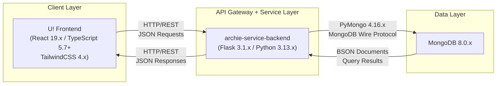

# Architecture

This document describes the system architecture of the To-Do List Application within the Blitzx platform. It explains how the application maps to the platform's five-layer service-oriented architecture, details the end-to-end request flow for task management operations, and documents the architectural constraints that govern the system's design. Use this document to understand the structural foundation upon which all task management features are built.

[← Back to README](../README.md)

---

## System Context

The To-Do List Application operates within the Blitzx platform's service-oriented architecture. Rather than functioning as an isolated standalone system, the application is composed of well-defined layers prescribed by the platform, each responsible for a distinct concern in the request lifecycle. The Blitzx platform defines a five-layer architecture that governs how all applications — including the To-Do List Application — are structured and how data flows between components.

*Source: Technical Specification §5.1.1*

### Five-Layer Architecture

The Blitzx platform prescribes the following five architectural layers:

| Layer | Responsibility | To-Do List Application Component |
|-------|---------------|----------------------------------|
| **1. Client Layer** | User interface and user interaction | **U!** — the React 19.x / TypeScript 5.7+ / TailwindCSS 4.x frontend application that renders the task management interface |
| **2. API Gateway Layer** | Single entry point for all client requests; request routing and validation | **archie-service-backend** (Flask 3.1.x / Python 3.13.x) — receives all HTTP requests from U! and routes them to the appropriate handler |
| **3. Service Layer** | Business logic processing | **archie-service-backend** — processes task management business rules such as validation, priority assignment, and completion state transitions |
| **4. Data Access Layer** | Database communication and query execution | **PyMongo 4.16.x** — translates Python operations into MongoDB wire protocol commands and manages connection pooling |
| **5. Data Layer** | Persistent data storage | **MongoDB 8.0.x** — stores all task documents in a document-oriented collection |

> **Note:** For the To-Do List Application, the API Gateway Layer (Layer 2) and the Service Layer (Layer 3) are combined within a single deployment unit — **archie-service-backend**. This simplification is appropriate because the application's business logic is co-located with the API routing within the same Flask service, eliminating the need for inter-service communication at this stage of the application's lifecycle.

*Source: Technical Specification §5.1*

---

## To-Do Application Architecture

While the Blitzx platform defines five architectural layers, the To-Do List Application maps these layers into a streamlined three-tier architecture that reflects the application's current scope and complexity. This three-tier view groups the API Gateway, Service, and Data Access layers into a single backend tier for simplicity.

### Client Tier — U! Frontend

The **U!** frontend is the sole user-facing application. Built with React 19.x and TypeScript 5.7+, it provides the task management interface including the task list view, task creation and editing forms, filter and sort controls, priority selectors, and completion toggles. TailwindCSS 4.x provides responsive, utility-first styling, and Vite 6.x powers both the development server and production build pipeline.

- Renders all task management screens
- Sends HTTP/REST requests to archie-service-backend for every data operation
- Never communicates directly with the database (enforced by constraint C-001)

### Backend Tier — archie-service-backend

The **archie-service-backend** is the single entry point for all API requests originating from U!. Built with Flask 3.1.x running on Python 3.13.x, it combines API gateway responsibilities (request routing, input validation) with business logic processing (priority management, completion state handling, due date enforcement) in a single service.

- Exposes RESTful API endpoints for task CRUD operations, filtering, and completion toggling
- Validates all incoming request data before processing
- Applies business rules (e.g., priority level constraints, required field enforcement)
- Delegates database operations to PyMongo 4.16.x

### Database Tier — MongoDB

**MongoDB 8.0.x** serves as the persistent data store for all task documents. Accessed exclusively through PyMongo 4.16.x from within archie-service-backend, the database stores task records with fields including title, description, priority, due date, completion status, and timestamps.

- Stores task documents in a dedicated collection
- Supports filtering and sorting via MongoDB's query language
- Provides indexing on frequently queried fields (priority, due date, completion status)
- No direct access from the U! frontend — all database communication is mediated by archie-service-backend

*Source: Technical Specification §5.1, §1.2*

---

## Architecture Diagram

The following diagram illustrates the end-to-end architecture of the To-Do List Application, showing the three primary components and the communication protocols connecting them.

**Diagram Key:**

- **U! Frontend** sends HTTP/REST requests with JSON payloads to archie-service-backend for every task operation (create, read, update, delete, filter, complete)
- **archie-service-backend** processes each request, applies validation and business logic, then communicates with MongoDB through PyMongo 4.16.x using the MongoDB wire protocol
- **MongoDB 8.0.x** executes the database operation and returns BSON documents back through PyMongo to archie-service-backend
- Responses propagate back from archie-service-backend to U! as JSON over HTTP

*Source: Technical Specification §5.1.3*

---

## Request Flow

Every task management operation in the To-Do List Application follows the same end-to-end request flow through the architectural layers. This section describes the lifecycle of a typical request — for example, creating a new task — from user interaction to data persistence and back.

### End-to-End Request Lifecycle

1. **User Interaction (Client Layer):** The user interacts with the U! frontend — for example, filling out the task creation form and clicking "Add Task." The React component captures the input data and prepares an HTTP request.

2. **HTTP Request Dispatch (Client → API Gateway):** U! sends an HTTP request (e.g., `POST /api/tasks`) to the archie-service-backend API endpoint. The request body contains a JSON payload with task fields such as title, description, priority, and due date.

3. **Request Validation (API Gateway Layer):** archie-service-backend receives the request, parses the JSON body, and validates the input data. Validation checks include required field presence (e.g., title is mandatory), data type correctness (e.g., priority must be one of "High", "Medium", "Low"), and value constraints (e.g., due date must be a valid date format).

4. **Business Logic Processing (Service Layer):** After validation, archie-service-backend executes the business logic for the operation. For task creation, this includes setting default values (e.g., `is_completed: false`), generating timestamps (`created_at`, `updated_at`), and applying any business rules.

5. **Database Operation (Data Access Layer → Data Layer):** archie-service-backend uses PyMongo 4.16.x to execute the database operation against MongoDB 8.0.x. For task creation, this is an insert operation that stores the task document in the tasks collection.

6. **Response Propagation (Data Layer → Client):** MongoDB confirms the operation. The response propagates back through the layers — PyMongo returns the result to archie-service-backend, which constructs an HTTP response (e.g., `201 Created` with the newly created task) and sends it back to U!. The React frontend updates its local state and re-renders the task list to reflect the new task.

> **Constraint C-001 Enforcement:** At no point in this flow does the U! frontend communicate directly with MongoDB. All requests must pass through archie-service-backend, which serves as the sole gateway between the client and the data layer. This constraint ensures that all data access is validated, authorized, and logged at the backend tier.

*Source: Technical Specification §4.1*

---

## Architectural Constraints

The To-Do List Application is subject to four inviolable architectural constraints defined by the Blitzx platform. These constraints govern how the application's components interact and set boundaries on the system's design.

| Constraint ID | Description | Impact on To-Do List Application |
|---------------|-------------|----------------------------------|
| **C-001** | **Single entry point** — All client requests must be routed through archie-service-backend. No direct database access from the frontend is permitted. | U! communicates exclusively with archie-service-backend via HTTP/REST. All task CRUD operations, filtering queries, and completion toggles are mediated by the backend API. The frontend never connects to MongoDB directly. |
| **C-002** | **Single client application** — U! is the only frontend application. No other clients, consumers, or third-party applications access archie-service-backend. | The To-Do List Application's API is designed for a single consumer (U!). API design decisions (response shapes, error formats, pagination patterns) are optimized for the React frontend without needing to accommodate additional client types. |
| **C-003** | **Limited external integrations** — Only GitHub is permitted as an external integration point. No third-party services (email, calendar, notifications) are integrated. | The To-Do List Application does not integrate with external services for notifications, calendar synchronization, or email reminders. All functionality is self-contained within the U! + archie-service-backend + MongoDB stack. Third-party integrations are documented in the [Future Improvements](future-improvements.md) roadmap. |
| **C-004** | **Repository initialization state** — The application is currently in the design phase. The repository has been initialized but does not yet contain source code or dependency manifests. | This architecture document describes the intended design of the To-Do List Application. All component descriptions, request flows, and technology references reflect the prescribed architecture that will be implemented in subsequent development phases. |

*Source: Technical Specification §4.1, §5.1.3*

---

## Cross-References

For additional details on the topics covered in this document, refer to the following related documentation:

- **[Technology Stack](technology-stack.md)** — Detailed version information, justifications, and compatibility notes for every technology in the application stack (React 19.x, Flask 3.1.x, MongoDB 8.0.x, and all supporting tools)
- **[Workflows](workflow.md)** — End-to-end user and system workflows with Mermaid sequence diagrams illustrating the request flow for task creation, editing, completion, deletion, and filtering
- **[Data Model](data-model.md)** — MongoDB collection schema, task document field definitions, ER diagram, indexing strategy, and sample documents

---

*This document is part of the To-Do List Application documentation. Return to the [README](../README.md) for the full documentation index.*
