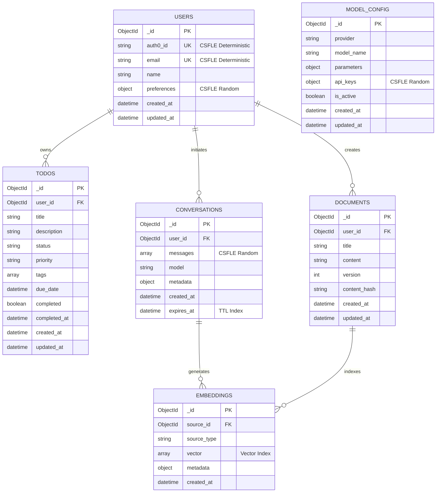

# Data Model

This document describes the MongoDB database schema for the Todo Application, including all collection definitions, field types, indexing strategies, and encryption configurations.

> **Source:** Tech Spec Section 6.2

**Technology context:**

- **Database:** MongoDB 8.0.17+
- **Driver:** PyMongo 4.16.0 (direct driver access — no ORM)
- **Encryption:** Client-Side Field-Level Encryption (CSFLE) for sensitive fields
- **Deployment:** MongoDB Atlas (production), local MongoDB (development)

## Table of Contents

- [Entity-Relationship Diagram](#entity-relationship-diagram)
- [Collection: todos](#collection-todos)
- [Collection: users](#collection-users)
- [Collection: conversations](#collection-conversations)
- [Collection: embeddings](#collection-embeddings)
- [Collection: documents](#collection-documents)
- [Collection: model_config](#collection-model_config)
- [Indexing Strategy](#indexing-strategy)
- [Encryption Strategy](#encryption-strategy)
- [Data Access Patterns](#data-access-patterns)
- [Related Documentation](#related-documentation)

---

## Entity-Relationship Diagram

*Source: Tech Spec Section 6.2*

The following diagram shows the relationships between all six MongoDB collections in the Todo Application.



> **Relationship cardinality:** A user can own many to-do items, initiate many conversations, and create many documents. Conversations and documents can generate multiple embeddings. The `model_config` collection stores global AI/LLM configuration and is not linked to individual users in the schema.

---

## Collection: `todos`

*Source: Tech Spec Section 6.2*

Stores all to-do items created by users. This is the primary application data collection.

### Field Definitions

| Field | Type | Required | Default | Description |
| --- | --- | --- | --- | --- |
| `_id` | `ObjectId` | Auto | Auto-generated | Unique document identifier |
| `user_id` | `ObjectId` | Yes | — | Reference to owning user in `users` collection |
| `title` | `String` | Yes | — | To-do item title (max 200 characters) |
| `description` | `String` | No | `""` | Detailed description of the to-do item |
| `status` | `String` | Yes | `"pending"` | Current status: `"pending"`, `"in_progress"`, `"completed"`, `"archived"` |
| `priority` | `String` | No | `"medium"` | Priority level: `"low"`, `"medium"`, `"high"`, `"urgent"` |
| `tags` | `Array[String]` | No | `[]` | User-defined tags for categorization |
| `due_date` | `DateTime` | No | `null` | Optional due date for the to-do item |
| `completed` | `Boolean` | Yes | `false` | Whether the to-do item is marked complete |
| `completed_at` | `DateTime` | No | `null` | Timestamp when marked complete (set automatically) |
| `created_at` | `DateTime` | Yes | Current time | Document creation timestamp |
| `updated_at` | `DateTime` | Yes | Current time | Last modification timestamp |

### Indexes

| Index Name | Fields | Type | Purpose |
| --- | --- | --- | --- |
| `idx_user_id` | `{ user_id: 1 }` | Standard | Fast lookup of all to-do items for a user |
| `idx_user_status` | `{ user_id: 1, status: 1 }` | Compound | Filter to-do items by user and status |
| `idx_user_priority` | `{ user_id: 1, priority: 1 }` | Compound | Filter to-do items by user and priority |
| `idx_user_due_date` | `{ user_id: 1, due_date: 1 }` | Compound | Sort to-do items by due date per user |
| `idx_user_created` | `{ user_id: 1, created_at: -1 }` | Compound | Sort to-do items by creation date (newest first) |
| `idx_tags` | `{ tags: 1 }` | Multikey | Search to-do items by tag |

### Example Document

```json
{
  "_id": "ObjectId('65f1a2b3c4d5e6f7a8b9c0d1')",
  "user_id": "ObjectId('65f1a2b3c4d5e6f7a8b9c0d2')",
  "title": "Review pull request #42",
  "description": "Review the authentication middleware changes",
  "status": "pending",
  "priority": "high",
  "tags": ["code-review", "backend"],
  "due_date": "2026-03-25T17:00:00Z",
  "completed": false,
  "completed_at": null,
  "created_at": "2026-03-24T10:00:00Z",
  "updated_at": "2026-03-24T10:00:00Z"
}
```

---

## Collection: `users`

*Source: Tech Spec Section 6.2*

Stores user profiles synchronized from Auth0. Contains CSFLE-encrypted fields for sensitive personal information.

### Field Definitions

| Field | Type | Required | Default | Encryption | Description |
| --- | --- | --- | --- | --- | --- |
| `_id` | `ObjectId` | Auto | Auto-generated | None | Unique document identifier |
| `auth0_id` | `String` | Yes | — | CSFLE: Deterministic | Auth0 user identifier (e.g., `auth0\|user123`) |
| `email` | `String` | Yes | — | CSFLE: Deterministic | User email address |
| `name` | `String` | No | `""` | None | Display name |
| `avatar_url` | `String` | No | `null` | None | Profile picture URL |
| `preferences` | `Object` | No | `{}` | CSFLE: Random | User preferences (theme, notifications, language) |
| `roles` | `Array[String]` | Yes | `["user"]` | None | Assigned roles: `"user"`, `"admin"` |
| `last_login` | `DateTime` | No | `null` | None | Last login timestamp |
| `created_at` | `DateTime` | Yes | Current time | None | Account creation timestamp |
| `updated_at` | `DateTime` | Yes | Current time | None | Last profile update timestamp |

### Indexes

| Index Name | Fields | Type | Purpose |
| --- | --- | --- | --- |
| `idx_auth0_id` | `{ auth0_id: 1 }` | Unique | Lookup user by Auth0 identifier (deterministic encryption enables equality queries) |
| `idx_email` | `{ email: 1 }` | Unique | Lookup user by email address (deterministic encryption enables equality queries) |

### Encryption Notes

The `auth0_id` and `email` fields use **deterministic encryption**, which allows exact-match queries while keeping data encrypted at rest. The `preferences` field uses **random encryption** for maximum security since it does not need to be queried directly.

For full CSFLE implementation details, see the [Security Architecture](security.md#defense-in-depth-encryption).

### Example Document

```json
{
  "_id": "ObjectId('65f1a2b3c4d5e6f7a8b9c0d2')",
  "auth0_id": "auth0|abc123def456",
  "email": "user@example.com",
  "name": "Jane Developer",
  "avatar_url": "https://example.com/avatars/jane.jpg",
  "preferences": {
    "theme": "dark",
    "notifications": true,
    "language": "en"
  },
  "roles": ["user"],
  "last_login": "2026-03-24T09:30:00Z",
  "created_at": "2026-01-15T08:00:00Z",
  "updated_at": "2026-03-24T09:30:00Z"
}
```

---

## Collection: `conversations`

*Source: Tech Spec Section 6.2*

Stores AI conversation sessions between users and the LangChain-powered AI assistant. Uses TTL indexing for automatic expiration of old conversations.

### Field Definitions

| Field | Type | Required | Default | Encryption | Description |
| --- | --- | --- | --- | --- | --- |
| `_id` | `ObjectId` | Auto | Auto-generated | None | Unique document identifier |
| `user_id` | `ObjectId` | Yes | — | None | Reference to user who initiated the conversation |
| `messages` | `Array[Object]` | Yes | `[]` | CSFLE: Random | Array of message objects (see structure below) |
| `model` | `String` | Yes | — | None | LLM model used for this conversation (e.g., `"gpt-4"`) |
| `metadata` | `Object` | No | `{}` | None | Additional context (token usage, processing time) |
| `created_at` | `DateTime` | Yes | Current time | None | Conversation start timestamp |
| `expires_at` | `DateTime` | Yes | +30 days | None | TTL expiration timestamp |

### Message Object Structure

Each entry in the `messages` array follows this structure:

```json
{
  "role": "user",
  "content": "Help me prioritize my tasks for today",
  "timestamp": "2026-03-24T10:15:00Z"
}
```

Valid values for `role`: `"user"`, `"assistant"`, `"system"`.

### Indexes

| Index Name | Fields | Type | Purpose |
| --- | --- | --- | --- |
| `idx_user_id` | `{ user_id: 1 }` | Standard | Find all conversations for a user |
| `idx_user_created` | `{ user_id: 1, created_at: -1 }` | Compound | List conversations by most recent first |
| `idx_ttl_expires` | `{ expires_at: 1 }` | TTL (`expireAfterSeconds: 0`) | Automatic document deletion after expiration |

### TTL Expiration Notes

The `expires_at` field controls automatic conversation expiration. MongoDB's TTL index automatically deletes documents once the `expires_at` timestamp is reached. The default TTL is 30 days from conversation creation.

This ensures that stale conversation data is cleaned up without requiring application-level garbage collection.

### Example Document

```json
{
  "_id": "ObjectId('65f1a2b3c4d5e6f7a8b9c0d3')",
  "user_id": "ObjectId('65f1a2b3c4d5e6f7a8b9c0d2')",
  "messages": [
    {
      "role": "user",
      "content": "Help me prioritize my tasks for today",
      "timestamp": "2026-03-24T10:15:00Z"
    },
    {
      "role": "assistant",
      "content": "Based on your to-do list, I recommend starting with the high-priority items...",
      "timestamp": "2026-03-24T10:15:02Z"
    }
  ],
  "model": "gpt-4",
  "metadata": {
    "total_tokens": 256,
    "processing_time_ms": 1200
  },
  "created_at": "2026-03-24T10:15:00Z",
  "expires_at": "2026-04-23T10:15:00Z"
}
```

---

## Collection: `embeddings`

*Source: Tech Spec Section 6.2*

Stores vector embeddings generated from conversations and documents for RAG (Retrieval-Augmented Generation) queries. Uses MongoDB Atlas Vector Search for similarity queries.

### Field Definitions

| Field | Type | Required | Default | Description |
| --- | --- | --- | --- | --- |
| `_id` | `ObjectId` | Auto | Auto-generated | Unique document identifier |
| `source_id` | `ObjectId` | Yes | — | Reference to source document or conversation |
| `source_type` | `String` | Yes | — | Source collection: `"conversation"` or `"document"` |
| `content` | `String` | Yes | — | Original text content that was embedded |
| `vector` | `Array[Number]` | Yes | — | Embedding vector (dimension depends on model, typically 1536 for OpenAI) |
| `metadata` | `Object` | No | `{}` | Additional context (chunk index, model used, token count) |
| `created_at` | `DateTime` | Yes | Current time | Embedding creation timestamp |

### Indexes

| Index Name | Fields | Type | Purpose |
| --- | --- | --- | --- |
| `idx_source` | `{ source_id: 1, source_type: 1 }` | Compound | Find all embeddings for a source document |
| `idx_vector_search` | `{ vector: "vectorSearch" }` | Atlas Vector Search | Semantic similarity search for RAG queries |

### Vector Search Configuration

The vector index uses MongoDB Atlas Vector Search with cosine similarity. Vector dimensions must match the embedding model output (1536 for OpenAI `text-embedding-3-small`, 768 for other models). The index definition requires an Atlas M10+ cluster tier.

**Atlas Vector Search Index Definition:**

```json
{
  "type": "vectorSearch",
  "fields": [
    {
      "path": "vector",
      "numDimensions": 1536,
      "similarity": "cosine",
      "type": "vector"
    },
    {
      "path": "source_type",
      "type": "filter"
    }
  ]
}
```

### Example Document

```json
{
  "_id": "ObjectId('65f1a2b3c4d5e6f7a8b9c0d4')",
  "source_id": "ObjectId('65f1a2b3c4d5e6f7a8b9c0d3')",
  "source_type": "conversation",
  "content": "Help me prioritize my tasks for today",
  "vector": [0.0123, -0.0456, 0.0789, "... (1536 dimensions)"],
  "metadata": {
    "chunk_index": 0,
    "model": "text-embedding-3-small",
    "token_count": 9
  },
  "created_at": "2026-03-24T10:15:01Z"
}
```

---

## Collection: `documents`

*Source: Tech Spec Section 6.2*

Stores user-uploaded or system-generated documents that can be indexed for RAG processing. Supports document versioning via the `version` field.

### Field Definitions

| Field | Type | Required | Default | Description |
| --- | --- | --- | --- | --- |
| `_id` | `ObjectId` | Auto | Auto-generated | Unique document identifier |
| `user_id` | `ObjectId` | Yes | — | Reference to owning user |
| `title` | `String` | Yes | — | Document title |
| `content` | `String` | Yes | — | Full document content (text) |
| `content_type` | `String` | No | `"text/plain"` | MIME type of the original document |
| `version` | `Integer` | Yes | `1` | Document version number (incremented on updates) |
| `content_hash` | `String` | Yes | — | SHA-256 hash of content (for change detection) |
| `metadata` | `Object` | No | `{}` | Additional metadata (source, author, tags) |
| `created_at` | `DateTime` | Yes | Current time | Document creation timestamp |
| `updated_at` | `DateTime` | Yes | Current time | Last modification timestamp |

### Indexes

| Index Name | Fields | Type | Purpose |
| --- | --- | --- | --- |
| `idx_user_id` | `{ user_id: 1 }` | Standard | Find all documents for a user |
| `idx_content_hash` | `{ content_hash: 1 }` | Unique | Prevent duplicate content storage |
| `idx_user_title` | `{ user_id: 1, title: 1 }` | Compound | Find documents by user and title |

### Versioning Notes

Document updates increment the `version` field and recalculate the `content_hash`. The previous version is not retained in this collection — version history is tracked through application-level logic if needed.

The `content_hash` (SHA-256) enables efficient change detection without comparing full document content.

### Example Document

```json
{
  "_id": "ObjectId('65f1a2b3c4d5e6f7a8b9c0d5')",
  "user_id": "ObjectId('65f1a2b3c4d5e6f7a8b9c0d2')",
  "title": "Project Requirements Specification",
  "content": "The todo application shall provide task management capabilities...",
  "content_type": "text/plain",
  "version": 2,
  "content_hash": "a3f2b8c1d4e5f6a7b8c9d0e1f2a3b4c5d6e7f8a9b0c1d2e3f4a5b6c7d8e9f0a1",
  "metadata": {
    "source": "upload",
    "author": "Jane Developer",
    "tags": ["requirements", "specification"]
  },
  "created_at": "2026-03-20T14:00:00Z",
  "updated_at": "2026-03-22T09:15:00Z"
}
```

---

## Collection: `model_config`

*Source: Tech Spec Section 6.2*

Stores configuration for LLM providers and models used by the AI processing service. Contains CSFLE-encrypted API keys for maximum security.

### Field Definitions

| Field | Type | Required | Default | Encryption | Description |
| --- | --- | --- | --- | --- | --- |
| `_id` | `ObjectId` | Auto | Auto-generated | None | Unique document identifier |
| `provider` | `String` | Yes | — | None | LLM provider name: `"openai"`, `"anthropic"`, `"azure"` |
| `model_name` | `String` | Yes | — | None | Model identifier (e.g., `"gpt-4"`, `"claude-3"`) |
| `parameters` | `Object` | No | `{}` | None | Model parameters (temperature, max_tokens, top_p) |
| `api_keys` | `Object` | Yes | — | CSFLE: Random | Provider API keys and secrets |
| `is_active` | `Boolean` | Yes | `true` | None | Whether this configuration is currently active |
| `created_at` | `DateTime` | Yes | Current time | None | Configuration creation timestamp |
| `updated_at` | `DateTime` | Yes | Current time | None | Last modification timestamp |

### Indexes

| Index Name | Fields | Type | Purpose |
| --- | --- | --- | --- |
| `idx_provider_model` | `{ provider: 1, model_name: 1 }` | Compound Unique | Ensure one configuration per provider and model combination |
| `idx_is_active` | `{ is_active: 1 }` | Standard | Quickly find active model configurations |

### Security Notes

The `api_keys` field uses CSFLE **random encryption**. API keys are encrypted client-side before being stored in MongoDB — the database server never sees plaintext API keys. Access to model configuration is restricted to users with the `admin:config` permission scope.

For full encryption implementation details, see the [Security Architecture](security.md#defense-in-depth-encryption).

### Example Document

```json
{
  "_id": "ObjectId('65f1a2b3c4d5e6f7a8b9c0d6')",
  "provider": "openai",
  "model_name": "gpt-4",
  "parameters": {
    "temperature": 0.7,
    "max_tokens": 4096,
    "top_p": 1.0
  },
  "api_keys": {
    "api_key": "<CSFLE_ENCRYPTED_VALUE>",
    "organization_id": "<CSFLE_ENCRYPTED_VALUE>"
  },
  "is_active": true,
  "created_at": "2026-01-15T08:00:00Z",
  "updated_at": "2026-03-20T12:00:00Z"
}
```

---

## Indexing Strategy

*Source: Tech Spec Section 6.2*

The following table summarizes all index types used across the six MongoDB collections in the Todo Application.

### Index Types Summary

| Index Type | Collections Used | Purpose |
| --- | --- | --- |
| Standard | All collections | Single-field lookups (e.g., `user_id`) |
| Compound | `todos`, `conversations`, `documents`, `model_config` | Multi-field queries (e.g., user + status filter) |
| Unique | `users`, `documents`, `model_config` | Prevent duplicate entries (email, content_hash, provider+model) |
| TTL | `conversations` | Automatic document expiration after 30 days |
| Multikey | `todos` | Array field indexing (tags) |
| Vector Search | `embeddings` | Semantic similarity search for RAG queries |

### Index Design Principles

- **Index coverage:** All queries should be supported by an index to avoid collection scans. Every query pattern documented in [Data Access Patterns](#data-access-patterns) has a corresponding index.
- **ESR rule:** Compound indexes follow the Equality-Sort-Range (ESR) rule for optimal query performance. Equality fields are placed first, followed by sort fields, then range fields.
- **TTL automation:** TTL indexes handle data lifecycle automatically — no application-level cleanup or cron jobs are needed for conversation expiration.
- **Vector search requirements:** Vector search indexes require a MongoDB Atlas M10+ cluster tier. Local development environments do not support Atlas Vector Search and should use alternative query strategies for testing.
- **CSFLE compatibility:** Fields encrypted with deterministic CSFLE can still use standard indexes for equality queries. This is why `auth0_id` and `email` use deterministic (not random) encryption.

---

## Encryption Strategy

*Source: Tech Spec Section 6.2*

The Todo Application uses MongoDB Client-Side Field-Level Encryption (CSFLE) to protect sensitive fields. The following table lists all encrypted fields across all collections.

### CSFLE-Encrypted Fields

| Collection | Field | Encryption Type | Query Support |
| --- | --- | --- | --- |
| `users` | `auth0_id` | Deterministic | Equality queries supported |
| `users` | `email` | Deterministic | Equality queries supported |
| `users` | `preferences` | Random | No query support |
| `conversations` | `messages` | Random | No query support |
| `model_config` | `api_keys` | Random | No query support |

### Encryption Type Comparison

- **Deterministic encryption:** The same plaintext always produces the same ciphertext. This allows equality queries (e.g., `find_one({"email": encrypted_email})`) but reveals that two documents share the same value. Used for fields that must be searchable.
- **Random encryption:** The same plaintext produces different ciphertext each time. This provides stronger security by preventing frequency analysis but does not support any query operations. Used for fields that are only read after document retrieval.

For the complete three-layer encryption architecture (TLS, WiredTiger/KMS, CSFLE), see the [Security Architecture](security.md).

---

## Data Access Patterns

*Source: Tech Spec Section 6.2*

### Direct PyMongo Access

The Todo Application uses PyMongo 4.16.0 as its database driver with no ORM or ODM layer:

- **No ORM/ODM:** No SQLAlchemy, MongoEngine, or other abstraction library is used
- **Explicit operations:** All database operations are explicit PyMongo method calls
- **Connection pooling:** Managed by PyMongo's built-in `MongoClient` with configurable pool size
- **CSFLE integration:** PyMongo's `AutoEncryptionOpts` handles transparent field encryption and decryption

### Common Query Patterns

The following examples demonstrate the primary data access patterns used throughout the application:

**Get a user's pending to-do items (sorted by newest first):**

```python
todos = db.todos.find(
    {"user_id": user_oid, "status": "pending"}
).sort("created_at", -1)
```

**Get a user by Auth0 ID (works with deterministic CSFLE):**

```python
user = db.users.find_one({"auth0_id": auth0_id})
```

**Create a new to-do item:**

```python
result = db.todos.insert_one({
    "user_id": user_oid,
    "title": "New task",
    "description": "",
    "status": "pending",
    "priority": "medium",
    "tags": [],
    "due_date": None,
    "completed": False,
    "completed_at": None,
    "created_at": datetime.utcnow(),
    "updated_at": datetime.utcnow(),
})
```

**Update a to-do item (with ownership check):**

```python
result = db.todos.update_one(
    {"_id": todo_oid, "user_id": user_oid},
    {"$set": {"title": "Updated title", "updated_at": datetime.utcnow()}}
)
```

**Delete a to-do item (with ownership check):**

```python
result = db.todos.delete_one({"_id": todo_oid, "user_id": user_oid})
```

**Vector similarity search (Atlas Vector Search aggregation pipeline):**

```python
results = db.embeddings.aggregate([
    {
        "$vectorSearch": {
            "index": "idx_vector_search",
            "path": "vector",
            "queryVector": query_embedding,
            "numCandidates": 100,
            "limit": 10,
            "filter": {"source_type": "document"}
        }
    },
    {
        "$project": {
            "content": 1,
            "source_id": 1,
            "score": {"$meta": "vectorSearchScore"}
        }
    }
])
```

### Resource Ownership Enforcement

All data access queries include a `user_id` filter to ensure users can only access their own data. This is the data-layer component of the RBAC (Role-Based Access Control) model and complements service-level authorization checks:

- Every `find`, `update_one`, and `delete_one` operation includes `"user_id": user_oid` in the query filter
- Admin users may bypass the `user_id` filter for administrative operations when the `admin:users` permission scope is present
- This pattern prevents horizontal privilege escalation where a user attempts to access another user's data by guessing document IDs

For the full RBAC model, see the [Security Architecture](security.md#role-based-access-control-rbac).

---

## Related Documentation

### Internal Documentation

- [Architecture Overview](overview.md) — System-level architecture context and five-tier model
- [Security Architecture](security.md) — CSFLE encryption details, authentication, and RBAC model
- [Todo API Reference](../api-reference/todos.md) — REST API endpoints for to-do CRUD operations
- [Users API Reference](../api-reference/users.md) — REST API endpoints for user management
- [Configuration Reference](../getting-started/configuration.md) — Database connection configuration and environment variables

### External References

- [MongoDB Documentation](https://www.mongodb.com/docs) — MongoDB server reference
- [PyMongo Documentation](https://pymongo.readthedocs.io/) — Python MongoDB driver reference
- [MongoDB Atlas Vector Search](https://www.mongodb.com/docs/atlas/atlas-vector-search/vector-search-overview/) — Vector search index and query reference
- [MongoDB CSFLE](https://www.mongodb.com/docs/manual/core/csfle/) — Client-Side Field-Level Encryption reference
