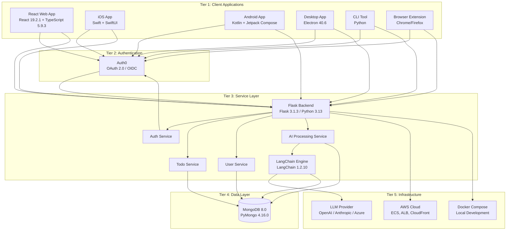
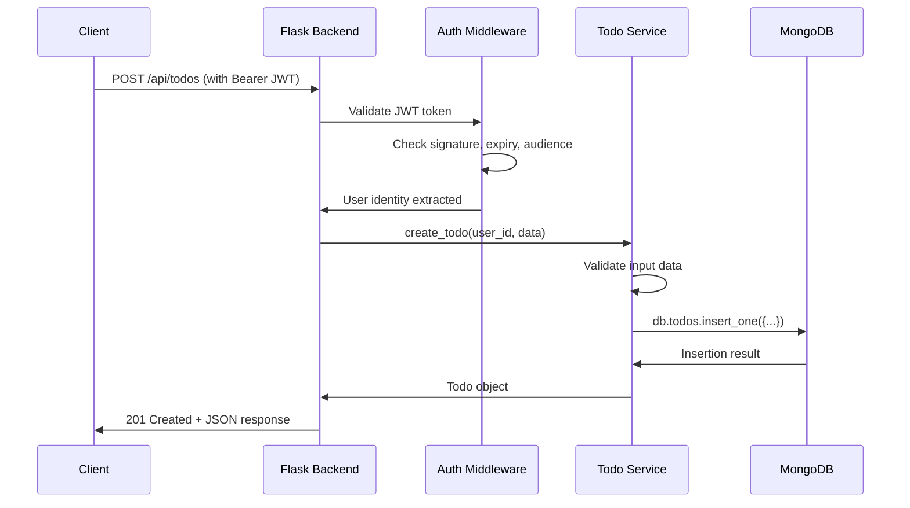
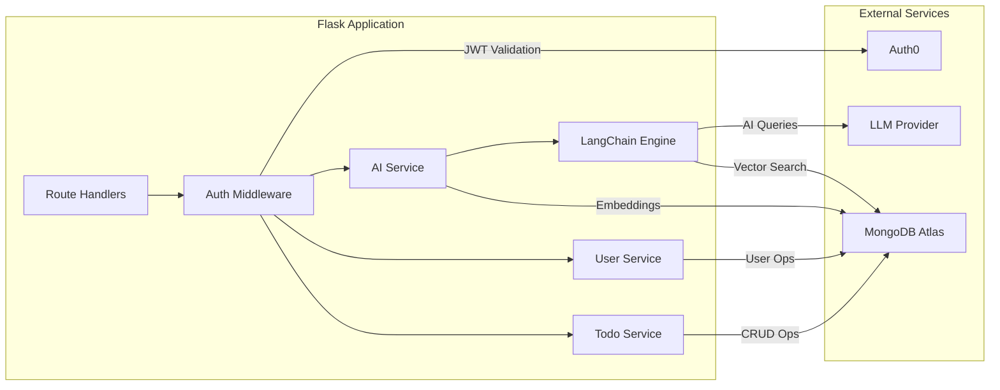

# Architecture Overview

This document provides a comprehensive overview of the Todo Application's system architecture, covering the five-tier model, component interactions, data flows, and external integrations.

> **Source:** Tech Spec Sections 5.1, 6.1, 6.3

## Table of Contents

- [Architecture Tier Diagram](#architecture-tier-diagram)
- [Five-Tier Architecture Model](#five-tier-architecture-model)
- [Component Inventory](#component-inventory)
- [Trust Boundaries](#trust-boundaries)
- [Data Flow Paths](#data-flow-paths)
- [Component Interaction Diagram](#component-interaction-diagram)
- [External Integrations](#external-integrations)
- [Technology Stack Summary](#technology-stack-summary)
- [Related Documentation](#related-documentation)

---

## Architecture Tier Diagram

*Source: Tech Spec Section 5.1*

The Todo Application follows a five-tier client-server architecture. The following diagram illustrates the major components and their relationships across tiers.

> **Note:** All client-to-server communication uses HTTPS (TLS 1.3). Authentication tokens (JWT) are obtained from Auth0 and included in API requests to the Flask backend.

---

## Five-Tier Architecture Model

*Source: Tech Spec Section 5.1*

The Todo Application is organized into five distinct tiers, each with clearly defined responsibilities and security boundaries. This layered design ensures separation of concerns, independent scalability, and defense-in-depth security.

### Tier 1: Client Applications

Six client platforms provide access to the Todo Application, each using the appropriate Auth0 SDK for its platform and communicating with the Flask backend via REST API over HTTPS.

- **React Web Application (Primary Platform):** Built with React 19.2.1, TypeScript 5.9.3, and TailwindCSS 4.1.x. Serves as the primary user interface for to-do management and AI interaction. Authentication is handled by the `@auth0/auth0-react` SPA SDK.
- **iOS Application:** Native Swift client using SwiftUI for platform-specific UX. Shares business logic patterns with the web application but delivers native iOS interactions.
- **Android Application:** Native Kotlin client using Jetpack Compose with Material Design. Provides the Android-native experience with platform-specific integrations.
- **Desktop Application:** Built with Electron 40.6, wrapping the React web application for cross-platform desktop access (macOS, Windows, Linux).
- **CLI Tool:** Python-based command-line interface for power users and automation workflows. Enables scripted to-do management and batch operations.
- **Browser Extension:** Chrome and Firefox extension for quick-add to-do items directly from the browser context menu without navigating to the full application.

### Tier 2: Authentication

Auth0 serves as the centralized identity provider for all client platforms, handling the full authentication lifecycle.

- **Protocol:** OAuth 2.0 Authorization Code Flow with PKCE (Proof Key for Code Exchange) for public clients (SPA, mobile, desktop).
- **Capabilities:** User registration, login, password reset, and multi-factor authentication (MFA).
- **Token Issuance:** Issues JWT access tokens, refresh tokens, and ID tokens. Access tokens are included in every API request to the Flask backend.
- **Centralized Management:** All user credentials are managed exclusively by Auth0 — the application never stores passwords.

For detailed authentication implementation, see the [Security Architecture](security.md).

### Tier 3: Service Layer

The Flask 3.1.3 backend implements a layered monolithic architecture (not microservices). All services run within a single Flask process, communicating via in-process Python function calls rather than HTTP.

- **Flask API Server:** REST API gateway handling request routing, middleware pipeline (CORS, rate limiting, JWT validation), and response serialization.
- **Auth Service:** Validates JWT tokens against the Auth0 JWKS endpoint, extracts user identity, and manages session context.
- **Todo Service:** Implements full CRUD operations for to-do items including creation, retrieval, update, deletion, filtering, sorting, and completion toggling.
- **User Service:** Manages user profiles, preferences, and account lifecycle. Synchronizes user data with Auth0.
- **AI Processing Service:** Powered by LangChain 1.2.10, provides three processing patterns: Simple (direct LLM query), RAG (retrieval-augmented generation with document context), and Multi-Step Agent (tool-orchestrated workflows).

For REST endpoint specifications, see the [API Reference Overview](../api-reference/overview.md).

### Tier 4: Data Layer

MongoDB 8.0.17+ serves as the sole persistent data store, accessed directly through the PyMongo 4.16.0 driver without an ORM.

- **Collections:** Six MongoDB collections store all application data — `todos`, `users`, `conversations`, `embeddings`, `documents`, and `model_config`.
- **Encryption:** Client-Side Field-Level Encryption (CSFLE) protects sensitive fields (email, auth0_id, API keys, conversation messages) before data leaves the application layer.
- **Vector Search:** MongoDB Atlas Vector Search enables semantic similarity queries for the RAG processing pattern, using vector embeddings stored in the `embeddings` collection.
- **Direct Driver Access:** PyMongo provides explicit database operations without abstraction layers, offering full control over queries, indexes, and aggregation pipelines.

For collection schemas and index strategies, see the [Data Model](data-model.md).

### Tier 5: Infrastructure

The infrastructure tier provides hosting, orchestration, and external service connectivity.

- **Production (AWS):** Amazon ECS for container orchestration, Application Load Balancer (ALB) for request distribution, CloudFront for CDN and static asset delivery, and AWS KMS for encryption key management.
- **Development (Docker Compose):** Local multi-service orchestration running MongoDB, Flask backend, and React frontend as containerized services with hot-reload support.
- **External LLM Provider:** Configurable connection to OpenAI, Anthropic, or Azure OpenAI for AI text generation and embedding creation, abstracted through the LangChain framework.
- **Infrastructure as Code:** Terraform 1.14.5+ manages all cloud infrastructure provisioning and configuration.

For local development setup, see the [Docker Development Guide](../guides/docker-development.md).

---

## Component Inventory

*Source: Tech Spec Sections 5.1, 6.1*

The Todo Application consists of 13 primary components distributed across the five architecture tiers. Each component has a clearly defined responsibility and technology stack.

| # | Component | Tier | Technology | Responsibility |
| --- | --- | --- | --- | --- |
| 1 | React Web Application | Client | React 19.2.1, TypeScript 5.9.3, TailwindCSS 4.1.x | Primary web-based user interface for to-do management and AI interaction |
| 2 | iOS Application | Client | Swift, SwiftUI | Native iOS client with platform-specific UX |
| 3 | Android Application | Client | Kotlin, Jetpack Compose | Native Android client with Material Design |
| 4 | Desktop Application | Client | Electron 40.6 | Cross-platform desktop client wrapping React web app |
| 5 | CLI Tool | Client | Python | Command-line interface for power users and automation |
| 6 | Browser Extension | Client | Chrome/Firefox APIs | Quick-add to-do items from browser context menu |
| 7 | Auth0 Identity Provider | Authentication | Auth0 SaaS | User authentication, authorization, MFA, token management |
| 8 | Flask API Server | Service | Flask 3.1.3, Python 3.13 | REST API gateway, request routing, middleware pipeline |
| 9 | Todo Service | Service | Python | CRUD operations for to-do items, filtering, sorting |
| 10 | User Service | Service | Python | User profile management, preferences, account lifecycle |
| 11 | Auth Service | Service | Python | JWT validation, Auth0 integration, session management |
| 12 | AI Processing Service | Service | Python, LangChain 1.2.10 | Natural language processing, task suggestions, conversational AI |
| 13 | MongoDB Database | Data | MongoDB 8.0.17+, PyMongo 4.16.0 | Persistent storage for all application data, vector embeddings |

---

## Trust Boundaries

*Source: Tech Spec Section 5.1*

The architecture defines four trust zones with explicit security controls at each boundary crossing. Data flowing between zones must pass through validation and authentication checkpoints.

| Zone | Name | Components | Security Controls |
| --- | --- | --- | --- |
| Zone 1 | Public Internet | Client applications, end-user browsers/devices | TLS 1.3 encryption, CORS policy enforcement |
| Zone 2 | Authentication Perimeter | Auth0 service | OAuth 2.0/OIDC protocols, PKCE, MFA enforcement |
| Zone 3 | Application Core | Flask backend, service layer, LangChain engine | JWT validation, RBAC, input validation, rate limiting |
| Zone 4 | Data Store | MongoDB, encryption keys (AWS KMS) | CSFLE encryption, WiredTiger at-rest encryption, network isolation |

### Boundary Transitions

- **Zone 1 to Zone 2 (Public to Auth):** Clients must authenticate through Auth0 before accessing any protected resources.
  Auth0 handles credential validation in an isolated, hardened environment managed by the Auth0 SaaS platform.
- **Zone 2 to Zone 3 (Auth to Application):** Auth0 issues cryptographically signed JWT tokens.
  The Flask backend validates every token against the Auth0 JWKS (JSON Web Key Set) endpoint,
  verifying signature, expiry, audience, and issuer before processing any request.
- **Zone 3 to Zone 4 (Application to Data):** The application core accesses MongoDB through authenticated connections over TLS.
  CSFLE ensures that sensitive fields are encrypted before data leaves the application process —
  the MongoDB server never sees plaintext values for encrypted fields.
- **Zone 3 to External (Application to LLM):** AI processing communicates with external LLM providers via authenticated HTTPS API calls.
  Provider API keys are stored encrypted (CSFLE with random encryption) in the MongoDB `model_config` collection
  and decrypted only in-memory during request processing.

For full security architecture details, see the [Security Architecture](security.md).

---

## Data Flow Paths

*Source: Tech Spec Sections 5.1, 6.1, 6.3*

Eight primary data flows traverse the architecture, each following a defined path through the trust boundaries.

| # | Flow Name | Path | Description |
| --- | --- | --- | --- |
| 1 | User Authentication | Client → Auth0 → Client → Flask | OAuth 2.0 login, token acquisition, token validation |
| 2 | Token Refresh | Client → Auth0 → Client | Silent refresh using refresh token when access token expires |
| 3 | Todo CRUD | Client → Flask → TodoService → MongoDB | Create, read, update, delete to-do items |
| 4 | User Profile | Client → Flask → UserService → MongoDB | Read and update user profile and preferences |
| 5 | Simple AI Query | Client → Flask → AIService → LangChain → LLM Provider | Direct LLM query without document context |
| 6 | RAG AI Query | Client → Flask → AIService → LangChain → MongoDB (embeddings) → LLM Provider | Query with retrieved document context |
| 7 | Agent AI Query | Client → Flask → AIService → LangChain → [Multiple Tools] → LLM Provider | Multi-step agent workflow with tool execution |
| 8 | Webhook/Callback | Auth0 → Flask → UserService → MongoDB | Auth0 post-login/registration webhooks for user sync |

### Detailed Flow: Todo CRUD

The following sequence diagram illustrates the complete request lifecycle for creating a to-do item, demonstrating the authentication middleware, service layer, and database interaction pattern that applies to all CRUD operations.

### Detailed Flow: AI Processing

The AI Processing Service supports three distinct processing patterns, each routed by LangChain based on query classification:

1. **Simple Query:** User question → LangChain → LLM → Direct response.
   No document retrieval is performed; the LLM generates a response based solely on its training data and the conversation context.
   Best suited for general questions, task suggestions, and simple categorization.
2. **RAG Query:** User question → LangChain → Retrieve relevant embeddings from MongoDB → Combine context + question → LLM → Contextual response.
   The system searches the `embeddings` collection using MongoDB Atlas Vector Search to find semantically similar content,
   then includes this context in the LLM prompt for grounded, accurate responses.
3. **Agent Query:** User question → LangChain Agent → Plan steps → Execute tools (search, calculate, create to-do items, etc.) → Synthesize → Response.
   The agent autonomously plans and executes a multi-step workflow, using available tools to gather information
   and perform actions before generating a final response.

For user-facing AI documentation, see the [AI Features Guide](../guides/ai-features.md).

---

## Component Interaction Diagram

*Source: Tech Spec Sections 6.1, 6.3*

The following diagram shows service-level interactions within the Flask application and connections to external services. All internal service communication uses in-process Python function calls.

### Interaction Notes

- **Auth middleware is mandatory:** All route handlers pass through the authentication middleware before reaching any service. The only exceptions are public endpoints such as the health check (`GET /api/health`).
- **In-process communication:** Services communicate via Python function calls within the same Flask process. There is no inter-service HTTP traffic, message queuing, or gRPC — this is a monolithic application, not microservices.
- **LangChain orchestration:** The LangChain engine manages the full AI processing pipeline, including prompt construction, LLM provider communication, tool orchestration (for agent queries), and response parsing.
- **Single data store:** MongoDB Atlas serves as the unified data store for all services. Each service accesses its relevant collections through the shared PyMongo connection pool.

---

## External Integrations

*Source: Tech Spec Section 6.3*

The Todo Application integrates with five external services, each accessed through authenticated and encrypted communication channels.

| Integration | Provider | Purpose | Communication | Authentication |
| --- | --- | --- | --- | --- |
| Identity Provider | Auth0 | User authentication, authorization, MFA | HTTPS REST API + OIDC | OAuth 2.0 client credentials |
| LLM Provider | OpenAI / Anthropic / Azure | AI text generation and embeddings | HTTPS REST API | API key (Bearer token) |
| Database | MongoDB Atlas | Persistent data storage, vector search | MongoDB Wire Protocol (TLS) | Connection string with credentials |
| Cloud Infrastructure | AWS | Hosting, CDN, load balancing, secrets management | AWS SDK | IAM roles, access keys |
| Monitoring | AWS CloudWatch | Application metrics, logs, alerts | AWS SDK | IAM roles |

### Integration Architecture Notes

- **Auth0** uses two distinct communication paths:
    1. **Frontend → Auth0:** Direct browser redirect for login using the Authorization Code Flow with PKCE. The frontend Auth0 SPA SDK handles the redirect, callback, and token storage.
    2. **Backend → Auth0:** Server-to-server communication using the Client Credentials Grant for user management operations (user creation, role assignment, profile updates) via the Auth0 Management API.
- **LLM Provider** is configurable through the LangChain abstraction layer. The application supports OpenAI, Anthropic, or Azure OpenAI as interchangeable providers. Provider selection and API key configuration are stored in the `model_config` MongoDB collection with CSFLE encryption for API keys.
- **MongoDB Atlas** provides the managed database service with built-in monitoring, automated backups, point-in-time recovery, and Atlas Vector Search for RAG embedding queries. Local development uses a Docker-based MongoDB instance.
- **All external integrations** enforce TLS 1.3 for in-transit encryption. Connection credentials are managed through environment variables and never hardcoded in application code.

For authentication flow details, see the [Authentication Guide](../guides/authentication.md). For environment variable configuration, see the [Configuration Reference](../getting-started/configuration.md).

---

## Technology Stack Summary

*Source: Tech Spec Sections 3.1, 3.3, 3.8*

The following table provides a complete reference of all technologies used in the Todo Application with their pinned versions.

| Category | Technology | Version | Purpose |
| --- | --- | --- | --- |
| Backend Runtime | Python | 3.13.x | Server-side application language |
| Backend Framework | Flask | 3.1.3 | REST API framework |
| AI Framework | LangChain | 1.2.10 | AI orchestration and LLM integration |
| AI Core | LangChain Core | 1.2.14 | Core LangChain abstractions |
| Database | MongoDB | 8.0.17+ | Document database for application data |
| Database Driver | PyMongo | 4.16.0 | Python MongoDB driver |
| Authentication | Auth0 | SaaS | Identity provider (OAuth 2.0 / OIDC) |
| Auth SDK (Frontend) | @auth0/auth0-react | Latest | React SPA authentication |
| Auth SDK (Backend) | auth0-python | 4.x | Server-side Auth0 management |
| Frontend Framework | React | 19.2.1 | UI component framework |
| Frontend Language | TypeScript | 5.9.3 | Type-safe JavaScript |
| CSS Framework | TailwindCSS | 4.1.x | Utility-first CSS framework |
| Mobile Framework | React Native | 0.84 | Cross-platform mobile apps |
| Desktop Framework | Electron | 40.6 | Cross-platform desktop apps |
| Containerization | Docker | Latest | Application containerization |
| Orchestration | Docker Compose | Latest | Local multi-service orchestration |
| IaC | Terraform | 1.14.5+ | Infrastructure as code |
| Cloud Provider | AWS | Current | Production hosting infrastructure |

---

## Related Documentation

### Internal Documentation

- [Data Model](data-model.md) — MongoDB collection schemas and relationships
- [Security Architecture](security.md) — Authentication, encryption, and RBAC
- [API Reference Overview](../api-reference/overview.md) — REST API conventions and endpoints
- [Authentication Guide](../guides/authentication.md) — User-facing Auth0 setup and flows
- [AI Features Guide](../guides/ai-features.md) — AI processing capabilities and patterns
- [Docker Development Guide](../guides/docker-development.md) — Local development with Docker Compose
- [Installation Guide](../getting-started/installation.md) — Environment setup
- [Configuration Reference](../getting-started/configuration.md) — Environment variables

### External References

- [Flask Documentation](https://flask.palletsprojects.com) — Flask framework reference
- [MongoDB Documentation](https://www.mongodb.com/docs) — MongoDB reference
- [LangChain Documentation](https://python.langchain.com) — LangChain framework reference
- [Auth0 Documentation](https://auth0.com/docs) — Auth0 platform documentation
- [React Documentation](https://react.dev) — React framework reference
- [AWS Documentation](https://docs.aws.amazon.com) — AWS cloud platform reference
