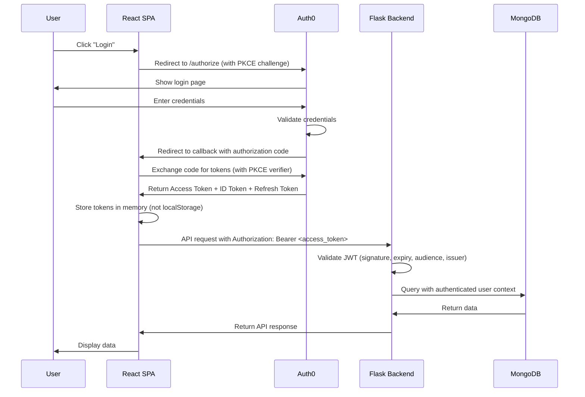
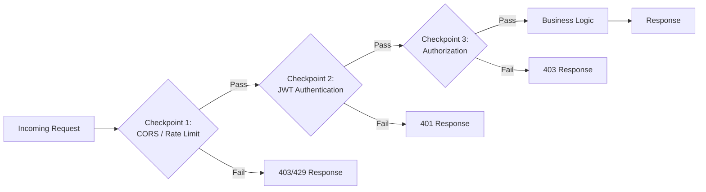

# Security Architecture

This document describes the security architecture of the Todo Application, covering authentication, authorization, encryption, and request validation strategies.

> **Source:** Tech Spec Sections 6.3, 6.4

## Table of Contents

- [Authentication Architecture](#authentication-architecture)
- [OAuth 2.0/OIDC Flow](#oauth-20oidc-flow)
- [JWT Validation Chain](#jwt-validation-chain)
- [Request Validation Checkpoints](#request-validation-checkpoints)
- [Defense-in-Depth Encryption](#defense-in-depth-encryption)
- [Role-Based Access Control (RBAC)](#role-based-access-control-rbac)
- [Security Headers and Best Practices](#security-headers-and-best-practices)
- [Related Documentation](#related-documentation)

---

## Authentication Architecture

*Source: Tech Spec Section 6.3*

The Todo Application delegates all authentication to [Auth0](https://auth0.com), a centralized identity provider. The application never stores user passwords, credentials, or authentication secrets directly — Auth0 manages the entire authentication lifecycle.

### Auth0 as Identity Provider

Auth0 serves as the single identity provider for all client platforms in the Todo Application ecosystem:

- **User registration:** New user accounts are created and managed within Auth0, including email/password validation and social login providers.
- **Login and logout:** Auth0 handles the full login and logout lifecycle using industry-standard OAuth 2.0 and OpenID Connect (OIDC) protocols.
- **Password management:** Password storage, hashing, reset flows, and breach detection are managed entirely by Auth0.
- **Multi-factor authentication (MFA):** Auth0 provides configurable MFA enforcement using TOTP, SMS, or push notifications.
- **Multi-platform support:** A single Auth0 tenant serves all six client platforms — Web (React), iOS (Swift), Android (Kotlin), Desktop (Electron), CLI (Python), and Browser Extension (Chrome/Firefox).

### Integration Points

The application integrates with Auth0 through three distinct communication channels:

| Integration Point | Technology | Direction | Purpose |
| --- | --- | --- | --- |
| Frontend (React SPA) | `@auth0/auth0-react` SDK | Browser → Auth0 | Redirect-based login, token acquisition, silent refresh |
| Backend (Flask) | JWT middleware | Flask ← Auth0 (via JWKS) | Validate JWT access tokens on every protected API request |
| Management API | `auth0-python` SDK | Flask → Auth0 | Server-to-server user profile operations (create, update, role assignment) |

### Token Types

Auth0 issues three types of tokens during the authentication flow, each serving a distinct purpose:

- **Access Token (JWT):** A short-lived JSON Web Token included in the `Authorization: Bearer <token>` header of every API request. The Flask backend validates this token to authenticate and authorize the request. Default lifetime is 24 hours.
- **Refresh Token:** A long-lived opaque token used to obtain new access tokens without requiring the user to re-authenticate. Stored securely by the client application and exchanged silently when the access token expires.
- **ID Token:** A JWT containing user profile claims (name, email, avatar). Used by the frontend for display purposes only — never sent to the backend API and never used for authorization decisions.

### Auth0 Configuration Requirements

The following environment variables must be configured for Auth0 integration:

| Variable | Description | Example |
| --- | --- | --- |
| `AUTH0_DOMAIN` | Auth0 tenant domain | `your-tenant.auth0.com` |
| `AUTH0_CLIENT_ID` | Application client identifier | `aBcDeFgHiJkLmNoPqRsT` |
| `AUTH0_CLIENT_SECRET` | Application client secret (backend only — never exposed to frontend) | `YOUR_AUTH0_CLIENT_SECRET` |
| `AUTH0_AUDIENCE` | API audience identifier for token scoping | `https://api.todoapp.com` |

> **See also:** [Configuration Reference](../getting-started/configuration.md) for complete environment variable documentation.

---

## OAuth 2.0/OIDC Flow

*Source: Tech Spec Section 6.3*

The Todo Application implements the OAuth 2.0 Authorization Code Flow with PKCE (Proof Key for Code Exchange) for all public clients (SPA, mobile, desktop). This flow provides the highest security for browser-based and native applications by preventing authorization code interception attacks.

### Flow Overview

- **Public clients (SPA, mobile, desktop, CLI, browser extension):** Use Authorization Code Flow with PKCE. The client generates a cryptographic code verifier and challenge, which Auth0 validates during token exchange.
- **Backend (server-to-server):** Uses the Client Credentials Grant for Auth0 Management API operations (user creation, role assignment) where no user interaction is involved.

### Authentication Sequence Diagram

The following diagram illustrates the complete login flow from user interaction through token acquisition and authenticated API access:



### Key Security Properties

This authentication flow provides several critical security guarantees:

- **PKCE protection:** The code verifier/challenge mechanism prevents authorization code interception attacks, where a malicious application intercepts the authorization code during the redirect.
- **In-memory token storage:** Tokens are stored in JavaScript memory (not `localStorage` or `sessionStorage`) to prevent cross-site scripting (XSS) attacks from stealing tokens.
- **Short-lived access tokens:** Access tokens expire after 24 hours by default, limiting the window of exposure if a token is compromised.
- **Refresh token rotation:** Auth0 supports refresh token rotation, where each use of a refresh token invalidates the previous one and issues a new one, preventing replay attacks.
- **Secure redirect validation:** Auth0 validates the redirect URI against a pre-configured allowlist, preventing open redirect attacks.

### Token Refresh Flow

When an access token expires, the frontend silently requests a new one without interrupting the user experience:

1. The React SPA detects that the access token has expired (or is about to expire) by checking the `exp` claim.
2. The Auth0 SPA SDK automatically sends a token refresh request to Auth0 using the stored refresh token.
3. Auth0 validates the refresh token and issues a new access token (and optionally a new refresh token via rotation).
4. The new access token replaces the expired one in memory, and the original API request is retried.
5. If the refresh token is also expired or revoked, Auth0 returns an error and the user is redirected to the login page for re-authentication.

---

## JWT Validation Chain

*Source: Tech Spec Section 6.4*

Every protected API request to the Flask backend passes through a multi-step JWT validation chain implemented as Flask middleware. The validation chain ensures that only properly authenticated and authorized requests reach the business logic layer.

### Validation Steps

The following nine validation steps are executed in order for every incoming request to a protected endpoint:

| Step | Name | Description | Failure Response |
| --- | --- | --- | --- |
| 1 | Token Presence | Check that the `Authorization` header exists and starts with the `Bearer` prefix | `401 Unauthorized` |
| 2 | Token Decode | Decode the JWT header (without verification) to extract the `kid` (Key ID) and `alg` (Algorithm) fields | `401 Unauthorized` |
| 3 | JWKS Verification | Fetch the Auth0 JWKS (JSON Web Key Set) from `https://{AUTH0_DOMAIN}/.well-known/jwks.json`, locate the public key matching the token's `kid`, and verify the token signature | `401 Unauthorized` |
| 4 | Algorithm Validation | Ensure the token uses the RS256 algorithm — reject HS256 or other algorithms to prevent key confusion attacks | `401 Unauthorized` |
| 5 | Issuer Validation | Verify the `iss` (issuer) claim matches `https://{AUTH0_DOMAIN}/` | `401 Unauthorized` |
| 6 | Audience Validation | Verify the `aud` (audience) claim matches the configured `AUTH0_AUDIENCE` value | `401 Unauthorized` |
| 7 | Expiration Check | Verify the `exp` (expiration) claim is in the future, accounting for a configurable clock skew tolerance (default 30 seconds) | `401 Unauthorized` |
| 8 | Not Before Check | If the `nbf` (not before) claim is present, verify it is in the past | `401 Unauthorized` |
| 9 | Claims Extraction | Extract the user identity (`sub`), email, roles, and permissions from the token claims and attach them to the Flask request context | N/A (proceeds to authorization) |

### Validation Failure Responses

When JWT validation fails at any step, the middleware returns a JSON error response with the appropriate HTTP status code:

**Missing token (Step 1):**

```json
{
  "error": "missing_token",
  "message": "Authorization header required"
}
```

HTTP Status: `401 Unauthorized`

**Invalid or expired token (Steps 2–8):**

```json
{
  "error": "invalid_token",
  "message": "Token validation failed"
}
```

HTTP Status: `401 Unauthorized`

**Insufficient permissions (post-validation authorization):**

```json
{
  "error": "insufficient_permissions",
  "message": "Required permissions not found"
}
```

HTTP Status: `403 Forbidden`

### JWKS Caching Strategy

To avoid excessive network calls to the Auth0 JWKS endpoint, the Flask backend implements an in-memory JWKS caching strategy:

- **Initial fetch:** On the first token validation after application startup, the JWKS is fetched from Auth0 and cached in memory.
- **TTL-based refresh:** The cached JWKS is refreshed at a configurable interval (default 1 hour) to pick up any key rotations.
- **Unknown `kid` refresh:** If a token presents a `kid` that is not found in the current cache, the JWKS is immediately re-fetched. This handles key rotation scenarios where Auth0 starts signing tokens with a new key before the cache TTL expires.
- **Fallback behavior:** If the JWKS endpoint is temporarily unreachable, the cached keys continue to be used until they expire or a new fetch succeeds.

---

## Request Validation Checkpoints

*Source: Tech Spec Section 6.4*

Every API request passes through three sequential validation checkpoints before reaching the business logic layer. This defense-in-depth approach ensures that invalid, unauthenticated, or unauthorized requests are rejected at the earliest possible stage.

### Three-Checkpoint Pipeline



### Checkpoint 1: API Gateway / CORS Layer

The first checkpoint validates the request at the network and protocol level before any authentication logic is invoked:

- **CORS origin validation:** The request `Origin` header is checked against the `CORS_ORIGINS` allowlist. Requests from unlisted origins are rejected with a `403 Forbidden` response.
- **Rate limiting:** Requests are throttled per IP address to prevent abuse and denial-of-service attacks. Exceeding the rate limit returns a `429 Too Many Requests` response with a `Retry-After` header.
- **Content-Type validation:** For requests with a body (`POST`, `PUT`, `PATCH`), the `Content-Type` header must be `application/json`. Requests with invalid content types are rejected with a `415 Unsupported Media Type` response.
- **Request size limits:** Request bodies exceeding the configured maximum size (default 1 MB) are rejected with a `413 Payload Too Large` response.

### Checkpoint 2: Authentication Middleware

The second checkpoint performs the full JWT validation chain described in the [JWT Validation Chain](#jwt-validation-chain) section:

- Executes all nine JWT validation steps (token presence, decode, JWKS verification, algorithm, issuer, audience, expiration, not-before, claims extraction).
- Extracts the authenticated user identity and attaches it to the Flask request context (`g.current_user`).
- Routes unauthenticated requests to a `401 Unauthorized` response.
- **Public endpoint bypass:** Certain endpoints do not require authentication and skip this checkpoint entirely:
  - `GET /api/health` — Health check endpoint for load balancer probes.
  - `POST /api/auth/login` — Login initiation (redirects to Auth0).
  - `POST /api/auth/callback` — Auth0 callback handler.

### Checkpoint 3: Service-Level Authorization

The third checkpoint validates that the authenticated user has permission to perform the specific requested operation:

- **Permission scope validation:** The business logic layer checks that the user's JWT contains the required permission scopes for the operation (e.g., `write:todos` for creating a to-do item).
- **Resource ownership checks:** For resource-specific operations (read, update, delete), the service layer verifies that the target resource belongs to the requesting user by matching the `user_id` field in the database document against the authenticated user's `sub` claim.
- **Role-based enforcement:** Administrative operations (manage all users, configure model settings) are restricted to users with the `admin` role.
- **Input validation and sanitization:** Request bodies are validated against expected schemas and sanitized before database operations to prevent injection attacks.

---

## Defense-in-Depth Encryption

*Source: Tech Spec Section 6.4*

The Todo Application implements a three-layer encryption strategy that protects data at every stage — in transit between services, at rest on disk, and at the individual field level for sensitive data.
This defense-in-depth approach ensures that a breach at any single layer does not expose plaintext sensitive data.

### Encryption Layer Overview

| Layer | Scope | Technology | Protection Target |
| --- | --- | --- | --- |
| Layer 1 | In-Transit | TLS 1.3 | All network communication between components |
| Layer 2 | At-Rest | WiredTiger / AWS KMS | All data files stored on disk by MongoDB |
| Layer 3 | Field-Level | CSFLE (Client-Side Field-Level Encryption) | Individual sensitive fields within MongoDB documents |

### Layer 1: In-Transit Encryption (TLS 1.3)

All network communication between application components is encrypted using TLS 1.3, the latest version of the Transport Layer Security protocol:

- **Client to server:** All HTTP traffic between client applications (React SPA, mobile apps, desktop, CLI, browser extension) and the Flask backend uses HTTPS with TLS 1.3.
- **Backend to database:** All communication between the Flask backend and MongoDB uses TLS-encrypted connections, enforced via the `tls=true` parameter in the MongoDB connection string.
- **Backend to Auth0:** All REST API calls from the Flask backend to Auth0 (JWKS endpoint, Management API) use HTTPS with TLS 1.3.
- **Backend to LLM provider:** All API calls from the Flask backend (via LangChain) to external LLM providers (OpenAI, Anthropic, Azure OpenAI) use HTTPS with TLS 1.3.
- **Certificate management:** TLS certificates are managed by the infrastructure layer — AWS Certificate Manager (ACM) for production deployments and Let's Encrypt for development/staging environments.

### Layer 2: At-Rest Encryption (WiredTiger / AWS KMS)

MongoDB's WiredTiger storage engine provides transparent encryption of all data files at rest:

- **WiredTiger encryption:** The WiredTiger storage engine encrypts all data files, journal files, and indexes on disk. This protects against physical disk theft or unauthorized file system access.
- **AWS KMS key management:** For MongoDB Atlas production deployments, encryption keys are managed by AWS Key Management Service (KMS). Atlas handles key rotation and access control through AWS IAM policies.
- **Local development:** Local development environments may run MongoDB without at-rest encryption for simplicity. This is acceptable because development databases do not contain real user data.
- **Coverage:** At-rest encryption covers all six MongoDB collections: `todos`, `users`, `conversations`, `embeddings`, `documents`, and `model_config`.

### Layer 3: Field-Level Encryption (CSFLE)

Client-Side Field-Level Encryption (CSFLE) provides the most granular encryption layer, protecting individual sensitive fields within MongoDB documents. CSFLE encrypts data before it leaves the application — the MongoDB server never sees plaintext values for encrypted fields.

#### CSFLE-Encrypted Fields

| Collection | Field | Encryption Type | Rationale |
| --- | --- | --- | --- |
| `users` | `email` | Deterministic | Enables exact-match queries (e.g., find user by email) while keeping data encrypted |
| `users` | `auth0_id` | Deterministic | Enables lookup by Auth0 identifier for user synchronization |
| `users` | `preferences` | Random | No query requirement — maximum security for user preference data |
| `conversations` | `messages` | Random | Sensitive AI conversation content — no query support needed |
| `model_config` | `api_keys` | Random | LLM provider API keys — highest sensitivity, no query requirement |

#### Deterministic vs. Random Encryption

CSFLE supports two encryption modes, each with different security and query tradeoffs:

- **Deterministic encryption:** The same plaintext value always produces the same ciphertext. This enables equality queries (e.g., `db.users.find_one({"email": encrypted_value})`) but reveals when two documents share the same value (frequency analysis risk).
  Used for fields that must be searchable.
- **Random encryption:** The same plaintext value produces different ciphertext each time. This provides the strongest security by preventing frequency analysis but does not support any query operations.
  Fields encrypted with random encryption can only be read after the document is retrieved by another query criterion. Used for fields where maximum confidentiality is required.

#### CSFLE Implementation Notes

- **PyMongo integration:** CSFLE is configured through PyMongo's `AutoEncryptionOpts`, which transparently encrypts fields on write and decrypts on read without requiring application-level encryption code.
- **Key management:** CSFLE master keys are stored in AWS KMS (production) or a local key file (development). Data encryption keys (DEKs) are stored in a dedicated MongoDB `__keyVault` collection, encrypted by the master key.
- **Performance impact:** CSFLE adds encryption/decryption overhead to read and write operations for encrypted fields. Deterministic encryption is faster than random encryption due to simpler key derivation.

> **See also:** [Data Model](data-model.md) for complete collection schemas and field definitions.

---

## Role-Based Access Control (RBAC)

*Source: Tech Spec Section 6.4*

The Todo Application implements role-based access control (RBAC) to govern what actions each user can perform. Roles and permissions are managed through Auth0 and enforced at the service layer of the Flask backend.

### Role Definitions

| Role | Description | Assigned To |
| --- | --- | --- |
| `user` | Standard application user | All registered users (default role) |
| `admin` | Application administrator | Designated administrators only |

**Role capabilities:**

- **`user` role:** Create, read, update, and delete their own to-do items. Use AI processing features (simple, RAG, and agent queries). Manage their own profile and preferences. Delete their own account.
- **`admin` role:** All capabilities of the `user` role, plus: manage all users (view, update, deactivate), view system metrics and usage statistics, configure AI model settings and API keys, and access administrative endpoints.

### Permission Model

Permissions are encoded as custom claims in the Auth0 JWT access token and enforced at two levels:

1. **Token-level permissions:** The JWT `permissions` claim contains an array of permission scopes granted to the user based on their assigned role. The Flask authentication middleware extracts these permissions during JWT validation (Step 9 of the [JWT Validation Chain](#jwt-validation-chain)).
2. **Resource-level ownership:** The data access layer enforces resource ownership by including a `user_id` filter in all database queries.
   A user can only access MongoDB documents where the `user_id` field matches their Auth0 `sub` claim.
   This prevents horizontal privilege escalation where a user attempts to access another user's data by guessing document IDs.

### Auth0 RBAC Configuration

Roles and permissions are configured in the Auth0 Dashboard:

1. **Define permissions:** Navigate to Auth0 Dashboard → Applications → APIs → select your API → Permissions tab. Define each permission scope listed in the [Permission Scopes](#permission-scopes) table below.
2. **Create roles:** Navigate to Auth0 Dashboard → User Management → Roles. Create the `user` and `admin` roles.
3. **Assign permissions to roles:** Assign the appropriate permission scopes to each role.
4. **Assign roles to users:** Assign the `user` role to all new registrations (via Auth0 Rules or Actions). Assign the `admin` role manually to designated administrators.
5. **Enable RBAC in API settings:** In Auth0 Dashboard → Applications → APIs → select your API → Settings, enable "Enable RBAC" and "Add Permissions in the Access Token" to include the `permissions` claim in JWT access tokens.

**Example JWT payload with permissions:**

```json
{
  "sub": "auth0|user123",
  "aud": "https://api.todoapp.com",
  "iss": "https://your-tenant.auth0.com/",
  "iat": 1700000000,
  "exp": 1700086400,
  "permissions": [
    "read:todos",
    "write:todos",
    "read:profile",
    "write:profile",
    "read:ai"
  ]
}
```

### Permission Scopes

The following table lists all permission scopes defined in the Todo Application:

| Scope | Description | Required Role |
| --- | --- | --- |
| `read:todos` | Read to-do items belonging to the authenticated user | `user`, `admin` |
| `write:todos` | Create, update, and delete to-do items belonging to the authenticated user | `user`, `admin` |
| `read:profile` | Read the authenticated user's profile information | `user`, `admin` |
| `write:profile` | Update the authenticated user's profile information | `user`, `admin` |
| `delete:account` | Permanently delete the authenticated user's account and all associated data | `user`, `admin` |
| `read:ai` | Submit queries to the AI processing service (simple, RAG, and agent patterns) | `user`, `admin` |
| `admin:users` | View and manage all user accounts (admin-only operations) | `admin` |
| `admin:config` | View and modify system configuration including AI model settings and API keys | `admin` |

---

## Security Headers and Best Practices

*Source: Tech Spec Section 6.4*

The Flask backend includes a comprehensive set of HTTP security headers on every response and follows security best practices to minimize the application's attack surface.

### HTTP Security Headers

The following headers are set on all API responses:

| Header | Value | Purpose |
| --- | --- | --- |
| `Strict-Transport-Security` | `max-age=63072000; includeSubDomains; preload` | Enforce HTTPS for all requests — browsers will refuse to connect over plain HTTP for two years after first visit |
| `X-Content-Type-Options` | `nosniff` | Prevent MIME type sniffing — browsers must respect the declared `Content-Type` |
| `X-Frame-Options` | `DENY` | Prevent clickjacking — the application cannot be embedded in iframes on any domain |
| `Content-Security-Policy` | `default-src 'self'; script-src 'self'; style-src 'self' 'unsafe-inline'` | Restrict resource loading to same-origin sources — blocks inline scripts and unauthorized external resources |
| `X-XSS-Protection` | `0` | Disabled — the Content-Security-Policy header provides superior XSS protection; the legacy XSS filter can introduce vulnerabilities |
| `Referrer-Policy` | `strict-origin-when-cross-origin` | Control referrer information — send full URL for same-origin requests, only origin for cross-origin requests |
| `Cache-Control` | `no-store, no-cache, must-revalidate` | Prevent caching of API responses containing sensitive data |

### Input Validation Best Practices

All user input is validated and sanitized before processing to prevent injection attacks and data corruption:

- **Schema validation:** Request bodies are validated against JSON schemas before reaching the service layer. Missing required fields, invalid types, and unexpected properties trigger a `422 Unprocessable Entity` response.
- **MongoDB injection prevention:** The PyMongo driver uses parameterized queries by default, preventing NoSQL injection attacks. The application never constructs database queries from raw string concatenation.
- **Request body size limits:** The CORS/gateway layer enforces a maximum request body size (default 1 MB) to prevent memory exhaustion attacks.
- **String length limits:** All string fields have maximum length constraints (e.g., to-do title: 200 characters, description: 5000 characters) enforced at the validation layer.
- **File upload restrictions:** If file upload functionality is enabled, files are restricted by MIME type and size, and stored in a sandboxed location.

### Sensitive Data Handling

The application follows strict practices for managing sensitive data throughout the system:

- **No secrets in logs:** API keys, JWT tokens, passwords, and other sensitive values are never written to application logs. Log entries redact sensitive fields using pattern-based masking.
- **Opaque error responses:** Error responses returned to clients never expose internal system details such as stack traces, database queries, or file paths. Internal error details are logged server-side only.
- **Production debug mode:** Debug mode is always disabled in production deployments (`DEBUG=false`). When debug mode is enabled in development, additional request/response logging is available but still redacts sensitive fields.
- **Environment-based secrets:** All secrets (Auth0 client secret, LLM API keys, MongoDB credentials, encryption keys) are stored as environment variables and injected at runtime. No secrets are ever hardcoded in application source code or committed to version control.
- **Secret rotation:** The application supports zero-downtime secret rotation for Auth0 client secrets, LLM API keys, and CSFLE master keys through environment variable updates and application restart.

> **See also:** [Configuration Reference](../getting-started/configuration.md) for complete environment variable documentation and secret management guidance.

---

## Related Documentation

### Internal Documentation

- [Architecture Overview](overview.md) — System-level architecture context, five-tier model, and component inventory
- [Data Model](data-model.md) — MongoDB collection schemas, field definitions, and CSFLE encryption details
- [Authentication Guide](../guides/authentication.md) — User-facing Auth0 setup instructions, login/logout flows, and MFA configuration
- [Authentication API Reference](../api-reference/auth.md) — REST endpoint specifications for authentication operations
- [Configuration Reference](../getting-started/configuration.md) — Environment variable setup including Auth0, MongoDB, and LLM configuration

### External References

- [Auth0 Documentation](https://auth0.com/docs) — Auth0 platform documentation and SDK references
- [OAuth 2.0 RFC 6749](https://datatracker.ietf.org/doc/html/rfc6749) — OAuth 2.0 Authorization Framework specification
- [OpenID Connect](https://openid.net/connect/) — OpenID Connect protocol specification
- [MongoDB CSFLE Documentation](https://www.mongodb.com/docs/manual/core/csfle/) — Client-Side Field-Level Encryption reference
- [JWT.io](https://jwt.io/) — JWT debugger, decoder, and specification documentation
- [OWASP Security Headers](https://owasp.org/www-project-secure-headers/) — HTTP security header best practices
