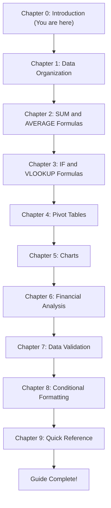

# Introduction to Calc

Welcome to the **Calc Project Document** — a comprehensive, hands-on guide to mastering spreadsheet skills. This guide provides a structured introduction to Calc, a spreadsheet application used for data organization, analysis, and visualization. Whether you are new to spreadsheets or looking to deepen your existing skills, this guide walks you through essential features using practical, worked examples.

Every chapter in this guide builds on a consistent sample dataset introduced later in this chapter. By working through the examples with real data, you will gain a solid understanding of how each feature works and how to apply it to your own projects. The term "Calc" is used generically throughout this guide to refer to spreadsheet applications — the concepts and formulas apply across all major spreadsheet software.

---

## What Is Calc?

Calc is a spreadsheet application that allows you to **organize**, **calculate**, **analyze**, and **visualize** data in a structured, grid-based environment. Spreadsheets are one of the most widely used tools in business, education, and personal productivity.

Spreadsheets are used across industries for a wide range of tasks, including:

- **Financial tracking** — managing budgets, expenses, and revenue
- **Data analysis** — summarizing and interpreting datasets
- **Reporting** — creating tables, charts, and dashboards
- **Budgeting** — planning and forecasting financial activities
- **Inventory management** — tracking stock levels and orders
- **Project planning** — organizing tasks, timelines, and resources

At its core, Calc operates on a **grid of cells** organized into **rows** (horizontal) and **columns** (vertical). Each cell sits at the intersection of a row and a column, and it can hold data — such as text, numbers, or dates — or a formula that computes a result from other cells.

Files created in Calc are saved as **workbooks**. A single workbook can contain multiple **worksheets** (also called sheets), allowing you to separate different types of data or analysis within one file.

---

## Core Concepts

Before diving into features, it is important to understand the fundamental building blocks of every spreadsheet. The five core concepts below form the foundation for everything covered in this guide.

### Cells

A **cell** is the basic unit of a spreadsheet — the single box found at the intersection of a row and a column. Every cell has a unique **cell address** (also called a cell reference) determined by its column letter and row number.

- **Example addresses:** A1 (column A, row 1), B3 (column B, row 3), C10 (column C, row 10)
- **Cell contents:** A cell can contain text, numbers, dates, formulas, or it can be left empty
- **Active cell:** The currently selected cell is highlighted with a bold border. Its address is displayed in the Name Box, and its contents appear in the Formula Bar
- **Editing:** Click a cell to select it, then type to enter data or double-click to edit existing content

### Rows

**Rows** are horizontal lines of cells that run from left to right across the spreadsheet. Rows are numbered sequentially starting from 1 (1, 2, 3, 4, ...).

- **Typical usage:** Each row represents one record or entry — for example, one employee, one transaction, or one product
- **Row 1 convention:** The first row is commonly reserved for column headers (labels describing what each column contains)
- **Operations:** Rows can be inserted, deleted, hidden, or resized to adjust the spreadsheet layout

### Columns

**Columns** are vertical lines of cells that run from top to bottom. Columns are labeled with letters starting from A (A, B, C, ... Z, AA, AB, AC, ...).

- **Typical usage:** Each column represents one attribute or field — for example, Name, Region, Sales Amount, or Date
- **Column width:** Columns can be resized to fit their content, or set to a specific width
- **Operations:** Columns can be inserted, deleted, hidden, or rearranged as needed

### Sheets (Worksheets)

A **sheet** (or worksheet) is a single page within a workbook. Each sheet contains its own independent grid of cells.

- **Sheet tabs:** Tabs appear at the bottom of the Calc window, allowing you to switch between sheets by clicking on them
- **Organization:** Use multiple sheets to separate different types of data or analysis within a single workbook — for example, one sheet for "Sales Data," another for "Analysis," and a third for "Charts"
- **Management:** Sheets can be renamed (for clarity), reordered (by dragging tabs), copied (to duplicate structure), or color-coded (for visual organization)
- **Cross-sheet references:** Formulas can reference cells on other sheets, enabling data connections across your workbook

### Workbooks

A **workbook** is the file that contains one or more worksheets. When you save your work in Calc, you are saving a workbook.

- **Common file formats:**
  - **ODS** (OpenDocument Spreadsheet) — the open standard format
  - **XLSX** (Microsoft Excel format) — widely used for compatibility
  - **CSV** (Comma-Separated Values) — a plain-text format used for data exchange between applications
- **Workbook scope:** A workbook is the complete document you create, save, and share with others. It holds all sheets, formatting, charts, and formulas in one file

---

## The Calc Interface

When you open Calc, you are presented with a workspace designed for efficient data entry and analysis. The key interface elements are described below. These descriptions are application-agnostic and apply to most spreadsheet applications.

| Interface Element | Description |
|-------------------|-------------|
| **Menu Bar** | The top bar providing access to all commands, organized by category: File, Edit, View, Insert, Format, Data, and Tools. Use the menu bar to access features not available through toolbar buttons. |
| **Toolbars** | Rows of quick-access buttons located below the menu bar. Toolbars provide shortcuts for common operations such as text formatting (bold, italic), cell alignment (left, center, right), borders, and number formatting. |
| **Name Box** | A small box on the left side of the Formula Bar area that displays the address of the active cell (e.g., "A1"). You can also type a cell address into the Name Box and press Enter to navigate directly to that cell. The Name Box is used to define and select named ranges. |
| **Formula Bar** | A wide input area next to the Name Box that shows the raw contents of the active cell. If the cell contains a formula, the Formula Bar displays the formula (e.g., `=SUM(C2:C6)`) while the cell itself shows the computed result. Use the Formula Bar to enter or edit data and formulas. |
| **Cell Grid** | The main working area — a large grid of rows (numbered) and columns (lettered) where you enter and view data. This is where all your spreadsheet content lives. Click any cell to select it, then begin typing to enter data. |
| **Sheet Tabs** | Tabs displayed at the bottom of the window, one for each worksheet in the workbook. Click a tab to switch to that sheet. Right-click a tab to access options for renaming, inserting, deleting, moving, or copying sheets. |
| **Status Bar** | The bottom bar of the window that displays contextual information. When you select a range of cells containing numbers, the Status Bar typically shows quick calculations such as the sum, average, and count of the selected values — without requiring a formula. |

**Tip:** You can customize which toolbars and status bar elements are visible through the View menu, tailoring the interface to your workflow.

---

## Sample Dataset: Acme Corp Quarterly Sales

Throughout this guide, examples and calculations are built around a single, consistent sample dataset. Using the same data across all chapters ensures that you can follow along progressively and see how different features work together on the same information.

### The Scenario

**Acme Corp** is a fictional company that sells three products across four geographic regions. The company tracks quarterly sales figures for each of its five sales employees. This dataset is compact enough to work with easily, yet rich enough to demonstrate all the features covered in this guide.

The dataset includes:

- **5 employees:** Alice, Bob, Carol, Dave, and Eve
- **4 regions:** North, South, East, and West
- **4 quarters of sales data:** Q1 through Q4 (representing one full fiscal year)
- **3 products:** Widget A, Widget B, and Widget C

### The Data

Here is the complete Acme Corp quarterly sales dataset. **These exact values are used in examples and calculations throughout the entire guide.**

| Employee | Region | Q1 Sales | Q2 Sales | Q3 Sales | Q4 Sales | Product  |
|----------|--------|----------|----------|----------|----------|----------|
| Alice    | North  | 15000    | 18000    | 22000    | 19000    | Widget A |
| Bob      | South  | 12000    | 14000    | 13000    | 16000    | Widget B |
| Carol    | East   | 20000    | 17000    | 25000    | 23000    | Widget A |
| Dave     | West   | 11000    | 13000    | 15000    | 14000    | Widget C |
| Eve      | North  | 18000    | 21000    | 19000    | 22000    | Widget B |

### Dataset Details

Understanding the structure and relationships within this dataset will help you follow the examples in every chapter:

- **Regional distribution:** The North region has two employees (Alice and Eve), while South (Bob), East (Carol), and West (Dave) each have one employee
- **Product assignments:** Widget A is sold by Alice and Carol; Widget B is sold by Bob and Eve; Widget C is sold only by Dave
- **Sales range:** Individual quarterly sales values range from 11,000 (Dave, Q1) to 25,000 (Carol, Q3)

### Key Summary Values

The following summary values are referenced frequently in formula examples and calculations throughout the guide. You can verify these numbers against the dataset above:

**Quarterly totals (all employees combined):**

- **Total Q1 Sales:** 15,000 + 12,000 + 20,000 + 11,000 + 18,000 = **76,000**
- **Total Q2 Sales:** 18,000 + 14,000 + 17,000 + 13,000 + 21,000 = **83,000**
- **Total Q3 Sales:** 22,000 + 13,000 + 25,000 + 15,000 + 19,000 = **94,000**
- **Total Q4 Sales:** 19,000 + 16,000 + 23,000 + 14,000 + 22,000 = **94,000**

**Quarterly averages (per employee):**

- **Average Q1 Sales:** 76,000 ÷ 5 = **15,200**
- **Average Q2 Sales:** 83,000 ÷ 5 = **16,600**
- **Average Q3 Sales:** 94,000 ÷ 5 = **18,800**
- **Average Q4 Sales:** 94,000 ÷ 5 = **18,800**

**Annual totals per employee:**

- **Alice:** 15,000 + 18,000 + 22,000 + 19,000 = **74,000**
- **Bob:** 12,000 + 14,000 + 13,000 + 16,000 = **55,000**
- **Carol:** 20,000 + 17,000 + 25,000 + 23,000 = **85,000**
- **Dave:** 11,000 + 13,000 + 15,000 + 14,000 = **53,000**
- **Eve:** 18,000 + 21,000 + 19,000 + 22,000 = **80,000**

**Grand total (all employees, all quarters):**

- 74,000 + 55,000 + 85,000 + 53,000 + 80,000 = **347,000**

### Setting Up the Dataset in Calc

To follow along with the examples in this guide, set up the sample dataset in your own spreadsheet:

1. **Open a new workbook** in your Calc application
2. **Enter the column headers** in Row 1:
   - Cell A1: `Employee`
   - Cell B1: `Region`
   - Cell C1: `Q1 Sales`
   - Cell D1: `Q2 Sales`
   - Cell E1: `Q3 Sales`
   - Cell F1: `Q4 Sales`
   - Cell G1: `Product`
3. **Enter the data** in Rows 2 through 6:
   - Row 2: `Alice`, `North`, `15000`, `18000`, `22000`, `19000`, `Widget A`
   - Row 3: `Bob`, `South`, `12000`, `14000`, `13000`, `16000`, `Widget B`
   - Row 4: `Carol`, `East`, `20000`, `17000`, `25000`, `23000`, `Widget A`
   - Row 5: `Dave`, `West`, `11000`, `13000`, `15000`, `14000`, `Widget C`
   - Row 6: `Eve`, `North`, `18000`, `21000`, `19000`, `22000`, `Widget B`
4. **Format the sales columns** (C through F) as numbers or currency for readability
5. **Save the workbook** — you will use this file throughout the guide

**Tip:** Rename the first sheet tab to "Sales Data" for easy identification as you add more sheets in later chapters.

### Where This Dataset Is Used

The Acme Corp dataset serves as the foundation for practical examples across the following chapters:

| Chapter | Topic | How the Dataset Is Used |
|---------|-------|------------------------|
| [Chapter 1: Data Organization](01-data-organization.md) | Structuring Data | Organizing and structuring the sales data with best practices |
| [Chapter 2: SUM and AVERAGE](02-formulas-sum-average.md) | Aggregation Formulas | Calculating total and average quarterly sales |
| [Chapter 3: IF and VLOOKUP](03-formulas-if-vlookup.md) | Conditional and Lookup Formulas | Categorizing sales performance and looking up employee data |
| [Chapter 4: Pivot Tables](04-pivot-tables.md) | Data Summarization | Summarizing sales by region and product |
| [Chapter 5: Charts](05-charts.md) | Data Visualization | Visualizing sales trends across quarters and employees |
| [Chapter 7: Data Validation](07-data-validation.md) | Input Controls | Creating input forms for entering new sales data |
| [Chapter 8: Conditional Formatting](08-conditional-formatting.md) | Visual Formatting | Building a color-coded sales performance dashboard |

---

## Document Conventions

This guide uses consistent formatting conventions to make content easy to read and follow. Here is what to expect:

### Formula Syntax

All formula and function syntax is presented in fenced code blocks. For example:

```text
=SUM(C2:C6)
```

When a formula is discussed inline, it appears in monospace formatting like `=AVERAGE(C2:C6)`.

### Spreadsheet Data

Spreadsheet data is shown in Markdown tables where column headers correspond to cell column labels. For example, a table with columns labeled "A (Employee)" and "B (Region)" indicates that column A in the spreadsheet contains employee names and column B contains regions.

### Cell References

Cell references use standard spreadsheet notation — a column letter followed by a row number:

- `A1` — column A, row 1 (typically the first header cell)
- `C2:C6` — a range from cell C2 to cell C6 (a vertical range in column C)
- `C2:F2` — a range from cell C2 to cell F2 (a horizontal range in row 2)

### Step-by-Step Calculations

Formula evaluation is broken down into numbered steps showing each stage of the computation, from the initial formula through intermediate values to the final result. This allows you to trace how the spreadsheet arrives at each answer.

### Workflow Diagrams

Multi-step processes and decision workflows are illustrated using Mermaid flowchart diagrams. These diagrams provide a visual overview of procedures such as creating pivot tables, selecting chart types, or setting up data validation rules.

### Cross-References

Links to other chapters in this guide use relative paths and include the chapter name. For example: [SUM and AVERAGE Formulas](02-formulas-sum-average.md). You can click these links to navigate directly to the referenced section.

### Terminology

The term **"Calc"** is used generically throughout this guide to refer to spreadsheet applications. The concepts, formulas, and features described here apply to all major spreadsheet software. Application-specific menu paths or interface differences are noted only when necessary for clarity.

### Tips and Warnings

- **Tip:** Helpful hints and best practices are prefixed with "Tip:" to make them easy to spot
- **Warning:** Common mistakes, pitfalls, and error-prone situations are explicitly called out so you can avoid them

---

## Guide Roadmap

The following diagram shows the complete learning path through this guide. Chapters are designed to build on each other progressively, but each chapter is also self-contained — so you can jump directly to any topic that interests you.



**Reading options:**

- **Sequential path:** Follow the chapters in order (0 → 1 → 2 → ... → 9) for a structured learning experience that builds skills progressively
- **Topic-based lookup:** Jump directly to any chapter that addresses your immediate need — each chapter includes all the context required to follow its examples independently

---

## Navigation

| | |
|---|---|
| **Next:** [Data Organization →](01-data-organization.md) | **Home:** [↑ Documentation Index](../README.md) |
