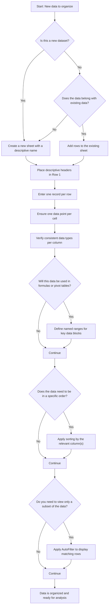

# Data Organization

Proper data organization is the foundation for effective spreadsheet analysis. Before you apply formulas, build pivot tables, create charts, or perform any kind of analysis, the underlying data must be well-structured, consistently typed, and logically arranged. When data is organized correctly, every downstream feature — from `SUM` to conditional formatting — works more reliably and produces more meaningful results.

This chapter covers the essential principles of data organization in Calc: understanding data types, structuring data in rows and columns, organizing sheets within a workbook, working with data ranges and named ranges, and using sorting and filtering to manage your data effectively. All examples in this chapter reference the **Acme Corp quarterly sales dataset** introduced in the [Introduction](00-introduction.md).

---

## Data Types in Calc

Every cell in a spreadsheet stores a value of a specific **data type**. Understanding data types is critical because the type of data in a cell determines how Calc stores, displays, and processes that value. Formulas, sorting, filtering, and charting all depend on data being the correct type.

The following table summarizes the six primary data types you will encounter in Calc:

| Data Type | Description | Examples | Storage Notes |
|-----------|-------------|----------|---------------|
| **Text (String)** | Alphabetic characters, labels, and names | "Alice", "North", "Widget A" | Left-aligned by default in the cell |
| **Numbers** | Numeric values used in calculations | 15000, 3.14, -500 | Right-aligned by default in the cell |
| **Dates** | Calendar dates stored as numbers internally | 2024-01-15, Jan 15 2024 | Displayed as a formatted date, stored as a serial number |
| **Currency** | Monetary values displayed with a currency symbol | $15,000.00, €1,234.56 | Stored as a number with currency formatting applied |
| **Boolean** | Logical values representing true or false | TRUE, FALSE | Used in conditions, logical formulas, and IF functions |
| **Percentage** | Values representing a ratio or proportion | 25%, 0.75 (displayed as 75%) | Stored as a decimal number with percentage formatting |

### Why Data Types Matter

Choosing and applying the correct data type is not just a cosmetic concern — it directly affects the reliability of your analysis:

- **Formulas require numeric data.** Functions like `SUM` and `AVERAGE` only calculate cells that contain actual numbers. If a value that looks like a number is stored as text (e.g., the text string "15000" instead of the number 15000), it will be silently skipped in calculations, producing incorrect totals without any error message.
- **Date arithmetic requires recognized dates.** To calculate the difference between two dates, or to sort records chronologically, Calc must recognize the cell value as a date. A date entered as plain text (e.g., "January 15") cannot be used in date calculations.
- **Consistent column types ensure reliable analysis.** When all values in a column share the same data type, sorting, filtering, and charting behave predictably. Mixing numbers and text in the same column can produce unexpected sort orders and break formulas.

**Tip:** If a number appears **left-aligned** in a cell, it may be stored as text rather than as a number. To fix this, select the cell, clear the content, re-enter the numeric value, and ensure the column is formatted as Number or General. Many spreadsheet applications also offer a "Convert to Number" option when they detect this issue.

---

## Structuring Data in Rows and Columns

The way you arrange data in rows and columns determines how effectively you can use every other feature in Calc. Following the standard tabular data layout ensures that your data works seamlessly with formulas, pivot tables, charts, AutoFilter, and data validation.

### Headers in Row 1

Every data table should begin with a **header row** — a single row of descriptive labels in Row 1 that identifies the content of each column.

- Headers should be **short, clear, and unique**. Use "Q1 Sales" rather than "Sales for the first quarter of the year."
- Headers become **field names** in pivot tables, **axis labels** in charts, and **dropdown labels** in AutoFilter.
- Never leave a header cell blank. Every column of data must have a label.

### One Record Per Row

Each row below the header should represent **one complete entity or record** — for example, one employee, one transaction, or one product.

- Never split a single record across multiple rows. All data about one entity belongs in one row.
- Keep related data together. If Alice's Q1 Sales and Q2 Sales both belong to Alice, they must be in the same row as Alice's name.
- As you add new records, append them as new rows below the existing data.

### One Data Point Per Cell

Each cell should contain **exactly one piece of information**. Combining multiple values into a single cell makes it nearly impossible to sort, filter, or use that data in formulas.

- Separate compound data into individual columns. Instead of putting "Alice, North" in one cell, create separate "Employee" and "Region" columns.
- Separate combined values. Instead of putting "15000/18000" in one cell for Q1/Q2 sales, create separate "Q1 Sales" and "Q2 Sales" columns.
- This principle is the key to enabling automated analysis. Every piece of data you might want to sort, filter, or calculate on should live in its own cell.

### Consistent Column Data Types

All values within a single column should be the **same data type**. A column of sales figures should contain only numbers. A column of employee names should contain only text.

- Do not mix numbers and text in the same column — this breaks formulas and creates unpredictable sort behavior.
- Use separate columns for different data categories rather than encoding multiple meanings in one column.
- If a column needs to accommodate missing data, leave the cell empty rather than entering a text placeholder like "N/A" in a numeric column.

### Good vs. Bad Data Layout

The following comparison illustrates the difference between poorly organized data and well-structured data:

**Bad Layout — Combined data in single cells:**

| Name and Region | Sales Q1/Q2 |
|-----------------|-------------|
| Alice - North   | 15000/18000 |
| Bob - South     | 12000/14000 |

This layout combines the employee name and region into one cell and merges two quarters of sales into another. You cannot sort by region alone, filter by Q1 sales independently, or use `SUM` on Q1 values.

**Good Layout — Each data point in its own cell:**

| Employee | Region | Q1 Sales | Q2 Sales |
|----------|--------|----------|----------|
| Alice    | North  | 15000    | 18000    |
| Bob      | South  | 12000    | 14000    |

This layout separates every data point into its own cell with a clear header. You can sort by any column, filter by region, and calculate sums or averages on individual quarterly sales columns.

---

## Sheet Organization

A workbook in Calc can contain multiple sheets (worksheets), each with its own independent grid of cells. Organizing your sheets effectively helps you keep your work structured, navigable, and maintainable — especially as your workbook grows in complexity.

### Sheet Naming Conventions

- **Use descriptive names** that indicate the sheet's content or purpose. Name sheets "Sales Data," "Analysis," or "Charts" — not "Sheet1," "Sheet2," or "Sheet3."
- **Keep names short** — under 20 characters is ideal. Sheet names appear in tabs at the bottom of the window and in cross-sheet formulas, so brevity improves readability.
- **Avoid special characters** in sheet names. Characters like `/`, `\`, `*`, `?`, `:`, `[`, and `]` can cause errors in formulas that reference the sheet.

### When to Use Multiple Sheets

Separating data across multiple sheets keeps your workbook organized and reduces visual clutter:

- **Separate raw data from analysis.** Keep your original source data on one sheet (e.g., "Sales Data") and perform calculations, summaries, and derived analysis on separate sheets (e.g., "Analysis," "Summary"). This protects your source data from accidental modification.
- **Separate by time period.** If you track data monthly or quarterly, consider using separate sheets for each period (e.g., "Jan 2024," "Feb 2024") or consolidating all periods into a single sheet with a date column — the choice depends on the volume of data and your analysis needs.
- **Separate by category.** Different product lines, departments, or data sources can each have their own sheet for clarity.
- **Reference sheets.** Dedicate a sheet for lookup tables, configuration values, or dropdown list sources. This keeps reference data accessible but separate from your working analysis.

### Sheet Organization Best Practices

- **Place the most important sheet first** (the leftmost tab). This is the sheet users see when they first open the workbook.
- **Use a "Table of Contents" sheet** for complex workbooks with many sheets. This sheet lists every other sheet with a brief description of its contents, providing an at-a-glance overview.
- **Color-code sheet tabs** for visual organization. For example, use blue tabs for data sheets, green for analysis sheets, and orange for chart sheets. This makes it easy to identify sheet types at a glance.

---

## Data Ranges and Named Ranges

Ranges and named ranges are fundamental concepts for working with data in Calc. They define the blocks of cells that formulas, charts, pivot tables, and other features operate on.

### Data Ranges

A **data range** is a rectangular block of cells identified by the address of its top-left cell and its bottom-right cell, separated by a colon.

- **Notation:** `A1:G6` refers to all cells from A1 (top-left corner) to G6 (bottom-right corner)
- **Single column range:** `C2:C6` refers to cells C2, C3, C4, C5, and C6 — a vertical block in column C
- **Single row range:** `C2:F2` refers to cells C2, D2, E2, and F2 — a horizontal block in row 2
- **Usage:** Ranges are used as arguments in formulas (e.g., `=SUM(C2:C6)`), as data sources for charts and pivot tables, and as targets for data validation and conditional formatting

### Named Ranges

A **named range** assigns a descriptive, human-readable name to a cell or range of cells. Instead of referring to `A1:G6`, you can give that range a name like "AcmeCorpSales" and use the name in formulas.

**Benefits of named ranges:**

- **Readability:** `=SUM(Q1Sales)` is immediately understandable compared to `=SUM(C2:C6)`. Named ranges make formulas self-documenting.
- **Maintainability:** If your data range changes (e.g., you add a new employee in row 7), you only need to update the named range definition once. Every formula that uses the name automatically picks up the new range.
- **Self-documenting:** A named range like "AcmeCorpSales" tells you exactly what data it contains, even without seeing the spreadsheet.

**How to create a named range:**

1. Select the range of cells you want to name (e.g., select A1:G6)
2. Click the **Name Box** (the small box to the left of the Formula Bar that shows the cell address)
3. Type a descriptive name (e.g., "AcmeCorpSales") and press Enter

Alternatively, use the menu: Insert → Named Ranges and Expressions → Define (the exact menu path may vary by application).

**Example using the Acme Corp dataset:**

- Select the range `A1:G6` containing the full sales dataset (headers and data)
- Name it `AcmeCorpSales`
- Now, `=SUM(AcmeCorpSales)` sums all numeric values in the range (all quarterly sales figures), yielding the same result as `=SUM(C2:F6)`

**Naming rules:**

- Names must start with a letter or underscore — not a number
- Names cannot contain spaces (use underscores or camelCase instead: "Q1_Sales" or "Q1Sales")
- Names cannot duplicate existing cell addresses (e.g., do not name a range "A1" or "Q1")
- Names are case-insensitive ("SalesData" and "salesdata" refer to the same named range)

---

## Sorting and Filtering

Once your data is organized in a proper tabular layout, sorting and filtering help you view, analyze, and explore it in different ways — without altering the underlying data structure.

### Sorting

**Sorting** rearranges the rows of your data based on the values in one or more columns. It changes the physical order of the rows in your sheet.

**Sort types:**

- **Ascending:** Arranges values from smallest to largest (numbers: 1 → 100) or from A to Z (text)
- **Descending:** Arranges values from largest to smallest (numbers: 100 → 1) or from Z to A (text)

**Single-column sort:**

Sort by one column to see data in a specific order. For example, sorting the Acme Corp data by Q1 Sales in descending order places the highest-performing employee first:

| Employee | Region | Q1 Sales | Q2 Sales | Q3 Sales | Q4 Sales | Product  |
|----------|--------|----------|----------|----------|----------|----------|
| Carol    | East   | 20000    | 17000    | 25000    | 23000    | Widget A |
| Eve      | North  | 18000    | 21000    | 19000    | 22000    | Widget B |
| Alice    | North  | 15000    | 18000    | 22000    | 19000    | Widget A |
| Bob      | South  | 12000    | 14000    | 13000    | 16000    | Widget B |
| Dave     | West   | 11000    | 13000    | 15000    | 14000    | Widget C |

**Multi-column sort:**

Sort by more than one column to create a nested order. For example, sort by Region ascending first, then by Q1 Sales descending within each region. This groups employees by region and ranks them by performance within each group.

**Important:** Always ensure that your entire data range is selected before sorting — including all columns. If you sort only one column without selecting the others, the row data will become misaligned, breaking the relationship between cells in each record.

### Filtering

**Filtering** temporarily hides rows that do not meet specified criteria. Unlike sorting, filtering does not change the order of the data — it simply controls which rows are visible.

**How to enable filtering:**

1. Select any cell within your data range (or select the entire data range including headers)
2. Open the Data menu and select **AutoFilter**
3. Dropdown arrows appear on each header cell — click an arrow to set filter criteria for that column

**Example filters on the Acme Corp dataset:**

- **Filter by Region = "North":** Only rows for Alice and Eve are displayed. All other rows are temporarily hidden.
- **Filter by Q1 Sales > 15000:** Shows Carol (20000), Eve (18000) — employees whose Q1 sales exceed 15,000.
- **Combining filters:** Apply a Region filter and a Q1 Sales filter simultaneously. Both conditions must be true for a row to be displayed (AND logic).

**Clearing filters:**

To show all data again, open the AutoFilter dropdown for each filtered column and select "All" or "Clear Filter." Alternatively, toggle AutoFilter off and back on to remove all filters at once.

**Key points about filtering:**

- Filtered data is **not deleted** — the rows are only hidden. Removing the filter reveals all rows again.
- Multiple filters can be applied simultaneously across different columns.
- Formulas referencing the filtered range still include hidden rows in their calculations by default. To calculate only visible (filtered) cells, use the `SUBTOTAL` function instead of `SUM` or `AVERAGE`.

---

## Data Organization Decision Process

The following flowchart provides a visual decision guide for organizing new data in Calc. Use it as a checklist when setting up any new dataset or adding data to an existing workbook.

This workflow covers the key decisions you face when organizing data. Start at the top and follow the path that matches your situation. Each step corresponds to a concept covered in detail in the sections above.

---

## Practical Example: Organizing the Acme Corp Sales Dataset

This section walks through a complete, step-by-step example of organizing the Acme Corp quarterly sales data introduced in the [Introduction](00-introduction.md). Follow along in your own Calc application to practice the principles covered in this chapter.

### Step 1: Create the Sheet

Open a new workbook (or use the workbook you created in the Introduction) and name the first sheet tab **"Sales Data"**. A descriptive name makes the sheet's purpose immediately clear.

### Step 2: Set Up Headers in Row 1

Enter the following column headers in Row 1. Each header describes the data in its column:

| Cell | Header |
|------|--------|
| A1   | Employee |
| B1   | Region |
| C1   | Q1 Sales |
| D1   | Q2 Sales |
| E1   | Q3 Sales |
| F1   | Q4 Sales |
| G1   | Product |

These seven headers define the structure of the dataset. Each column captures one attribute of each employee's sales record.

### Step 3: Enter Data — One Employee Per Row

Enter the sales data for each employee in Rows 2 through 6. Each row represents one employee's complete record:

| | A (Employee) | B (Region) | C (Q1 Sales) | D (Q2 Sales) | E (Q3 Sales) | F (Q4 Sales) | G (Product) |
|---|---|---|---|---|---|---|---|
| **Row 2** | Alice | North | 15000 | 18000 | 22000 | 19000 | Widget A |
| **Row 3** | Bob | South | 12000 | 14000 | 13000 | 16000 | Widget B |
| **Row 4** | Carol | East | 20000 | 17000 | 25000 | 23000 | Widget A |
| **Row 5** | Dave | West | 11000 | 13000 | 15000 | 14000 | Widget C |
| **Row 6** | Eve | North | 18000 | 21000 | 19000 | 22000 | Widget B |

Each row contains exactly one employee. Each cell contains exactly one data point. Sales columns contain only numbers.

### Step 4: Define a Named Range

Select the range **A1:G6** (the entire dataset including headers) and define a named range called **"AcmeCorpSales"**:

1. Click the Name Box (to the left of the Formula Bar)
2. Type `AcmeCorpSales`
3. Press Enter

You can now reference this range by name in formulas and other features. For example, `=ROWS(AcmeCorpSales)` returns 6 (the number of rows including the header), and `=SUM(C2:F6)` computes the grand total of all sales (347,000).

### Step 5: Apply Number Formatting

Format cells **C2:F6** (all quarterly sales values) with number formatting that includes a thousands separator:

- Select the range C2:F6
- Apply Number formatting with zero decimal places and a thousands separator
- The value 15000 now displays as **15,000** — easier to read without changing the underlying value

Optionally, apply Currency formatting if you prefer dollar signs: $15,000.

### Step 6: Enable AutoFilter

Select any cell within the data range (e.g., A1) and enable AutoFilter:

- Navigate to Data → AutoFilter
- Dropdown arrows appear on each header cell (A1 through G1)
- You can now click any dropdown to filter the data by that column's values

### Step 7: Verify Data Integrity

Before moving on to analysis, check that your dataset follows all the organization principles covered in this chapter:

| Check | Status | Notes |
|-------|--------|-------|
| All employees have data in all columns | ✓ | No blank cells in the data range |
| Sales columns (C–F) contain only numbers | ✓ | All values are right-aligned, confirming numeric type |
| Text columns (A, B, G) contain only text | ✓ | All values are left-aligned |
| Region values are consistently capitalized | ✓ | "North", "South", "East", "West" — all title case |
| Product names are consistent | ✓ | "Widget A", "Widget B", "Widget C" — no variations |
| Headers are in Row 1 | ✓ | Seven clear, descriptive headers |
| One record per row | ✓ | Five employees, five data rows (Rows 2–6) |

### The Final Organized Dataset

Here is the complete, organized dataset as it appears in your spreadsheet:

| Employee | Region | Q1 Sales | Q2 Sales | Q3 Sales | Q4 Sales | Product  |
|----------|--------|----------|----------|----------|----------|----------|
| Alice    | North  | 15,000   | 18,000   | 22,000   | 19,000   | Widget A |
| Bob      | South  | 12,000   | 14,000   | 13,000   | 16,000   | Widget B |
| Carol    | East   | 20,000   | 17,000   | 25,000   | 23,000   | Widget A |
| Dave     | West   | 11,000   | 13,000   | 15,000   | 14,000   | Widget C |
| Eve      | North  | 18,000   | 21,000   | 19,000   | 22,000   | Widget B |

This dataset is now ready for analysis. In the chapters that follow, you will use this organized data to:

- Calculate totals and averages with [SUM and AVERAGE formulas](02-formulas-sum-average.md)
- Categorize performance and look up data with [IF and VLOOKUP formulas](03-formulas-if-vlookup.md)
- Summarize data dynamically with [Pivot Tables](04-pivot-tables.md)
- Visualize trends with [Charts](05-charts.md)
- Constrain data entry with [Data Validation](07-data-validation.md)
- Highlight key values with [Conditional Formatting](08-conditional-formatting.md)

---

## Tips and Best Practices

Apply these tips to keep your data organized and your analysis reliable:

- **Leave no blank rows or columns within your data range.** Blank rows break AutoFilter boundaries, cause pivot tables to miss data, and can lead formulas to reference incomplete ranges. If you need visual separation, use cell borders or formatting instead of blank rows.

- **Freeze the header row.** Use View → Freeze Rows and Columns to keep the header row visible while scrolling through large datasets. This ensures you always know which column you are looking at, no matter how far down the sheet you scroll.

- **Use data validation to enforce consistent data entry.** Dropdown lists, numeric range restrictions, and other validation rules prevent invalid data from being entered in the first place. Data validation is covered in detail in [Chapter 7: Data Validation](07-data-validation.md).

- **Back up your data before performing large reorganizations.** Before sorting, deleting rows, or restructuring a sheet, save a copy of the workbook or duplicate the sheet. This provides a safety net if the reorganization produces unexpected results.

- **Use consistent date formats throughout the workbook.** Choose a single date format (e.g., YYYY-MM-DD) and apply it to all date columns. Inconsistent date formats cause sorting errors, formula miscalculations, and confusion.

- **Avoid merged cells.** Merged cells interfere with sorting, filtering, formulas, and pivot tables. Instead of merging cells for visual effect, use center-across-selection formatting or simply widen the column.

- **Keep a "raw data" sheet untouched.** Always maintain the original, unmodified source data on a dedicated sheet. Perform all calculations, summaries, and analysis on separate sheets. This allows you to start over from clean data if an analysis goes wrong and preserves an audit trail of the original values.

- **Use named ranges for frequently referenced data blocks.** Any range used in multiple formulas or features benefits from having a named range. It reduces errors and makes your formulas easier to read and maintain.

---

## Navigation

| | | |
|---|---|---|
| [← Introduction](00-introduction.md) | [↑ Documentation Index](../README.md) | [SUM and AVERAGE Formulas →](02-formulas-sum-average.md) |
