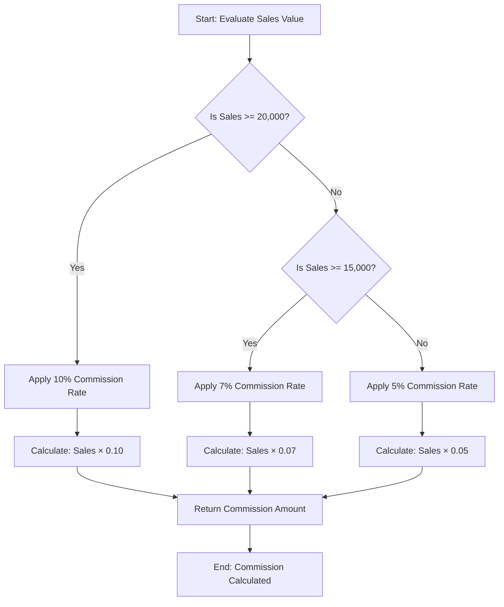
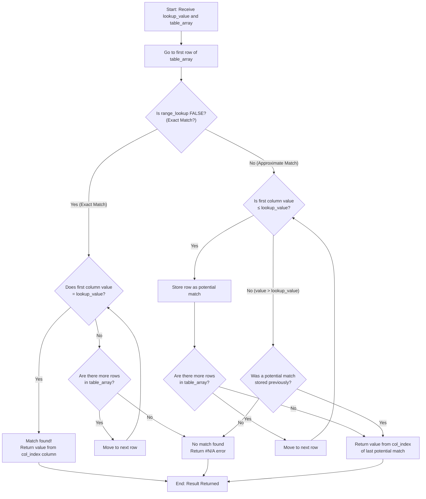

# IF and VLOOKUP Formulas

The **IF** function and **VLOOKUP** function are two of the most powerful tools in any spreadsheet user's toolkit. IF enables **conditional logic** — making decisions based on data values — so your spreadsheet can return different results depending on whether a condition is met. VLOOKUP performs **lookup operations** — searching for a value in a table and returning related information from another column — making it indispensable for cross-referencing data across different parts of a workbook.

Together, these functions are essential for data analysis and decision-making in spreadsheets. This chapter covers both functions in detail, with syntax references, practical examples using the [Acme Corp sample dataset](00-introduction.md#sample-dataset-acme-corp-quarterly-sales), and step-by-step evaluation traces so you can follow exactly how each formula is computed.

**Prerequisite:** This chapter assumes familiarity with basic formula concepts — cell references, operators, and the formula bar — introduced in [SUM and AVERAGE Formulas](02-formulas-sum-average.md).

---

## IF Function

The **IF** function evaluates a logical condition and returns one value when the condition is TRUE and a different value when the condition is FALSE. It is the foundation of conditional logic in spreadsheets, allowing you to automate decision-making directly within your data.

### Syntax

```text
=IF(condition, value_if_true, value_if_false)
```

### Parameters

| Parameter | Required | Description |
|-----------|----------|-------------|
| `condition` | Yes | A logical test that evaluates to TRUE or FALSE (e.g., `A1>100`, `B2="North"`) |
| `value_if_true` | Yes | The value returned if the condition evaluates to TRUE — can be a number, text (in quotes), cell reference, or another formula |
| `value_if_false` | Yes | The value returned if the condition evaluates to FALSE — can be a number, text (in quotes), cell reference, or another formula |

### Return Value

Returns `value_if_true` when the condition evaluates to TRUE; otherwise returns `value_if_false`.

### Comparison Operators

Conditions in the IF function are built using comparison operators. These operators compare two values and return TRUE or FALSE:

| Operator | Meaning | Example | Result (if A1 = 15000) |
|----------|---------|---------|------------------------|
| `=` | Equal to | `A1=15000` | TRUE |
| `>` | Greater than | `A1>15000` | FALSE |
| `<` | Less than | `A1<15000` | FALSE |
| `>=` | Greater than or equal to | `A1>=15000` | TRUE |
| `<=` | Less than or equal to | `A1<=15000` | TRUE |
| `<>` | Not equal to | `A1<>15000` | FALSE |

**Tip:** Pay careful attention to the difference between `>` (strictly greater than) and `>=` (greater than or equal to). This distinction frequently determines whether boundary values are included or excluded.

---

### Practical Example: Sales Performance Rating

**Scenario:** Rate each employee's Q1 sales as "Above Target" or "Below Target" based on a quarterly sales target of $15,000. An employee must exceed $15,000 (strictly greater than) to be rated "Above Target."

Using the Acme Corp dataset from the [Introduction](00-introduction.md#the-data), the data and formulas in the spreadsheet look like this:

| | A (Employee) | B (Region) | C (Q1 Sales) | H (Rating) |
|---|---|---|---|---|
| 1 | Employee | Region | Q1 Sales | Rating |
| 2 | Alice | North | 15000 | `=IF(C2>15000,"Above Target","Below Target")` |
| 3 | Bob | South | 12000 | `=IF(C3>15000,"Above Target","Below Target")` |
| 4 | Carol | East | 20000 | `=IF(C4>15000,"Above Target","Below Target")` |
| 5 | Dave | West | 11000 | `=IF(C5>15000,"Above Target","Below Target")` |
| 6 | Eve | North | 18000 | `=IF(C6>15000,"Above Target","Below Target")` |

**Formula in cell H2:**

```text
=IF(C2>15000,"Above Target","Below Target")
```

This formula checks whether the Q1 Sales value in column C is strictly greater than 15000. If so, it returns the text "Above Target"; otherwise, it returns "Below Target." The same formula is applied in cells H3 through H6, with the cell reference adjusting for each row.

**Results:**

| Employee | Q1 Sales | Rating |
|----------|----------|--------|
| Alice | 15000 | Below Target |
| Bob | 12000 | Below Target |
| Carol | 20000 | Above Target |
| Dave | 11000 | Below Target |
| Eve | 18000 | Above Target |

**Note:** Alice's Q1 Sales of 15000 results in "Below Target" because the condition uses `>` (strictly greater than), not `>=` (greater than or equal to). Since 15000 is not greater than 15000, the condition evaluates to FALSE. If the requirement were "at or above target," the formula would use `>=` instead: `=IF(C2>=15000,"Above Target","Below Target")`.

---

### Nested IF: Tiered Commission Calculation

When a decision involves more than two possible outcomes, you can nest one IF function inside another. A **nested IF** uses an IF function as the `value_if_false` (or `value_if_true`) argument of an outer IF, creating a chain of conditions that are evaluated in sequence.

**Scenario:** Calculate commission amounts based on Q1 Sales using a tiered commission structure:

| Sales Threshold | Commission Rate |
|-----------------|-----------------|
| Sales ≥ $20,000 | 10% |
| Sales ≥ $15,000 | 7% |
| Sales < $15,000 | 5% |

**Formula:**

```text
=IF(C2>=20000, C2*0.10, IF(C2>=15000, C2*0.07, C2*0.05))
```

This formula works as follows:

1. **First check:** Is `C2 >= 20000`? If yes, return `C2 * 0.10` (10% commission).
2. **Second check (only reached if the first check is FALSE):** Is `C2 >= 15000`? If yes, return `C2 * 0.07` (7% commission).
3. **Default (only reached if both checks are FALSE):** Return `C2 * 0.05` (5% commission).

**Results:**

| Employee | Q1 Sales | Commission Rate | Commission Amount |
|----------|----------|-----------------|-------------------|
| Alice | 15000 | 7% | 1050 |
| Bob | 12000 | 5% | 600 |
| Carol | 20000 | 10% | 2000 |
| Dave | 11000 | 5% | 550 |
| Eve | 18000 | 7% | 1260 |

**Calculation verification:**

- **Alice:** 15000 ≥ 20000? No → 15000 ≥ 15000? Yes → 15000 × 0.07 = **1050** ✓
- **Bob:** 12000 ≥ 20000? No → 12000 ≥ 15000? No → 12000 × 0.05 = **600** ✓
- **Carol:** 20000 ≥ 20000? Yes → 20000 × 0.10 = **2000** ✓
- **Dave:** 11000 ≥ 20000? No → 11000 ≥ 15000? No → 11000 × 0.05 = **550** ✓
- **Eve:** 18000 ≥ 20000? No → 18000 ≥ 15000? Yes → 18000 × 0.07 = **1260** ✓

**Tip:** When nesting IFs, evaluate conditions from the most restrictive (largest threshold) to the least restrictive. This ensures that each condition is only reached when all higher thresholds have been ruled out.

---

### Combining IF with AND/OR

The IF function becomes even more powerful when combined with the logical functions AND and OR, which allow you to test multiple conditions simultaneously.

#### IF with AND

The **AND** function returns TRUE only when **all** of its conditions are TRUE. Use AND inside IF when you need every condition to be satisfied.

**Syntax:**

```text
=IF(AND(condition1, condition2), value_if_true, value_if_false)
```

**Example:** Flag employees who are in the "North" region **and** have Q1 sales above $15,000:

```text
=IF(AND(B2="North", C2>15000), "Top North", "Other")
```

**Results:**

| Employee | Region | Q1 Sales | AND Result | IF Result |
|----------|--------|----------|------------|-----------|
| Alice | North | 15000 | AND(TRUE, FALSE) = FALSE | Other |
| Bob | South | 12000 | AND(FALSE, FALSE) = FALSE | Other |
| Carol | East | 20000 | AND(FALSE, TRUE) = FALSE | Other |
| Dave | West | 11000 | AND(FALSE, FALSE) = FALSE | Other |
| Eve | North | 18000 | AND(TRUE, TRUE) = TRUE | Top North |

**Explanation:** Only Eve meets both conditions — she is in the North region (TRUE) and her Q1 sales of 18000 exceed 15000 (TRUE). Alice is in North (TRUE) but her sales of 15000 are not strictly greater than 15000 (FALSE), so AND returns FALSE.

#### IF with OR

The **OR** function returns TRUE when **at least one** of its conditions is TRUE. Use OR inside IF when satisfying any single condition is sufficient.

**Syntax:**

```text
=IF(OR(condition1, condition2), value_if_true, value_if_false)
```

**Example:** Flag employees who are in the "North" region **or** have Q1 sales above $18,000:

```text
=IF(OR(B2="North", C2>18000), "Flagged", "Not Flagged")
```

**Results:**

| Employee | Region | Q1 Sales | OR Result | IF Result |
|----------|--------|----------|-----------|-----------|
| Alice | North | 15000 | OR(TRUE, FALSE) = TRUE | Flagged |
| Bob | South | 12000 | OR(FALSE, FALSE) = FALSE | Not Flagged |
| Carol | East | 20000 | OR(FALSE, TRUE) = TRUE | Flagged |
| Dave | West | 11000 | OR(FALSE, FALSE) = FALSE | Not Flagged |
| Eve | North | 18000 | OR(TRUE, FALSE) = TRUE | Flagged |

**Explanation:** Alice is flagged because she is in North (TRUE), even though her sales do not exceed 18000. Carol is flagged because her sales of 20000 exceed 18000 (TRUE), even though she is not in North. Eve is flagged because she is in North (TRUE). Note that Eve's Q1 sales of 18000 are not strictly greater than 18000, so only her region condition is TRUE — but OR only needs one TRUE condition.

---

### Step-by-Step: IF Evaluation Trace

This section walks through the nested IF commission formula `=IF(C2>=20000, C2*0.10, IF(C2>=15000, C2*0.07, C2*0.05))` for each employee, showing every stage of evaluation.

**Employee: Alice (C2 = 15000)**

1. **Evaluate outer IF condition:** Is C2 >= 20000? → Is 15000 >= 20000? → **FALSE**
2. **Proceed to value_if_false:** This is the inner IF: `IF(C2>=15000, C2*0.07, C2*0.05)`
3. **Evaluate inner IF condition:** Is C2 >= 15000? → Is 15000 >= 15000? → **TRUE**
4. **Return inner value_if_true:** C2 × 0.07 = 15000 × 0.07 = **1050**

**Employee: Carol (C4 = 20000)**

1. **Evaluate outer IF condition:** Is C4 >= 20000? → Is 20000 >= 20000? → **TRUE**
2. **Return outer value_if_true:** C4 × 0.10 = 20000 × 0.10 = **2000**

**Employee: Bob (C3 = 12000)**

1. **Evaluate outer IF condition:** Is C3 >= 20000? → Is 12000 >= 20000? → **FALSE**
2. **Proceed to value_if_false:** This is the inner IF: `IF(C3>=15000, C3*0.07, C3*0.05)`
3. **Evaluate inner IF condition:** Is C3 >= 15000? → Is 12000 >= 15000? → **FALSE**
4. **Return inner value_if_false:** C3 × 0.05 = 12000 × 0.05 = **600**

**Employee: Dave (C5 = 11000)**

1. **Evaluate outer IF condition:** Is C5 >= 20000? → Is 11000 >= 20000? → **FALSE**
2. **Proceed to value_if_false:** This is the inner IF: `IF(C5>=15000, C5*0.07, C5*0.05)`
3. **Evaluate inner IF condition:** Is C5 >= 15000? → Is 11000 >= 15000? → **FALSE**
4. **Return inner value_if_false:** C5 × 0.05 = 11000 × 0.05 = **550**

**Employee: Eve (C6 = 18000)**

1. **Evaluate outer IF condition:** Is C6 >= 20000? → Is 18000 >= 20000? → **FALSE**
2. **Proceed to value_if_false:** This is the inner IF: `IF(C6>=15000, C6*0.07, C6*0.05)`
3. **Evaluate inner IF condition:** Is C6 >= 15000? → Is 18000 >= 15000? → **TRUE**
4. **Return inner value_if_true:** C6 × 0.07 = 18000 × 0.07 = **1260**

---

### IF Evaluation Logic — Flowchart

The following diagram visualizes the evaluation logic of the nested IF formula used for tiered commission calculation. The spreadsheet evaluates each condition in order, stopping at the first TRUE result.



**How to read this diagram:**

1. Start at the top with the employee's sales value.
2. The first diamond checks the highest threshold (≥ 20,000). If TRUE, the 10% rate is applied immediately.
3. If FALSE, the flow continues to the next diamond (≥ 15,000). If TRUE, the 7% rate is applied.
4. If both checks are FALSE, the default 5% rate is applied.
5. All paths converge at the result — the calculated commission amount.

This flowchart directly maps to the nested IF formula structure: the outer IF handles the first decision, and the inner IF (the `value_if_false` of the outer IF) handles the second decision.

---

## VLOOKUP Function

The **VLOOKUP** function (Vertical Lookup) searches for a value in the **first column** of a table and returns a value from another column in the same row. It is one of the most widely used lookup functions in spreadsheets, enabling you to cross-reference data between different tables or sections of a workbook.

### Syntax

```text
=VLOOKUP(lookup_value, table_array, col_index, [range_lookup])
```

### Parameters

| Parameter | Required | Description |
|-----------|----------|-------------|
| `lookup_value` | Yes | The value to search for in the first column of `table_array`. Can be a number, text, cell reference, or the result of another formula. |
| `table_array` | Yes | The range of cells containing the data (the lookup table). VLOOKUP always searches the **first column** of this range. |
| `col_index` | Yes | The column number within `table_array` from which to return a value. 1 = first column, 2 = second column, and so on. |
| `range_lookup` | No | Determines the match type. **FALSE** = exact match (recommended for most use cases). **TRUE** = approximate match (the first column must be sorted in ascending order). If omitted, defaults to TRUE. |

### Return Value

The value from the column specified by `col_index` in the row where `lookup_value` is found in the first column of `table_array`.

### Important Notes

- VLOOKUP always searches the **first column** of `table_array`. The value you want to return must be in a column **to the right** of the search column within the specified range.
- When using **exact match** (FALSE), if the lookup value is not found, VLOOKUP returns a `#N/A` error.
- When using **approximate match** (TRUE), the first column of `table_array` **must be sorted in ascending order**. VLOOKUP finds the largest value that is less than or equal to the lookup value.
- VLOOKUP is **case-insensitive** — "carol", "Carol", and "CAROL" are treated as identical when searching.

---

### Practical Example: Looking Up Employee Region

**Scenario:** Given an employee name, look up their region from the Acme Corp dataset.

The lookup table is the Acme Corp dataset from the [Introduction](00-introduction.md#the-data), laid out as follows:

| | A (Employee) | B (Region) | C (Q1 Sales) | D (Q2 Sales) | E (Q3 Sales) | F (Q4 Sales) | G (Product) |
|---|---|---|---|---|---|---|---|
| 1 | Employee | Region | Q1 Sales | Q2 Sales | Q3 Sales | Q4 Sales | Product |
| 2 | Alice | North | 15000 | 18000 | 22000 | 19000 | Widget A |
| 3 | Bob | South | 12000 | 14000 | 13000 | 16000 | Widget B |
| 4 | Carol | East | 20000 | 17000 | 25000 | 23000 | Widget A |
| 5 | Dave | West | 11000 | 13000 | 15000 | 14000 | Widget C |
| 6 | Eve | North | 18000 | 21000 | 19000 | 22000 | Widget B |

**Formula:**

```text
=VLOOKUP("Carol", A2:G6, 2, FALSE)
```

**Parameter breakdown:**

- `lookup_value`: "Carol" — the employee name to search for
- `table_array`: A2:G6 — the data range (excluding the header row)
- `col_index`: 2 — return the value from the 2nd column (Region)
- `range_lookup`: FALSE — use exact match

**Result:** "East"

VLOOKUP searches column A for "Carol", finds it in row 4, and returns the value from column 2 (Region) of that row, which is "East".

**Additional lookup examples:**

| Lookup Formula | What It Returns | Result |
|----------------|-----------------|--------|
| `=VLOOKUP("Alice", A2:G6, 2, FALSE)` | Alice's Region (column 2) | North |
| `=VLOOKUP("Bob", A2:G6, 3, FALSE)` | Bob's Q1 Sales (column 3) | 12000 |
| `=VLOOKUP("Eve", A2:G6, 7, FALSE)` | Eve's Product (column 7) | Widget B |
| `=VLOOKUP("Dave", A2:G6, 6, FALSE)` | Dave's Q4 Sales (column 6) | 14000 |

**Tip:** Use **absolute references** (`$A$2:$G$6`) for the `table_array` when copying the VLOOKUP formula to multiple cells. This prevents the range from shifting as the formula is copied down or across.

---

### VLOOKUP with Approximate Match: Tax Bracket Lookup

**Scenario:** Determine the applicable tax rate for a given annual income using a tax bracket table. Tax brackets assign rates based on income thresholds — the rate applies to the bracket that the income falls into.

**Tax Bracket Table** (column A must be sorted in ascending order for approximate match):

| | A (Income Threshold) | B (Tax Rate) |
|---|---|---|
| 1 | Income Threshold | Tax Rate |
| 2 | 0 | 10% |
| 3 | 10000 | 15% |
| 4 | 40000 | 22% |
| 5 | 85000 | 24% |
| 6 | 165000 | 32% |

**Formula:**

```text
=VLOOKUP(55000, A2:B6, 2, TRUE)
```

**Result:** 22%

**How approximate match works:** With `range_lookup` set to TRUE, VLOOKUP scans down the first column looking for the largest value that is **less than or equal to** the lookup value. For an income of $55,000:

- 0 ≤ 55,000 → potential match (10%)
- 10,000 ≤ 55,000 → potential match (15%)
- 40,000 ≤ 55,000 → potential match (22%)
- 85,000 ≤ 55,000? → **No** — 85,000 exceeds 55,000, so the search stops

The last valid match was at the 40,000 threshold, so VLOOKUP returns the corresponding tax rate: **22%**.

**Additional approximate match examples:**

| Income | Formula | Result | Explanation |
|--------|---------|--------|-------------|
| 5000 | `=VLOOKUP(5000, A2:B6, 2, TRUE)` | 10% | Falls in the 0–9,999 bracket |
| 10000 | `=VLOOKUP(10000, A2:B6, 2, TRUE)` | 15% | Exactly matches the 10,000 threshold |
| 100000 | `=VLOOKUP(100000, A2:B6, 2, TRUE)` | 24% | Falls in the 85,000–164,999 bracket |
| 200000 | `=VLOOKUP(200000, A2:B6, 2, TRUE)` | 32% | Falls in the 165,000+ bracket |

**Warning:** When using approximate match (TRUE), the first column of the table **must be sorted in ascending order**. If the data is not sorted, VLOOKUP may return incorrect results without any error message, making the mistake difficult to detect.

---

### Step-by-Step: VLOOKUP Search Process

This section traces the internal search process for both exact match and approximate match VLOOKUP calls.

#### Exact Match Trace

**Formula:** `=VLOOKUP("Carol", A2:G6, 2, FALSE)`

| Step | Row Examined | First Column Value | Match Check | Action |
|------|-------------|-------------------|-------------|--------|
| 1 | A2 | Alice | "Alice" = "Carol"? **No** | Move to next row |
| 2 | A3 | Bob | "Bob" = "Carol"? **No** | Move to next row |
| 3 | A4 | Carol | "Carol" = "Carol"? **Yes** | Match found! |
| 4 | — | — | — | Return column 2 value from row 4 |
| 5 | — | — | — | **Result: "East"** |

**Process summary:** VLOOKUP examines each row in the first column of the table, comparing it to the lookup value "Carol". When it finds an exact match in row A4, it returns the value from column 2 (Region) of that row, which is "East".

#### Approximate Match Trace

**Formula:** `=VLOOKUP(55000, A2:B6, 2, TRUE)`

| Step | Row Examined | First Column Value | Comparison | Action |
|------|-------------|-------------------|------------|--------|
| 1 | A2 | 0 | 0 ≤ 55000? **Yes** | Store as potential match (10%). Move to next row. |
| 2 | A3 | 10000 | 10000 ≤ 55000? **Yes** | Update potential match (15%). Move to next row. |
| 3 | A4 | 40000 | 40000 ≤ 55000? **Yes** | Update potential match (22%). Move to next row. |
| 4 | A5 | 85000 | 85000 ≤ 55000? **No** | Stop searching. |
| 5 | — | — | — | Return last stored potential match from column 2: **22%** |

**Process summary:** With approximate match, VLOOKUP scans down the sorted first column, keeping track of the last row where the value was ≤ the lookup value. When it encounters a value that exceeds the lookup value (85000 > 55000), it stops and returns the result from the last valid match (the row containing 40000, returning 22%).

---

### VLOOKUP Search Process — Flowchart

The following diagram visualizes how VLOOKUP searches for a value, covering both exact match and approximate match paths.



**Key takeaway:** The exact match path (left side) checks every row for equality and returns `#N/A` if no match is found. The approximate match path (right side) progressively narrows to the largest value ≤ the lookup value, which is why the first column must be sorted in ascending order.

---

## Common Errors

This section covers the most common errors encountered when working with IF and VLOOKUP, along with their causes and resolutions.

### #N/A Error (VLOOKUP)

The `#N/A` error is the most common VLOOKUP error and indicates that the lookup value was not found.

**Cause 1:** The lookup value does not exist in the first column of the table array when using exact match (FALSE).

**Resolution:** Verify that the value you are searching for actually exists in the lookup column. Check for:
- **Trailing spaces:** "Carol " (with a trailing space) does not match "Carol". Use the TRIM function to remove extra spaces: `=VLOOKUP(TRIM(H1), A2:G6, 2, FALSE)`.
- **Case differences:** VLOOKUP is case-insensitive, so "carol" matches "Carol". This is typically not the cause of `#N/A` errors.
- **Data type mismatch:** The number 123 (numeric) does not match "123" (text). Ensure both values are the same data type.

**Cause 2:** The `col_index` value exceeds the number of columns in `table_array`.

**Resolution:** Count the columns in your table array and ensure `col_index` does not exceed this count. For example, if `table_array` is A2:G6 (7 columns), `col_index` must be between 1 and 7.

### #VALUE! Error

**Cause:** An argument has the wrong data type. For example, passing text where a number is expected in the `col_index` parameter, or providing a non-logical expression as the condition in an IF function.

**Resolution:** Verify that each argument matches the expected data type:
- IF: The condition must evaluate to TRUE or FALSE.
- VLOOKUP: `col_index` must be a positive integer; `table_array` must be a valid cell range.

### Nested IF Complexity

**Issue:** Deeply nested IF formulas (three or more levels) become difficult to read, understand, and maintain. Each additional nesting level increases the risk of errors in matching parentheses and tracking logic flow.

**Resolution:**
- **Use VLOOKUP with a reference table** instead of nested IFs. For the tiered commission example, create a lookup table of thresholds and rates, then use VLOOKUP with approximate match — this is cleaner and easier to update.
- **Use the IFS function** (available in newer spreadsheet versions): `=IFS(C2>=20000, C2*0.10, C2>=15000, C2*0.07, TRUE, C2*0.05)`. The IFS function evaluates multiple conditions in sequence without nesting.
- **Limit nesting to 2–3 levels** at most. If more are needed, restructure the logic using helper columns or lookup tables.

### VLOOKUP Left Limitation

**Issue:** VLOOKUP can only return values from columns **to the right** of the search column. It cannot look left — if the data you need is in a column to the left of the lookup column, VLOOKUP cannot retrieve it directly.

**Resolution:**
- **Rearrange your data** so the search column is the leftmost column in the table array.
- **Use INDEX/MATCH combination** as a more flexible alternative: `=INDEX(return_range, MATCH(lookup_value, lookup_range, 0))`. INDEX/MATCH can look in any direction and is not restricted to leftward-only returns.

### Sorted Data Requirement for Approximate Match

**Issue:** When using approximate match (TRUE or omitting `range_lookup`), VLOOKUP assumes the first column is sorted in ascending order. If the data is not sorted, VLOOKUP may return **incorrect results without any error message**, making the problem very difficult to detect.

**Resolution:**
- Always sort the lookup table by the first column in ascending order before using approximate match.
- When in doubt, use **FALSE** (exact match) instead of TRUE. Exact match does not require sorted data and is the safer default.

For a complete reference of all spreadsheet error codes — including `#VALUE!`, `#N/A`, `#REF!`, `#DIV/0!`, and `#NAME?` — see the [Quick Reference](09-quick-reference.md) chapter.

---

## Tips

The following tips will help you use IF and VLOOKUP more effectively and avoid common pitfalls.

1. **Default to exact match for VLOOKUP.** Always use FALSE for the `range_lookup` parameter unless you specifically need approximate match behavior (such as looking up values in a tiered bracket table). Exact match is more predictable and does not require sorted data.

2. **Use absolute references for VLOOKUP table arrays.** When entering a VLOOKUP formula that will be copied to other cells, lock the `table_array` with dollar signs (e.g., `$A$2:$G$6`). This prevents the range from shifting as the formula is copied, ensuring every copy looks up from the same table.

3. **Test IF formulas with known values.** Before applying an IF formula to a large dataset, test it with a few known values where you can predict the correct outcome. This helps catch logic errors (such as using `>` instead of `>=`) early.

4. **Evaluate nested IF conditions from most restrictive to least restrictive.** In the tiered commission example, the formula checks ≥ 20000 first (highest threshold), then ≥ 15000, then defaults to the lowest tier. This ordering ensures that higher thresholds are not accidentally bypassed by a lower threshold match.

5. **Wrap VLOOKUP with IFERROR for graceful error handling.** Instead of displaying a raw `#N/A` error when a lookup value is not found, use IFERROR to provide a user-friendly message:

   ```text
   =IFERROR(VLOOKUP("Frank", A2:G6, 2, FALSE), "Employee Not Found")
   ```

   This formula returns "Employee Not Found" instead of `#N/A` if "Frank" is not in the lookup table.

6. **Combine IF and VLOOKUP for powerful data analysis.** You can use VLOOKUP inside an IF condition, or use IF to choose between different VLOOKUP calls. For example, to look up a value only if a cell is not empty:

   ```text
   =IF(H1="", "", VLOOKUP(H1, A2:G6, 2, FALSE))
   ```

   This formula returns an empty string if H1 is blank, and performs the lookup only when H1 contains a value.

7. **Consider INDEX/MATCH as a VLOOKUP alternative.** For advanced users, the INDEX/MATCH combination offers more flexibility than VLOOKUP — it can look left, handle column insertions without breaking, and is generally faster on very large datasets.

---

## Navigation

| | | |
|---|---|---|
| [← SUM and AVERAGE Formulas](02-formulas-sum-average.md) | [↑ Documentation Index](../README.md) | [Pivot Tables →](04-pivot-tables.md) |

