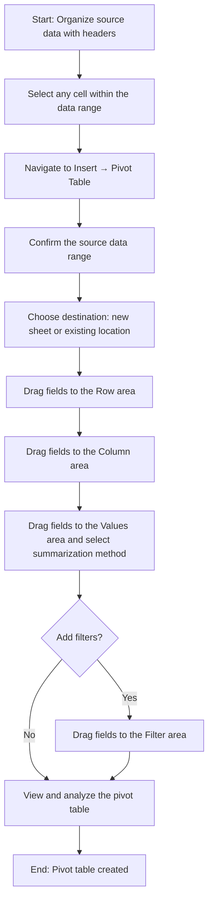

# Pivot Tables

Pivot tables are one of the most powerful features available in Calc for summarizing, grouping, and analyzing large datasets. Rather than writing complex formulas to aggregate data manually, a pivot table lets you reorganize and summarize information interactively — without modifying the original source data. You simply drag fields into different areas to instantly see totals, counts, averages, and other summaries from multiple perspectives.

This chapter covers everything you need to know about pivot tables: what they are, how to create them step by step, how to configure fields and summarization methods, and how to apply grouping, filtering, and sorting. All examples use the Acme Corp quarterly sales dataset introduced in the [Introduction](00-introduction.md).

---

## What Are Pivot Tables?

A pivot table takes a flat data range — such as a table of sales records — and transforms it into a dynamic, interactive summary. The term "pivot" refers to the ability to rotate or rearrange data so you can view it from different angles without altering the underlying dataset. Instead of writing formulas, you configure a pivot table by dragging field names into designated areas, and the pivot table engine handles all the calculations automatically.

### Common Use Cases

Pivot tables excel at answering questions that require grouping and aggregation:

- **Summarizing sales by region, product, or time period** — instantly see total revenue broken down by any category
- **Counting occurrences of categories** — determine how many employees, transactions, or products fall into each group
- **Calculating averages, maximums, or minimums across groups** — compare performance metrics across departments, regions, or time periods
- **Cross-tabulating data** — create a matrix that shows values at the intersection of two categories (e.g., product sales by region)

### The Four Field Areas

Every pivot table is built around four configurable field areas. Understanding these areas is the key to building effective pivot tables:

| Field Area | Purpose | Example |
|------------|---------|---------|
| **Row Fields** | Categories displayed as rows in the pivot table. Each unique value becomes a separate row. | Drag "Region" here → rows for North, South, East, West |
| **Column Fields** | Categories displayed as column headers. Each unique value becomes a separate column. Used for cross-tabulation. | Drag "Product" here → columns for Widget A, Widget B, Widget C |
| **Value Fields** | The data being summarized (aggregated). You choose the summarization method: Sum, Count, Average, Max, or Min. | Drag "Q1 Sales" here → shows the sum (or other aggregate) of Q1 Sales for each row/column combination |
| **Filter Fields** | Fields used to filter the entire pivot table. A dropdown appears at the top, letting you restrict the view to specific values. | Drag "Employee" here → a dropdown lets you filter the table to show only Alice's data, or only Bob's, etc. |

**How it works conceptually:** Row Fields and Column Fields define the structure (the "skeleton") of the pivot table. Value Fields provide the numbers that fill in the cells. Filter Fields act as global controls that narrow the entire view.

---

## Pivot Table Creation Workflow

The following diagram illustrates the complete process for creating a pivot table, from preparing your source data to analyzing the finished result.

Each step in this workflow is explained in detail in the sections that follow.

---

## Creating a Pivot Table: Step-by-Step

This section walks through creating a pivot table using the Acme Corp quarterly sales dataset. If you have not set up this dataset in your spreadsheet yet, refer to the [Introduction](00-introduction.md) for the complete data and setup instructions.

### Source Data

The pivot table will be built from the following data, located in cells A1:G6:

| | A (Employee) | B (Region) | C (Q1 Sales) | D (Q2 Sales) | E (Q3 Sales) | F (Q4 Sales) | G (Product) |
|---|---|---|---|---|---|---|---|
| **1** | Employee | Region | Q1 Sales | Q2 Sales | Q3 Sales | Q4 Sales | Product |
| **2** | Alice | North | 15000 | 18000 | 22000 | 19000 | Widget A |
| **3** | Bob | South | 12000 | 14000 | 13000 | 16000 | Widget B |
| **4** | Carol | East | 20000 | 17000 | 25000 | 23000 | Widget A |
| **5** | Dave | West | 11000 | 13000 | 15000 | 14000 | Widget C |
| **6** | Eve | North | 18000 | 21000 | 19000 | 22000 | Widget B |

### Steps

1. **Click any cell within the data range** — for example, click cell A1. Calc will automatically detect the contiguous data range (A1:G6) that includes your headers and all data rows.

2. **Navigate to Insert → Pivot Table** — open the Insert menu from the menu bar and select "Pivot Table." Some applications may label this option as "PivotTable" or "DataPilot."

3. **Confirm the source data range** — a dialog appears showing the detected data range. Verify that it reads `A1:G6` (or `$A$1:$G$6` with absolute references). If you defined a named range for your data, you can select it here instead. Adjust the range if it does not cover all your data.

4. **Choose the destination** — select where the pivot table should be placed. The recommended option is "New Sheet," which creates a dedicated worksheet for the pivot table, keeping your source data separate from the analysis.

5. **The pivot table layout dialog appears** — you will see a list of all available fields (Employee, Region, Q1 Sales, Q2 Sales, Q3 Sales, Q4 Sales, Product) on one side, and the four field areas (Row, Column, Values, Filter) on the other. You are now ready to configure the pivot table by dragging fields into the desired areas.

---

## Configuring Pivot Table Fields

Once the pivot table layout dialog is open, configure the analysis by dragging fields into the four areas. The configuration determines what your pivot table displays and how data is summarized.

### Row Fields

Drag the field whose unique values should appear as rows in the pivot table.

**Example:** Drag **"Region"** to the Row area.

**Result:** Each unique region value becomes a separate row:

| Region |
|--------|
| North  |
| South  |
| East   |
| West   |

### Column Fields

Drag a field to the Column area to create a cross-tabulation — each unique value in this field becomes a column header.

**Example:** Drag **"Product"** to the Column area.

**Result:** Each product becomes a column header, creating a Region × Product matrix:

| Region \ Product | Widget A | Widget B | Widget C |
|------------------|----------|----------|----------|

### Value Fields

Drag a numeric field to the Values area to populate the pivot table with summarized data. The default summarization method is typically Sum.

**Example:** Drag **"Q1 Sales"** to the Values area.

**Result:** The pivot table shows the sum of Q1 Sales for each Region × Product combination:

| Region | Widget A | Widget B | Widget C | Grand Total |
|--------|----------|----------|----------|-------------|
| North  | 15000    | 18000    | —        | 33000       |
| South  | —        | 12000    | —        | 12000       |
| East   | 20000    | —        | —        | 20000       |
| West   | —        | —        | 11000    | 11000       |
| **Grand Total** | **35000** | **30000** | **11000** | **76000** |

Cells marked with "—" indicate that no data exists for that particular Region × Product combination (for example, no one in the South region sells Widget A).

### Filter Fields

Drag a field to the Filter area to add a global dropdown filter at the top of the pivot table.

**Example:** Drag **"Employee"** to the Filter area.

**Result:** A dropdown control appears above the pivot table. By default, it shows "All," meaning data for all employees is included. You can select a specific employee (e.g., "Alice") to filter the entire pivot table to show only that employee's data.

When filtered to "Alice" only:

| Region | Widget A | Widget B | Widget C | Grand Total |
|--------|----------|----------|----------|-------------|
| North  | 15000    | —        | —        | 15000       |

---

## Summarization Methods

The Values area determines not only which data to display but also how it is aggregated. By default, numeric fields are summed, but you can change the summarization method to suit your analysis needs.

### Available Methods

The following summarization methods are available for Value Fields. Each example shows the result of summarizing Q1 Sales by Region (with Region as the Row Field):

| Method | Description | North | South | East | West |
|--------|-------------|-------|-------|------|------|
| **Sum** | Adds all values in the group | 33000 | 12000 | 20000 | 11000 |
| **Count** | Counts the number of entries in the group | 2 | 1 | 1 | 1 |
| **Average** | Calculates the arithmetic mean of the group | 16500 | 12000 | 20000 | 11000 |
| **Max** | Returns the highest value in the group | 18000 | 12000 | 20000 | 11000 |
| **Min** | Returns the lowest value in the group | 15000 | 12000 | 20000 | 11000 |

### Verification of Calculations

All values above are derived from the Acme Corp dataset:

- **North Q1 Sales:** Alice (15000) + Eve (18000) = **33000** (Sum), **2** entries (Count), 33000 ÷ 2 = **16500** (Average), max(15000, 18000) = **18000** (Max), min(15000, 18000) = **15000** (Min)
- **South Q1 Sales:** Bob (12000) = **12000** (Sum), **1** entry (Count), 12000 ÷ 1 = **12000** (Average, Max, Min are all the same for a single entry)
- **East Q1 Sales:** Carol (20000) = **20000** (Sum, Average, Max, Min all equal for a single entry), **1** entry (Count)
- **West Q1 Sales:** Dave (11000) = **11000** (Sum, Average, Max, Min all equal for a single entry), **1** entry (Count)

### How to Change the Summarization Method

To change how a value field is summarized:

1. Right-click on any value cell within the pivot table
2. Select **"Value Field Settings"** (or "Field Settings" depending on your application)
3. In the dialog, choose the desired function: Sum, Count, Average, Max, Min, Product, Count Numbers, StdDev, StdDevP, Var, or VarP
4. Click **OK** to apply the change

The pivot table updates immediately to reflect the new summarization method.

---

## Grouping Data

Grouping lets you combine individual row or column values into broader categories. This is useful when you want to analyze data at a higher level without modifying the source data.

### Grouping by Category

You can manually group row or column items into custom categories.

**Example:** Group the four regions into two divisions — "North/South Division" and "East/West Division."

**Steps:**

1. In the pivot table, select the row labels you want to group (e.g., select both "North" and "South")
2. Right-click and choose **"Group"**
3. The selected items are combined under a new group label (e.g., "Group1")
4. Rename "Group1" to **"North/South Division"**
5. Repeat for "East" and "West," renaming the group to **"East/West Division"**

**Grouped Pivot Table Result (Q1 Sales):**

| Division | Region | Q1 Sales (Sum) |
|----------|--------|-----------------|
| **North/South Division** | | **45000** |
| | North | 33000 |
| | South | 12000 |
| **East/West Division** | | **31000** |
| | East | 20000 |
| | West | 11000 |
| **Grand Total** | | **76000** |

**Verification:**
- North/South Division: 33000 + 12000 = **45000**
- East/West Division: 20000 + 11000 = **31000**
- Grand Total: 45000 + 31000 = **76000**

### Grouping by Date

When your source data contains date fields, pivot tables offer automatic date grouping options. While the Acme Corp dataset uses quarterly column labels rather than individual dates, date grouping is commonly used when data includes a date column (e.g., transaction dates).

**How date grouping works:**

1. Add the date field to the Row area
2. Right-click any date value in the pivot table
3. Select **"Group"**
4. Choose the grouping interval: Days, Months, Quarters, or Years
5. The pivot table automatically groups individual dates into the selected periods

**Example:** If you had a "Transaction Date" column with daily entries, grouping by "Months" would consolidate all January transactions into a single "January" row, all February transactions into "February," and so on.

---

## Filtering and Sorting

Pivot tables provide built-in tools for narrowing and reordering the data displayed, allowing you to focus on the most relevant information.

### Filtering

There are two main ways to filter pivot table data:

**1. Using the Filter Field Area (Global Filter)**

If you placed a field in the Filter area (as described in the Configuring Fields section), a dropdown control appears at the top of the pivot table. Select a specific value from the dropdown to filter the entire table.

**Example:** With "Employee" in the Filter area, select **"Carol"** from the dropdown.

**Filtered result (Q1 Sales by Region):**

| Region | Widget A | Grand Total |
|--------|----------|-------------|
| East   | 20000    | 20000       |
| **Grand Total** | **20000** | **20000** |

Only Carol's data appears because Carol is the only employee assigned to the East region selling Widget A.

**2. Using Row or Column Label Filters**

Dropdown arrows appear on the row field headers and column field headers within the pivot table. Click these arrows to access filtering options for that specific field.

**Example:** Click the dropdown arrow on the "Product" column header and uncheck "Widget B" and "Widget C," leaving only "Widget A" checked.

**Filtered result (Q1 Sales, Widget A only):**

| Region | Widget A |
|--------|----------|
| North  | 15000    |
| East   | 20000    |
| **Grand Total** | **35000** |

Only regions with Widget A sales appear: North (Alice, 15000) and East (Carol, 20000). The total is 15000 + 20000 = **35000**.

### Sorting

Pivot table rows and columns can be sorted to highlight patterns in your data:

**Sort by Label (Alphabetical)**

- Click the dropdown arrow on a row or column field header
- Select **"Sort A to Z"** for ascending alphabetical order, or **"Sort Z to A"** for descending order

**Example:** Sort regions alphabetically (A to Z): East, North, South, West.

**Sort by Value (Numerical)**

- Right-click a value in the pivot table
- Select **"Sort"** and choose ascending or descending order based on the value field

**Example:** Sort regions by Q1 Sales (highest first):

| Region | Q1 Sales (Sum) |
|--------|-----------------|
| North  | 33000           |
| East   | 20000           |
| South  | 12000           |
| West   | 11000           |

North has the highest Q1 Sales total (33000) and West has the lowest (11000).

---

## Refreshing Pivot Table Data

Pivot tables do **not** update automatically when the underlying source data changes. If you modify, add, or delete values in the original data range, you must manually refresh the pivot table to see the updated results.

### How to Refresh

1. **Right-click** anywhere inside the pivot table
2. Select **"Refresh"** (some applications label this "Update" or "Reload")
3. The pivot table recalculates all values based on the current source data

### When to Refresh

- **After editing source data** — if you changed any sales values, employee names, or other fields in the original data range, refresh to update the pivot table
- **Before presenting results** — always refresh pivot tables before sharing or reporting results, especially if other users may have modified the source data
- **After pasting new data** — if new data has been pasted into the source range, refresh to include it

### Expanding the Data Range

If new rows were added **below** the original data range (for example, a sixth employee was added in row 7), the pivot table may not automatically include the new rows. In this case:

1. Right-click the pivot table and select **"Pivot Table Options"** or **"Data Source"**
2. Update the source data range to include the new rows (e.g., change `A1:G6` to `A1:G7`)
3. Refresh the pivot table

**Tip:** To avoid manually expanding the range every time new data is added, define a **named range** that dynamically adjusts to the size of your data, or convert the data to a formal **table** (Insert → Table). When the source is a named range or table, the pivot table automatically includes newly added rows upon refresh.

---

## Practical Example: Sales Analysis by Region and Product

This section demonstrates a complete, end-to-end pivot table analysis using the Acme Corp dataset. Two pivot tables are built: one for regional product analysis and one for employee annual performance.

### Analysis 1: Q1 Sales by Region and Product

**Pivot Table Configuration:**

- **Row Fields:** Region
- **Column Fields:** Product
- **Value Fields:** Sum of Q1 Sales
- **Filter Fields:** None

**Result:**

| Region | Widget A | Widget B | Widget C | Grand Total |
|--------|----------|----------|----------|-------------|
| North  | 15000    | 18000    | —        | 33000       |
| South  | —        | 12000    | —        | 12000       |
| East   | 20000    | —        | —        | 20000       |
| West   | —        | —        | 11000    | 11000       |
| **Grand Total** | **35000** | **30000** | **11000** | **76000** |

**Verification of totals:**

- **Widget A total:** Alice/North (15000) + Carol/East (20000) = **35000**
- **Widget B total:** Bob/South (12000) + Eve/North (18000) = **30000**  *(Note: Bob is in South and Eve is in North)*
- **Widget C total:** Dave/West (11000) = **11000**
- **North total:** Alice/Widget A (15000) + Eve/Widget B (18000) = **33000**
- **South total:** Bob/Widget B (12000) = **12000**
- **East total:** Carol/Widget A (20000) = **20000**
- **West total:** Dave/Widget C (11000) = **11000**
- **Grand Total:** 35000 + 30000 + 11000 = **76000** (by product), also 33000 + 12000 + 20000 + 11000 = **76000** (by region)

**Key Insights from This Pivot Table:**

- Widget A generates the highest total Q1 revenue (35000), followed closely by Widget B (30000)
- The North region leads in Q1 sales (33000) due to having two employees
- Widget C is sold by only one employee in one region, resulting in the lowest product total (11000)

### Analysis 2: Annual Sales by Employee

**Pivot Table Configuration:**

- **Row Fields:** Employee
- **Value Fields:** Sum of Q1 Sales + Sum of Q2 Sales + Sum of Q3 Sales + Sum of Q4 Sales

To create this pivot table, drag all four quarterly sales fields (Q1 Sales, Q2 Sales, Q3 Sales, Q4 Sales) into the Values area. Each will be summed individually. Add a calculated "Total Annual Sales" by summing the four quarterly values for each employee.

**Result:**

| Employee | Q1 Sales | Q2 Sales | Q3 Sales | Q4 Sales | Total Annual Sales |
|----------|----------|----------|----------|----------|--------------------|
| Alice    | 15000    | 18000    | 22000    | 19000    | 74000              |
| Bob      | 12000    | 14000    | 13000    | 16000    | 55000              |
| Carol    | 20000    | 17000    | 25000    | 23000    | 85000              |
| Dave     | 11000    | 13000    | 15000    | 14000    | 53000              |
| Eve      | 18000    | 21000    | 19000    | 22000    | 80000              |
| **Grand Total** | **76000** | **83000** | **94000** | **94000** | **347000** |

**Verification of annual totals:**

- **Alice:** 15000 + 18000 + 22000 + 19000 = **74000**
- **Bob:** 12000 + 14000 + 13000 + 16000 = **55000**
- **Carol:** 20000 + 17000 + 25000 + 23000 = **85000**
- **Dave:** 11000 + 13000 + 15000 + 14000 = **53000**
- **Eve:** 18000 + 21000 + 19000 + 22000 = **80000**
- **Grand Total:** 74000 + 55000 + 85000 + 53000 + 80000 = **347000**

**Verification of quarterly totals:**

- **Q1 Total:** 15000 + 12000 + 20000 + 11000 + 18000 = **76000**
- **Q2 Total:** 18000 + 14000 + 17000 + 13000 + 21000 = **83000**
- **Q3 Total:** 22000 + 13000 + 25000 + 15000 + 19000 = **94000**
- **Q4 Total:** 19000 + 16000 + 23000 + 14000 + 22000 = **94000**

**Key Insights from This Pivot Table:**

- Carol is the top performer with annual sales of 85000
- Dave has the lowest annual sales at 53000
- Sales increase from Q1 (76000) to Q3 (94000), suggesting a seasonal growth trend
- Q3 and Q4 are tied at 94000, indicating a plateau in the second half of the year

**Next Step:** The output from these pivot tables — especially the quarterly trends and employee rankings — can be used directly as source data for creating charts. See [Charts](05-charts.md) for a guide on visualizing this data.

---

## Tips and Common Errors

### Tips for Effective Pivot Tables

- **Ensure source data has consistent headers** — pivot tables use the first row of the data range as field names. Missing or duplicate headers cause errors or unclear field labels.

- **Avoid blank rows or columns in source data** — blank rows can cause Calc to detect an incomplete range, resulting in missing data in your pivot table. Ensure every row has values in all columns (use a consistent placeholder like "N/A" for genuinely missing values).

- **Use named ranges for the source data** — defining a named range makes it easier to expand the data as new records are added. Named ranges also make the pivot table data source more readable.

- **Create multiple pivot tables from the same source** — you can build several pivot tables from the same dataset, each configured differently to answer different questions. For example, one pivot table for regional analysis and another for employee performance.

- **Copy results for static reporting** — if you need a snapshot of pivot table results that will not change, select the pivot table output, copy it, and use **Paste Special → Values Only** to paste a static copy on another sheet. This preserves the numbers without maintaining the dynamic pivot table link.

### Common Errors and How to Fix Them

- **Blank cells ("—") in pivot results** — a blank cell in a pivot table means no data exists for that particular combination of row and column values. This is not an error — it simply indicates that the combination does not appear in the source data. For example, no one in the South region sells Widget A, so that cell is blank.

- **Unexpected results or incorrect totals** — if the pivot table shows values you do not expect, check the source data for inconsistent category names. For example, "North" and "north" (different capitalization) are treated as two separate categories. Standardize your data before creating the pivot table.

- **Pivot table does not include new data** — if you added rows to the source data after creating the pivot table, the new rows may fall outside the original data range. Update the data source range (see the [Refreshing Pivot Table Data](#refreshing-pivot-table-data) section) and refresh.

- **Wrong summarization method** — if you expected sums but the pivot table shows counts (or vice versa), the wrong summarization method may be selected. Right-click the value field, select **"Value Field Settings,"** and choose the correct function.

- **Duplicate field entries** — if the same field name appears in the field list more than once, it usually means the source data has duplicate column headers. Ensure each column in your data range has a unique header.

---

## Navigation

| | | |
|---|---|---|
| [← IF and VLOOKUP Formulas](03-formulas-if-vlookup.md) | [↑ Documentation Index](../README.md) | [Charts →](05-charts.md) |
