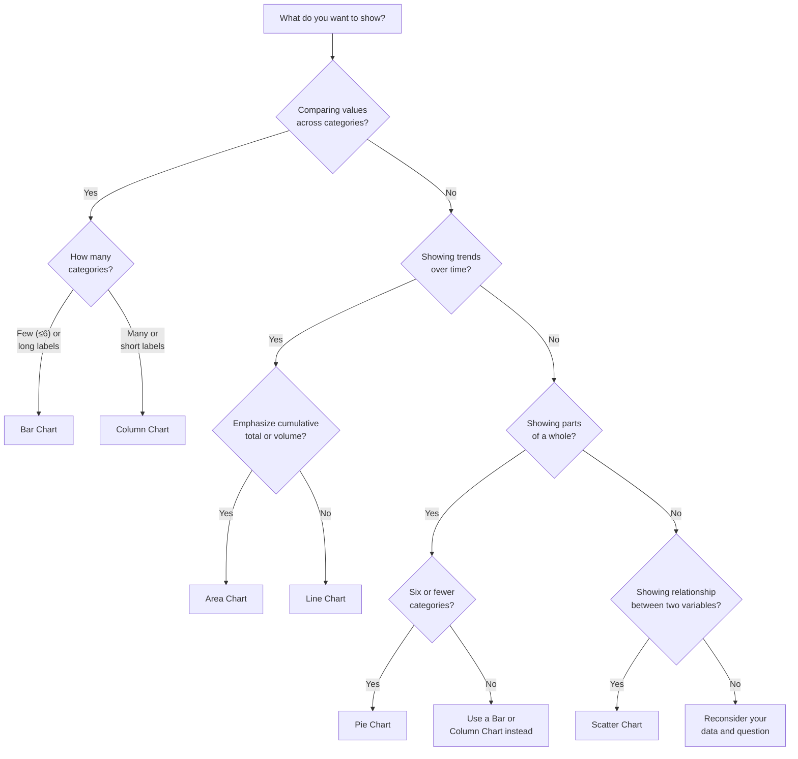

# Charts

Charts transform raw spreadsheet data into visual representations, making patterns, trends, and comparisons far easier to understand at a glance than rows and columns of numbers alone. A well-chosen chart can reveal insights — such as seasonal sales trends, performance outliers, or proportional breakdowns — that might otherwise be buried in the data.

Calc supports a variety of chart types, each designed for a specific kind of analysis: **bar**, **column**, **line**, **pie**, **scatter**, and **area** charts. This chapter covers how to select the right chart type for your data, how to create and configure charts step by step, how to customize their appearance, and best practices for effective data visualization.

All examples in this chapter use the Acme Corp quarterly sales dataset introduced in the [Introduction](00-introduction.md). Where applicable, pivot table output from the [Pivot Tables](04-pivot-tables.md) chapter is referenced as a data source for chart creation.

---

## Overview of Chart Types

Choosing the right chart type is the first and most important decision in data visualization. Each chart type is designed to communicate a specific kind of information effectively. Below is a detailed overview of the six primary chart types available in Calc.

### Bar Chart

A bar chart displays data as **horizontal bars** extending from the Y-axis. The length of each bar is proportional to the value it represents.

- **Best for:** Comparing values across categories, especially when category labels are long
- **Example use:** Comparing total annual sales for each employee side by side
- **When to choose:** You have categorical data and want to compare magnitudes; horizontal orientation accommodates long category names without crowding

### Column Chart

A column chart displays data as **vertical bars** rising from the X-axis. It is the vertical counterpart of the bar chart.

- **Best for:** Comparing values over time or across categories with short labels
- **Example use:** Quarterly sales comparison for each employee, with quarters on the X-axis
- **When to choose:** You want to compare values across a small to moderate number of categories; vertical bars naturally suggest a timeline when the X-axis represents time periods

### Line Chart

A line chart plots data points connected by **straight lines**, emphasizing the flow and direction of change from one point to the next.

- **Best for:** Showing trends, changes, and patterns over continuous time periods
- **Example use:** Sales trend across Q1 through Q4 for each employee, revealing whether sales are rising, falling, or stable
- **When to choose:** Your data has a natural sequence or time component and you want to highlight the direction and rate of change

### Pie Chart

A pie chart is a **circular chart divided into slices**, where each slice represents a proportion of the whole. The size of each slice corresponds to its percentage of the total.

- **Best for:** Showing composition — the proportional contribution of parts to a total — when there are six or fewer categories
- **Example use:** Market share distribution by product type (Widget A, Widget B, Widget C)
- **When to choose:** You want to show how a total is divided among a small number of categories
- **Important note:** Avoid pie charts when there are more than six categories or when slice sizes are very similar, as these conditions make the chart difficult to read

### Scatter (XY) Chart

A scatter chart plots individual **data points** using X and Y coordinates, without connecting them with lines. Each point represents the intersection of two numerical values.

- **Best for:** Showing relationships, correlations, or distributions between two numerical variables
- **Example use:** Plotting Q1 Sales (X-axis) against Q4 Sales (Y-axis) for each employee to see if employees who started strong also finished strong
- **When to choose:** You have two numeric variables and want to explore whether a relationship exists between them

### Area Chart

An area chart is similar to a line chart, but the **region below the line is filled** with color. When multiple series are plotted, the filled areas can be stacked to show cumulative totals.

- **Best for:** Showing cumulative totals over time or emphasizing the volume of change
- **Example use:** Cumulative quarterly sales stacked by region, illustrating both individual regional contributions and the overall total
- **When to choose:** You want to combine the trend-showing ability of a line chart with a visual emphasis on magnitude or cumulative volume

### Chart Type Summary

The following table provides a quick reference for selecting the appropriate chart type:

| Chart Type | Best For | Data Requirements | Example |
|------------|----------|-------------------|---------|
| Bar | Category comparison | Categories + values | Sales by employee |
| Column | Time comparison | Time periods + values | Quarterly sales |
| Line | Trends over time | Time series data | Sales trends |
| Pie | Proportions | Categories + one value set | Product distribution |
| Scatter | Correlations | Two numeric variables | Sales correlation |
| Area | Cumulative trends | Time series data | Cumulative sales |

---

## Selecting the Right Chart Type

Choosing an appropriate chart type depends on the question you are trying to answer with your data. The following decision tree guides you through the selection process based on what you want to communicate.

**How to use this decision tree:**

1. Start at the top by asking yourself what your chart needs to communicate
2. Follow the decision branches based on your data and communication goal
3. Arrive at the recommended chart type
4. If no branch fits perfectly, consider whether a table or dashboard combination might be more effective

**Tip:** When in doubt between two chart types, create both and compare which one communicates your insight more clearly. You can always delete the less effective chart.

---

## Creating a Chart: Step-by-Step

This section walks through the complete process of creating a chart in Calc, using the Acme Corp quarterly sales dataset as the example data.

### Source Data

The chart will be created from the following data, located in cells A1:E6:

| | A (Employee) | B (Q1 Sales) | C (Q2 Sales) | D (Q3 Sales) | E (Q4 Sales) |
|---|---|---|---|---|---|
| **1** | Employee | Q1 Sales | Q2 Sales | Q3 Sales | Q4 Sales |
| **2** | Alice | 15000 | 18000 | 22000 | 19000 |
| **3** | Bob | 12000 | 14000 | 13000 | 16000 |
| **4** | Carol | 20000 | 17000 | 25000 | 23000 |
| **5** | Dave | 11000 | 13000 | 15000 | 14000 |
| **6** | Eve | 18000 | 21000 | 19000 | 22000 |

**Note:** For charting purposes, only the Employee name and the four quarterly sales columns are selected. The Region and Product columns are omitted from the chart data range to keep the visualization focused.

### Steps

1. **Prepare your data** — Verify that your data is organized with column headers in the first row (Row 1) and labels in the first column (Column A). Each subsequent row should represent one record. Ensure there are no blank rows or columns within the data range.

2. **Select the data range** — Click cell A1 and drag to cell E6 to select the entire dataset including headers. The selected range should be highlighted. This range includes five employees (rows 2–6) and four quarters of sales data (columns B–E), plus their headers.

3. **Insert the chart** — Open the **Insert** menu from the menu bar and select **Chart**. A chart wizard dialog appears, guiding you through the configuration process.

4. **Choose the chart type** — In the chart wizard, select the desired chart type from the list. For this example, choose **Column Chart** to create a vertical bar comparison of quarterly sales by employee.

5. **Configure data series** — The wizard shows a preview of how the data will be plotted. Verify that the data series are correctly assigned:
   - **Data series in columns** — each column (Q1 Sales, Q2 Sales, Q3 Sales, Q4 Sales) becomes a separate series
   - **First column as labels** — employee names from column A are used as category labels on the X-axis
   - **First row as labels** — the header row provides series names for the legend

6. **Set chart elements** — Add descriptive elements to make the chart self-explanatory:
   - **Chart title:** Enter a title such as "Quarterly Sales by Employee"
   - **X-axis title:** Enter "Employee"
   - **Y-axis title:** Enter "Sales ($)"
   - **Legend:** Ensure the legend is enabled and positioned where it does not overlap the data

7. **Finalize and place** — Click **Finish** (or the equivalent confirmation button). The chart is created and embedded directly in your worksheet as an object.

8. **Resize and position** — Click the chart once to select it (handles appear on the corners and edges). Drag the corner handles to resize the chart to your preferred dimensions. Drag the chart body to reposition it on the worksheet. Click outside the chart to deselect it.

---

## Configuring Data Series and Axis Labels

After creating a chart, you may need to adjust how data series and axis labels are configured. Understanding these concepts gives you full control over how your data is represented visually.

### Understanding Data Series

A **data series** is a set of related data points plotted on a chart. Each series typically corresponds to one row or one column of your source data.

- **Series by Columns (default):** Each column of numeric data becomes a separate series. Using the Acme Corp data, this produces four series — Q1 Sales, Q2 Sales, Q3 Sales, and Q4 Sales — with employee names as category labels.
- **Series by Rows:** Each row of data becomes a separate series. This produces five series — one per employee (Alice, Bob, Carol, Dave, Eve) — with quarter names as category labels.
- **Series properties:** Each series has a name (taken from the header), a set of values, and visual properties (color, marker shape, line style) that distinguish it from other series.

### Series by Columns vs. Series by Rows

The orientation of data series fundamentally changes what the chart communicates:

| Configuration | Series (Legend Entries) | Categories (X-Axis Labels) | Best For |
|---------------|------------------------|---------------------------|----------|
| Series by Columns | Q1 Sales, Q2 Sales, Q3 Sales, Q4 Sales | Alice, Bob, Carol, Dave, Eve | Comparing employees across quarters |
| Series by Rows | Alice, Bob, Carol, Dave, Eve | Q1 Sales, Q2 Sales, Q3 Sales, Q4 Sales | Comparing quarters for each employee |

**To switch orientation:**

1. Double-click the chart to enter edit mode
2. Right-click the chart area and select **Data Ranges** (or **Data Series**)
3. Toggle the **Data series in** option between "Columns" and "Rows"
4. Click **OK** and the chart redraws with the new orientation

### Axis Configuration

Every chart with two axes has a **Category Axis** and a **Value Axis**:

- **X-Axis (Category Axis):** Displays the category labels along the horizontal axis. These are the non-numeric identifiers such as employee names or quarter labels. The category axis organizes the chart horizontally and determines how data points are grouped.
- **Y-Axis (Value Axis):** Displays the numeric scale along the vertical axis. The scale automatically adjusts to fit the range of your data values (e.g., 0 to 25000 for the Acme Corp sales data). The value axis includes tick marks and gridlines at regular intervals.

**Axis title best practices:**

- Use descriptive titles that include units: "Sales ($)" is better than "Values"
- Keep titles concise: "Quarter" is sufficient; "Fiscal Quarter of the Year" is unnecessarily verbose
- Format the value axis numbers appropriately: use currency symbols, thousands separators, or percentage signs as applicable

---

## Formatting Titles, Legends, and Gridlines

Titles, legends, and gridlines are the supporting elements that make a chart readable and self-explanatory. Proper formatting of these elements separates a clear, professional chart from an ambiguous one.

### Chart Title

The chart title communicates the purpose and scope of the visualization at a glance.

- **Content:** Should be descriptive and specific. A good title answers "what is this chart showing?" Example: "Quarterly Sales by Employee (2024)" is far more informative than "Sales" or "Chart 1."
- **Position:** Displayed at the top of the chart by default. Most applications allow repositioning to the bottom or overlaying on the chart area.
- **Formatting:** The title font size should be noticeably larger than axis labels and legend text to establish visual hierarchy. Bold formatting is recommended.
- **How to edit:** Double-click the chart to enter edit mode, then double-click the title text to edit it directly.

### Legend

The legend identifies which color, pattern, or marker style corresponds to each data series.

- **Content:** Displays the name of each data series (e.g., "Q1 Sales," "Q2 Sales") alongside a sample of its visual style (color swatch, line pattern, or marker shape).
- **Position options:** Top, bottom, left, right, or hidden entirely. Place the legend where it does not overlap or obscure the chart data.
- **Best practice:** For charts with few series (2–3), a legend at the top or bottom works well. For charts with many series, a legend on the right side provides room for longer labels. If series labels are directly annotated on the chart (data labels), the legend may be hidden to reduce clutter.
- **How to configure:** Double-click the chart, then right-click the legend and select **Format Legend** to adjust position, font, and background.

### Gridlines

Gridlines are reference lines drawn across the chart area to help readers estimate values visually.

- **Major gridlines:** Horizontal lines at major value intervals on the Y-axis (e.g., every 5000 units). These provide the primary visual reference for reading values.
- **Minor gridlines:** Finer subdivisions between major gridlines. These add precision but can create visual clutter.
- **Best practice:** Enable major gridlines only. Disable minor gridlines unless precise value reading is essential. Use a light gray color for gridlines so they recede behind the data.
- **How to configure:** Double-click the chart, then right-click the chart area and select **Insert/Delete Gridlines** or access gridline settings through the chart formatting options.

### Axis Labels

Axis labels provide context for the category and value axes.

- **X-axis labels:** Should clearly identify each category. If labels are long, consider angling them (45°) or using a bar chart (horizontal orientation) instead.
- **Y-axis labels:** Should include number formatting appropriate to the data. For sales data, use currency format or thousands separators (e.g., "15,000" or "$15K").
- **Axis titles:** Separate from axis labels, axis titles describe what the axis represents (e.g., "Employee" for the X-axis, "Sales ($)" for the Y-axis). Always include axis titles unless the context is completely obvious from the chart title alone.

---

## Chart Customization Options

Beyond the basic chart elements, Calc provides several customization features that can enhance clarity, add analytical depth, or align the chart with presentation requirements.

### Colors

Change the color of individual data series to improve visual distinction or match branding guidelines.

- **When to use:** When default colors are too similar, when the chart needs to match a corporate color scheme, or when you want to highlight a specific series.
- **How:** Double-click the chart, then double-click a data series (e.g., one set of bars) to open its formatting dialog. Select the desired fill color.

### Data Labels

Add value labels directly onto chart elements (on top of bars, next to data points, inside pie slices).

- **When to use:** When exact values matter more than general trends, or when the chart will be read without access to the underlying data.
- **How:** Double-click the chart, right-click a data series, and select **Insert Data Labels**. Choose the label position (above, below, center, outside end) and format.

### Data Table

Display the source data in a table directly below the chart area.

- **When to use:** When the audience needs both the visual pattern and the precise numbers. Useful for printed reports where readers cannot hover over data points.
- **How:** Double-click the chart, access chart options, and enable **Show Data Table**. The table appears integrated below the chart, aligned with the category axis.

### Error Bars

Display visual indicators of data variability or uncertainty.

- **When to use:** In scientific or statistical presentations where margin of error, standard deviation, or confidence intervals need to be communicated.
- **How:** Double-click the chart, right-click a data series, and select **Insert Error Bars**. Configure the error amount as a fixed value, percentage, or standard deviation.

### Trendlines

Add a calculated trend line overlaid on the data to highlight the overall direction.

- **When to use:** With line charts or scatter charts to reveal underlying trends, make predictions, or smooth out noisy data.
- **Types available:** Linear, logarithmic, exponential, power, polynomial, and moving average.
- **How:** Double-click the chart, right-click a data series, and select **Insert Trend Curve**. Choose the regression type and optionally display the equation on the chart.

### Secondary Axis

Add a second Y-axis on the right side of the chart for data series with a different scale.

- **When to use:** When plotting two data series that have very different value ranges on the same chart (e.g., revenue in thousands alongside profit margin as a percentage).
- **How:** Double-click the chart, right-click the data series that should use the secondary axis, select **Format Data Series**, and assign it to the secondary Y-axis.

### Chart Style

Apply a predefined style template that sets colors, fonts, and effects in one step.

- **When to use:** For quick, consistent formatting when creating multiple charts, or when a polished look is needed without manual customization.
- **How:** Double-click the chart, then use the chart style selector (often available in a toolbar or formatting menu) to browse and apply styles.

---

## Practical Example: Visualizing Quarterly Sales Trends

This section demonstrates creating three different chart types from the Acme Corp dataset, illustrating how the same data can tell different stories depending on the chart type chosen. All data values are sourced from the sample dataset defined in the [Introduction](00-introduction.md).

### Chart 1: Column Chart — Quarterly Sales Comparison

**Purpose:** Compare quarterly sales performance across all five employees.

**Configuration:**

- **Data range:** A1:E6 (Employee names and Q1–Q4 Sales)
- **Chart type:** Column Chart (clustered)
- **Series by Columns:** Each quarter becomes a separate series
- **X-axis (Category):** Employee names — Alice, Bob, Carol, Dave, Eve
- **Y-axis (Value):** Sales amount in dollars
- **Series:** Q1 Sales, Q2 Sales, Q3 Sales, Q4 Sales (four series, displayed as side-by-side columns for each employee)
- **Chart title:** "Quarterly Sales by Employee"
- **X-axis title:** "Employee"
- **Y-axis title:** "Sales ($)"

**Data displayed:**

| Employee | Q1 Sales | Q2 Sales | Q3 Sales | Q4 Sales |
|----------|----------|----------|----------|----------|
| Alice | 15000 | 18000 | 22000 | 19000 |
| Bob | 12000 | 14000 | 13000 | 16000 |
| Carol | 20000 | 17000 | 25000 | 23000 |
| Dave | 11000 | 13000 | 15000 | 14000 |
| Eve | 18000 | 21000 | 19000 | 22000 |

**Patterns visible in this chart:**

- **Carol** has the highest single-quarter value (25000 in Q3) and the tallest columns overall, indicating top performance
- **Dave** has the lowest values across all quarters, with his highest quarter (Q3 at 15000) still below most other employees' lowest quarters
- **Alice** shows a clear upward trend from Q1 to Q3, then a slight dip in Q4
- **Eve** maintains consistently high performance, with Q2 as her strongest quarter (21000)
- **Bob** has relatively flat performance with a modest upward trend toward Q4

### Chart 2: Line Chart — Sales Trends Over Quarters

**Purpose:** Visualize how each employee's sales change across the four quarters, emphasizing trends and trajectories.

**Configuration:**

- **Data range:** A1:E6 (same data as Chart 1)
- **Chart type:** Line Chart
- **Series by Rows:** Each employee becomes a separate line
- **X-axis (Category):** Quarters — Q1, Q2, Q3, Q4
- **Y-axis (Value):** Sales amount in dollars
- **Series:** Alice, Bob, Carol, Dave, Eve (five lines, one per employee)
- **Chart title:** "Employee Sales Trends Q1–Q4"
- **X-axis title:** "Quarter"
- **Y-axis title:** "Sales ($)"

**Trends visible in this chart:**

- **Carol** shows a strong overall upward trend: 20000 → 17000 → 25000 → 23000. Despite a dip in Q2, she recovers sharply to the highest quarterly value in Q3 and maintains strong performance in Q4
- **Alice** trends upward through the first three quarters (15000 → 18000 → 22000) before a slight decline in Q4 (19000)
- **Eve** shows steady, high performance: 18000 → 21000 → 19000 → 22000, oscillating around the 20000 level
- **Bob** is relatively flat with a slight positive slope: 12000 → 14000 → 13000 → 16000
- **Dave** shows a gradual upward trend: 11000 → 13000 → 15000 → 14000, with the lowest values of all employees throughout the year
- **All lines converge** slightly in Q3–Q4, suggesting the gap between top and bottom performers narrows in the second half of the year

### Chart 3: Pie Chart — Annual Sales Distribution by Product

**Purpose:** Show the proportional contribution of each product to total annual sales.

**Data Preparation:**

To create this pie chart, first calculate the total annual sales by product. This can be done manually, with formulas, or by using a pivot table (see [Pivot Tables](04-pivot-tables.md) for how to create summary data):

| Product | Employees | Annual Sales Calculation | Total |
|---------|-----------|--------------------------|-------|
| Widget A | Alice + Carol | 74000 + 85000 | **159000** |
| Widget B | Bob + Eve | 55000 + 80000 | **135000** |
| Widget C | Dave | 53000 | **53000** |
| **Grand Total** | | | **347000** |

**Verification of individual annual totals** (from the [Introduction](00-introduction.md)):

- Alice: 15000 + 18000 + 22000 + 19000 = **74000**
- Bob: 12000 + 14000 + 13000 + 16000 = **55000**
- Carol: 20000 + 17000 + 25000 + 23000 = **85000**
- Dave: 11000 + 13000 + 15000 + 14000 = **53000**
- Eve: 18000 + 21000 + 19000 + 22000 = **80000**

**Percentage calculations:**

- Widget A: 159000 ÷ 347000 = **45.8%**
- Widget B: 135000 ÷ 347000 = **38.9%**
- Widget C: 53000 ÷ 347000 = **15.3%**
- Verification: 45.8% + 38.9% + 15.3% = **100.0%**

**Configuration:**

- **Data range:** A product summary table with two columns — Product Name and Total Annual Sales
- **Chart type:** Pie Chart
- **Categories:** Widget A, Widget B, Widget C
- **Values:** 159000, 135000, 53000
- **Chart title:** "Annual Sales Distribution by Product"
- **Data labels:** Show both the product name and percentage on each slice

**Insights from this chart:**

- **Widget A dominates sales** with nearly half (45.8%) of all revenue, driven by the two highest-performing employees (Alice and Carol)
- **Widget B accounts for 38.9%** of total sales, supported by Eve's strong performance
- **Widget C represents only 15.3%** of total sales, sold by a single employee (Dave), suggesting either limited market demand or an opportunity for growth
- The three-category breakdown is ideal for a pie chart — the slices are clearly different in size, making proportions easy to compare visually

### Using Pivot Table Output as Chart Data

The analyses created in the [Pivot Tables](04-pivot-tables.md) chapter — such as "Q1 Sales by Region and Product" and "Annual Sales by Employee" — produce summary tables that are excellent data sources for charts. Rather than charting raw data, you can:

1. Create a pivot table summarizing data by your desired categories
2. Select the pivot table output (the summary rows and columns)
3. Insert a chart from the selected pivot table data

This workflow combines the analytical power of pivot tables with the visual clarity of charts, and is a common real-world approach for dashboards and reports.

---

## Best Practices for Effective Data Visualization

Creating a chart is straightforward; creating an effective chart that clearly communicates an insight requires thoughtful design. The following guidelines will help you produce visualizations that inform rather than confuse.

1. **Choose the right chart type** — Use the decision tree earlier in this chapter to match your data and communication goal to the appropriate chart type. Do not force data into the wrong chart simply because it looks appealing. A pie chart with fifteen slices communicates nothing; a simple bar chart might be the better choice.

2. **Keep it simple** — Avoid 3D effects, excessive drop shadows, gradient fills, and decorative elements that add visual noise without adding information. Every element on a chart should serve a purpose. This principle, sometimes called minimizing "chart junk," ensures that the reader's attention is focused on the data itself.

3. **Label clearly** — Always include a descriptive chart title, axis titles, and a legend (when multiple series are present). Labels should be large enough to read easily. A chart without labels forces the reader to guess what the data represents.

4. **Use consistent scales** — For bar and column charts, start the Y-axis at zero to avoid exaggerating differences. If you must truncate the axis (for example, when all values are between 10000 and 25000), clearly indicate the break with a visible axis break symbol. When comparing multiple charts side by side, ensure they use the same Y-axis range so visual comparisons are accurate.

5. **Limit categories** — Too many categories make any chart difficult to read:
   - Pie charts: Use six or fewer slices. Group small categories into an "Other" slice if necessary.
   - Bar and column charts: Twelve or fewer categories for readability.
   - Line charts: Six or fewer series (lines) to avoid a tangled, unreadable display.

6. **Use color purposefully** — Assign distinct colors to different data series for quick identification. Highlight the most important series with a bold or contrasting color while keeping less critical series in muted tones. Use colorblind-friendly palettes (avoid relying solely on red vs. green to distinguish series). Consistent color assignments across related charts help readers build familiarity.

7. **Tell a story** — A chart should communicate a clear insight, not just display data. Add annotations to call attention to key data points (e.g., "Record high in Q3" or "Below target"). Write a chart title that frames the takeaway rather than just describing the data.

8. **Consider your audience** — Tailor the chart type and complexity to the audience:
   - **Executive audiences** prefer simple, high-level charts (bar, pie) with clear takeaways
   - **Technical audiences** may appreciate more detailed charts (scatter plots with trendlines, multi-axis charts)
   - **Public-facing visualizations** should prioritize accessibility and simplicity

---

## Tips and Common Errors

### Tips

- **Double-click a chart to edit it** — this enters chart edit mode where you can modify titles, series, formatting, and other elements. Click outside the chart to exit edit mode and return to the normal worksheet view.

- **Right-click chart elements for formatting options** — right-clicking on a specific element (title, legend, axis, data series, gridlines) opens a context menu with formatting and configuration options specific to that element.

- **Use a data table below the chart when exact values matter** — enabling the data table option (available in chart formatting) displays the source numbers in a compact table aligned with the chart axes, providing both visual pattern recognition and precise values in one view.

- **Update charts automatically by changing source data** — charts in Calc are dynamically linked to their source data. When you update a value in the source range, the chart updates automatically. There is no need to recreate the chart after data changes.

- **Create multiple charts from the same data** — as demonstrated in the practical example, a single dataset can support multiple chart types, each revealing different aspects of the data. Do not limit yourself to one chart when the data has multiple stories to tell.

- **Use chart sheets for presentation-quality charts** — if a chart needs to fill an entire page (for printing or presentation), move it to its own dedicated sheet. Right-click the chart, select **Move Chart**, and choose **New Sheet** as the destination.

### Common Errors

- **Selecting too much data (including totals rows)** — if your data range includes summary or total rows (e.g., a "Grand Total" row at the bottom), the chart will plot those totals as additional data points, distorting the visualization. Always select only the raw data rows when creating a chart.

- **Using pie charts with too many categories** — pie charts with more than six slices become cluttered and difficult to interpret. Small slices appear nearly identical in size. Switch to a bar or column chart when you have many categories.

- **Inconsistent axis scales when comparing charts** — if you create two column charts to compare different time periods, ensure both charts use the same Y-axis minimum and maximum values. Otherwise, visual comparisons between the charts will be misleading (a bar that looks the same height in both charts could represent very different values).

- **Forgetting to update the data range after adding rows** — if new data is appended below the original data range, the chart may not include the new rows automatically. Right-click the chart, select **Data Ranges**, and extend the range to include the new data.

- **Overlapping labels on crowded charts** — when there are many data points or long category labels, labels may overlap and become unreadable. Solutions include: angling X-axis labels, increasing the chart size, reducing the number of categories, or abbreviating labels.

---

## Navigation

| | | |
|---|---|---|
| [← Pivot Tables](04-pivot-tables.md) | [↑ Documentation Index](../README.md) | [Financial Analysis →](06-financial-analysis.md) |
