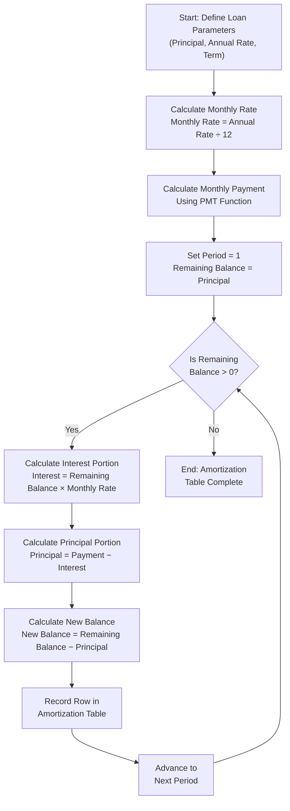

# Financial Analysis

Calc includes powerful financial functions that enable you to perform loan calculations, project investment growth, evaluate business decisions, and build budgets — all within a spreadsheet. Financial analysis in Calc centers on the **time value of money** principle: a dollar received today is worth more than a dollar received in the future, because today's dollar can be invested to earn a return.

This chapter covers five core financial functions:

1. **PMT** — Calculate periodic loan or annuity payments
2. **FV** — Project the future value of an investment or savings plan
3. **PV** — Determine the present value of a series of future payments
4. **NPV** — Evaluate an investment project by discounting future cash flows
5. **IRR** — Find the internal rate of return for a series of cash flows

Each function includes a complete syntax reference, a realistic worked example, and a step-by-step calculation walkthrough so you can verify the results by hand. The chapter concludes with a loan amortization table walkthrough, a budget planning example using formulas from earlier chapters, and practical tips for financial modeling.

> **Note:** This chapter uses dedicated financial datasets tailored to each scenario (mortgages, savings accounts, business investments, and budgets) rather than the Acme Corp quarterly sales dataset introduced in the [Introduction](00-introduction.md), which is better suited to the data analysis chapters of this guide.

---

## Introduction to Financial Functions

Financial functions in Calc are built around the **time value of money** — the foundational concept that money available now is worth more than the same amount in the future due to its earning potential. Understanding this concept is essential for making informed decisions about loans, savings, and investments.

### Common Financial Analysis Scenarios

- **Loan payments** — Determining how much you need to pay each month on a mortgage, car loan, or personal loan
- **Savings growth** — Projecting how much your regular savings contributions will grow over time with compound interest
- **Investment evaluation** — Assessing whether a business project or investment opportunity is financially worthwhile
- **Budgeting** — Tracking income and expenses, forecasting cash flow, and planning for financial goals

### Key Financial Concepts

The five financial functions covered in this chapter share a common set of parameters. Understanding these parameters is the key to using the functions correctly:

| Concept | Abbreviation | Description |
|---------|-------------|-------------|
| **Interest Rate** | rate | The interest rate per period. For monthly calculations, divide the annual rate by 12 |
| **Number of Periods** | nper | The total number of payment periods over the life of the loan or investment |
| **Payment** | pmt | The fixed payment amount made each period (e.g., monthly loan payment or savings deposit) |
| **Present Value** | pv | The lump-sum value today — the current loan balance or the initial investment amount |
| **Future Value** | fv | The lump-sum value at the end — the target savings balance or the remaining loan balance |

### Sign Convention

Calc financial functions use a strict sign convention to distinguish money flowing in different directions:

- **Cash outflows** (money you pay out) are entered as **negative** values — for example, a loan payment you make each month or an initial investment you fund
- **Cash inflows** (money you receive) are entered as **positive** values — for example, a loan amount you receive from a lender or investment returns you collect

**Tip:** Forgetting the sign convention is the most common source of unexpected results with financial functions. If a function returns a negative number when you expect a positive one (or vice versa), check whether your inputs use the correct signs.

---

## PMT Function: Calculating Loan Payments

The **PMT** function calculates the fixed periodic payment required to fully repay a loan (or fund an annuity) at a constant interest rate over a specified number of periods.

### Syntax

```text
=PMT(rate, nper, pv, [fv], [type])
```

### Parameters

| Parameter | Required | Description |
|-----------|----------|-------------|
| **rate** | Yes | Interest rate per period. For monthly payments on an annual rate, divide by 12 (e.g., 5% annual → `0.05/12`) |
| **nper** | Yes | Total number of payment periods. For a 30-year monthly loan, use `30*12` = 360 |
| **pv** | Yes | Present value — the total loan amount. Enter as positive if you are receiving the loan; the result will be negative (an outflow). Alternatively, enter as negative to get a positive payment result |
| **fv** | No | Future value — the remaining balance after the last payment. Default is 0 (loan fully repaid) |
| **type** | No | Payment timing: `0` = payment at end of period (default), `1` = payment at beginning of period |

### Practical Example: Monthly Mortgage Payment

**Scenario:** You are taking out a $200,000 mortgage at a 5% annual interest rate, to be repaid over 30 years with monthly payments. What is your monthly payment?

**Setup in Calc:**

| Cell | Label | Value |
|------|-------|-------|
| A1 | Loan Amount | 200000 |
| A2 | Annual Interest Rate | 5% |
| A3 | Loan Term (years) | 30 |
| A4 | Monthly Payment | `=PMT(A2/12, A3*12, -A1)` |

**Formula with values substituted:**

```text
=PMT(0.05/12, 30*12, -200000)
=PMT(0.004167, 360, -200000)
```

### Step-by-Step Calculation

1. **Convert the annual interest rate to a monthly rate:**
   - 0.05 ÷ 12 = **0.004167** (rounded to 6 decimal places)

2. **Convert the loan term from years to months:**
   - 30 × 12 = **360** months

3. **Apply the PMT formula:**
   - PMT = PV × r × (1 + r)^n ÷ [(1 + r)^n − 1]
   - PMT = 200,000 × 0.004167 × (1.004167)^360 ÷ [(1.004167)^360 − 1]
   - (1.004167)^360 ≈ 4.4677
   - PMT = 200,000 × 0.004167 × 4.4677 ÷ (4.4677 − 1)
   - PMT = 200,000 × 0.018613 ÷ 3.4677
   - PMT ≈ 3,722.59 ÷ 3.4677

4. **Result: $1,073.64 per month**

5. **Total paid over the life of the loan:**
   - $1,073.64 × 360 = **$386,510.40**

6. **Total interest paid:**
   - $386,510.40 − $200,000 = **$186,510.40**

**Insight:** Over 30 years, you pay nearly as much in interest ($186,510) as the original loan amount ($200,000). This illustrates the significant long-term cost of borrowing.

---

## FV Function: Projecting Future Value

The **FV** function calculates the future value of an investment based on a constant interest rate, regular periodic payments, and (optionally) an initial lump-sum deposit.

### Syntax

```text
=FV(rate, nper, pmt, [pv], [type])
```

### Parameters

| Parameter | Required | Description |
|-----------|----------|-------------|
| **rate** | Yes | Interest rate per period. For monthly compounding at an annual rate, divide by 12 |
| **nper** | Yes | Total number of compounding periods |
| **pmt** | Yes | Payment made each period. Enter as negative for deposits (cash outflows) |
| **pv** | No | Present value — an initial lump-sum deposit. Default is 0 (no initial deposit). Enter as negative for a deposit |
| **type** | No | Payment timing: `0` = end of period (default), `1` = beginning of period |

### Practical Example: Retirement Savings Growth

**Scenario:** You invest $500 per month into a retirement account that earns a 7% annual return, compounded monthly. How much will you have after 10 years?

**Setup in Calc:**

| Cell | Label | Value |
|------|-------|-------|
| A1 | Monthly Contribution | 500 |
| A2 | Annual Return Rate | 7% |
| A3 | Investment Period (years) | 10 |
| A4 | Future Value | `=FV(A2/12, A3*12, -A1)` |

**Formula with values substituted:**

```text
=FV(0.07/12, 10*12, -500)
=FV(0.005833, 120, -500)
```

### Step-by-Step Calculation

1. **Convert the annual rate to a monthly rate:**
   - 0.07 ÷ 12 = **0.005833** (rounded to 6 decimal places)

2. **Convert the investment period from years to months:**
   - 10 × 12 = **120** months

3. **Apply the FV formula:**
   - FV = PMT × [(1 + r)^n − 1] ÷ r
   - FV = 500 × [(1.005833)^120 − 1] ÷ 0.005833
   - (1.005833)^120 ≈ 2.0097
   - FV = 500 × (2.0097 − 1) ÷ 0.005833
   - FV = 500 × 1.0097 ÷ 0.005833
   - FV = 500 × 173.0848

4. **Result: $86,542.40**

5. **Total contributions over 10 years:**
   - $500 × 120 = **$60,000**

6. **Interest earned:**
   - $86,542.40 − $60,000 = **$26,542.40**

**Insight:** Compound interest added over $26,500 on top of your $60,000 in contributions — nearly 44% more than what you deposited. Starting early and investing consistently allows compounding to work significantly in your favor.

---

## PV Function: Determining Present Value

The **PV** function calculates the present value of a series of future payments — in other words, how much a stream of future cash flows is worth in today's terms. This is useful for determining how much you can afford to borrow given a fixed monthly payment.

### Syntax

```text
=PV(rate, nper, pmt, [fv], [type])
```

### Parameters

| Parameter | Required | Description |
|-----------|----------|-------------|
| **rate** | Yes | Interest rate per period |
| **nper** | Yes | Total number of payment periods |
| **pmt** | Yes | Payment made each period. Enter as negative for payments you make (cash outflows) |
| **fv** | No | Future value — the remaining balance after the last payment. Default is 0 |
| **type** | No | Payment timing: `0` = end of period (default), `1` = beginning of period |

### Practical Example: How Much Can You Afford to Borrow?

**Scenario:** You can afford to make $500 monthly payments for 5 years. If the annual interest rate is 6%, how much can you borrow?

**Setup in Calc:**

| Cell | Label | Value |
|------|-------|-------|
| A1 | Monthly Payment | 500 |
| A2 | Annual Interest Rate | 6% |
| A3 | Loan Term (years) | 5 |
| A4 | Maximum Loan Amount | `=PV(A2/12, A3*12, -A1)` |

**Formula with values substituted:**

```text
=PV(0.06/12, 5*12, -500)
=PV(0.005, 60, -500)
```

### Step-by-Step Calculation

1. **Convert the annual rate to a monthly rate:**
   - 0.06 ÷ 12 = **0.005**

2. **Convert the loan term from years to months:**
   - 5 × 12 = **60** months

3. **Apply the PV formula:**
   - PV = PMT × [1 − (1 + r)^(−n)] ÷ r
   - PV = 500 × [1 − (1.005)^(−60)] ÷ 0.005
   - (1.005)^60 ≈ 1.3489
   - (1.005)^(−60) = 1 ÷ 1.3489 ≈ 0.7414
   - PV = 500 × (1 − 0.7414) ÷ 0.005
   - PV = 500 × 0.2586 ÷ 0.005
   - PV = 500 × 51.726

4. **Result: $25,862.78**

5. **Interpretation:** With $500 monthly payments at 6% interest over 5 years, you can borrow up to approximately **$25,862.78**.

6. **Total payments made:**
   - $500 × 60 = **$30,000**

7. **Total interest paid:**
   - $30,000 − $25,862.78 = **$4,137.22**

**Insight:** The PV function is the inverse of PMT — PMT tells you the payment for a given loan, while PV tells you the loan amount for a given payment. Together, they let you evaluate loans from either direction.

---

## NPV Function: Evaluating Investment Projects

The **NPV** (Net Present Value) function evaluates whether a business investment or project is financially worthwhile by discounting all future cash flows back to their present-day value and comparing the total against the upfront cost.

### Syntax

```text
=NPV(rate, value1, [value2], ...)
```

### Parameters

| Parameter | Required | Description |
|-----------|----------|-------------|
| **rate** | Yes | Discount rate per period — the minimum acceptable rate of return |
| **value1, value2, ...** | Yes | A series of future cash flows occurring at the end of each period. Positive values represent income; negative values represent costs |

### Important Note on NPV Timing

NPV in Calc assumes that all cash flows in the values argument occur at the **end** of each period, starting from Period 1. If you have an initial investment made at time 0 (the beginning), you must **add it separately** outside the NPV function:

```text
=NPV(rate, future_cash_flows) + initial_investment
```

This is critical — placing the initial investment inside the NPV function would incorrectly discount it by one period.

### Practical Example: Evaluating a Business Expansion

**Scenario:** A company is considering investing $50,000 in new equipment. The investment is expected to generate the following cash flows over 5 years. The company requires a minimum 10% annual return (discount rate).

| Year | Cash Flow | Description |
|------|-----------|-------------|
| 0 | −$50,000 | Initial equipment purchase (paid today) |
| 1 | $15,000 | First year net revenue |
| 2 | $18,000 | Second year net revenue |
| 3 | $20,000 | Third year net revenue |
| 4 | $22,000 | Fourth year net revenue |
| 5 | $10,000 | Fifth year net revenue (reduced due to maintenance costs) |

**Setup in Calc:**

| Cell | Label | Value |
|------|-------|-------|
| C1 | Year 0 (Initial Investment) | −50000 |
| C2 | Year 1 Cash Flow | 15000 |
| C3 | Year 2 Cash Flow | 18000 |
| C4 | Year 3 Cash Flow | 20000 |
| C5 | Year 4 Cash Flow | 22000 |
| C6 | Year 5 Cash Flow | 10000 |
| C8 | Discount Rate | 10% |
| C9 | NPV | `=NPV(C8, C2:C6) + C1` |

**Formula with values substituted:**

```text
=NPV(0.10, 15000, 18000, 20000, 22000, 10000) + (-50000)
```

### Step-by-Step Calculation

1. **Discount each future cash flow to its present value** using the formula: PV = Cash Flow ÷ (1 + rate)^year

   | Year | Cash Flow | Discount Factor (1.10)^year | Present Value |
   |------|-----------|----------------------------|---------------|
   | 1 | $15,000 | 1.1000 | $13,636.36 |
   | 2 | $18,000 | 1.2100 | $14,876.03 |
   | 3 | $20,000 | 1.3310 | $15,026.30 |
   | 4 | $22,000 | 1.4641 | $15,026.30 |
   | 5 | $10,000 | 1.6105 | $6,209.21 |

2. **Sum the discounted cash flows:**
   - $13,636.36 + $14,876.03 + $15,026.30 + $15,026.30 + $6,209.21 = **$64,774.20**

3. **Add the initial investment (at time 0, not discounted):**
   - $64,774.20 + (−$50,000) = **$14,774.20**

4. **Interpretation:**
   - NPV = **$14,774.20** (positive)
   - A positive NPV means the investment is expected to earn more than the 10% required return
   - **Decision: Proceed with the investment** — it creates $14,774.20 in value above the required return

**Tip:** A negative NPV means the investment does not meet the required return rate and should generally be rejected. An NPV of exactly zero means the investment earns exactly the required rate — neither creating nor destroying value.

---

## IRR Function: Calculating Internal Rate of Return

The **IRR** (Internal Rate of Return) function finds the discount rate at which the net present value of a series of cash flows equals zero. In practical terms, IRR tells you the effective annual rate of return an investment is expected to earn.

### Syntax

```text
=IRR(values, [guess])
```

### Parameters

| Parameter | Required | Description |
|-----------|----------|-------------|
| **values** | Yes | A range of cells containing the cash flows. The range must include at least one negative value (investment/cost) and at least one positive value (return/income). Cash flows are assumed to occur at regular intervals |
| **guess** | No | An initial estimate for the rate. Default is 0.1 (10%). Provide a closer guess if Calc returns a #NUM! error |

### Practical Example: Return on the Business Expansion

**Scenario:** Using the same business expansion cash flows from the NPV example, calculate the internal rate of return to determine the actual rate of return the investment earns.

**Cash flows:**

| Cell | Year | Cash Flow |
|------|------|-----------|
| B1 | 0 | −50000 |
| B2 | 1 | 15000 |
| B3 | 2 | 18000 |
| B4 | 3 | 20000 |
| B5 | 4 | 22000 |
| B6 | 5 | 10000 |

**Formula:**

```text
=IRR(B1:B6)
```

**Result: approximately 21.1%**

### Step-by-Step Explanation

1. **What IRR means:** IRR is the discount rate that makes the NPV of all cash flows equal to zero. At this rate, the present value of future income exactly equals the initial investment.

2. **How Calc finds IRR:** Calc uses an iterative numerical method — it tests different rates, adjusting each time until the NPV converges to zero (within a tiny tolerance). You do not need to solve the equation by hand.

3. **Verification at 21.1%:** At a discount rate of 21.1%, the present value of the five future cash flows ($15,000 through $10,000) approximately equals the $50,000 initial investment, resulting in an NPV of approximately $0.

4. **Compare IRR to the hurdle rate (required return):**
   - The company requires a minimum 10% return (the hurdle rate)
   - IRR (21.1%) **>** Hurdle rate (10%) → **Accept the project**
   - If IRR were less than the hurdle rate → Reject the project

### Relationship Between NPV and IRR

NPV and IRR are two sides of the same coin:

- When the discount rate used in NPV is **less than** the IRR, NPV is **positive** (the investment earns more than the required rate)
- When the discount rate **equals** the IRR, NPV is **exactly zero**
- When the discount rate is **greater than** the IRR, NPV is **negative** (the investment earns less than the required rate)

In our example:
- At 10% discount rate: NPV = +$14,774.20 (positive — good investment)
- At 21.1% discount rate: NPV ≈ $0 (break-even rate)
- At 25% discount rate: NPV would be negative (investment does not meet that threshold)

---

## Loan Amortization Table

A **loan amortization table** (also called an amortization schedule) breaks down each loan payment into its two components: the portion that pays **interest** on the outstanding balance and the portion that reduces the **principal** (the loan balance itself). As the loan progresses, the interest portion decreases and the principal portion increases — even though the total payment remains the same.

### Amortization Calculation Flow

The following diagram illustrates the step-by-step process for building a loan amortization table:



### Practical Example: First 6 Months of the $200,000 Mortgage

Using the mortgage from the PMT example — $200,000 at 5% annual interest over 30 years — the amortization table shows how each $1,073.64 payment is split between interest and principal.

**Amortization schedule (months 1 through 6):**

| Month | Beginning Balance | Payment | Interest | Principal | Ending Balance |
|------:|------------------:|--------:|---------:|----------:|---------------:|
| 1 | $200,000.00 | $1,073.64 | $833.33 | $240.31 | $199,759.69 |
| 2 | $199,759.69 | $1,073.64 | $832.33 | $241.31 | $199,518.38 |
| 3 | $199,518.38 | $1,073.64 | $831.33 | $242.31 | $199,276.07 |
| 4 | $199,276.07 | $1,073.64 | $830.32 | $243.32 | $199,032.75 |
| 5 | $199,032.75 | $1,073.64 | $829.30 | $244.34 | $198,788.41 |
| 6 | $198,788.41 | $1,073.64 | $828.29 | $245.35 | $198,543.06 |

**Verification:** In every row, Interest + Principal = Payment ($1,073.64). For example, Month 1: $833.33 + $240.31 = $1,073.64.

### Formulas Used in Each Column

To build this table in Calc, use the following formulas (assuming the payment amount is in cell `$B$1` and the monthly rate is in cell `$B$2`):

**Interest (column D):**

```text
=B5 * $B$2
```

This multiplies the beginning balance by the monthly rate (0.05 ÷ 12 = 0.004167).

**Principal (column E):**

```text
=$B$1 - D5
```

The principal portion is the total payment minus the interest portion.

**Ending Balance (column F):**

```text
=B5 - E5
```

The new balance is the beginning balance minus the principal paid.

**Next row's Beginning Balance (column B):**

```text
=F5
```

Each month's beginning balance equals the previous month's ending balance.

### Step-by-Step Walkthrough for Months 1–3

**Month 1:**
- Beginning Balance: $200,000.00
- Interest: $200,000.00 × (0.05 ÷ 12) = $200,000.00 × 0.004167 = **$833.33**
- Principal: $1,073.64 − $833.33 = **$240.31**
- Ending Balance: $200,000.00 − $240.31 = **$199,759.69**

**Month 2:**
- Beginning Balance: $199,759.69
- Interest: $199,759.69 × 0.004167 = **$832.33**
- Principal: $1,073.64 − $832.33 = **$241.31**
- Ending Balance: $199,759.69 − $241.31 = **$199,518.38**

**Month 3:**
- Beginning Balance: $199,518.38
- Interest: $199,518.38 × 0.004167 = **$831.33**
- Principal: $1,073.64 − $831.33 = **$242.31**
- Ending Balance: $199,518.38 − $242.31 = **$199,276.07**

**Key observation:** Notice how the interest portion decreases each month ($833.33 → $832.33 → $831.33) while the principal portion increases ($240.31 → $241.31 → $242.31). Early in the loan, most of each payment goes toward interest. Over time, the balance shifts toward principal repayment.

---

## Budget Planning Example: Monthly Expense Tracker

Financial analysis is not limited to loans and investments. A well-structured budget spreadsheet helps you track spending, identify over-budget categories, and make informed financial decisions. This example demonstrates how to combine SUM, percentage calculations, and IF functions to build a practical monthly budget tracker.

### The Budget Template

| | A (Category) | B (Budget) | C (Actual) | D (Difference) | E (% of Budget) | F (Status) |
|---|---|---:|---:|---:|---:|---|
| **Row 1** | **Category** | **Budget** | **Actual** | **Difference** | **% of Budget** | **Status** |
| **Row 2** | Housing | 1,500 | 1,500 | 0 | 100.0% | On Track |
| **Row 3** | Transportation | 400 | 350 | 50 | 87.5% | On Track |
| **Row 4** | Food | 600 | 680 | −80 | 113.3% | Over Budget |
| **Row 5** | Utilities | 200 | 185 | 15 | 92.5% | On Track |
| **Row 6** | Entertainment | 200 | 250 | −50 | 125.0% | Over Budget |
| **Row 7** | Savings | 500 | 500 | 0 | 100.0% | On Track |
| **Row 8** | **Total** | **3,400** | **3,465** | **−65** | **101.9%** | **Over Budget** |

### Formulas Used

**Difference (column D) — How much under or over budget:**

```text
=B2-C2
```

A positive difference means under budget; a negative difference means over budget. For example, Food: $600 − $680 = −$80 (over budget by $80).

**Percent of Budget (column E) — Actual spending as a percentage of budgeted amount:**

```text
=C2/B2*100
```

For example, Entertainment: $250 ÷ $200 × 100 = 125.0% (spent 25% more than budgeted).

**Status (column F) — Automatic over-budget flagging using IF:**

```text
=IF(D2<0, "Over Budget", "On Track")
```

This formula checks the Difference value: if negative (actual exceeded budget), it displays "Over Budget"; otherwise, it displays "On Track."

**Total row (Row 8) — Summing each column:**

```text
Total Budget:     =SUM(B2:B7)    → 3,400
Total Actual:     =SUM(C2:C7)    → 3,465
Total Difference: =SUM(D2:D7)    → -65
Total % of Budget: =C8/B8*100    → 101.9%
Total Status:     =IF(D8<0, "Over Budget", "On Track")  → "Over Budget"
```

### Building the Budget Step by Step

1. **Enter category names** in column A (rows 2 through 7)
2. **Enter budgeted amounts** in column B — these are your planned spending limits
3. **Enter actual amounts** in column C — update these as you track real spending
4. **Add the Difference formula** in D2: `=B2-C2` and copy down to D7
5. **Add the % of Budget formula** in E2: `=C2/B2*100` and copy down to E7
6. **Add the Status formula** in F2: `=IF(D2<0, "Over Budget", "On Track")` and copy down to F7
7. **Add SUM totals** in row 8 for columns B, C, and D
8. **Add the total percentage** in E8: `=C8/B8*100`
9. **Add the total status** in F8: `=IF(D8<0, "Over Budget", "On Track")`

For more details on the SUM function, see [Chapter 2: SUM and AVERAGE Formulas](02-formulas-sum-average.md). For more details on the IF function, see [Chapter 3: IF and VLOOKUP Formulas](03-formulas-if-vlookup.md).

---

## Tips for Financial Modeling

The following best practices will help you build financial models in Calc that are accurate, readable, and easy to update.

### Structure and Organization

- **Label all inputs clearly.** Place your assumptions (interest rate, loan term, initial investment) in dedicated cells with descriptive labels. Keep inputs separate from calculations so that anyone reviewing the spreadsheet can understand what drives the results.
- **Use absolute cell references** (`$A$1`) for key parameters such as the interest rate or loan term. This ensures that when you copy formulas down a column (e.g., in an amortization table), the reference to the parameter stays fixed while row references adjust.
- **Use named ranges** for financial parameters. Instead of referring to cell A2 for the interest rate, define a named range like `AnnualRate`. Formulas become self-documenting: `=PMT(AnnualRate/12, LoanTerm*12, -LoanAmount)` is far clearer than `=PMT(A2/12, A3*12, -A1)`.

### Sign Convention Reminders

- **Outflows are negative, inflows are positive.** Loan payments you make, investment contributions you fund, and costs you incur should be entered as negative values. Loan amounts you receive, investment returns, and revenue should be positive.
- **Check your signs when results seem wrong.** If PMT returns a negative number when you expect a positive one, it typically means your present value input needs its sign flipped.

### NPV and IRR Best Practices

- **With NPV, always add the initial investment separately.** The NPV function in Calc discounts all values starting from Period 1. An investment made at time 0 (today) should not be discounted, so add it outside the function: `=NPV(rate, future_cash_flows) + initial_investment`.
- **Use IRR and NPV together** for investment decisions. IRR gives you the break-even rate; NPV gives you the dollar value created at your required rate. Both perspectives help build a complete picture.

### Common Errors and Troubleshooting

| Error | Cause | Resolution |
|-------|-------|------------|
| **#NUM!** | IRR cannot converge to a solution within its iteration limit | Provide a `guess` parameter closer to the expected rate (e.g., `=IRR(B1:B6, 0.15)`). Ensure the cash flows include at least one negative and one positive value |
| **#VALUE!** | A text value was passed where a number is expected (e.g., rate or nper contains text) | Verify that all numeric parameters reference cells containing numbers, not text labels or formatted strings |
| **#DIV/0!** | Division by zero — typically occurs when nper is 0 | Ensure the number of periods is greater than zero |
| **Unexpected negative result** | Sign convention mismatch — inputs have incorrect positive/negative signs | Review each input parameter against the sign convention: outflows negative, inflows positive |

### Advanced Modeling Tips

- **Build sensitivity tables** to see how results change with different assumptions. For example, create a table that shows monthly payments at interest rates from 4% to 7% in 0.5% increments, or project investment growth at annual returns of 5%, 7%, and 9%.
- **Use Goal Seek** (found under the Data or Tools menu) to reverse-engineer inputs. For example, you know you can afford a $1,200 monthly payment — use Goal Seek to find the maximum loan amount at a given interest rate.
- **Document your assumptions** directly in the spreadsheet using comment cells or a dedicated "Assumptions" sheet. Financial models are only as reliable as their inputs.

---

## Navigation

| | | |
|---|---|---|
| [← Charts](05-charts.md) | [↑ Documentation Index](../README.md) | [Data Validation →](07-data-validation.md) |
