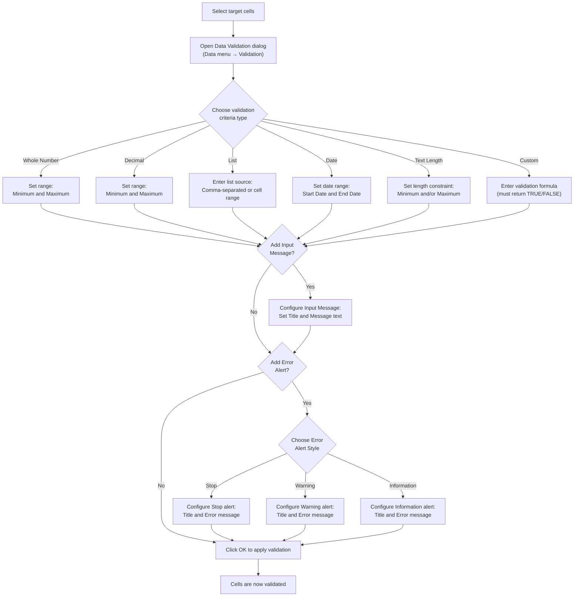

# Data Validation

Data validation is a powerful feature in Calc that allows you to control exactly what values can be entered into specific cells. By defining validation rules, you can prevent invalid data from being entered at the source, maintain data integrity across your spreadsheets, and guide users through the data entry process with helpful messages and dropdown lists.

This chapter covers all major validation rule types — including whole numbers, decimals, lists, dates, text length, and custom formulas — as well as how to create dropdown lists, configure input messages and error alerts, and build a complete validated data entry form. The practical examples in this chapter use the Acme Corp quarterly sales dataset introduced in the [Introduction](00-introduction.md).

---

## What Is Data Validation?

Data validation is a set of rules applied to one or more cells that restrict the type, range, or format of data a user can enter. When a user tries to enter data that does not meet the validation criteria, Calc can display a warning, reject the input entirely, or simply inform the user of the expected format.

### Benefits of Data Validation

Data validation improves the quality and reliability of your spreadsheets in several important ways:

- **Prevents invalid data entry at the source** — Rather than cleaning up errors after the fact, validation stops incorrect values before they enter your data
- **Provides guidance through input messages** — When a user selects a validated cell, a tooltip can appear explaining what type of data is expected
- **Alerts users when invalid data is entered** — Error messages inform the user that their input does not meet the criteria and prompt them to correct it
- **Creates dropdown lists for standardized input** — Lists eliminate free-text entry for fields with a fixed set of acceptable values, ensuring consistency across all records

### Three Components of a Validation Rule

Every data validation rule in Calc is built from up to three components:

1. **Criteria** — The condition that determines whether input is valid. This is the only required component. For example: "Allow only whole numbers between 1,000 and 50,000" or "Allow only values from a predefined list."
2. **Input Message** — An optional tooltip displayed when the user selects a validated cell. It appears before any data is entered, guiding the user on what to type. For example: "Enter the quarterly sales amount (1,000–50,000)."
3. **Error Alert** — An optional message displayed when the user enters data that violates the validation criteria. Error alerts can stop the entry, warn the user, or simply provide information. For example: "Sales amount must be between 1,000 and 50,000."

Together, these three components create a complete validation experience: the criteria enforce rules, the input message provides proactive guidance, and the error alert provides reactive feedback.

---

## Validation Rule Types

Calc provides several built-in validation rule types, each designed for a specific kind of data constraint. The table below summarizes all available rule types, followed by a detailed explanation and example for each.

| Rule Type | Description | Example Use Case |
|-----------|-------------|-----------------|
| Whole Number | Restricts input to integers within a range | Sales amounts (1,000–50,000) |
| Decimal | Restricts input to decimal numbers within a range | Discount percentages (0.00–100.00) |
| List | Restricts input to a predefined set of values | Region selection (North, South, East, West) |
| Date | Restricts input to dates within a range | Transaction dates within the fiscal year |
| Text Length | Restricts input to text of a specified length | Employee names (max 50 characters) |
| Custom Formula | Uses a formula to determine validity | No duplicates, email format, weekday-only dates |

### Whole Number

The **Whole Number** rule restricts cell input to integers (numbers with no decimal places) that fall within a specified range or meet a specific condition.

**Configuration:**

| Setting | Value |
|---------|-------|
| Allow | Whole Number |
| Data | between / greater than / less than / equal to / not equal to |
| Minimum | The lowest acceptable integer |
| Maximum | The highest acceptable integer |

**Example:** Allow only whole numbers between 1,000 and 50,000 for the quarterly sales amount cells (C2:F6) in the Acme Corp dataset.

```text
Allow:   Whole Number
Data:    between
Minimum: 1000
Maximum: 50000
```

With this rule in place, entering a value like `15000` is accepted, while entering `500` (below minimum), `75000` (above maximum), or `15000.50` (not a whole number) is rejected.

### Decimal

The **Decimal** rule restricts cell input to numbers (including decimal places) within a specified range.

**Configuration:**

| Setting | Value |
|---------|-------|
| Allow | Decimal |
| Data | between / greater than / less than / equal to / not equal to |
| Minimum | The lowest acceptable decimal value |
| Maximum | The highest acceptable decimal value |

**Example:** Allow decimal values between 0.00 and 100.00 for a discount percentage column.

```text
Allow:   Decimal
Data:    between
Minimum: 0.00
Maximum: 100.00
```

This rule accepts values like `15.5`, `0.00`, and `99.99`, but rejects `-5.00` (below minimum) or `150.25` (above maximum).

### List

The **List** rule restricts cell input to a predefined set of acceptable values and displays a dropdown menu in the cell for easy selection.

**Configuration:**

| Setting | Value |
|---------|-------|
| Allow | List |
| Source | Comma-separated values or a cell range reference |

**Example:** Allow only "North", "South", "East", "West" for the Region column (B2:B6) in the Acme Corp dataset.

```text
Allow:  List
Source: North,South,East,West
```

Alternatively, if the list values are stored in cells J1:J4 on a reference sheet:

```text
Allow:  List
Source: =$J$1:$J$4
```

A dropdown arrow appears in each validated cell, and users can select from the predefined options. Free-text entry of unlisted values is rejected. Creating dropdown lists is covered in detail in the next section.

### Date

The **Date** rule restricts cell input to dates that fall within a specified range or meet a date-based condition.

**Configuration:**

| Setting | Value |
|---------|-------|
| Allow | Date |
| Data | between / greater than / less than / equal to / not equal to |
| Start Date | The earliest acceptable date |
| End Date | The latest acceptable date |

**Example:** Allow only dates within the 2024 fiscal year for a transaction date column.

```text
Allow:      Date
Data:       between
Start Date: 2024-01-01
End Date:   2024-12-31
```

This rule accepts `2024-06-15` but rejects `2023-12-31` (before the start) or `2025-01-01` (after the end).

### Text Length

The **Text Length** rule restricts cell input based on the number of characters in the entered text.

**Configuration:**

| Setting | Value |
|---------|-------|
| Allow | Text Length |
| Data | less than or equal to / greater than or equal to / between / equal to |
| Maximum | The maximum number of characters allowed |

**Example:** Limit employee name entries in column A to a maximum of 50 characters.

```text
Allow:   Text Length
Data:    less than or equal to
Maximum: 50
```

This rule accepts "Alice" (5 characters) but rejects a name exceeding 50 characters.

### Custom Formula

The **Custom Formula** rule uses a formula expression to determine whether input is valid. The formula must return `TRUE` for the input to be accepted and `FALSE` for it to be rejected. This is the most flexible validation type.

**Configuration:**

| Setting | Value |
|---------|-------|
| Allow | Custom |
| Formula | A formula that evaluates to TRUE (valid) or FALSE (invalid) |

**Example:** Ensure that no cell in column A is left blank and that consecutive entries are not duplicates.

```text
Allow:   Custom
Formula: =AND(LEN(A2)>0, A2<>A1)
```

Custom formula validation is covered in greater depth in the [Custom Formula Validation](#custom-formula-validation) section later in this chapter.

---

## Creating a Dropdown List

Dropdown lists are one of the most commonly used data validation features. They replace free-text entry with a controlled selection menu, ensuring that users can only enter values from a predefined set. This eliminates typos, enforces consistency, and speeds up data entry.

### Step-by-Step Walkthrough

Follow these steps to create a dropdown list for the Region column in the Acme Corp dataset:

1. **Select the target cells** — Click on cell B2, then drag down to B6 (or whatever range should contain the dropdown). For a larger dataset, you might select B2:B100 to cover future entries.

2. **Open the Data Validation dialog** — Navigate to the **Data** menu and select **Validation** (or **Data Validation**, depending on your Calc application).

3. **Set the Allow field to "List"** — In the validation dialog, find the "Allow" or "Criteria" dropdown and select **List**.

4. **Enter the list items in the Source field** — You have two options:

   - **Option A — Comma-separated values:** Type the values directly into the Source field:
     ```text
     North,South,East,West
     ```
   - **Option B — Cell range reference:** If the list values are stored in a reference range (e.g., cells J1:J4 on a "Reference" sheet), enter the range:
     ```text
     =$J$1:$J$4
     ```

5. **Enable the in-cell dropdown** — Ensure the "In-cell dropdown" option is checked so that a dropdown arrow appears in each cell.

6. **Click OK to apply** — The validation is now active on the selected cells.

### Result

After applying the list validation, each cell in B2:B6 displays a small dropdown arrow when selected. Clicking the arrow reveals the list of valid options:

| | A (Employee) | B (Region) ▼ |
|---|---|---|
| 1 | Employee | Region |
| 2 | Alice | North ▾ |
| 3 | Bob | South ▾ |
| 4 | Carol | East ▾ |
| 5 | Dave | West ▾ |
| 6 | Eve | North ▾ |

The ▾ symbol indicates the dropdown arrow that appears when a cell is selected. Only the values North, South, East, and West can be entered or selected.

### Before and After Comparison

| Aspect | Before Validation | After Validation |
|--------|-------------------|------------------|
| Input method | Free text — user types anything | Dropdown selection — user picks from a list |
| Accepted values | Any text (e.g., "north", "NORTH", "Nrth") | Only exact matches: North, South, East, West |
| Data consistency | Prone to typos and inconsistent capitalization | 100% consistent — all entries match exactly |
| User experience | User must remember valid options | Options are presented in a dropdown menu |

**Tip:** If your list of valid values may change over time (e.g., adding new regions), store the values in a separate reference sheet and use a cell range reference (Option B). This way, you only need to update the reference cells — the validation automatically reflects the changes.

---

## Input Messages and Error Alerts

Beyond simply restricting input, data validation can communicate with users through two types of messages: input messages (shown before data entry) and error alerts (shown after invalid data is entered). Together, they create a guided data entry experience.

### Input Messages

An **input message** is a tooltip that appears automatically when a user selects a validated cell. It provides proactive guidance — telling the user what kind of data is expected before they begin typing.

**Configuration Steps:**

1. Select the validated cells
2. Open the Data Validation dialog (Data menu → Validation)
3. Navigate to the **Input Message** tab
4. Check **"Show input message when cell is selected"**
5. Enter a **Title** (appears in bold at the top of the tooltip)
6. Enter a **Message** (appears as the body text of the tooltip)
7. Click OK to apply

**Example:** For the quarterly sales cells (C2:F6):

| Setting | Value |
|---------|-------|
| Title | Sales Amount |
| Message | Enter the quarterly sales amount as a whole number between 0 and 100,000. |

When a user selects any cell in the range C2:F6, a small tooltip appears near the cell displaying the title and message. This helps the user enter the correct value on the first attempt.

### Error Alert Styles

An **error alert** appears when a user attempts to enter data that violates the validation criteria. Calc provides three error alert styles, each with a different level of enforcement.

**Configuration Steps:**

1. Select the validated cells
2. Open the Data Validation dialog (Data menu → Validation)
3. Navigate to the **Error Alert** tab
4. Check **"Show error alert after invalid data is entered"**
5. Select a **Style** (Stop, Warning, or Information)
6. Enter a **Title** and **Error message**
7. Click OK to apply

#### Stop

The **Stop** style is the strictest error alert. It prevents the invalid entry entirely — the user must correct the value or cancel the input.

| Property | Detail |
|----------|--------|
| Icon | Red circle with X (error icon) |
| Buttons | Retry, Cancel |
| Behavior | Rejects the invalid value; the cell reverts to its previous content |
| Use when | Data integrity is critical — required fields, numeric ranges, controlled lists |

**Example applied to sales amount cells:**

| Setting | Value |
|---------|-------|
| Style | Stop |
| Title | Invalid Sales Amount |
| Message | Sales amount must be a whole number between 0 and 100,000. Please correct your entry. |

If a user enters `150000` into cell C2, the Stop alert appears immediately. The user must click **Retry** to re-enter a valid value or **Cancel** to revert to the previous cell content.

#### Warning

The **Warning** style alerts the user that their input does not meet the criteria but allows them to proceed if the value is intentional.

| Property | Detail |
|----------|--------|
| Icon | Yellow triangle with exclamation mark (warning icon) |
| Buttons | Yes, No, Cancel |
| Behavior | Asks the user if they want to continue; selecting Yes accepts the invalid value |
| Use when | Unusual values should be flagged but may be legitimate exceptions |

**Example applied to sales amount cells:**

| Setting | Value |
|---------|-------|
| Style | Warning |
| Title | Unusual Sales Amount |
| Message | The entered amount is outside the expected range (0–100,000). Do you want to keep this value? |

If a user enters `150000`, the Warning alert appears. The user can click **Yes** to accept the out-of-range value (perhaps it is a legitimate large sale), **No** to re-enter a different value, or **Cancel** to revert.

#### Information

The **Information** style provides the gentlest feedback. It informs the user that the value does not match criteria but accepts the entry without requiring confirmation.

| Property | Detail |
|----------|--------|
| Icon | Blue circle with "i" (information icon) |
| Buttons | OK, Cancel |
| Behavior | Notifies the user; clicking OK accepts the value as entered |
| Use when | Providing guidance without strict enforcement — soft recommendations |

**Example applied to sales amount cells:**

| Setting | Value |
|---------|-------|
| Style | Information |
| Title | Note: Sales Amount |
| Message | The typical range for quarterly sales is 0–100,000. The value you entered is outside this range. |

If a user enters `150000`, the Information alert appears. Clicking **OK** accepts the value; clicking **Cancel** reverts.

### Choosing the Right Error Alert Style

| Style | Strictness | User Can Override? | Best For |
|-------|-----------|-------------------|----------|
| **Stop** | Strict | No — must enter valid data | Critical fields, financial data, required entries |
| **Warning** | Moderate | Yes — with confirmation | Flagging unusual but potentially valid entries |
| **Information** | Gentle | Yes — automatically | Soft guidance, recommendations, optional constraints |

**Tip:** For most business data entry scenarios, use **Stop** alerts on critical fields (e.g., sales amounts, employee IDs) and **Warning** alerts on fields where exceptions may be legitimate (e.g., unusually high or low values).

---

## Validation Rule Setup Workflow

The following diagram illustrates the complete workflow for setting up a data validation rule in Calc. This process applies to any validation rule type.



**How to read this diagram:**

1. Start at the top by selecting the cells you want to validate
2. Open the Data Validation dialog from the Data menu
3. Choose the appropriate criteria type based on the data you expect
4. Configure the specific conditions for your chosen criteria type
5. Optionally add an input message to guide users
6. Optionally add an error alert to handle invalid entries
7. Apply the validation — your cells are now protected

---

## Custom Formula Validation

Custom formula validation is the most flexible type of data validation available in Calc. Instead of selecting a predefined rule type, you write a formula that evaluates each cell entry. If the formula returns `TRUE`, the input is accepted; if it returns `FALSE`, the input is rejected.

Custom formulas are configured by selecting **Custom** (or **Formula**) as the Allow type in the Data Validation dialog, then entering the validation formula.

**Important:** When writing custom validation formulas, use a **relative cell reference** for the first cell in the range (e.g., `A2` instead of `$A$2`). Calc automatically adjusts the reference for each cell in the validated range, so the formula is evaluated individually for every cell.

### Example 1: No Blank Entries

**Purpose:** Ensure that a cell is not left empty — require at least one character.

```text
=LEN(A2)>0
```

**How it works:**
- `LEN(A2)` returns the number of characters in cell A2
- If the length is greater than 0, the formula returns `TRUE` (valid)
- If the cell is empty (length = 0), the formula returns `FALSE` (invalid)

**Step-by-step evaluation for cell A2 containing "Alice":**

1. `LEN("Alice")` → 5
2. `5 > 0` → `TRUE` — input is accepted

**Step-by-step evaluation for an empty cell A2:**

1. `LEN("")` → 0
2. `0 > 0` → `FALSE` — input is rejected

### Example 2: Unique Values Only

**Purpose:** Prevent duplicate entries in a column — each value in the range must be unique.

```text
=COUNTIF($A$2:$A$100,A2)<=1
```

**How it works:**
- `COUNTIF($A$2:$A$100, A2)` counts how many times the value in A2 appears in the range A2:A100
- If the count is 1 or less (the value appears only once, which is the current entry), the formula returns `TRUE`
- If the count is greater than 1 (the value already exists elsewhere), the formula returns `FALSE`

**Note:** The range `$A$2:$A$100` uses absolute references so it does not shift as the formula is applied across cells, but `A2` is relative so it adjusts for each row.

### Example 3: Basic Email Format Check

**Purpose:** Validate that text contains an `@` symbol and a `.` but no spaces — a basic check for email-like format.

```text
=AND(ISERROR(FIND(" ",A2)),NOT(ISERROR(FIND("@",A2))),NOT(ISERROR(FIND(".",A2))))
```

**How it works:**
- `ISERROR(FIND(" ", A2))` — Returns `TRUE` if there is no space (the FIND function errors when the character is not found, and ISERROR catches that error)
- `NOT(ISERROR(FIND("@", A2)))` — Returns `TRUE` if an `@` symbol is found
- `NOT(ISERROR(FIND(".", A2)))` — Returns `TRUE` if a `.` is found
- `AND(...)` combines all three conditions — all must be `TRUE` for the input to be accepted

**Step-by-step evaluation for cell A2 containing "alice@acme.com":**

1. `FIND(" ", "alice@acme.com")` → Error (no space found)
2. `ISERROR(Error)` → `TRUE` (no spaces — good)
3. `FIND("@", "alice@acme.com")` → 6 (found at position 6)
4. `ISERROR(6)` → `FALSE`
5. `NOT(FALSE)` → `TRUE` (@ found — good)
6. `FIND(".", "alice@acme.com")` → 10 (found at position 10)
7. `ISERROR(10)` → `FALSE`
8. `NOT(FALSE)` → `TRUE` (. found — good)
9. `AND(TRUE, TRUE, TRUE)` → `TRUE` — input is accepted

### Example 4: Date Must Be a Weekday

**Purpose:** Only allow dates that fall on Monday through Friday — reject weekends.

```text
=WEEKDAY(A2,2)<6
```

**How it works:**
- `WEEKDAY(A2, 2)` returns the day of the week for the date in A2, using mode 2 where Monday = 1, Tuesday = 2, ..., Friday = 5, Saturday = 6, Sunday = 7
- If the result is less than 6, the day is a weekday (Monday–Friday) → `TRUE`
- If the result is 6 or 7, the day is a weekend (Saturday or Sunday) → `FALSE`

**Example:** If A2 contains the date 2024-07-15 (a Monday):
1. `WEEKDAY(2024-07-15, 2)` → 1 (Monday)
2. `1 < 6` → `TRUE` — input is accepted

If A2 contains the date 2024-07-13 (a Saturday):
1. `WEEKDAY(2024-07-13, 2)` → 6 (Saturday)
2. `6 < 6` → `FALSE` — input is rejected

---

## Practical Example: Employee Data Entry Form

This section brings together all the validation concepts covered in this chapter into a single, comprehensive example. We will create a validated data entry form for the Acme Corp employee sales dataset, ensuring that every field has appropriate validation rules, input messages, and error alerts.

### Form Design

The data entry form uses columns A through G, matching the structure of the Acme Corp sample dataset from the [Introduction](00-introduction.md). Each column has a specific validation rule applied:

| Column | Field | Validation Rule | Input Message | Error Alert (Stop) |
|--------|-------|----------------|---------------|---------------------|
| A | Employee Name | Text Length ≤ 50 characters | "Enter employee full name (max 50 chars)" | "Name too long — must be 50 characters or fewer" |
| B | Region | List: North, South, East, West | "Select a region from the dropdown" | "Invalid region — select from the dropdown list" |
| C | Q1 Sales | Whole Number between 0 and 100,000 | "Enter Q1 sales amount (0–100,000)" | "Sales must be between 0 and 100,000" |
| D | Q2 Sales | Whole Number between 0 and 100,000 | "Enter Q2 sales amount (0–100,000)" | "Sales must be between 0 and 100,000" |
| E | Q3 Sales | Whole Number between 0 and 100,000 | "Enter Q3 sales amount (0–100,000)" | "Sales must be between 0 and 100,000" |
| F | Q4 Sales | Whole Number between 0 and 100,000 | "Enter Q4 sales amount (0–100,000)" | "Sales must be between 0 and 100,000" |
| G | Product | List: Widget A, Widget B, Widget C | "Select a product from the dropdown" | "Invalid product — select from the dropdown list" |

### Step-by-Step Setup

The following walkthrough demonstrates how to set up three representative validation rules: Employee Name (text length), Region (dropdown list), and Q1 Sales (whole number range). The same principles apply to the remaining columns.

#### Setting Up the Employee Name Validation (Column A)

1. **Select cells A2:A100** (or as many rows as you expect to use)
2. Open the **Data Validation** dialog (Data menu → Validation)
3. **Criteria tab:**
   - Allow: **Text Length**
   - Data: **less than or equal to**
   - Maximum: **50**
4. **Input Message tab:**
   - Check "Show input message when cell is selected"
   - Title: **Employee Name**
   - Message: **Enter employee full name (max 50 chars)**
5. **Error Alert tab:**
   - Check "Show error alert after invalid data is entered"
   - Style: **Stop**
   - Title: **Name Too Long**
   - Message: **Name too long — must be 50 characters or fewer.**
6. Click **OK** to apply

#### Setting Up the Region Dropdown (Column B)

1. **Select cells B2:B100**
2. Open the **Data Validation** dialog
3. **Criteria tab:**
   - Allow: **List**
   - Source: **North,South,East,West**
   - Ensure "In-cell dropdown" is checked
4. **Input Message tab:**
   - Title: **Region**
   - Message: **Select a region from the dropdown**
5. **Error Alert tab:**
   - Style: **Stop**
   - Title: **Invalid Region**
   - Message: **Invalid region — select from the dropdown list.**
6. Click **OK** to apply

#### Setting Up the Q1 Sales Validation (Column C)

1. **Select cells C2:C100**
2. Open the **Data Validation** dialog
3. **Criteria tab:**
   - Allow: **Whole Number**
   - Data: **between**
   - Minimum: **0**
   - Maximum: **100000**
4. **Input Message tab:**
   - Title: **Q1 Sales**
   - Message: **Enter Q1 sales amount (0–100,000)**
5. **Error Alert tab:**
   - Style: **Stop**
   - Title: **Invalid Sales Amount**
   - Message: **Sales must be between 0 and 100,000.**
6. Click **OK** to apply

Repeat the same Whole Number validation for columns D (Q2 Sales), E (Q3 Sales), and F (Q4 Sales), adjusting only the Input Message title for each quarter. For column G (Product), follow the same steps as the Region dropdown but use the source values `Widget A,Widget B,Widget C`.

### Valid vs. Invalid Data Entry

With all validation rules in place, here is what happens when data is entered into the form:

**Valid entries (accepted without alerts):**

| Action | Cell | Value Entered | Result |
|--------|------|---------------|--------|
| Type a name | A2 | Alice | Accepted — 5 characters, within 50-character limit |
| Select from dropdown | B2 | North | Accepted — matches a value in the list |
| Enter sales amount | C2 | 15000 | Accepted — whole number between 0 and 100,000 |
| Select product | G2 | Widget A | Accepted — matches a value in the list |

**Invalid entries (triggers error alert):**

| Action | Cell | Value Entered | Error Alert |
|--------|------|---------------|-------------|
| Type a very long name | A2 | (51+ characters) | Stop: "Name too long — must be 50 characters or fewer" |
| Type a non-listed region | B2 | Northwest | Stop: "Invalid region — select from the dropdown list" |
| Enter negative sales | C2 | -5000 | Stop: "Sales must be between 0 and 100,000" |
| Enter decimal sales | C2 | 15000.50 | Stop: "Sales must be between 0 and 100,000" |
| Enter excessive sales | C2 | 200000 | Stop: "Sales must be between 0 and 100,000" |
| Type a non-listed product | G2 | Widget D | Stop: "Invalid product — select from the dropdown list" |

### Completed Form with Sample Data

After setting up all validation rules, the completed form with the Acme Corp sample data looks like this:

| | A (Employee Name) | B (Region) ▼ | C (Q1 Sales) | D (Q2 Sales) | E (Q3 Sales) | F (Q4 Sales) | G (Product) ▼ |
|---|---|---|---|---|---|---|---|
| 1 | Employee Name | Region | Q1 Sales | Q2 Sales | Q3 Sales | Q4 Sales | Product |
| 2 | Alice | North | 15000 | 18000 | 22000 | 19000 | Widget A |
| 3 | Bob | South | 12000 | 14000 | 13000 | 16000 | Widget B |
| 4 | Carol | East | 20000 | 17000 | 25000 | 23000 | Widget A |
| 5 | Dave | West | 11000 | 13000 | 15000 | 14000 | Widget C |
| 6 | Eve | North | 18000 | 21000 | 19000 | 22000 | Widget B |

The ▼ symbol on the Region and Product columns indicates that these fields use dropdown list validation. Every value in this form meets its respective validation criteria. Adding new rows (7, 8, 9, ...) within the validated range will automatically enforce the same rules, ensuring that all new entries conform to the established data quality standards.

---

## Removing and Modifying Validation Rules

Validation rules are not permanent — you can remove, modify, or copy them at any time.

### Removing Validation

To remove all validation rules from a set of cells:

1. **Select the cells** from which you want to remove validation (e.g., B2:B100)
2. Open the **Data Validation** dialog (Data menu → Validation)
3. Click **Clear All** (or **Reset** / **Remove All**, depending on your application)
4. Click **OK** to confirm

**Important:** Removing validation does **not** delete the existing data in the cells. It only removes the rules that govern future entries. Data already present in the cells remains unchanged.

### Modifying Validation Rules

To change an existing validation rule:

1. **Select the cells** with the validation you want to modify
2. Open the **Data Validation** dialog — the current validation settings are displayed
3. **Change any setting** — update the criteria, input message, or error alert as needed
4. Click **OK** to apply the updated rule

**Example:** To change the sales amount range from 0–100,000 to 0–200,000:
1. Select cells C2:F100
2. Open Data Validation
3. Change Maximum from `100000` to `200000`
4. Click OK

### Copying Validation Rules

To apply the same validation rule to additional cells without re-configuring:

1. **Select a cell** that already has the desired validation rule (e.g., C2)
2. **Copy** the cell (Edit menu → Copy, or use the keyboard shortcut)
3. **Select the destination cells** where you want the same rule applied
4. Use **Paste Special** (Edit menu → Paste Special)
5. In the Paste Special dialog, select **Validation only** (uncheck all other options)
6. Click **OK** — the validation rule is applied to the destination cells without overwriting their content

### Finding Cells with Validation

To locate all cells in a worksheet that have validation rules applied:

1. Open the **Go To Special** dialog (varies by application — often found under Edit menu → Go To → Special, or via a keyboard shortcut)
2. Select **Data Validation**
3. Choose **All** to find all validated cells, or **Same** to find cells with the same validation as the currently selected cell
4. Click **OK** — all matching cells are highlighted

This is particularly useful when auditing a large spreadsheet to understand which cells have validation rules and which do not.

---

## Tips and Common Errors

### Tips for Effective Data Validation

- **Always add input messages** — Input messages guide users before they make errors. A well-written input message reduces the number of error alerts users encounter, improving the overall data entry experience.

- **Use "Stop" alerts for critical fields, "Warning" for non-critical** — Reserve the strictest enforcement for fields where incorrect data would cause downstream problems (e.g., financial calculations, lookup keys). Use Warning alerts for fields where unusual but valid entries may occur.

- **Store dropdown list values in a separate reference sheet** — Instead of hardcoding comma-separated values in the validation dialog, maintain your list values in a dedicated "Reference" or "Lists" sheet. This makes it easy to add, remove, or modify list items in one place. Use a cell range reference (e.g., `=Reference.$A$1:$A$10`) as the list source.

- **Test validation rules with both valid and invalid entries** — After setting up validation, test each rule by entering values that should be accepted and values that should be rejected. Verify that input messages appear when cells are selected and that error alerts display correctly for invalid data.

- **Use named ranges for list sources** — Instead of cell range references like `=$J$1:$J$4`, define a named range (e.g., "Regions") and use it as the list source. Named ranges make validation formulas more readable and easier to maintain: `=Regions` is clearer than `=Reference.$A$1:$A$4`.

- **Apply validation before distributing spreadsheets** — Set up all validation rules before sharing a spreadsheet with other users. This ensures that everyone entering data is guided by the same rules from the start.

### Common Errors and How to Avoid Them

- **Copy-pasting data can bypass validation** — When users paste data into validated cells (using standard paste, not Paste Special), the pasted values may bypass validation rules entirely. To prevent this, consider protecting the sheet (allowing only cell selection and data entry) to restrict paste operations, or train users to use Paste Special → Values Only.

- **Custom formulas must use relative references** — When applying a custom formula validation to a range (e.g., A2:A100), the formula should reference the first cell with a relative reference (e.g., `A2`). Calc adjusts the reference for each cell in the range. Using an absolute reference like `$A$2` would cause every cell to validate against the value in A2, which is usually not the desired behavior.

- **Validation does not retroactively check existing data** — Applying validation to cells that already contain data does not trigger error alerts for existing values. If you need to identify existing data that violates the new rules, use Find & Replace or a helper formula column to flag invalid entries.

- **Dropdown lists have a character limit for comma-separated sources** — If your comma-separated list of values exceeds the character limit for the Source field (varies by application), switch to a cell range reference instead. This also makes the list easier to maintain.

- **Deleting the source range for a list breaks validation** — If your dropdown list references a cell range (e.g., `=$J$1:$J$4`) and you delete those cells, the validation will stop working correctly. Always protect or clearly label reference ranges to prevent accidental deletion.

---

## Navigation

| | | |
|---|---|---|
| [← Financial Analysis](06-financial-analysis.md) | [↑ Documentation Index](../README.md) | [Conditional Formatting →](08-conditional-formatting.md) |
