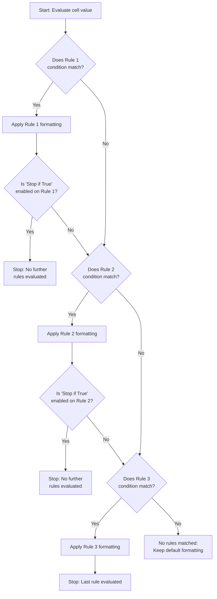

# Conditional Formatting

Conditional formatting allows you to change the visual appearance of cells automatically based on their values or specific conditions. Instead of manually scanning rows and columns to spot patterns, you define rules that tell Calc when and how to format cells — and Calc applies those formats instantly whenever the data meets the criteria.

Common use cases for conditional formatting include:

- **Highlighting outliers** — flag values that are unusually high or low
- **Creating visual dashboards** — turn a plain data table into a color-coded summary at a glance
- **Identifying trends** — shade cells to reveal patterns across rows, columns, or time periods
- **Flagging errors or missing data** — draw attention to cells that need review

This chapter covers all major conditional formatting rule types — highlight cell rules, top/bottom rules, color scales, data bars, icon sets, and formula-based rules — with practical examples using the Acme Corp sample dataset introduced in the [Introduction](00-introduction.md). By the end of this chapter, you will build a complete Sales Performance Dashboard that combines multiple rules for a professional, at-a-glance view of your data.

---

## What Is Conditional Formatting?

Conditional formatting is a feature that applies visual formatting — such as background colors, font styles, icons, or gradient fills — to cells **automatically** based on rules you define. Each rule specifies a condition and a format: when a cell's value satisfies the condition, Calc applies the corresponding format.

### How It Works

1. **You define one or more rules** for a selected range of cells
2. **Calc evaluates each cell** in the range against the rules
3. **If a condition is met**, the corresponding formatting is applied to that cell
4. **If no condition is met**, the cell retains its default formatting (no change)

Rules are evaluated in **priority order** — the first matching rule that applies to a cell determines its formatting (unless "Stop if True" is disabled, which allows multiple rules to stack). You can create, edit, reorder, and delete rules at any time.

### Common Use Cases

| Use Case | Description | Example |
|----------|-------------|---------|
| Highlighting above/below targets | Compare values against a threshold | Sales above 18,000 get a green background |
| Color-coding performance ratings | Assign colors to performance tiers | Red for low performers, green for top performers |
| Identifying duplicates | Flag repeated values in a range | Duplicate region names highlighted in yellow |
| Creating visual heat maps | Apply color gradients across a dataset | Darker shades for higher sales, lighter for lower |
| Tracking progress | Show status with icons or data bars | Arrows indicating improvement or decline |

### Key Terminology

| Term | Meaning |
|------|---------|
| **Rule** | A condition-format pair: "If cell value > 15000, apply green fill" |
| **Condition** | The logical test a cell value is checked against |
| **Format** | The visual style applied when the condition is true (color, font, icon, bar) |
| **Priority** | The order in which rules are evaluated; higher-priority rules are checked first |
| **Stop if True** | A setting that prevents further rules from being evaluated once a match is found |

---

## Highlight Cell Rules

Highlight cell rules are the most common type of conditional formatting. They compare each cell's value against a specified threshold and apply formatting when the comparison is true. These rules are straightforward to set up and cover most everyday formatting needs.

The five standard highlight rule types are: Greater Than, Less Than, Between, Equal To, and Text Contains.

### Greater Than

**Condition:** Cell value is greater than a specified value.

**Configuration:**
1. Select the target range (e.g., C2:C6 for Q1 Sales)
2. Open Conditional Formatting → Highlight Cell Rules → Greater Than
3. Enter the threshold value (e.g., 15000)
4. Choose the format (e.g., green background fill)

**Example — Q1 Sales greater than 15,000:**

Using the Acme Corp sample dataset, apply a "Greater Than 15000" rule to the Q1 Sales column (C2:C6):

| Cell | Employee | Q1 Sales | Greater Than 15000? | Formatting Applied |
|------|----------|----------|---------------------|--------------------|
| C2   | Alice    | 15000    | No (15000 is not > 15000) | None |
| C3   | Bob      | 12000    | No | None |
| C4   | Carol    | 20000    | Yes | **Green background** |
| C5   | Dave     | 11000    | No | None |
| C6   | Eve      | 18000    | Yes | **Green background** |

**Result:** Carol (20,000) and Eve (18,000) are highlighted with green backgrounds because their Q1 Sales exceed 15,000. Alice's value of exactly 15,000 is not highlighted because the condition requires strictly greater than.

### Less Than

**Condition:** Cell value is less than a specified value.

**Configuration:**
1. Select the target range (e.g., C2:C6)
2. Open Conditional Formatting → Highlight Cell Rules → Less Than
3. Enter the threshold value (e.g., 13000)
4. Choose the format (e.g., red background fill)

**Example — Q1 Sales less than 13,000:**

| Cell | Employee | Q1 Sales | Less Than 13000? | Formatting Applied |
|------|----------|----------|------------------|--------------------|
| C2   | Alice    | 15000    | No | None |
| C3   | Bob      | 12000    | Yes | **Red background** |
| C4   | Carol    | 20000    | No | None |
| C5   | Dave     | 11000    | Yes | **Red background** |
| C6   | Eve      | 18000    | No | None |

**Result:** Bob (12,000) and Dave (11,000) are highlighted with red backgrounds.

### Between

**Condition:** Cell value falls between two specified values (inclusive on both ends).

**Configuration:**
1. Select the target range (e.g., C2:C6)
2. Open Conditional Formatting → Highlight Cell Rules → Between
3. Enter the lower bound (e.g., 13000) and upper bound (e.g., 18000)
4. Choose the format (e.g., yellow background fill)

**Example — Q1 Sales between 13,000 and 18,000:**

| Cell | Employee | Q1 Sales | Between 13000 and 18000? | Formatting Applied |
|------|----------|----------|-------------------------|--------------------|
| C2   | Alice    | 15000    | Yes (13000 ≤ 15000 ≤ 18000) | **Yellow background** |
| C3   | Bob      | 12000    | No (12000 < 13000) | None |
| C4   | Carol    | 20000    | No (20000 > 18000) | None |
| C5   | Dave     | 11000    | No (11000 < 13000) | None |
| C6   | Eve      | 18000    | Yes (13000 ≤ 18000 ≤ 18000) | **Yellow background** |

**Result:** Alice (15,000) and Eve (18,000) are highlighted. The "Between" rule is inclusive, so Eve's exact boundary value of 18,000 is included.

### Equal To

**Condition:** Cell value equals a specified value exactly.

**Configuration:**
1. Select the target range (e.g., B2:B6 for Region)
2. Open Conditional Formatting → Highlight Cell Rules → Equal To
3. Enter the match value (e.g., "North")
4. Choose the format (e.g., blue background fill)

**Example — Region equal to "North":**

| Cell | Employee | Region | Equal to "North"? | Formatting Applied |
|------|----------|--------|-------------------|--------------------|
| B2   | Alice    | North  | Yes | **Blue background** |
| B3   | Bob      | South  | No | None |
| B4   | Carol    | East   | No | None |
| B5   | Dave     | West   | No | None |
| B6   | Eve      | North  | Yes | **Blue background** |

**Result:** Alice and Eve are highlighted because they both belong to the North region.

### Text Contains

**Condition:** Cell text contains a specified substring.

**Configuration:**
1. Select the target range (e.g., G2:G6 for Product)
2. Open Conditional Formatting → Highlight Cell Rules → Text Contains
3. Enter the search text (e.g., "Widget A")
4. Choose the format (e.g., bold text)

**Example — Product containing "Widget A":**

| Cell | Employee | Product  | Contains "Widget A"? | Formatting Applied |
|------|----------|----------|----------------------|--------------------|
| G2   | Alice    | Widget A | Yes | **Bold text** |
| G3   | Bob      | Widget B | No | None |
| G4   | Carol    | Widget A | Yes | **Bold text** |
| G5   | Dave     | Widget C | No | None |
| G6   | Eve      | Widget B | No | None |

**Result:** Alice and Carol's product cells are displayed in bold because their product names contain "Widget A."

**Tip:** Text Contains is case-insensitive in most spreadsheet applications — searching for "widget a" would also match "Widget A."

---

## Top/Bottom Rules

Top/Bottom rules highlight cells based on their rank within the selected range rather than comparing against a fixed value. These rules are useful when you want to identify the highest or lowest performers, or cells above or below the average, without manually calculating thresholds.

### Top N Items

**What it does:** Selects the top N values from the range and applies formatting to those cells.

**Configuration:**
1. Select the target range (e.g., C2:C6 for Q1 Sales)
2. Open Conditional Formatting → Top/Bottom Rules → Top N Items
3. Enter N (e.g., 3 for the top three values)
4. Choose the format (e.g., green bold text)

**Example — Top 3 Q1 Sales values:**

First, sort the Q1 Sales values to identify the top three:

| Rank | Employee | Q1 Sales |
|------|----------|----------|
| 1    | Carol    | 20000    |
| 2    | Eve      | 18000    |
| 3    | Alice    | 15000    |
| 4    | Bob      | 12000    |
| 5    | Dave     | 11000    |

The top 3 values are 20,000, 18,000, and 15,000.

**Result applied to original data:**

| Cell | Employee | Q1 Sales | In Top 3? | Formatting Applied |
|------|----------|----------|-----------|--------------------|
| C2   | Alice    | 15000    | Yes (rank 3) | **Green bold** |
| C3   | Bob      | 12000    | No | None |
| C4   | Carol    | 20000    | Yes (rank 1) | **Green bold** |
| C5   | Dave     | 11000    | No | None |
| C6   | Eve      | 18000    | Yes (rank 2) | **Green bold** |

### Bottom N Items

**What it does:** Selects the bottom N values from the range and applies formatting to those cells.

**Configuration:**
1. Select the target range (e.g., C2:C6)
2. Open Conditional Formatting → Top/Bottom Rules → Bottom N Items
3. Enter N (e.g., 2)
4. Choose the format (e.g., red italic text)

**Example — Bottom 2 Q1 Sales values:**

The two lowest Q1 Sales values are:

| Rank (Bottom) | Employee | Q1 Sales |
|---------------|----------|----------|
| 1 (lowest)    | Dave     | 11000    |
| 2             | Bob      | 12000    |

**Result:**

| Cell | Employee | Q1 Sales | In Bottom 2? | Formatting Applied |
|------|----------|----------|---------------|--------------------|
| C2   | Alice    | 15000    | No | None |
| C3   | Bob      | 12000    | Yes (rank 2) | *Red italic* |
| C4   | Carol    | 20000    | No | None |
| C5   | Dave     | 11000    | Yes (rank 1) | *Red italic* |
| C6   | Eve      | 18000    | No | None |

### Above Average

**What it does:** Highlights cells with values above the arithmetic mean of the selected range.

**Step-by-step calculation:**

1. Identify the Q1 Sales values in C2:C6: 15000, 12000, 20000, 11000, 18000
2. Calculate the sum: 15000 + 12000 + 20000 + 11000 + 18000 = 76000
3. Count the values: 5
4. Calculate the average: 76000 ÷ 5 = **15200**
5. Compare each cell value to 15200

| Cell | Employee | Q1 Sales | Above 15200? | Formatting Applied |
|------|----------|----------|-------------|--------------------|
| C2   | Alice    | 15000    | No (15000 < 15200) | None |
| C3   | Bob      | 12000    | No (12000 < 15200) | None |
| C4   | Carol    | 20000    | Yes (20000 > 15200) | **Green background** |
| C5   | Dave     | 11000    | No (11000 < 15200) | None |
| C6   | Eve      | 18000    | Yes (18000 > 15200) | **Green background** |

**Result:** Carol and Eve have Q1 Sales above the average of 15,200 and are highlighted. Alice's 15,000 is just below the average and is not highlighted.

### Below Average

**What it does:** Highlights cells with values below the arithmetic mean of the selected range.

Using the same average of 15,200 calculated above:

| Cell | Employee | Q1 Sales | Below 15200? | Formatting Applied |
|------|----------|----------|-------------|--------------------|
| C2   | Alice    | 15000    | Yes (15000 < 15200) | **Orange background** |
| C3   | Bob      | 12000    | Yes (12000 < 15200) | **Orange background** |
| C4   | Carol    | 20000    | No (20000 > 15200) | None |
| C5   | Dave     | 11000    | Yes (11000 < 15200) | **Orange background** |
| C6   | Eve      | 18000    | No (18000 > 15200) | None |

**Result:** Alice, Bob, and Dave have Q1 Sales below the average and are highlighted. Note that Alice is only 200 below the average — Above/Below Average rules can surface subtle differences that are hard to spot visually.

---

## Color Scales

Color scales apply gradient fills to cells, shading each cell from one color to another based on its value relative to the range's minimum and maximum. Color scales turn a column of numbers into a visual heat map, making it easy to spot high and low values at a glance without reading every number.

### 2-Color Scale

A 2-color scale assigns one color to the minimum value and another color to the maximum value. All intermediate values receive a blended shade proportional to their position between the minimum and maximum.

**Configuration:**
1. Select the target range (e.g., C2:C6 for Q1 Sales)
2. Open Conditional Formatting → Color Scales → 2-Color Scale
3. Choose the minimum color (e.g., white) and maximum color (e.g., dark green)
4. Optionally set the minimum and maximum to specific values, percentiles, or percentages

**Example — White-to-Green 2-Color Scale on Q1 Sales:**

The Q1 Sales range spans from 11,000 (minimum, Dave) to 20,000 (maximum, Carol). The range width is 20,000 − 11,000 = 9,000.

**Shade calculation for each employee:**

| Cell | Employee | Q1 Sales | Position in Range | Shade Percentage | Color |
|------|----------|----------|-------------------|------------------|-------|
| C5   | Dave     | 11000    | (11000−11000) ÷ 9000 = 0.00 | 0% | White |
| C3   | Bob      | 12000    | (12000−11000) ÷ 9000 = 0.11 | 11% | Very light green |
| C2   | Alice    | 15000    | (15000−11000) ÷ 9000 = 0.44 | 44% | Light green |
| C6   | Eve      | 18000    | (18000−11000) ÷ 9000 = 0.78 | 78% | Medium-dark green |
| C4   | Carol    | 20000    | (20000−11000) ÷ 9000 = 1.00 | 100% | Dark green |

**Visual interpretation:** The darker the green, the higher the sales. Carol's cell is the darkest; Dave's cell is white.

### 3-Color Scale

A 3-color scale uses three reference points — minimum, midpoint, and maximum — each assigned a different color. Values between reference points blend smoothly from one color to the next, creating a gradient with more visual distinction than a 2-color scale.

**Configuration:**
1. Select the target range (e.g., C2:C6)
2. Open Conditional Formatting → Color Scales → 3-Color Scale
3. Set the minimum color (e.g., red), midpoint color (e.g., yellow), and maximum color (e.g., green)
4. Define the midpoint value — this can be a specific value, the median, a percentile, or a percentage
5. Optionally override the minimum and maximum values

**Example — Red-Yellow-Green 3-Color Scale on Q1 Sales:**

Using manual reference points: Minimum = 11,000 (red), Midpoint = 15,000 (yellow), Maximum = 20,000 (green).

| Cell | Employee | Q1 Sales | Position Relative to References | Color |
|------|----------|----------|---------------------------------|-------|
| C5   | Dave     | 11000    | At minimum | Red |
| C3   | Bob      | 12000    | Between minimum and midpoint (25%) | Red-orange |
| C2   | Alice    | 15000    | At midpoint | Yellow |
| C6   | Eve      | 18000    | Between midpoint and maximum (60%) | Yellow-green |
| C4   | Carol    | 20000    | At maximum | Green |

### Scale Reference Options

The minimum, midpoint, and maximum do not have to correspond to actual values in your data. You can set them using several methods:

| Reference Type | Description | When to Use |
|----------------|-------------|-------------|
| **Minimum/Maximum value** | Automatically uses the lowest and highest values in the range | Default option; good for relative comparison within the current data |
| **Specific number** | A fixed value you define (e.g., 10000 for minimum, 25000 for maximum) | When you have known benchmarks or targets to compare against |
| **Percentile** | A percentile rank (e.g., 25th percentile for minimum, 75th for maximum) | When you want to highlight the middle 50% differently from extremes |
| **Percentage** | A percentage of the range (e.g., 0% for minimum, 50% for midpoint, 100% for maximum) | When you want evenly distributed color bands |

**Tip:** Using fixed numbers as reference points ensures consistent coloring even when data changes. If you use minimum/maximum values, the colors recalculate whenever data is updated — which is useful for dynamic analysis but can make comparisons across time periods inconsistent.

---

## Data Bars

Data bars are horizontal bars displayed inside cells that visually represent the magnitude of each cell's value. Longer bars indicate higher values, and shorter bars indicate lower values — similar to a miniature bar chart embedded directly in your spreadsheet cells.

### How Data Bars Work

Each cell in the selected range receives a bar whose length is proportional to the cell's value relative to the range's minimum and maximum. The bar fills a portion of the cell width, creating an in-cell visualization that supplements the numeric value.

### Configuration Options

| Option | Description | Choices |
|--------|-------------|---------|
| **Bar direction** | Direction the bar extends within the cell | Left-to-right (default), right-to-left |
| **Minimum value** | The value that corresponds to no bar (0% width) | Automatic (uses range minimum) or a specific number |
| **Maximum value** | The value that corresponds to a full-width bar (100% width) | Automatic (uses range maximum) or a specific number |
| **Fill type** | How the bar is rendered | Solid fill (uniform color) or gradient fill (color fades from dark to light) |
| **Bar color** | The color of the bar | Any color; commonly blue, green, or orange |
| **Show bar only** | Whether to hide the numeric value and show only the bar | Yes (bar only) or No (bar + number, default) |

### Example — Data Bars on Q1 Sales

Apply solid blue data bars to Q1 Sales (C2:C6). Using automatic minimum (11,000) and maximum (20,000):

**Bar length calculation:** Each bar's width is proportional to `(value − minimum) ÷ (maximum − minimum)`.

| Cell | Employee | Q1 Sales | Bar Width | Visual Representation |
|------|----------|----------|-----------|----------------------|
| C5   | Dave     | 11000    | (11000−11000) ÷ 9000 = 0% | (no bar) |
| C3   | Bob      | 12000    | (12000−11000) ÷ 9000 = 11% | `█` |
| C2   | Alice    | 15000    | (15000−11000) ÷ 9000 = 44% | `█████` |
| C6   | Eve      | 18000    | (18000−11000) ÷ 9000 = 78% | `█████████` |
| C4   | Carol    | 20000    | (20000−11000) ÷ 9000 = 100% | `████████████` |

**Visual interpretation:** Carol's cell has the longest bar (full width), while Dave's cell has no visible bar. The relative bar lengths make it immediately obvious that Carol is the top Q1 performer and Dave is at the bottom — even without reading the numbers.

**Tip:** Data bars work best with numeric data that has a meaningful range. If values are very close together, the bars will look nearly identical. In that case, consider using color scales or icon sets instead for clearer differentiation.

---

## Icon Sets

Icon sets display small graphical icons inside cells based on value thresholds. Icons provide an intuitive, at-a-glance indicator of status, direction, or rating — similar to traffic lights or star ratings.

### How Icon Sets Work

You define threshold values that divide the range into segments. Each segment is assigned a different icon. Calc evaluates each cell's value, determines which segment it falls into, and displays the corresponding icon.

### Directional Arrows (3 Arrows)

Directional arrows use up, sideways, and down arrows to indicate high, medium, and low values.

**Threshold configuration for Q1 Sales:**

| Icon | Meaning | Condition |
|------|---------|-----------|
| ↑ (green up arrow) | High performance | Value ≥ 18000 |
| → (yellow sideways arrow) | Medium performance | Value between 14000 and 17999 |
| ↓ (red down arrow) | Low performance | Value < 14000 |

**Applied to the Acme Corp Q1 Sales data:**

| Cell | Employee | Q1 Sales | Segment | Icon |
|------|----------|----------|---------|------|
| C2   | Alice    | 15000    | 14000–17999 (medium) | → |
| C3   | Bob      | 12000    | < 14000 (low) | ↓ |
| C4   | Carol    | 20000    | ≥ 18000 (high) | ↑ |
| C5   | Dave     | 11000    | < 14000 (low) | ↓ |
| C6   | Eve      | 18000    | ≥ 18000 (high) | ↑ |

**Result:** Carol and Eve display up arrows (strong Q1 performance), Alice displays a sideways arrow (moderate), and Bob and Dave display down arrows (below the medium threshold).

### Traffic Lights (3 Circles)

Traffic light icons use colored circles — green, yellow, and red — following the familiar traffic signal metaphor.

**Threshold configuration (same boundaries as arrows above):**

| Icon | Meaning | Condition |
|------|---------|-----------|
| Green circle | On track / good | Value ≥ 18000 |
| Yellow circle | Caution / moderate | Value between 14000 and 17999 |
| Red circle | Warning / low | Value < 14000 |

**Applied to Q1 Sales:**

| Employee | Q1 Sales | Traffic Light |
|----------|----------|---------------|
| Alice    | 15000    | Yellow |
| Bob      | 12000    | Red |
| Carol    | 20000    | Green |
| Dave     | 11000    | Red |
| Eve      | 18000    | Green |

### Star Ratings (5 Stars)

Star ratings divide the range into five equal segments (quintiles) and assign a star count from one to five based on which quintile the value falls into.

**Threshold configuration for Q1 Sales (range 11,000 to 20,000):**

The range width is 9,000. Each quintile spans 9,000 ÷ 5 = 1,800.

| Stars | Range | Condition |
|-------|-------|-----------|
| ★★★★★ (5 stars) | 18200–20000 | Top quintile |
| ★★★★☆ (4 stars) | 16400–18199 | Second quintile |
| ★★★☆☆ (3 stars) | 14600–16399 | Third quintile |
| ★★☆☆☆ (2 stars) | 12800–14599 | Fourth quintile |
| ★☆☆☆☆ (1 star)  | 11000–12799 | Bottom quintile |

**Applied to Q1 Sales:**

| Employee | Q1 Sales | Quintile | Rating |
|----------|----------|----------|--------|
| Alice    | 15000    | 14600–16399 (3rd) | ★★★☆☆ |
| Bob      | 12000    | 11000–12799 (5th) | ★☆☆☆☆ |
| Carol    | 20000    | 18200–20000 (1st) | ★★★★★ |
| Dave     | 11000    | 11000–12799 (5th) | ★☆☆☆☆ |
| Eve      | 18000    | 16400–18199 (2nd) | ★★★★☆ |

**Tip:** Icon sets pair well with other conditional formatting types. You can apply icons to one column and color scales to another column in the same dataset for a multi-dimensional visual dashboard.

---

## Formula-Based Conditional Formatting

Formula-based rules provide the most flexible conditional formatting in Calc. Instead of using a fixed comparison (greater than, less than), you write a formula that returns TRUE or FALSE for each cell. When the formula evaluates to TRUE, the formatting is applied; when it evaluates to FALSE, no formatting is applied.

This flexibility allows you to:

- Format cells based on values in **other columns**
- Apply formatting to **entire rows** based on a single column's value
- Create complex, **multi-condition** rules using AND, OR, and other functions
- Highlight **duplicates**, **unique values**, or cells matching a pattern

### Example 1: Highlight Entire Row Based on One Column

**Goal:** Highlight every cell in a row when the employee's product (column G) is "Widget A."

**Formula:**

```text
=$G2="Widget A"
```

**Applied to range:** A2:G6 (the entire data area excluding headers)

**Key detail:** The dollar sign before G (`$G`) locks the column reference so that no matter which column Calc is evaluating, it always checks column G. The row reference (2) is relative, so it adjusts as Calc moves down each row.

**Step-by-step evaluation:**

| Row | Employee | $G value (Product) | Formula Result | Row Formatted? |
|-----|----------|-------------------|----------------|----------------|
| 2   | Alice    | Widget A          | `"Widget A" = "Widget A"` → TRUE | Yes — entire row highlighted |
| 3   | Bob      | Widget B          | `"Widget B" = "Widget A"` → FALSE | No |
| 4   | Carol    | Widget A          | `"Widget A" = "Widget A"` → TRUE | Yes — entire row highlighted |
| 5   | Dave     | Widget C          | `"Widget C" = "Widget A"` → FALSE | No |
| 6   | Eve      | Widget B          | `"Widget B" = "Widget A"` → FALSE | No |

**Result:** Rows for Alice and Carol (both selling Widget A) are highlighted across all columns.

### Example 2: Compare Two Columns

**Goal:** Highlight Q2 Sales cells where Q2 Sales exceed Q1 Sales (sales improved quarter-over-quarter).

**Formula:**

```text
=D2>C2
```

**Applied to range:** D2:D6 (Q2 Sales column)

**Step-by-step evaluation:**

| Cell | Employee | Q1 Sales (C) | Q2 Sales (D) | D > C? | Formatted? |
|------|----------|---------------|---------------|--------|------------|
| D2   | Alice    | 15000         | 18000         | 18000 > 15000 → TRUE | Yes |
| D3   | Bob      | 12000         | 14000         | 14000 > 12000 → TRUE | Yes |
| D4   | Carol    | 20000         | 17000         | 17000 > 20000 → FALSE | No |
| D5   | Dave     | 11000         | 13000         | 13000 > 11000 → TRUE | Yes |
| D6   | Eve      | 18000         | 21000         | 21000 > 18000 → TRUE | Yes |

**Result:** Alice, Bob, Dave, and Eve all improved from Q1 to Q2 and their Q2 cells are highlighted. Carol's Q2 Sales decreased from Q1, so her cell remains unformatted.

### Example 3: Highlight Duplicates

**Goal:** Highlight duplicate values in the Region column (B2:B6).

**Formula:**

```text
=COUNTIF($B$2:$B$6,B2)>1
```

**Applied to range:** B2:B6 (Region column)

**How it works:** The COUNTIF function counts how many times each cell's value appears in the entire range B2:B6. If the count is greater than 1, the value is a duplicate and the formula returns TRUE.

**Step-by-step evaluation:**

| Cell | Region | COUNTIF Result | Count > 1? | Formatted? |
|------|--------|----------------|------------|------------|
| B2   | North  | COUNTIF finds "North" 2 times (B2, B6) → 2 | 2 > 1 → TRUE | Yes |
| B3   | South  | COUNTIF finds "South" 1 time (B3) → 1 | 1 > 1 → FALSE | No |
| B4   | East   | COUNTIF finds "East" 1 time (B4) → 1 | 1 > 1 → FALSE | No |
| B5   | West   | COUNTIF finds "West" 1 time (B5) → 1 | 1 > 1 → FALSE | No |
| B6   | North  | COUNTIF finds "North" 2 times (B2, B6) → 2 | 2 > 1 → TRUE | Yes |

**Result:** Cells B2 and B6 (both "North") are highlighted as duplicates. All other regions appear only once and are not formatted.

**Tip:** When writing formula-based rules, use dollar signs (`$`) carefully. Lock the column (`$B2`) when the column should stay fixed as the rule evaluates across columns. Lock the row (`B$2`) when the row should stay fixed. Lock both (`$B$2`) for an absolute reference that never changes.

---

## Managing and Prioritizing Multiple Rules

As you apply more conditional formatting rules to a range, managing those rules becomes important. Rules can overlap — multiple rules may apply to the same cell — and the order in which they are evaluated determines the final appearance.

### Rule Evaluation Order

Rules are evaluated **from top to bottom** in the rules list (as shown in the Manage Rules dialog). The order matters because:

1. The **first matching rule** applies its formatting to the cell
2. If **"Stop if True"** is enabled on that rule, no further rules are evaluated for that cell
3. If **"Stop if True"** is not enabled, Calc continues checking subsequent rules, and later rules may override or layer on top of earlier formatting

### "Stop if True" Behavior

The "Stop if True" setting controls whether rule evaluation continues after a match:

| Setting | Behavior |
|---------|----------|
| **Stop if True: Enabled** | When this rule matches, formatting is applied and **no further rules are checked** for that cell |
| **Stop if True: Disabled** | When this rule matches, formatting is applied but **subsequent rules are still evaluated** — later matches may add to or override the formatting |

**Example:** You have two rules on cell C4 (Carol, Q1 Sales = 20,000):
- Rule 1: "Greater than 18000 → Green background" (Stop if True: Enabled)
- Rule 2: "Top 3 → Bold text"

With "Stop if True" enabled on Rule 1, Carol's cell gets a green background but does **not** get bold text, because evaluation stops after Rule 1 matches. If you disable "Stop if True" on Rule 1, Carol's cell would get **both** a green background and bold text.

### Managing Rules

To manage conditional formatting rules, open the **Manage Rules** dialog (typically found under Format → Conditional Formatting → Manage Rules). From this dialog you can:

| Action | How To |
|--------|--------|
| **View existing rules** | Open the Manage Rules dialog to see all rules applied to the current selection or entire sheet |
| **Edit a rule** | Select a rule in the list and click Edit to modify its condition or formatting |
| **Delete a rule** | Select a rule and click Delete to remove it |
| **Reorder rules** | Use the Move Up / Move Down buttons (or drag and drop) to change rule priority |
| **Add a new rule** | Click New Rule to create an additional conditional formatting rule |

### Tips for Managing Complex Rule Sets

- **Keep rules simple:** Each rule should test one condition. Complex logic is easier to debug when broken into multiple simple rules rather than one complex formula
- **Document your rules:** Use a separate note or comment in your spreadsheet listing what each rule does — this helps when revisiting the file weeks or months later
- **Test incrementally:** Add one rule at a time and verify its effect before adding the next. This makes it easy to identify which rule causes unexpected behavior
- **Name your ranges:** If your rules apply to named ranges, changes to the data range automatically update the rules
- **Review regularly:** As data grows or changes, revisit your rules to ensure they still make sense with the current data distribution

---

## How Rules Are Evaluated

The following flowchart illustrates how Calc evaluates conditional formatting rules for a single cell when multiple rules are defined. The process starts at the top of the rules list and proceeds downward.



**Reading the flowchart:**

1. Calc starts by checking Rule 1 against the cell's value
2. If Rule 1 matches, its formatting is applied. If "Stop if True" is enabled, evaluation ends immediately
3. If Rule 1 does not match (or "Stop if True" is disabled), Calc proceeds to Rule 2
4. The process repeats for each rule in the list
5. If no rules match at all, the cell retains its default formatting with no conditional changes

This evaluation model means that **rule order matters**. If you want a specific rule to take precedence, place it higher in the list. If you want rules to combine (e.g., one rule sets background color and another sets font style), ensure "Stop if True" is disabled on all but the last rule.

---

## Practical Example: Sales Performance Dashboard

This section brings together multiple conditional formatting techniques to create a comprehensive, color-coded dashboard using the Acme Corp quarterly sales data from the [Introduction](00-introduction.md).

### Source Data

| | A | B | C | D | E | F | G |
|---|---|---|---|---|---|---|---|
| **1** | Employee | Region | Q1 Sales | Q2 Sales | Q3 Sales | Q4 Sales | Product |
| **2** | Alice | North | 15000 | 18000 | 22000 | 19000 | Widget A |
| **3** | Bob | South | 12000 | 14000 | 13000 | 16000 | Widget B |
| **4** | Carol | East | 20000 | 17000 | 25000 | 23000 | Widget A |
| **5** | Dave | West | 11000 | 13000 | 15000 | 14000 | Widget C |
| **6** | Eve | North | 18000 | 21000 | 19000 | 22000 | Widget B |

### Dashboard Rules

We will apply four conditional formatting rules to build the dashboard:

| Rule # | Rule Type | Range | Condition | Format |
|--------|-----------|-------|-----------|--------|
| 1 | 3-Color Scale | C2:F6 | Green (high) → Yellow (mid) → Red (low) | Gradient background fill |
| 2 | Icon Set (3 Arrows) | F2:F6 | ≥20000: ↑, 15000–19999: →, <15000: ↓ | Arrow icons in Q4 cells |
| 3 | Formula-Based | A2:G6 | Total annual sales > 70000 | Bold + green text |
| 4 | Highlight Cell | C2:F6 | Cell value < 13000 | Red background |

### Step-by-Step Setup

#### Rule 1: 3-Color Scale on All Sales Columns

1. **Select range** C2:F6 (all quarterly sales values)
2. Open Conditional Formatting → Color Scales → 3-Color Scale
3. Set minimum = red, midpoint = yellow, maximum = green
4. The values span from 11,000 (Dave, Q1) to 25,000 (Carol, Q3)

The color scale automatically maps:
- 11,000 → Red (lowest value in the range)
- 18,000 → Yellow (midpoint of 11,000–25,000 = 18,000)
- 25,000 → Green (highest value in the range)

#### Rule 2: Icon Set on Q4 Sales

1. **Select range** F2:F6 (Q4 Sales column)
2. Open Conditional Formatting → Icon Sets → 3 Arrows
3. Configure thresholds:
   - ↑ (green up arrow): Value ≥ 20000
   - → (yellow sideways arrow): Value between 15000 and 19999
   - ↓ (red down arrow): Value < 15000

**Evaluation for each employee:**

| Employee | Q4 Sales | Threshold Check | Icon |
|----------|----------|-----------------|------|
| Alice    | 19000    | 15000 ≤ 19000 < 20000 | → |
| Bob      | 16000    | 15000 ≤ 16000 < 20000 | → |
| Carol    | 23000    | 23000 ≥ 20000 | ↑ |
| Dave     | 14000    | 14000 < 15000 | ↓ |
| Eve      | 22000    | 22000 ≥ 20000 | ↑ |

#### Rule 3: Bold Green Text for High Annual Performers

1. **Select range** A2:G6 (entire data area)
2. Open Conditional Formatting → New Rule → Use a Formula
3. Enter the formula:

```text
=($C2+$D2+$E2+$F2)>70000
```

4. Set format to bold text with green font color

**Annual sales calculation for each employee:**

| Employee | Q1 | Q2 | Q3 | Q4 | Annual Total | > 70000? | Format Applied |
|----------|----|----|----|----|-------------|----------|----------------|
| Alice    | 15000 | 18000 | 22000 | 19000 | 74000 | Yes | **Bold + green text** |
| Bob      | 12000 | 14000 | 13000 | 16000 | 55000 | No | None |
| Carol    | 20000 | 17000 | 25000 | 23000 | 85000 | Yes | **Bold + green text** |
| Dave     | 11000 | 13000 | 15000 | 14000 | 53000 | No | None |
| Eve      | 18000 | 21000 | 19000 | 22000 | 80000 | Yes | **Bold + green text** |

#### Rule 4: Red Background for Low Quarterly Sales

1. **Select range** C2:F6 (all quarterly sales values)
2. Open Conditional Formatting → Highlight Cell Rules → Less Than
3. Enter the threshold: 13000
4. Set format to red background

**Cells matching the condition (value < 13000):**

| Employee | Q1 | Q2 | Q3 | Q4 | Cells with Red Background |
|----------|----|----|----|----|--------------------------|
| Alice    | 15000 | 18000 | 22000 | 19000 | None |
| Bob      | **12000** | 14000 | 13000 | 16000 | C3 (Q1 = 12000) |
| Carol    | 20000 | 17000 | 25000 | 23000 | None |
| Dave     | **11000** | 13000 | 15000 | 14000 | C5 (Q1 = 11000) |
| Eve      | 18000 | 21000 | 19000 | 22000 | None |

Note: Bob's Q3 Sales of 13,000 is **not** highlighted because the condition is strictly "less than 13000" and 13,000 is not less than 13,000.

### Final Dashboard View

The table below shows the combined effect of all four rules. Formatting indicators are shown in brackets since Markdown cannot render actual colors.

| Row | Employee | Region | Q1 Sales | Q2 Sales | Q3 Sales | Q4 Sales | Product |
|-----|----------|--------|----------|----------|----------|----------|---------|
| 2 | **Alice** [Bold Green] | **North** [Bold Green] | **15000** [Bold Green] [Yellow scale] | **18000** [Bold Green] [Yellow scale] | **22000** [Bold Green] [Green scale] | **19000** [Bold Green] [Yellow scale] → | **Widget A** [Bold Green] |
| 3 | Bob | South | 12000 [Red BG] [Red scale] | 14000 [Red-Orange scale] | 13000 [Red-Orange scale] | 16000 [Yellow scale] → | Widget B |
| 4 | **Carol** [Bold Green] | **East** [Bold Green] | **20000** [Bold Green] [Green scale] | **17000** [Bold Green] [Yellow scale] | **25000** [Bold Green] [Green scale] | **23000** [Bold Green] [Green scale] ↑ | **Widget A** [Bold Green] |
| 5 | Dave | West | 11000 [Red BG] [Red scale] | 13000 [Red-Orange scale] | 15000 [Yellow scale] | 14000 [Red-Orange scale] ↓ | Widget C |
| 6 | **Eve** [Bold Green] | **North** [Bold Green] | **18000** [Bold Green] [Yellow scale] | **21000** [Bold Green] [Green scale] | **19000** [Bold Green] [Yellow-Green scale] | **22000** [Bold Green] [Green scale] ↑ | **Widget B** [Bold Green] |

### Reading the Dashboard Legend

| Indicator | Meaning |
|-----------|---------|
| **[Bold Green]** | Employee's annual sales exceed 70,000 (Rule 3) |
| [Green scale] | Cell value is near the maximum on the 3-color scale (Rule 1) |
| [Yellow scale] | Cell value is near the midpoint on the 3-color scale (Rule 1) |
| [Red-Orange scale] | Cell value is between the minimum and midpoint on the 3-color scale (Rule 1) |
| [Red scale] | Cell value is at or near the minimum on the 3-color scale (Rule 1) |
| [Red BG] | Cell value is below 13,000 — flagged as critically low (Rule 4) |
| ↑ | Q4 Sales ≥ 20,000 — strong finish to the year (Rule 2) |
| → | Q4 Sales between 15,000 and 19,999 — moderate finish (Rule 2) |
| ↓ | Q4 Sales < 15,000 — weak finish (Rule 2) |

### Dashboard Insights

With all four rules applied, the dashboard instantly communicates:

1. **Top performers are obvious:** Alice, Carol, and Eve have bold green text throughout their rows, signaling annual sales above 70,000
2. **Trouble spots stand out:** The red backgrounds on Bob's Q1 (12,000) and Dave's Q1 (11,000) immediately flag the lowest-performing quarters
3. **Q4 trajectory is clear:** The arrow icons in the Q4 column show Carol and Eve finishing strong (↑), Alice and Bob holding steady (→), and Dave trailing (↓)
4. **Overall trends are visible:** The color scale gradient across all sales columns reveals that Carol and Eve consistently outperform, while Dave's numbers remain in the red-to-yellow range throughout the year

---

## Tips and Common Errors

### Tips

- **Test rules one at a time:** Add one conditional formatting rule, verify it works correctly, then add the next. This makes it much easier to identify which rule causes unexpected behavior when multiple rules interact
- **Use absolute references when appropriate:** In formula-based rules, use `$A$1` (absolute) when the rule should always reference the same fixed cell, and mixed references like `$A2` when only the column should be locked. Incorrect references are the most common cause of formula-based rules not working as expected
- **Color scales and data bars work best with numeric data:** Applying color scales or data bars to cells containing text or mixed data types produces unpredictable results. Ensure your target range contains only numbers
- **Preview before committing:** Many spreadsheet applications show a live preview of the formatting as you configure the rule. Use this preview to verify the rule matches your expectations before clicking OK
- **Remove unnecessary formatting before sharing:** If conditional formatting is used for personal analysis but is distracting in a shared document, clear the rules before distributing the file. You can always re-apply them later
- **Combine formatting types for richer dashboards:** Use color scales for overall trends, icon sets for categorical status, and highlight rules for critical thresholds — all on the same dataset — to create a comprehensive visual dashboard

### Common Errors

| Error | Cause | Solution |
|-------|-------|----------|
| Formatting applies to wrong cells | Rule applied to incorrect range, or cell references in formula are not locked properly | Verify the selected range in Manage Rules; check `$` usage in formula references |
| Overlapping rules produce unexpected colors | Multiple rules match the same cell and the priority order is not what you intended | Open Manage Rules, reorder rules so the most important rule is first, and enable "Stop if True" where appropriate |
| Formula-based rule does not trigger | Formula returns a number or text instead of TRUE/FALSE | Ensure the formula is a logical test (uses `=`, `>`, `<`, `<>`, etc.) that evaluates to TRUE or FALSE |
| Color scale shows no variation | All values in the range are identical or very close | Widen the range, use manual minimum/maximum values, or switch to a different formatting type |
| Icons do not display | Icon set thresholds are misconfigured or the data type is not numeric | Verify threshold values match the actual data range; ensure cells contain numbers, not text formatted as numbers |
| Formatting disappears after editing data | Some applications clear conditional formatting when cells are cut/pasted or when rows are inserted/deleted | Re-apply the rule to the updated range, or use named ranges that adjust automatically |

---

## Navigation

| | | |
|---|---|---|
| [← Data Validation](07-data-validation.md) | [↑ Documentation Index](../README.md) | [Quick Reference →](09-quick-reference.md) |
