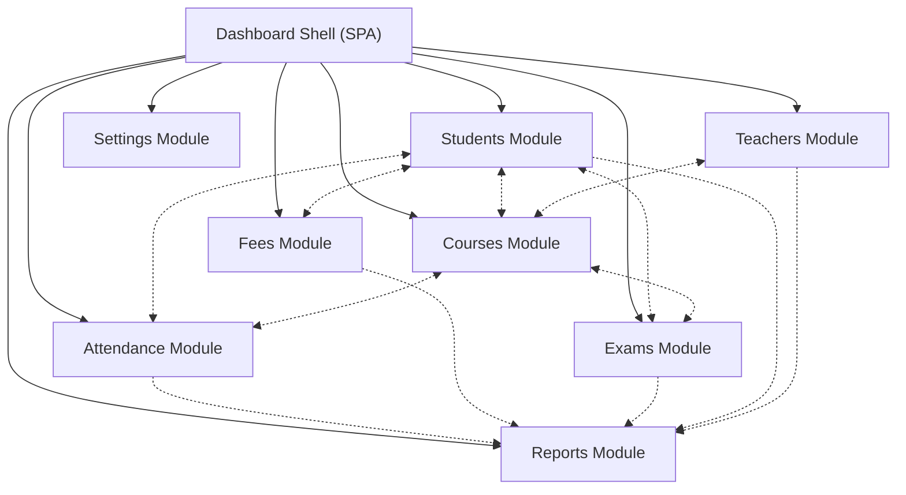
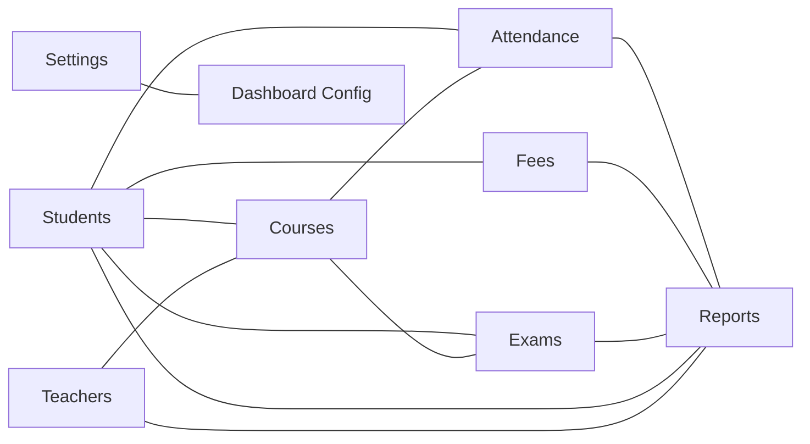
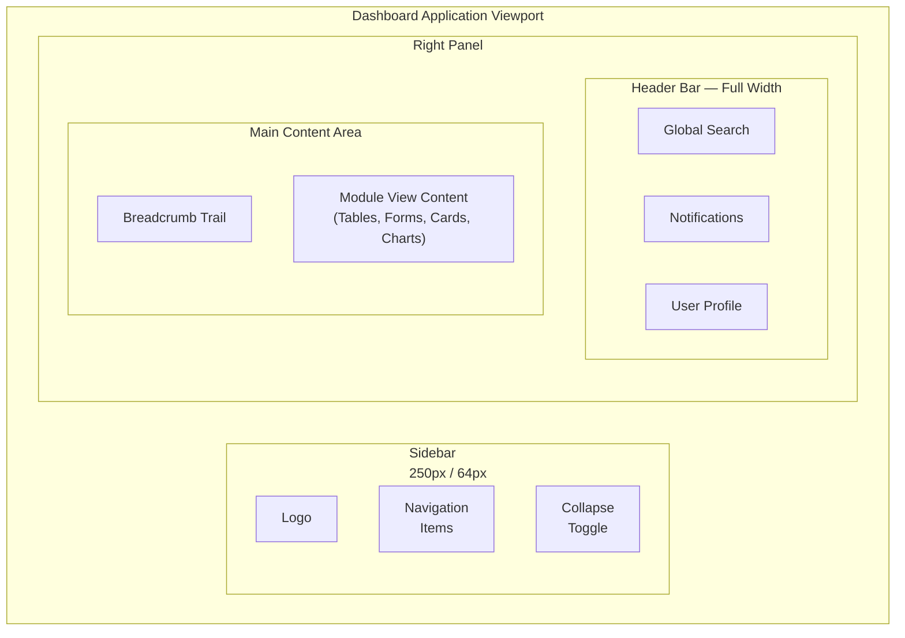
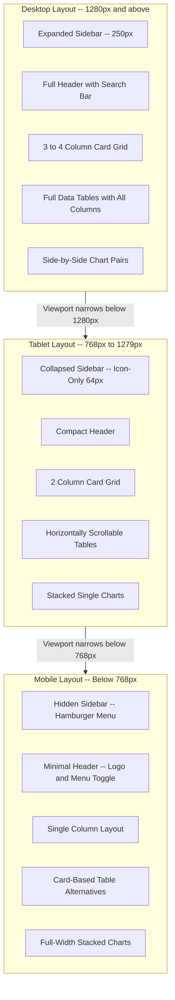
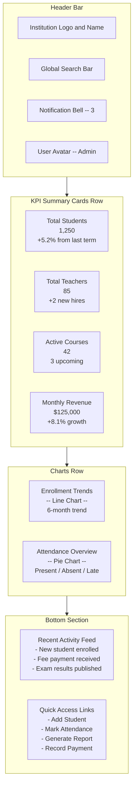
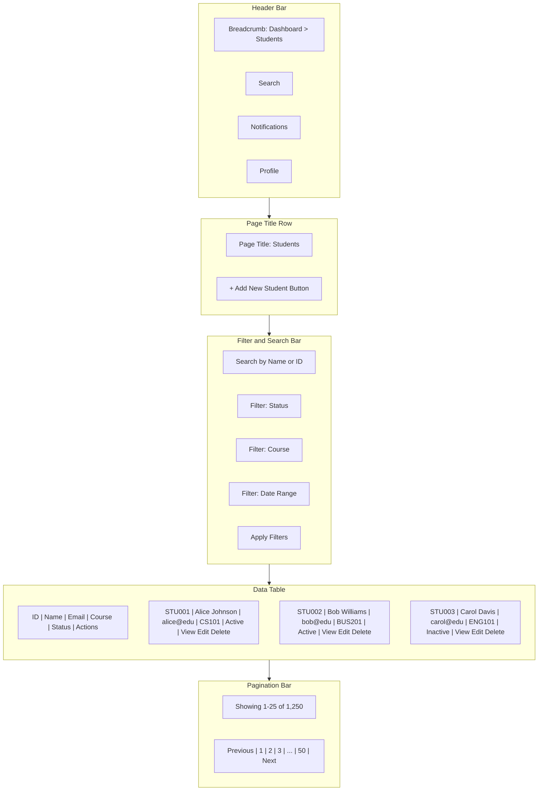
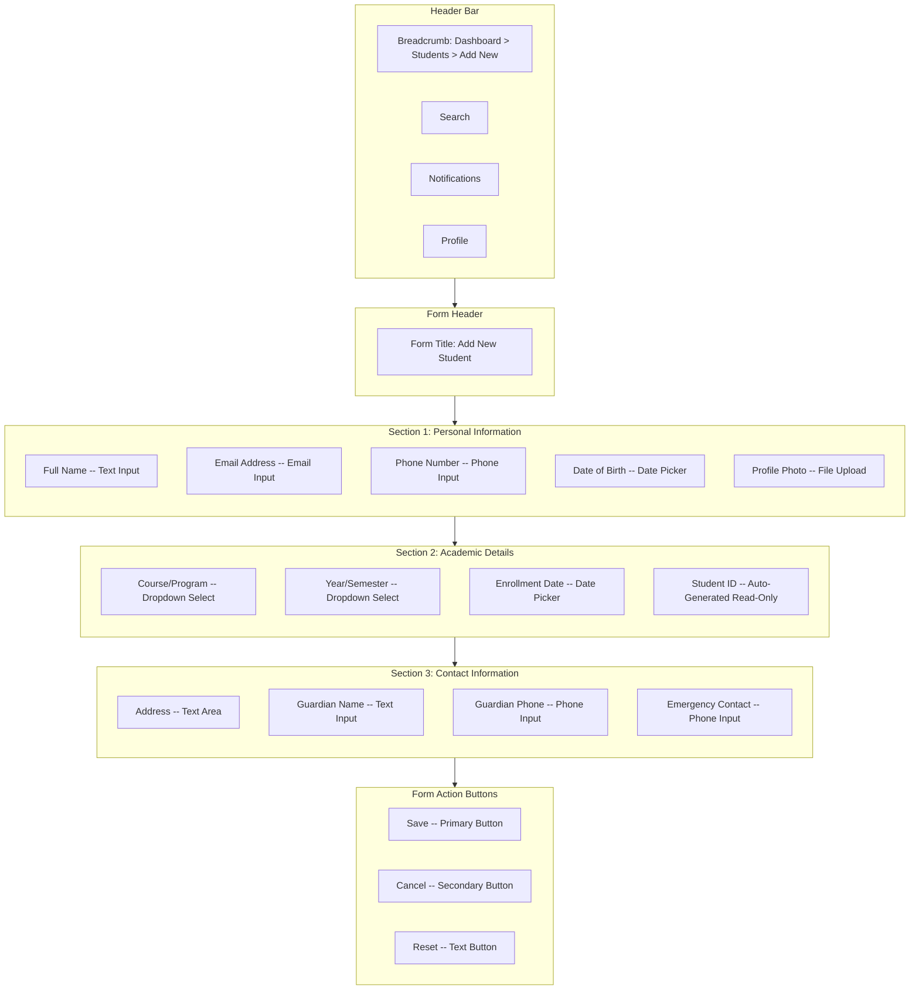

# College Management Admin Dashboard — UI Design Project Document

---

## Table of Contents

1. [Introduction](#1-introduction)
2. [Project Objectives](#2-project-objectives)
3. [Target Users](#3-target-users)
4. [System Overview](#4-system-overview)
5. [Dashboard Layout Structure](#5-dashboard-layout-structure)
6. [Description of Modules](#6-description-of-modules)
7. [UI Components](#7-ui-components)
8. [Color Scheme and Typography](#8-color-scheme-and-typography)
9. [Responsive Design Approach](#9-responsive-design-approach)
10. [User Experience Considerations](#10-user-experience-considerations)
11. [Wireframe Explanation](#11-wireframe-explanation)
12. [Conclusion](#12-conclusion)

---

## 1. Introduction

### 1.1 Project Background

Educational institutions across the globe face an ever-growing complexity in managing academic and administrative operations. Colleges, in particular, must coordinate a broad spectrum of activities including student enrollment, faculty management, course scheduling, attendance tracking, financial record-keeping, examination administration, and institutional reporting. Traditionally, many of these processes have relied on paper-based record systems, disparate spreadsheet files, and fragmented software tools that do not communicate with one another. This fragmentation leads to data duplication, increased risk of human error, delayed information retrieval, and an overall reduction in operational efficiency.

The College Management Admin Dashboard addresses these challenges by providing a unified, web-based administrative interface that consolidates all critical management functions into a single, cohesive platform. By centralizing data access and operational workflows within a modern dashboard application, administrative staff and college management personnel gain the ability to view, manage, and analyze institutional information in real time. The dashboard is designed as a Single-Page Application (SPA) that prioritizes usability, visual clarity, and efficient task completion.

This document presents the complete user interface design specification for the College Management Admin Dashboard. It has been prepared as an academic project submission and is intended to demonstrate a thorough, research-informed approach to UI design for enterprise-grade administrative systems within the higher education domain.

### 1.2 Purpose of the Document

This document serves as the comprehensive UI design specification for the College Management Admin Dashboard project. Its primary purpose is to articulate the visual design, layout structure, interaction patterns, and user experience principles that govern the dashboard application. The document is scoped exclusively to the user interface layer — it does not address backend application logic, database schema design, server-side API specifications, or deployment infrastructure.

The scope of this document encompasses the following design areas: the overall dashboard layout and spatial organization, detailed descriptions of eight functional modules, a catalog of reusable UI components, the visual identity system (color palette and typography), responsive design strategies for multiple viewport sizes, user experience guidelines, and wireframe-level layout diagrams rendered through Mermaid notation.

This document is prepared for academic evaluation and follows formal documentation conventions with structured headings, descriptive prose, tabular data, and visual diagrams suitable for scholarly review.

### 1.3 Scope of the Project

The scope of the College Management Admin Dashboard UI design project includes the following elements:

**In Scope:**

- Dashboard shell layout comprising a sidebar navigation panel, a header bar, and a main content area
- Eight functional modules: Students, Teachers, Courses, Attendance, Fees, Exams, Reports, and Settings
- Reusable UI component catalog: cards, tables, charts, forms, and modals
- Color scheme definition with specific hexadecimal values and semantic usage guidelines
- Typography system with defined font families, sizes, weights, and line heights
- Responsive design approach covering desktop, tablet, and mobile breakpoints
- User experience considerations including navigation patterns, accessibility standards, and feedback mechanisms
- Wireframe-level layout diagrams for key screens

**Out of Scope:**

- Backend API design, server-side logic, and data processing algorithms
- Database schema design and data modeling
- User authentication and authorization implementation details
- Deployment infrastructure, hosting configurations, and CI/CD pipelines
- Third-party service integrations and external API contracts
- Functional prototypes or interactive click-through mockups

---

## 2. Project Objectives

### 2.1 Primary Objectives

The following primary objectives define the core goals of the College Management Admin Dashboard UI design:

1. **Design an intuitive, role-based dashboard interface** that enables both administrative staff and college management personnel to perform their respective tasks efficiently, with clear visual cues and logical navigation pathways tailored to each user group.
2. **Create a modular UI architecture** supporting eight core functional areas — Students, Teachers, Courses, Attendance, Fees, Exams, Reports, and Settings — where each module operates as an independent yet interconnected section of the dashboard.
3. **Establish a consistent visual design language** encompassing a defined color palette, typographic hierarchy, spacing system, and component library that ensures visual coherence across all modules and screens.
4. **Ensure responsive design** across desktop (≥1280px), tablet (768px–1279px), and mobile (<768px) viewports, providing an optimal user experience regardless of the device used to access the dashboard.
5. **Optimize navigation and information architecture** by implementing a persistent sidebar, breadcrumb trails, and global search functionality that minimize the number of clicks required to access any piece of information within the system.

### 2.2 Secondary Objectives

The following secondary objectives support and enhance the primary design goals:

1. **Support accessibility standards** in alignment with the Web Content Accessibility Guidelines (WCAG) 2.1 Level AA, ensuring that the dashboard is usable by individuals with diverse abilities, including those relying on keyboard navigation and screen readers.
2. **Enable dashboard customization** for different administrative roles, allowing management users to prioritize report views and KPI summaries while administrative staff access data entry and record management tools.
3. **Provide rich data visualization** through a variety of chart types (bar, line, pie, and area charts) and interactive reports that transform raw institutional data into actionable insights for decision-makers.
4. **Maintain design scalability** so that additional modules, features, or data sources can be incorporated into the dashboard in the future without requiring a fundamental redesign of the UI architecture.

---

## 3. Target Users

### 3.1 Administrative Staff

Administrative staff represent the primary day-to-day users of the College Management Admin Dashboard. This user group includes data entry clerks, registrar office personnel, front-desk administrators, departmental secretaries, and accounts receivable officers. Their primary responsibilities revolve around the operational management of student records, attendance logging, fee collection processing, and routine data maintenance across all modules.

**Role Description:** Administrative staff interact with the dashboard at a transactional level, performing high-frequency operations such as enrolling new students, updating contact information, recording daily attendance, processing fee payments, and entering examination results. Their workflow is characterized by repetitive data entry tasks, frequent list browsing to locate specific records, and form-based submissions that require accuracy and speed.

**Pain Points with Current Systems:** In many institutions, administrative staff contend with manual, paper-based processes that are prone to transcription errors, duplicate data entry across disconnected systems, slow record retrieval when serving students or parents, and a lack of real-time data validation that could prevent mistakes at the point of entry.

**Dashboard Interaction Patterns:** Administrative staff primarily interact with list views (data tables with search and filter capabilities), data entry forms (multi-field forms for creating and updating records), and confirmation modals (for verifying destructive actions such as deletions). Their sessions tend to be extended, task-intensive, and focused on specific modules for sustained periods.

**Technical Proficiency:** This user group possesses moderate technical proficiency. They are comfortable navigating web-based applications, using form controls, and performing basic search and filter operations. The dashboard design accommodates this proficiency level by providing clear labels, intuitive layouts, and guided workflows that minimize the learning curve.

### 3.2 College Management

College management personnel represent the strategic oversight users of the dashboard. This user group includes principals, vice-principals, deans, department heads, academic coordinators, and financial officers. Their primary responsibilities center on institutional governance, performance monitoring, strategic reporting, and data-driven decision-making.

**Role Description:** Management users interact with the dashboard at an analytical and supervisory level. They review aggregated data summaries, monitor key performance indicators (KPIs), examine trend analyses across academic terms, approve or oversee critical operations, and generate reports for internal reviews or external audits. Unlike administrative staff, management users do not typically perform high-volume data entry; instead, they consume information presented through charts, summary cards, and tabular reports.

**Pain Points with Current Systems:** Management personnel frequently encounter challenges such as the inability to access real-time institutional analytics, difficulty aggregating data from multiple departments or academic units into a unified view, reliance on manually compiled spreadsheet reports that are time-consuming to produce and often outdated by the time they are reviewed, and a general lack of visual data representations that facilitate quick comprehension of institutional performance.

**Dashboard Interaction Patterns:** Management users primarily interact with the Dashboard Home screen (KPI summary cards and trend charts), the Reports module (custom report generation and data export), and module-level summary views. Their sessions are typically shorter but information-dense, focused on extracting insights rather than inputting data.

**Technical Proficiency:** This user group exhibits varying levels of technical proficiency. While some management personnel are highly adept with digital tools, others prefer simplified, visually oriented interfaces. The dashboard design addresses this variability by presenting information through large, clearly labeled KPI cards, intuitive chart visualizations, and one-click report generation capabilities that do not require technical configuration.

---

## 4. System Overview

### 4.1 High-Level Architecture

The College Management Admin Dashboard is architected as a Single-Page Application (SPA) that functions as the user interface layer for institutional administration. The application adopts a modular architecture in which a central dashboard shell provides the structural framework — comprising the sidebar navigation, header bar, and main content area — while eight discrete functional modules plug into this shell to deliver domain-specific capabilities.

The following diagram illustrates the high-level system architecture, showing the dashboard shell connected to all eight functional modules along with the cross-module data relationships that exist between them:

*Figure 1: System Architecture — Dashboard shell with eight functional modules and cross-module data relationships. Solid arrows indicate primary module containment; dashed arrows indicate data dependencies and cross-module references.*

The data flow within the dashboard follows a predictable pattern: the user navigates to a module via the sidebar, the selected module view renders within the main content area, data is displayed through components such as tables, cards, and charts, and user actions (creating, editing, deleting records) trigger state changes that are reflected immediately in the interface.

The following diagram further illustrates the inter-module data relationships, highlighting how core entities such as students, teachers, and courses serve as shared data points across multiple modules:

*Figure 2: Module Relationship Graph — Data relationships between functional modules showing shared entity dependencies.*

### 4.2 Technology Considerations

The UI design documented in this specification is informed by a prescribed technology stack that provides the foundation for eventual implementation. The selected technologies include React 19.x as the SPA framework for building component-based user interfaces, TypeScript 5.7+ for type-safe development that reduces runtime errors, TailwindCSS 4.x as the utility-first CSS framework that directly informs the color palette and typography decisions presented in this document, and Vite 6.x as the modern build tool for fast development and optimized production builds.

TailwindCSS, in particular, plays a significant role in the design rationale. The color palette defined in Section 8 aligns with TailwindCSS's default color scale (Slate, Blue, Teal, Amber, Red), ensuring that design tokens translate directly into utility classes during implementation. Similarly, the typography system leverages the Inter font family, which is widely used in conjunction with TailwindCSS-based dashboards for its excellent readability at small sizes and clean geometric proportions.

It is important to note that these technology references serve as contextual design considerations rather than implementation prescriptions. This document describes the UI design vision; the implementation details will be addressed in subsequent technical documentation.

---

## 5. Dashboard Layout Structure

The dashboard employs a three-zone layout pattern that is standard in modern administrative applications. This layout divides the viewport into a sidebar navigation panel, a header bar, and a main content area, each serving a distinct functional purpose.

### 5.1 Sidebar Navigation

The sidebar navigation panel occupies the left edge of the viewport and serves as the primary navigation mechanism for the dashboard. It provides persistent, always-visible access to all eight functional modules and the dashboard home screen.

**Navigation Items:**

The sidebar contains the following navigation links, each accompanied by a representative icon and a text label:

- Dashboard Home (grid/overview icon)
- Students (graduation cap icon)
- Teachers (person/lecturer icon)
- Courses (book icon)
- Attendance (clipboard/check icon)
- Fees (currency/wallet icon)
- Exams (document/pen icon)
- Reports (chart/analytics icon)
- Settings (gear/cog icon)

**Sidebar Features:**

- **Collapsible/Expandable Behavior:** The sidebar supports two states — expanded (displaying icons alongside text labels at a width of 250 pixels) and collapsed (displaying only icons at a width of 64 pixels). A toggle button at the bottom or top of the sidebar allows the user to switch between these states, maximizing the available space for the main content area when needed.
- **Active State Highlighting:** The currently active module is visually distinguished through a highlighted background color (using the Primary Light color, `#3B82F6`) and bold text, providing clear wayfinding context at all times.
- **Icon and Label Format:** Each navigation item displays a 20-pixel icon to the left of its text label. In the collapsed state, only the icon is visible, with the text label appearing as a tooltip on hover.
- **Module Grouping:** Navigation items are logically organized with the Dashboard Home link at the top, the eight functional modules in the middle section, and the Settings link at the bottom, separated by subtle divider lines.

### 5.2 Header Bar

The header bar spans the full width of the viewport above the main content area (adjacent to the sidebar) and provides global utilities and contextual navigation elements.

**Header Components:**

- **Institution Name and Logo:** Displayed at the left edge of the header, the institution's name and optional logo mark provide branding context. The institution name is rendered in the H4 typography style (16px, Medium weight) using the Text Primary color (`#1E293B`).
- **Global Search Bar:** Positioned centrally within the header, the search bar enables users to search across all modules — finding students, teachers, courses, and other records from a single input. The search component features an input field with placeholder text ("Search students, teachers, courses..."), a search icon, and dropdown results that appear as the user types.
- **Notification Bell Icon:** Located in the right section of the header, the notification icon displays a badge count indicating unread notifications such as upcoming fee deadlines, attendance alerts, or exam schedule reminders.
- **User Profile Avatar and Dropdown:** At the far-right edge, a circular avatar displays the logged-in user's profile image or initials. Clicking the avatar reveals a dropdown menu with options for viewing the user profile, adjusting account settings, and logging out.

**Breadcrumb Navigation:** A breadcrumb trail is displayed below the header bar within the main content area, providing hierarchical context for the current view (e.g., "Dashboard > Students > Add New Student"). This element assists users in understanding their location within the application hierarchy and enables quick navigation to parent views.

### 5.3 Main Content Area

The main content area occupies the remaining viewport space to the right of the sidebar and below the header bar. This zone serves as the primary canvas where module-specific screens are rendered.

**Layout Patterns Within the Main Content Area:**

- **Grid-Based Dashboard Layouts:** The Dashboard Home screen and module summary views use responsive grid layouts to arrange KPI cards, chart components, and summary panels in a visually balanced composition.
- **Full-Width Table Layouts:** Module list views (e.g., Student List, Teacher List) render data tables that span the full available width, with horizontal scrolling enabled on smaller viewports to preserve data readability.
- **Centered Form Layouts:** Data entry and editing forms are centered within the content area with a maximum width constraint (typically 800 pixels) to maintain optimal line lengths and prevent form fields from stretching uncomfortably wide on large screens.

The following diagram illustrates the spatial arrangement of the three primary layout zones:

*Figure 3: Dashboard Layout Structure — Three-zone spatial arrangement showing the sidebar navigation, header bar, and main content area.*

---

## 6. Description of Modules

The College Management Admin Dashboard comprises eight functional modules, each dedicated to a specific domain of institutional administration. Every module is accessed through the sidebar navigation and renders its views within the main content area. The following subsections describe each module in detail, including its purpose, key screens, data fields, and available user actions.

### 6.1 Students Module

The Students module serves as the central hub for managing all student-related records within the institution. It provides administrative staff with the tools necessary to enroll new students, maintain accurate student profiles, track academic status across semesters, and manage the complete student lifecycle from admission through graduation or withdrawal. This module is one of the most frequently accessed areas of the dashboard, as student data forms the foundation upon which attendance, fee, and examination records are built.

**Key Screens:**

- **Student List View:** A paginated data table displaying all enrolled students with sortable columns, inline search, and filter controls for narrowing results by course, year, or enrollment status.
- **Student Profile/Detail View:** A comprehensive single-student view presenting personal information, academic history, attendance summary, fee payment status, and examination results in a card-based layout.
- **Add/Edit Student Form:** A multi-section form for creating new student records or updating existing ones, organized into logical field groups.

**Data Fields:**

| Field Name | Description | Display Type |
|------------|-------------|--------------|
| Student ID | Unique system-generated identifier | Text (read-only) |
| Full Name | Student's complete legal name | Text input |
| Email | Institutional or personal email address | Email input |
| Phone | Primary contact phone number | Phone input |
| Enrollment Date | Date of admission to the institution | Date picker |
| Course/Program | Enrolled academic program or major | Dropdown select |
| Year/Semester | Current academic year and semester | Dropdown select |
| Status | Current enrollment status (Active, Inactive, Graduated, Withdrawn) | Status badge |
| Profile Photo | Student photograph for identification | Image upload |

**User Actions:** View all students in a paginated table, search and filter students by name, ID, course, or status, add a new student via the registration form, edit existing student details, delete or archive a student record (with confirmation modal), and export the student list to PDF, Excel, or CSV format.

### 6.2 Teachers Module

The Teachers module provides a centralized interface for managing faculty records, tracking departmental assignments, and maintaining teacher profiles. Administrative staff use this module to register new teachers, update qualifications and contact information, and assign faculty members to specific courses. Management personnel leverage the module to review departmental staffing levels and faculty workload distributions.

**Key Screens:**

- **Teacher List View:** A sortable, filterable data table listing all faculty members with columns for name, department, assigned subjects, and employment status.
- **Teacher Profile View:** A detailed single-teacher view displaying personal information, assigned courses, departmental affiliation, qualification history, and a schedule overview.
- **Add/Edit Teacher Form:** A structured form for entering or modifying teacher records, including personal details, academic qualifications, and department assignments.

**Data Fields:**

| Field Name | Description | Display Type |
|------------|-------------|--------------|
| Teacher ID | Unique system-generated identifier | Text (read-only) |
| Full Name | Teacher's complete name | Text input |
| Department | Academic department affiliation | Dropdown select |
| Subjects/Courses | Currently assigned teaching subjects | Multi-select tags |
| Qualification | Highest academic qualification | Text input |
| Email | Professional email address | Email input |
| Phone | Contact phone number | Phone input |
| Joining Date | Date of employment commencement | Date picker |
| Status | Employment status (Active, On Leave, Retired, Terminated) | Status badge |

**User Actions:** View all teachers in a paginated table, search and filter by name, department, or status, add a new teacher record, edit existing teacher details, delete or archive a teacher record, assign or reassign courses to a teacher, and export the teacher directory.

### 6.3 Courses Module

The Courses module manages the institution's academic course catalog, providing tools for creating and maintaining course definitions, scheduling class sessions, assigning instructors, and monitoring enrollment numbers. This module serves as a connecting point between the Teachers module (instructor assignments) and the Students module (enrollment tracking), making it a critical component of the dashboard's data architecture.

**Key Screens:**

- **Course Catalog View:** A comprehensive listing of all courses offered by the institution, displayed in a data table with columns for course code, name, department, credits, and enrollment count.
- **Course Detail View:** A single-course view presenting the complete course profile including assigned teacher, enrolled students, class schedule, and syllabus summary.
- **Add/Edit Course Form:** A form for defining new courses or modifying existing course attributes, including academic details and scheduling parameters.

**Data Fields:**

| Field Name | Description | Display Type |
|------------|-------------|--------------|
| Course Code | Unique alphanumeric course identifier | Text input |
| Course Name | Official name of the course | Text input |
| Department | Offering department | Dropdown select |
| Credits | Number of academic credits | Number input |
| Schedule | Class days and times | Schedule picker |
| Assigned Teacher | Faculty member teaching the course | Searchable dropdown |
| Enrollment Count | Number of currently enrolled students | Numeric display (read-only) |
| Max Capacity | Maximum student enrollment limit | Number input |
| Status | Course availability (Active, Archived, Upcoming) | Status badge |

**User Actions:** View the complete course catalog, search and filter courses by department, status, or teacher, add a new course, edit course details and scheduling, delete or archive a course, assign or change the assigned teacher, view the enrollment roster, and export course information.

### 6.4 Attendance Module

The Attendance module enables administrative staff and instructors to record, track, and analyze student attendance across all courses. Attendance data is a critical operational metric that influences academic standing, fee eligibility, and institutional reporting. The module provides both transactional tools for daily attendance marking and analytical views for reviewing attendance trends over time.

**Key Screens:**

- **Attendance Dashboard:** A summary view displaying institution-wide attendance statistics through KPI cards (overall attendance rate, today's attendance count) and charts (weekly attendance trends, per-course attendance comparison).
- **Mark Attendance View:** A class-specific interface for recording attendance on a given date, presenting a list of enrolled students with toggle controls for marking each student as present, absent, late, or excused.
- **Attendance Reports View:** A reporting interface with filter controls for generating attendance reports by date range, course, student, or department, with export capabilities.

**Data Fields:**

| Field Name | Description | Display Type |
|------------|-------------|--------------|
| Date | Attendance record date | Date picker |
| Student Name/ID | Student being marked | Text display (read-only) |
| Course | Course for which attendance is recorded | Dropdown select |
| Status | Attendance status (Present, Absent, Late, Excused) | Toggle/radio buttons |
| Attendance Percentage | Cumulative attendance rate for the student | Percentage bar |
| Remarks | Optional notes for the attendance entry | Text input |

**User Actions:** Mark attendance for a class on a specific date, view attendance reports with filtering by date range, course, or student, export attendance reports to PDF or Excel, view per-student attendance summaries, identify students with attendance below a defined threshold, and print attendance sheets.

### 6.5 Fees Module

The Fees module delivers a comprehensive financial management interface for tracking student fee structures, recording payments, generating invoices, and monitoring outstanding balances. This module is essential for the institution's financial operations, providing administrative staff with efficient tools for processing transactions and providing management with visibility into revenue streams and collection rates. The Fees module links directly to student records, ensuring that payment status is always accessible within the student profile view.

**Key Screens:**

- **Fee Overview/Dashboard:** A financial summary view displaying KPI cards (total revenue collected, outstanding balances, overdue payments) and charts (monthly collection trends, payment method distribution) that provide management with a quick snapshot of institutional finances.
- **Payment Records View:** A detailed data table of all payment transactions, sortable by date, student, amount, and payment status, with inline action buttons for viewing receipts or processing refunds.
- **Fee Structure Configuration:** An administrative view for defining tuition fee structures, additional charges (library fees, laboratory fees, activity fees), and semester-specific pricing.
- **Invoice Generation:** A utility screen for generating and previewing student invoices, with options for bulk generation across a class or individual invoice creation.

**Data Fields:**

| Field Name | Description | Display Type |
|------------|-------------|--------------|
| Student Name/ID | Student associated with the fee record | Searchable dropdown |
| Fee Type | Category of fee (Tuition, Library, Lab, Activity, Exam) | Dropdown select |
| Amount Due | Total fee amount for the period | Currency input |
| Amount Paid | Amount received to date | Currency display |
| Balance | Outstanding balance (Amount Due minus Amount Paid) | Calculated display |
| Due Date | Payment deadline | Date picker |
| Payment Status | Current status (Paid, Partial, Overdue, Pending) | Status badge |
| Transaction Date | Date of the most recent payment | Date display |
| Payment Method | Method used (Cash, Bank Transfer, Online, Cheque) | Dropdown select |

**User Actions:** View the fee overview dashboard with financial KPIs, browse and search payment records, record a new payment against a student's account, generate individual or bulk invoices, send automated payment reminders to students with outstanding balances, configure fee structures for upcoming semesters, process refunds, and export financial reports to PDF or Excel.

### 6.6 Exams Module

The Exams module provides the tools necessary for scheduling examinations, entering student results, and generating grade reports. It supports the complete examination lifecycle from scheduling through result publication, enabling administrative staff to manage the logistical aspects of exam administration while providing management with statistical overviews of academic performance. The module connects to both the Students and Courses modules to ensure that results are correctly attributed.

**Key Screens:**

- **Exam Schedule View:** A calendar-style or tabular view displaying upcoming and past examinations with details including subject, date, time, duration, and assigned room.
- **Results Entry View:** A spreadsheet-like interface for entering student marks by course and exam, with features for bulk data entry, validation checks (marks cannot exceed total), and auto-grade calculation.
- **Grade Reports View:** A reporting interface displaying grade distributions, pass/fail ratios, class averages, and individual student transcripts, with export capabilities.

**Data Fields:**

| Field Name | Description | Display Type |
|------------|-------------|--------------|
| Exam Name | Identifier for the examination (e.g., Midterm, Final) | Text input |
| Subject/Course | Course associated with the exam | Dropdown select |
| Date | Scheduled examination date | Date picker |
| Duration | Length of the examination in minutes | Number input |
| Total Marks | Maximum achievable marks | Number input |
| Student Name/ID | Student being graded | Text display (read-only) |
| Marks Obtained | Marks scored by the student | Number input |
| Grade | Calculated letter grade (A, B, C, D, F) | Auto-calculated display |
| Pass/Fail | Determination based on passing threshold | Status badge |

**User Actions:** Schedule new examinations with date, time, and room assignments, enter and edit student results by course and exam, generate grade sheets and transcripts, publish results to the student portal, view statistical summaries (class average, highest/lowest marks, pass rate), and export grade reports.

### 6.7 Reports Module

The Reports module serves as the institution's analytics and business intelligence hub, aggregating data from all other modules to produce meaningful visualizations, trend analyses, and custom reports. This module is primarily used by college management for strategic oversight and decision-making, although administrative staff may also generate operational reports for their specific domains. The Reports module distinguishes itself from module-specific reporting views by offering cross-module analytics and custom report-building capabilities.

**Key Screens:**

- **Report Dashboard:** A visually rich summary screen displaying pre-configured charts and KPI cards that provide an at-a-glance overview of institutional performance across enrollment, attendance, finances, and academics.
- **Custom Report Builder:** An interactive tool allowing users to select data sources (modules), define filters (date ranges, departments, courses), choose visualization types (bar, line, pie, area), and generate custom reports tailored to specific analytical needs.
- **Export Options:** A utility screen providing controls for exporting generated reports in multiple formats (PDF for formal documents, Excel for data manipulation, CSV for raw data import).

**Data Displayed:**

| Report Category | Data Sources | Visualization Types | Key Metrics |
|-----------------|-------------|---------------------|-------------|
| Enrollment Reports | Students, Courses | Bar chart, Line chart | Total enrollment, enrollment trends, per-course numbers |
| Attendance Reports | Attendance, Students, Courses | Pie chart, Line chart | Overall rate, per-course rates, absentee lists |
| Financial Reports | Fees, Students | Area chart, Bar chart | Revenue collected, outstanding amounts, collection rate |
| Academic Reports | Exams, Students, Courses | Bar chart, Table | Grade distributions, pass rates, class averages |
| Faculty Reports | Teachers, Courses | Table, Bar chart | Teaching load, department headcount, course assignments |

**User Actions:** View the report dashboard with pre-configured analytics, build custom reports by selecting modules, filters, and chart types, generate predefined reports (enrollment summary, attendance summary, financial summary, academic performance), filter and sort report data dynamically, export reports to PDF, Excel, or CSV, view trend analyses across academic terms, and schedule automated report generation.

### 6.8 Settings Module

The Settings module provides system-level configuration options that govern the behavior, appearance, and access control of the dashboard application. It is typically restricted to users with administrative or super-administrator privileges. The module encompasses general system preferences, user account management, role-based permission configuration, and notification settings, enabling institutions to tailor the dashboard to their specific operational requirements.

**Key Screens:**

- **General Settings:** A configuration panel for institution-wide preferences including the institution name, logo upload, default academic year, timezone, date format, and dashboard theme selection.
- **User Management:** A data table listing all dashboard user accounts with columns for name, email, role, last login date, and account status, accompanied by forms for creating and editing user accounts.
- **Role Permissions:** A matrix-style interface for defining and configuring roles (Super Admin, Admin, Manager, Viewer) and their associated permissions across all modules (view, create, edit, delete, export).
- **Notification Settings:** A configuration panel for managing notification preferences including email alert triggers, in-app notification types, and reminder schedules for fees and attendance.

**Data Displayed:**

| Setting Category | Configuration Items | Input Types |
|-----------------|---------------------|-------------|
| General | Institution name, logo, academic year, timezone, date format | Text input, file upload, dropdown |
| Theme | Color mode (Light/Dark), sidebar position, accent color | Toggle, radio, color picker |
| User Accounts | User list, account creation/editing, password reset | Data table, form |
| Roles | Role definitions, per-module permission matrix | Checkbox matrix |
| Notifications | Email alerts, in-app notifications, reminder frequency | Toggle switches, dropdown |
| Data Management | Backup settings, data export, academic year archival | Button actions, dropdown |

**User Actions:** Update general institution settings, upload or change the institution logo, manage dashboard user accounts (add, edit, deactivate, reset passwords), configure role-based permissions using a visual matrix, set up notification preferences and alert triggers, customize the dashboard appearance (theme, layout preferences), configure academic year parameters, and manage data backup and archival settings.

---

## 7. UI Components

The College Management Admin Dashboard employs a consistent set of reusable UI components that appear across all modules. These components provide visual and functional consistency, reduce the cognitive load on users by establishing predictable interaction patterns, and enable efficient development through component reuse. The five primary component types are cards, tables, charts, forms, and modals.

The following matrix summarizes which component types are utilized within each module:

| Module | Cards | Tables | Charts | Forms | Modals |
|--------|-------|--------|--------|-------|--------|
| Dashboard Home | ✅ | — | ✅ | — | — |
| Students | ✅ | ✅ | — | ✅ | ✅ |
| Teachers | ✅ | ✅ | — | ✅ | ✅ |
| Courses | ✅ | ✅ | — | ✅ | ✅ |
| Attendance | ✅ | ✅ | ✅ | ✅ | ✅ |
| Fees | ✅ | ✅ | ✅ | ✅ | ✅ |
| Exams | ✅ | ✅ | ✅ | ✅ | ✅ |
| Reports | ✅ | ✅ | ✅ | ✅ | — |
| Settings | — | ✅ | — | ✅ | ✅ |

*Table: Component-to-Module Usage Matrix — checkmarks indicate active usage of each component type within the module.*

### 7.1 Cards

Cards are compact, self-contained containers used to display summary information, key performance indicators, and quick-glance statistics. They provide visual emphasis for important metrics and serve as entry points for deeper exploration of data.

**Variants:**

- **KPI Summary Card:** Displays a prominent numeric value (e.g., total student count), a descriptive label, an associated icon, and a trend indicator (percentage change compared to the previous period, displayed with an up/down arrow and green/red coloring). These cards are prominently featured on the Dashboard Home screen and module-level summary views.
- **Info Card:** Contains a title and a short block of descriptive text, used for displaying announcements, quick tips, or contextual information within module views.
- **Stat Card:** Presents a single large number with supporting context text (e.g., "85% — Average Attendance Rate"), used within dashboards and report summaries to highlight critical metrics.

**Cross-Module Usage:** KPI summary cards appear on the Dashboard Home (Total Students, Total Teachers, Active Courses, Monthly Revenue), within the Attendance Dashboard (Today's Attendance, Weekly Average), the Fees Overview (Revenue Collected, Outstanding Balance), and the Reports Dashboard (aggregated metrics). Info cards are used for system notifications and settings descriptions. Stat cards appear in module-specific summary sections.

### 7.2 Tables

Tables are data-rich grid components designed for displaying collections of records in a structured, scannable format. They are the most ubiquitous component in the dashboard, appearing in every module that manages lists of records.

**Features:**

- **Sortable Columns:** Users click column headers to sort data in ascending or descending order by any field.
- **Filterable Data:** Dropdown filters and text search inputs above the table allow users to narrow the displayed records.
- **Pagination:** Tables display a configurable number of rows per page (10, 25, 50, 100) with navigation controls for moving between pages.
- **Row Selection:** Checkbox-based row selection enables bulk actions such as bulk delete, bulk export, or bulk status changes.
- **Inline Actions:** Each row contains action buttons (view, edit, delete) rendered as icon buttons in the rightmost column.
- **Bulk Actions:** A toolbar appears above the table when rows are selected, offering bulk operations.

**Variants:**

- **Standard Data Table:** Full-featured table with all capabilities listed above, used for primary record listings (students, teachers, courses, fees, exams).
- **Compact Table:** Reduced row height and font size for dense data displays, used in secondary data views and modal content.
- **Expandable Row Table:** Rows that expand on click to reveal additional details without navigating away, used for attendance records and transaction histories.

**Cross-Module Usage:** Standard data tables are the primary interface for the Students List, Teachers List, Course Catalog, Payment Records, and Exam Results views. Compact tables appear within profile views (e.g., a student's course list). Expandable row tables are used in the Fees module (transaction history) and Attendance module (per-date details).

### 7.3 Charts

Charts provide visual representations of data for analytics, trend identification, and comparative analysis. They transform numerical data into intuitive graphical formats that support rapid comprehension and data-driven decision-making.

**Variants:**

- **Bar Chart:** Used for categorical comparisons — e.g., enrollment count per department, fee collection by month, or grade distribution by letter grade. Supports horizontal and vertical orientations.
- **Line Chart:** Used for time-series trend analysis — e.g., enrollment trends across semesters, monthly attendance rates, or revenue collection over the academic year. Supports multiple data series for comparative trends.
- **Pie/Donut Chart:** Used for proportional representations — e.g., attendance status distribution (present vs. absent vs. late), payment status breakdown (paid vs. partial vs. overdue), or student status composition.
- **Area Chart:** Used for volume and cumulative trend analysis — e.g., cumulative revenue over time, total attendance volume per week. Provides a filled visual that emphasizes magnitude.

**Cross-Module Usage:** The Dashboard Home features line charts (enrollment trends) and pie charts (attendance overview). The Attendance module uses line charts (attendance rates over time) and pie charts (daily status breakdown). The Fees module uses area charts (cumulative revenue) and bar charts (monthly collection). The Reports module offers all chart types through the custom report builder. The Exams module uses bar charts (grade distributions).

### 7.4 Forms

Forms are structured input interfaces that enable users to enter, edit, and submit data across all modules. They are the primary mechanism for creating new records, updating existing information, and configuring system settings.

**Variants:**

- **Data Entry Form:** A multi-field, multi-section form used for creating or editing records (students, teachers, courses). Sections are visually grouped with headings and dividers (e.g., Personal Information, Academic Details, Contact Information).
- **Filter/Search Form:** A compact, inline form typically placed above data tables, containing dropdowns, date range pickers, and text inputs for filtering records.
- **Settings Form:** A configuration-oriented form with grouped toggles, radio buttons, and input fields used within the Settings module for system preferences.

**Form Components:**

All forms utilize a consistent set of input elements: text inputs (single-line and multi-line), email inputs with validation, phone inputs with format masking, dropdown/select menus (single and multi-select), date pickers with calendar popup, file upload fields (for photos and documents), radio button groups, checkbox groups, and text areas for longer content.

**Cross-Module Usage:** Data entry forms are used in the Students module (Add/Edit Student), Teachers module (Add/Edit Teacher), Courses module (Add/Edit Course), Fees module (Record Payment), and Exams module (Enter Results). Filter forms appear above every data table across all modules. Settings forms are used exclusively within the Settings module.

### 7.5 Modals

Modals are overlay dialog windows that appear above the main content, temporarily focusing the user's attention on a specific action or piece of information without navigating away from the current view.

**Variants:**

- **Confirmation Modal:** A dialog requesting user confirmation before executing a potentially destructive or irreversible action, such as deleting a student record, archiving a course, or processing a refund. The modal presents a warning message and two action buttons (Confirm and Cancel).
- **Detail Modal:** A quick-view overlay that displays a summary of a record's details (e.g., student profile snapshot, payment receipt) without requiring navigation to the full detail page.
- **Action Modal:** A compact form overlay for performing quick edits or single-field updates (e.g., changing a student's status, recording a quick note) without leaving the current list view.

**Features:**

- **Backdrop Overlay:** A semi-transparent dark overlay behind the modal dims the main content, directing visual focus to the modal window.
- **Close Button:** An "X" icon in the top-right corner of the modal provides a consistent close mechanism.
- **Action Buttons:** Modals include contextually labeled action buttons (e.g., "Delete" and "Cancel" for confirmation, "Save" and "Discard" for action modals).
- **Responsive Sizing:** Modals scale responsively, occupying a constrained maximum width on desktop (480px–640px) and expanding to near-full-width on mobile viewports.

**Cross-Module Usage:** Confirmation modals appear across all record-management modules (Students, Teachers, Courses, Fees, Exams) for delete and archive actions. Detail modals are used in the Students and Teachers modules for quick profile previews. Action modals are used in the Fees module (payment confirmation) and Exams module (grade detail view).

---

## 8. Color Scheme and Typography

The visual identity of the College Management Admin Dashboard is defined by a carefully selected color palette and a typographic hierarchy designed for clarity, professionalism, and accessibility. These design tokens establish the foundation for visual consistency across all modules and components.

### 8.1 Color Palette

The color palette draws from a professional, education-appropriate aesthetic that balances authority with approachability. The primary palette is anchored by a deep blue tone that conveys trust and institutional stability, complemented by functional semantic colors for status indication, warnings, and errors. All color values are specified as hexadecimal codes and are aligned with the TailwindCSS default color scale for seamless utility-class mapping during implementation.

| Color Name | Hex Value | TailwindCSS Equivalent | Usage / Purpose |
|------------|-----------|------------------------|-----------------|
| Primary | `#1E40AF` | `blue-800` | Primary buttons, active sidebar navigation, focused input borders, links |
| Primary Light | `#3B82F6` | `blue-500` | Hover states on primary elements, secondary highlights, active tab indicators |
| Primary Dark | `#1E3A8A` | `blue-900` | Active/pressed button states, header background accents |
| Secondary | `#0D9488` | `teal-600` | Success states, positive status badges, confirmation icons, growth indicators |
| Accent | `#F59E0B` | `amber-500` | Warning indicators, attention badges, pending status, notification highlights |
| Danger / Error | `#EF4444` | `red-500` | Error messages, delete buttons, critical alerts, overdue status badges |
| Background | `#F8FAFC` | `slate-50` | Page background color for the main content area |
| Surface | `#FFFFFF` | `white` | Card backgrounds, table backgrounds, form containers, modal backgrounds |
| Text Primary | `#1E293B` | `slate-800` | Headings, body text, primary content, table cell text |
| Text Secondary | `#64748B` | `slate-500` | Labels, captions, helper text, breadcrumb text, secondary metadata |
| Border | `#E2E8F0` | `slate-200` | Card borders, table row dividers, input field borders, section separators |
| Sidebar Background | `#0F172A` | `slate-900` | Sidebar navigation panel background |
| Sidebar Text | `#CBD5E1` | `slate-300` | Sidebar navigation labels, sidebar icon fill color |
| Sidebar Active | `#3B82F6` | `blue-500` | Active navigation item highlight in the sidebar |

**Semantic Color Usage Patterns:**

The color system follows established semantic conventions to ensure intuitive interpretation by users. Green/teal tones (`#0D9488`) consistently indicate success, positive outcomes, and completed states (e.g., "Paid" status, "Present" attendance, passing grades). Amber/orange tones (`#F59E0B`) signal warnings, pending actions, and items requiring attention (e.g., "Partial" payment, upcoming deadlines). Red tones (`#EF4444`) denote errors, critical alerts, and destructive actions (e.g., "Overdue" fees, "Failed" grade, delete operations). Blue tones (`#1E40AF`, `#3B82F6`) represent primary interactive elements and information states.

### 8.2 Typography System

The dashboard employs the Inter typeface as its primary font family. Inter is an open-source, variable font specifically designed for screen interfaces, offering exceptional legibility at small sizes, a clean geometric aesthetic, and comprehensive weight support. The system font stack serves as a fallback to ensure consistent rendering across all platforms.

**Font Stack:** `'Inter', ui-sans-serif, system-ui, -apple-system, BlinkMacSystemFont, 'Segoe UI', Roboto, 'Helvetica Neue', Arial, sans-serif`

| Level | Font Family | Size (px / rem) | Weight | Line Height | Usage |
|-------|-------------|------------------|--------|-------------|-------|
| H1 (Page Title) | Inter | 30px / 1.875rem | Bold (700) | 1.2 | Module page titles, dashboard heading |
| H2 (Section Heading) | Inter | 24px / 1.5rem | Semi-Bold (600) | 1.3 | Section headings within module views |
| H3 (Subsection) | Inter | 20px / 1.25rem | Semi-Bold (600) | 1.4 | Subsection headings, card group titles |
| H4 (Detail Heading) | Inter | 16px / 1rem | Medium (500) | 1.5 | Detail labels, form section headers |
| Body | Inter | 14px / 0.875rem | Regular (400) | 1.6 | Paragraph text, table cell content, descriptions |
| Body Small | Inter | 12px / 0.75rem | Regular (400) | 1.5 | Captions, helper text, timestamps, metadata |
| Label | Inter | 12px / 0.75rem | Medium (500) | 1.4 | Form labels, table column headers, badge text |
| Button | Inter | 14px / 0.875rem | Medium (500) | 1.0 | Button text, link text, action labels |
| KPI Value | Inter | 36px / 2.25rem | Bold (700) | 1.1 | Large numeric values on KPI summary cards |

**Font Loading Strategy:** The Inter font is loaded via Google Fonts or a self-hosted web font file to ensure consistent rendering. The system font stack provides an immediate fallback during font loading to prevent layout shifts. Font files are preloaded in the document head to minimize flash-of-unstyled-text (FOUT) effects. On devices where Inter is unavailable, the system sans-serif font provides a visually similar experience.

---

## 9. Responsive Design Approach

The College Management Admin Dashboard is designed to function effectively across a range of devices and viewport sizes. Given that the primary user environment for administrative dashboards is desktop workstations, the design follows a desktop-first approach, progressively adapting the layout for smaller viewports through media query breakpoints.

### 9.1 Breakpoint Strategy

The responsive design system defines three primary breakpoints that correspond to the most common device categories used in institutional settings:

| Breakpoint | Viewport Width | Target Devices | Layout Behavior |
|------------|---------------|----------------|-----------------|
| Desktop | 1280px and above | Desktop monitors, laptops with external displays | Full layout: expanded sidebar, multi-column grids, full-width tables |
| Tablet | 768px to 1279px | Tablets (landscape and portrait), small laptops | Adapted layout: collapsed sidebar (icon-only), reduced column count, scrollable tables |
| Mobile | Below 768px | Smartphones, small tablets in portrait mode | Compact layout: hidden sidebar (hamburger menu), single-column, card-based alternatives |

**Design Approach:** The desktop-first strategy is selected because administrative dashboards are predominantly accessed from desktop computers in office environments. This approach ensures that the full-featured layout is the default experience, with progressive simplification applied as the viewport narrows. Critical functionality remains accessible at all breakpoints, though information density is reduced on smaller screens to maintain usability.

### 9.2 Layout Adaptations

The following diagram illustrates how the dashboard layout transforms as the viewport width decreases through each breakpoint:

*Figure 4: Responsive Layout Adaptation — Transformation of the dashboard layout across desktop, tablet, and mobile breakpoints.*

**Desktop Behavior (1280px and above):** The sidebar navigation is fully expanded at 250 pixels wide, displaying both icons and text labels. KPI cards are arranged in a 3-to-4-column responsive grid. Data tables display all columns without horizontal scrolling. Charts are rendered side by side in two-column layouts. Forms maintain a comfortable maximum width of 800 pixels centered within the content area.

**Tablet Behavior (768px to 1279px):** The sidebar collapses to an icon-only state at 64 pixels wide, with text labels appearing as tooltips on hover. KPI cards reflow into a 2-column grid. Data tables enable horizontal scrolling to accommodate all columns within the reduced width. Charts stack vertically, each occupying the full content width. Forms maintain their structure but reduce padding and margin values.

**Mobile Behavior (below 768px):** The sidebar is completely hidden and replaced by a hamburger menu icon in the header that triggers a full-screen overlay navigation drawer. The header simplifies to display only the institution logo/name and the hamburger menu toggle. KPI cards stack in a single column. Data tables are replaced by card-based record representations, where each table row transforms into an individual card displaying key fields. Charts render at full width with touch-friendly interactions. Forms stack all fields vertically in a single column with full-width inputs.

**Component-Level Responsive Behavior:**

- **Tables:** On mobile, standard data tables transform into a card list where each record is represented as a card displaying the most critical fields (name, status, primary action). Users can tap a card to view full details.
- **Charts:** All charts resize proportionally to their container width. On mobile, chart legends move from side-positioned to bottom-positioned to conserve horizontal space.
- **Forms:** Multi-column form layouts (e.g., two fields side by side on desktop) stack into a single column on mobile. Date pickers and dropdowns use native mobile controls when available.
- **Modals:** Modals expand to near-full-screen overlays on mobile, with action buttons repositioned to the bottom for thumb-friendly access.

---

## 10. User Experience Considerations

The user experience design of the College Management Admin Dashboard is guided by principles of clarity, efficiency, accessibility, and feedback. These principles ensure that both administrative staff (who perform high-frequency transactional tasks) and management users (who consume analytical data) can accomplish their objectives with minimal friction.

### 10.1 Navigation and Information Architecture

The dashboard employs a hierarchical navigation model structured around three layers of wayfinding: the persistent sidebar for primary navigation, breadcrumb trails for hierarchical context, and tabbed sub-views for intra-module navigation.

**Primary Navigation (Sidebar):** The sidebar provides single-click access to any of the eight modules and the dashboard home screen. Because the sidebar is persistently visible on desktop and tablet viewports, users can switch between modules without returning to a home screen or using the browser's back button. This flat navigation model minimizes the depth of interaction required to reach any screen.

**Breadcrumb Navigation:** Breadcrumbs appear below the header bar and reflect the user's current position within the application hierarchy. A typical breadcrumb path reads "Dashboard > Students > John Smith > Edit Profile," enabling the user to navigate backward through the hierarchy by clicking any ancestor link.

**Tabbed Sub-Views:** Within certain modules, tabs provide access to related but distinct views. For example, the Attendance module might present tabs for "Dashboard," "Mark Attendance," and "Reports," allowing users to switch between views within the module without returning to the sidebar.

**Global Search:** The header-mounted search bar provides a universal search capability that queries across all modules. As the user types, a dropdown displays categorized results (e.g., "Students: John Smith," "Courses: CS101 — Introduction to Computing"), each linking directly to the relevant record detail view.

The following diagram illustrates the navigation flow through the dashboard, showing how users move from the dashboard home through module list views to individual record details and forms:

```mermaid
flowchart TD
    HOME["Dashboard Home"]
    HOME --> STU_LIST["Students List"]
    HOME --> TCH_LIST["Teachers List"]
    HOME --> CRS_LIST["Courses Catalog"]
    HOME --> ATT_DASH["Attendance Dashboard"]
    HOME --> FEE_DASH["Fees Overview"]
    HOME --> EXM_SCHED["Exam Schedule"]
    HOME --> RPT_DASH["Reports Dashboard"]
    HOME --> SET_GEN["General Settings"]

    STU_LIST --> STU_DET["Student Detail View"]
    STU_LIST --> STU_ADD["Add/Edit Student Form"]
    STU_DET --> STU_ADD

    TCH_LIST --> TCH_DET["Teacher Detail View"]
    TCH_LIST --> TCH_ADD["Add/Edit Teacher Form"]

    CRS_LIST --> CRS_DET["Course Detail View"]
    CRS_LIST --> CRS_ADD["Add/Edit Course Form"]

    ATT_DASH --> ATT_MARK["Mark Attendance"]
    ATT_DASH --> ATT_RPT["Attendance Reports"]

    FEE_DASH --> FEE_PAY["Payment Records"]
    FEE_DASH --> FEE_INV["Invoice Generation"]

    EXM_SCHED --> EXM_RES["Results Entry"]
    EXM_SCHED --> EXM_GRD["Grade Reports"]

    RPT_DASH --> RPT_BUILD["Custom Report Builder"]
    RPT_DASH --> RPT_EXP["Export Options"]

    SET_GEN --> SET_USR["User Management"]
    SET_GEN --> SET_ROLE["Role Permissions"]
    SET_GEN --> SET_NOTIF["Notification Settings"]
```

*Figure 5: Navigation Flow Diagram — User navigation paths from the dashboard home through module views to detailed screens and forms.*

### 10.2 Accessibility

The dashboard design adheres to the Web Content Accessibility Guidelines (WCAG) 2.1 Level AA to ensure that the application is usable by individuals with a wide range of abilities.

**Keyboard Navigation:** All interactive elements — including navigation links, buttons, form inputs, table rows, and modal controls — are fully accessible via keyboard. The tab order follows a logical, left-to-right, top-to-bottom sequence. Focus management ensures that when a modal opens, focus is trapped within the modal until it is dismissed, and upon closure, focus returns to the triggering element.

**Screen Reader Compatibility:** Semantic HTML elements (nav, main, header, section, article, table) are used throughout the application to provide structural meaning. All interactive components include appropriate ARIA attributes: `aria-label` for icon buttons without visible text, `aria-expanded` for collapsible sections, `aria-current` for the active navigation item, and `role` attributes for custom widgets. Data tables include proper `<th>` elements with scope attributes for row and column headers.

**Color Contrast:** The color palette has been designed to meet minimum contrast ratios. Body text (`#1E293B` on `#F8FAFC` background) exceeds the 4.5:1 contrast ratio required for normal text. Large headings (`#1E293B` on `#FFFFFF`) exceed the 3:1 ratio for large text. Sidebar text (`#CBD5E1` on `#0F172A`) exceeds the 4.5:1 ratio. Interactive elements and status indicators never rely solely on color — they are always accompanied by text labels, icons, or patterns.

**Additional Accessibility Features:** Visible focus indicators (a 2-pixel blue outline) appear on all focusable elements when navigated via keyboard. A "Skip to Main Content" link is provided as the first focusable element on the page, allowing keyboard users to bypass the sidebar and header. All form inputs are associated with explicit `<label>` elements. Error messages are programmatically associated with their respective form fields using `aria-describedby`.

### 10.3 Feedback and Error Handling

Effective feedback mechanisms ensure that users are always informed about the state of their actions and the status of the system.

**Loading States:** When data is being fetched or processed, the dashboard displays skeleton screens — gray placeholder shapes that mirror the layout of the expected content — to maintain spatial context and reduce perceived wait times. For actions that take longer than 500 milliseconds, a subtle progress indicator or spinner appears within the affected component. Full-page loading states use a centered spinner with a descriptive label ("Loading student records...").

**Success Feedback:** Upon successful completion of an action (e.g., saving a new student, recording a payment), a toast notification slides into view from the top-right corner of the viewport. The toast displays a green success icon, a brief confirmation message ("Student added successfully"), and auto-dismisses after 5 seconds. For inline operations (e.g., marking attendance), a brief green checkmark animation confirms the action.

**Error Handling:** Form validation errors are displayed inline beneath the offending input field in red text, immediately upon blur or on form submission. Each error message describes the issue clearly (e.g., "Email address is required" rather than "Invalid input"). API or network errors trigger a toast notification with a red error icon and a descriptive message ("Unable to save changes. Please try again."). Empty states — screens where no data exists yet — display an illustration with a descriptive message and a call-to-action button (e.g., "No students found. Add your first student.").

**Confirmation Patterns:** All destructive actions (delete, archive, bulk delete) require explicit confirmation through a modal dialog. The confirmation modal states the action being taken, identifies the affected record(s), warns of irreversibility where applicable, and provides clearly labeled "Confirm" and "Cancel" buttons. The destructive action button (e.g., "Delete") is styled in the Danger color (`#EF4444`) to reinforce the severity of the action.

**Undo Capabilities:** Where technically feasible, non-destructive state changes (e.g., archiving a record, changing a status) include a brief undo window. After the action is performed, a toast notification appears with an "Undo" link that remains active for 10 seconds, allowing the user to reverse the action without navigating to another screen.

---

## 11. Wireframe Explanation

This section presents wireframe-level layout diagrams for three key screen types within the College Management Admin Dashboard. These wireframes illustrate the spatial arrangement of UI components on each screen, providing a visual reference for the layout patterns described in earlier sections. All wireframes are rendered using Mermaid notation and represent the desktop viewport layout.

### 11.1 Dashboard Home Wireframe

The Dashboard Home screen is the landing page of the application, presenting a high-level overview of institutional metrics and recent activity. It is designed to provide both administrative staff and management users with immediate access to the most critical information upon login.

*Figure 6: Dashboard Home Wireframe — Layout showing the header bar, KPI summary card row, charts row, and bottom section with activity feed and quick access links.*

**Wireframe Zone Descriptions:**

- **Header Bar:** Contains the institution branding, a centrally positioned global search input, a notification bell with an unread count badge, and the logged-in user's avatar with a dropdown menu.
- **KPI Summary Cards Row:** Four equally spaced KPI cards arranged horizontally, each displaying a metric title, a large numeric value, and a trend indicator. This row provides the most critical at-a-glance metrics for the institution.
- **Charts Row:** Two charts placed side by side — a line chart on the left tracking enrollment trends over the past six months and a pie chart on the right showing today's attendance status distribution.
- **Bottom Section:** Split into two panels — a recent activity feed on the left (displaying the latest system events such as new enrollments, payments, and result publications) and a quick access links panel on the right (providing shortcut buttons to the most common administrative actions).

### 11.2 Module List View Wireframe

The Module List View wireframe represents the standard template used by all record-listing screens (Student List, Teacher List, Course Catalog, etc.). This reusable pattern ensures visual and functional consistency across all modules.

*Figure 7: Module List View Wireframe — Standard list view layout with header, title bar, filter controls, data table, and pagination.*

**Wireframe Zone Descriptions:**

- **Header Bar:** Displays breadcrumb navigation showing the current location within the application hierarchy, alongside the global search, notifications, and user profile elements.
- **Page Title Row:** Contains the module name as a page heading and a prominent "Add New" action button aligned to the right. This row establishes context and provides the primary creation action.
- **Filter and Search Bar:** A horizontal bar of filter controls including a text search input, dropdown filters for common fields (status, course, date range), and an "Apply Filters" button. These controls narrow the data table results.
- **Data Table:** The main content area displaying records in a tabular format with sortable column headers, data rows, and per-row action buttons (View, Edit, Delete). Each row represents a single record with its key fields.
- **Pagination Bar:** Displays the current result count ("Showing 1–25 of 1,250") and page navigation controls for moving between pages of results.

This wireframe pattern is replicated across the Students, Teachers, Courses, Fees (Payment Records), and Exams (Exam Schedule, Results) modules, with only the column definitions and filter options changing per module.

### 11.3 Module Detail/Form Wireframe

The Module Detail/Form wireframe represents the standard template used for data entry and record editing screens. This pattern is used for adding new students, editing teacher profiles, creating courses, recording payments, and entering exam results.

*Figure 8: Module Detail/Form Wireframe — Standard form layout with header, form title, grouped field sections, and action buttons.*

**Wireframe Zone Descriptions:**

- **Header Bar:** Displays breadcrumb navigation reflecting the full path to the current form (e.g., "Dashboard > Students > Add New"), providing clear hierarchical context and a path for the user to navigate back.
- **Form Title:** A clear heading identifying the form's purpose (e.g., "Add New Student" or "Edit Student — Alice Johnson"), left-aligned within the content area.
- **Section 1 — Personal Information:** The first field group containing core personal details. Fields are arranged vertically in a single column (on mobile) or in a two-column grid (on desktop) to balance density with readability.
- **Section 2 — Academic Details:** The second field group focusing on academic enrollment information, including program selection, semester, and the auto-generated student ID.
- **Section 3 — Contact Information:** The third field group capturing contact and emergency information, including the student's address and guardian details.
- **Action Buttons:** Positioned at the bottom of the form, the action bar contains a primary "Save" button (styled with the Primary color), a secondary "Cancel" button (styled with a neutral border), and a tertiary "Reset" text link. On mobile, these buttons stack vertically and span the full width.

This form layout pattern is applied consistently across all modules that require data entry, with the section headings and field definitions varying per module. The grouped section structure ensures that long forms remain organized and scannable, reducing the cognitive load on the user during data entry tasks.

---

## 12. Conclusion

The College Management Admin Dashboard UI design, as documented in this specification, presents a comprehensive and cohesive vision for a modern, web-based administrative interface tailored to the needs of higher education institutions. The design addresses the fundamental challenges of fragmented college management systems by consolidating eight critical functional areas — Students, Teachers, Courses, Attendance, Fees, Exams, Reports, and Settings — into a unified, intuitive dashboard application.

The architectural foundation of the dashboard rests on a modular design philosophy. Each of the eight modules operates as an independent functional unit within a shared dashboard shell, enabling focused development, independent evolution, and clear separation of concerns. The three-zone layout structure — comprising a persistent sidebar navigation panel, a global header bar, and a dynamic main content area — provides a spatial framework that is both familiar to administrative users and adaptable to future feature additions.

Visual consistency is achieved through a rigorously defined design language. The color palette, anchored by a professional blue primary tone (`#1E40AF`) and complemented by semantic colors for success, warning, and error states, ensures that status information is immediately interpretable across all modules. The typography system, built on the Inter typeface with a clear size and weight hierarchy, delivers excellent readability across screen sizes while maintaining a professional aesthetic appropriate for institutional use.

The five reusable UI component types — cards, tables, charts, forms, and modals — form a versatile component library that addresses the full spectrum of administrative interactions. Summary cards distill complex data into actionable metrics, data tables manage the record browsing and management workflows that dominate administrative tasks, charts transform raw data into visual insights for management decision-making, forms provide structured and validated data entry interfaces, and modals deliver focused interactions without disrupting the user's current context.

The responsive design strategy ensures that the dashboard remains functional and usable across desktop workstations, tablets, and mobile devices. By following a desktop-first approach with progressive layout adaptation at three defined breakpoints (1280px, 768px, and below 768px), the design serves the primary desktop use case optimally while maintaining accessibility for users on alternative devices. Component-level responsive behaviors — such as the transformation of data tables into card-based views on mobile — demonstrate attention to the unique constraints and interaction patterns of each device category.

User experience considerations, including adherence to WCAG 2.1 AA accessibility standards, comprehensive keyboard navigation support, and thoughtful feedback mechanisms (loading states, success confirmations, error handling, and undo capabilities), position the dashboard as an inclusive and user-centered application. The navigation architecture, with its combination of sidebar, breadcrumbs, tabbed views, and global search, minimizes the cognitive overhead required to locate and manage information across the system.

Looking ahead, the modular architecture and scalable design system provide a strong foundation for future enhancements. Potential areas for expansion include a dark mode theme for reduced eye strain during extended use, multi-language internationalization to serve diverse institutional communities, advanced analytics with predictive modeling capabilities, and a companion mobile-native application for on-the-go administrative access. The design decisions documented herein ensure that such enhancements can be integrated without fundamental restructuring of the UI architecture.

---

*Document prepared as an academic project submission for the College Management Admin Dashboard UI Design.*
*All diagrams rendered using Mermaid notation for version-controlled, text-based visual representations.*
