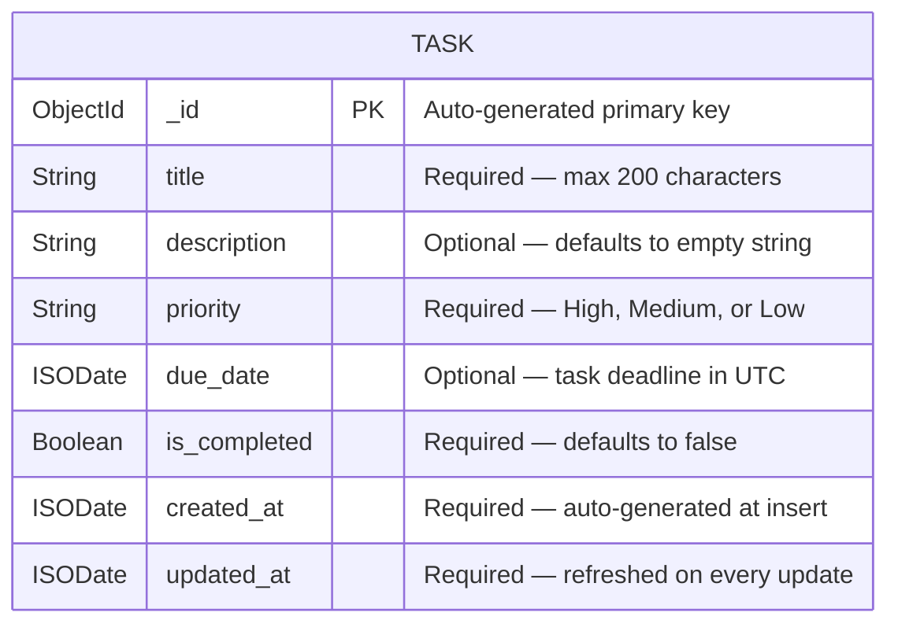

# Data Model

This document defines the data storage design for the To-Do List Application. It covers the MongoDB 8.0.x collection schema, field definitions, entity-relationship diagram, indexing strategy, data validation rules, and sample documents. The data model is the foundation for all task persistence and retrieval operations performed by the archie-service-backend.

[← Back to README](../README.md)

*Source: Technical Specification §6.2*

---

## Database Selection

The To-Do List Application uses **MongoDB 8.0.x** as its primary data store. MongoDB was selected as the prescribed database for the Blitzx platform's data layer, and its document-oriented model is a natural fit for task data.

### Why MongoDB

- **Document-oriented storage** — Tasks are self-contained documents with a mix of required and optional fields (title, description, priority, due date). MongoDB's flexible document model stores each task as a single BSON document without requiring rigid relational table schemas.
- **JSON-native data exchange** — The BSON (Binary JSON) storage format aligns directly with the JSON payloads exchanged between the U! frontend and the archie-service-backend, minimizing serialization overhead.
- **Flexible schema evolution** — As the To-Do List Application evolves (e.g., adding tags, categories, or attachments), new fields can be introduced to task documents without costly schema migrations.
- **Rich query capabilities** — MongoDB's expressive query language supports filtering tasks by priority, date ranges, completion status, and text search — all core requirements of the application.
- **Blitzx platform alignment** — MongoDB 8.0.x is the prescribed database in the Blitzx platform's technology stack, ensuring consistency with platform-level tooling and operational practices.

*Source: Technical Specification §3.5, §6.2*

### Python Driver

The archie-service-backend accesses MongoDB through **PyMongo 4.16.x**, the official MongoDB driver for Python. PyMongo provides direct wire-protocol communication with MongoDB, connection pooling, and native BSON handling. The **flask-pymongo** extension integrates PyMongo's connection management with Flask's application context, enabling request-scoped database access. For full driver details, see the [Technology Stack](technology-stack.md).

### Database and Collection Naming

| Item | Name | Description |
|------|------|-------------|
| Database | `todo_app` | The MongoDB database dedicated to the To-Do List Application |
| Collection | `tasks` | The single collection storing all task documents |

The `todo_app` database is configured via the `DATABASE_URL` environment variable (e.g., `mongodb://localhost:27017/todo_app`). All task management operations target the `tasks` collection within this database.

---

## Task Collection Schema

The `tasks` collection stores one document per task. Each document contains the fields defined in the table below.

| Field Name | Type | Required | Default | Description |
|------------|------|----------|---------|-------------|
| `_id` | ObjectId | Yes | Auto-generated | MongoDB primary key — unique identifier for each task document |
| `title` | String | Yes | — | The task title; maximum 200 characters |
| `description` | String | No | `""` (empty string) | A detailed description of the task; free-text with no enforced length limit |
| `priority` | String | Yes | `"Medium"` | Task urgency level; must be one of `"High"`, `"Medium"`, or `"Low"` |
| `due_date` | ISODate | No | `null` | The task deadline stored as a UTC ISODate; `null` when no deadline is assigned |
| `is_completed` | Boolean | Yes | `false` | Indicates whether the task has been marked as complete |
| `created_at` | ISODate | Yes | Auto-generated | UTC timestamp recorded when the task document is first inserted |
| `updated_at` | ISODate | Yes | Auto-generated | UTC timestamp refreshed on every update to the task document |

### Field Details

- **`_id`** — Automatically generated by MongoDB as a 12-byte ObjectId. It serves as the primary key and is returned in all API responses to uniquely identify each task.
- **`title`** — The human-readable name of the task. This is the only field that must be explicitly provided by the user during task creation. It is constrained to a maximum of 200 characters.
- **`description`** — An optional free-text field for additional context about the task. Defaults to an empty string when not provided.
- **`priority`** — Classifies the task's urgency. Accepted values are `"High"`, `"Medium"`, and `"Low"` (case-sensitive). Defaults to `"Medium"` when omitted during creation.
- **`due_date`** — An optional deadline for the task, stored as a UTC ISODate. When provided via the API, it is transmitted as an ISO 8601 date string (e.g., `"2026-04-15"`) and converted to an ISODate on the server. Set to `null` when no deadline is assigned.
- **`is_completed`** — A boolean flag tracking whether the task has been completed. Defaults to `false` on creation and is toggled via the completion tracking endpoint.
- **`created_at`** — A server-generated UTC timestamp set at the moment the task document is inserted into the collection. This field is immutable after creation.
- **`updated_at`** — A server-generated UTC timestamp that is refreshed every time the task document is modified (edits, completion toggles, or any field update).

---

## Entity-Relationship Diagram

The following Mermaid ER diagram illustrates the structure of the `Task` entity within the `tasks` collection. Since the To-Do List Application operates on a single collection with no foreign key relationships, the diagram focuses on the task document's field definitions and their types.



The `TASK` entity is a standalone document. There are no relationships to other collections — each task is fully self-contained. If future enhancements introduce related entities (e.g., users, categories, or tags), the ER diagram will be extended to show those relationships.

---

## Indexing Strategy

Indexes are critical for efficient query execution on the `tasks` collection. The indexing strategy is designed around the application's most common query patterns: filtering by completion status, filtering by priority, sorting by due date, and combined filter operations.

| Index Name | Fields | Type | Purpose |
|------------|--------|------|---------|
| `_id_` | `{ _id: 1 }` | Primary (default) | Unique task identification; auto-created by MongoDB |
| `idx_is_completed` | `{ is_completed: 1 }` | Single-field | Efficiently filter tasks by completion status (active vs. completed) |
| `idx_priority` | `{ priority: 1 }` | Single-field | Efficiently filter and sort tasks by priority level |
| `idx_due_date` | `{ due_date: 1 }` | Single-field | Efficiently sort tasks by deadline and execute date-range queries |
| `idx_status_priority` | `{ is_completed: 1, priority: 1 }` | Compound | Optimizes the common combined filter: active tasks filtered by priority |

### Index Rationale

- **`_id_`** — The default primary index on `_id` is automatically created by MongoDB. It supports single-task lookups for editing, deletion, and completion toggling.
- **`idx_is_completed`** — Supports the most frequent filter operation: retrieving active tasks (`is_completed: false`) or completed tasks (`is_completed: true`). Since the task list defaults to showing active tasks, this index is heavily used.
- **`idx_priority`** — Supports filtering the task list by a specific priority level and sorting tasks in priority order (High > Medium > Low).
- **`idx_due_date`** — Supports sorting tasks by their deadline and executing date-range queries (e.g., tasks due this week). Also enables efficient identification of overdue tasks by comparing `due_date` against the current date.
- **`idx_status_priority`** — A compound index that covers the combined filter pattern (e.g., "show me all active high-priority tasks"). MongoDB can use this index to satisfy both the `is_completed` filter and the `priority` filter in a single index scan, avoiding a collection scan.

### Illustrative Index Creation

```javascript
db.tasks.createIndex({ is_completed: 1 }, { name: "idx_is_completed" })
db.tasks.createIndex({ priority: 1 }, { name: "idx_priority" })
db.tasks.createIndex({ due_date: 1 }, { name: "idx_due_date" })
db.tasks.createIndex({ is_completed: 1, priority: 1 }, { name: "idx_status_priority" })
```

> **Note:** These are illustrative commands showing the intended index definitions. Actual index creation will be implemented as part of the application's database initialization logic.

---

## Data Validation Rules

Data validation is enforced at two levels: the archie-service-backend validates all incoming request data before writing to MongoDB, and MongoDB's built-in schema validation provides an additional safety net at the database level.

### Field-Level Validation

| Field | Rule | Error Behavior |
|-------|------|----------------|
| `title` | Required; must be a non-empty string; maximum 200 characters | Rejected with `400 Bad Request` if missing, empty, or exceeds 200 characters |
| `description` | Optional; string type | Defaults to `""` if not provided |
| `priority` | Required; must be exactly `"High"`, `"Medium"`, or `"Low"` | Rejected with `400 Bad Request` if an invalid value is provided |
| `due_date` | Optional; must be a valid ISO 8601 date string when provided | Rejected with `400 Bad Request` if the format is invalid |
| `is_completed` | Required; must be a boolean (`true` or `false`) | Rejected with `400 Bad Request` if a non-boolean value is provided |
| `created_at` | Server-generated; immutable after creation | Not accepted in client requests; always set server-side |
| `updated_at` | Server-generated; refreshed on every update | Not accepted in client requests; always set server-side |

### MongoDB Schema Validation

MongoDB supports JSON Schema-based document validation at the collection level. The following illustrative validation rule ensures that all documents in the `tasks` collection conform to the expected structure:

```javascript
db.createCollection("tasks", {
  validator: {
    $jsonSchema: {
      bsonType: "object",
      required: ["title", "priority", "is_completed", "created_at", "updated_at"],
      properties: {
        title: { bsonType: "string", maxLength: 200, description: "Task title — required, max 200 chars" },
        priority: { enum: ["High", "Medium", "Low"], description: "Task priority level" },
        is_completed: { bsonType: "bool", description: "Completion status flag" },
        due_date: { bsonType: ["date", "null"], description: "Optional task deadline" },
        created_at: { bsonType: "date", description: "Creation timestamp" },
        updated_at: { bsonType: "date", description: "Last update timestamp" }
      }
    }
  }
})
```

> **Note:** This is an illustrative schema validation definition showing the intended constraints. The actual implementation will be part of the application's database setup process.

---

## Sample Documents

The following JSON samples illustrate the structure of task documents stored in the `tasks` collection. These examples demonstrate the field layout, data types, and realistic values for both active and completed tasks.

### Sample 1 — Active High-Priority Task

A newly created task with all fields populated, a High priority level, and a future due date:

```json
{
  "_id": "664a1b2c3d4e5f6a7b8c9d0e",
  "title": "Prepare quarterly report",
  "description": "Compile financial data and write executive summary for Q1 2026 review.",
  "priority": "High",
  "due_date": "2026-04-15T00:00:00.000Z",
  "is_completed": false,
  "created_at": "2026-03-10T09:30:00.000Z",
  "updated_at": "2026-03-10T09:30:00.000Z"
}
```

- **Priority:** High — this task requires immediate attention.
- **Due date:** April 15, 2026 — a future deadline.
- **Status:** Active (`is_completed: false`).
- **Timestamps:** `created_at` and `updated_at` are identical, indicating the task has not been modified since creation.

### Sample 2 — Completed Medium-Priority Task

A task that has been completed, with a Medium priority level and a past due date:

```json
{
  "_id": "664a1b2c3d4e5f6a7b8c9d1f",
  "title": "Update project dependencies",
  "description": "Review and update all npm and pip packages to their latest compatible versions.",
  "priority": "Medium",
  "due_date": "2026-02-28T00:00:00.000Z",
  "is_completed": true,
  "created_at": "2026-02-01T14:00:00.000Z",
  "updated_at": "2026-02-27T16:45:00.000Z"
}
```

- **Priority:** Medium — standard urgency.
- **Due date:** February 28, 2026 — a past date, but the task was completed before the deadline.
- **Status:** Completed (`is_completed: true`).
- **Timestamps:** `updated_at` differs from `created_at`, reflecting that the task was modified (marked complete) after its initial creation.

---

## Data Access Patterns

The archie-service-backend uses **PyMongo 4.16.x** to interact with the `tasks` collection in MongoDB. All database operations are performed through the flask-pymongo extension, which provides request-scoped access to the MongoDB client within Flask route handlers.

### Common Query Patterns

The table below summarizes the most common data access patterns used by the application, along with the corresponding MongoDB query structure.

| Pattern | Description | Query Structure |
|---------|-------------|-----------------|
| Retrieve all tasks | Fetch every task in the collection | `db.tasks.find({})` |
| Filter by status | Retrieve only active or completed tasks | `db.tasks.find({ is_completed: false })` |
| Filter by priority | Retrieve tasks of a specific priority level | `db.tasks.find({ priority: "High" })` |
| Find overdue tasks | Retrieve active tasks past their deadline | `db.tasks.find({ is_completed: false, due_date: { $lt: current_date } })` |
| Combined filter | Retrieve active tasks of a given priority | `db.tasks.find({ is_completed: false, priority: "High" })` |
| Sort by due date | Order tasks by deadline ascending | `db.tasks.find().sort("due_date", 1)` |
| Sort by priority | Order tasks by urgency descending | Custom sort mapping: High=1, Medium=2, Low=3 |
| Paginated retrieval | Fetch a page of results | `db.tasks.find().skip(offset).limit(page_size)` |
| Single task lookup | Retrieve a task by its unique identifier | `db.tasks.find_one({ _id: ObjectId("...") })` |

### Write Patterns

| Operation | PyMongo Method | Description |
|-----------|----------------|-------------|
| Create a task | `db.tasks.insert_one(document)` | Inserts a new task document with server-generated timestamps |
| Update a task | `db.tasks.update_one({ _id: id }, { $set: fields })` | Applies partial updates and refreshes `updated_at` |
| Toggle completion | `db.tasks.update_one({ _id: id }, { $set: { is_completed: new_value, updated_at: now } })` | Flips `is_completed` and updates the timestamp |
| Delete a task | `db.tasks.delete_one({ _id: id })` | Permanently removes the task document |

### Cross-References

- See [Core Functionality](functionality.md) for detailed descriptions of each CRUD operation, API endpoints, request/response patterns, and validation rules.
- See [Technology Stack](technology-stack.md) for details on MongoDB 8.0.x capabilities and PyMongo 4.16.x driver configuration.

---

*This document is part of the To-Do List Application documentation. Return to the [README](../README.md) for the full documentation index.*
