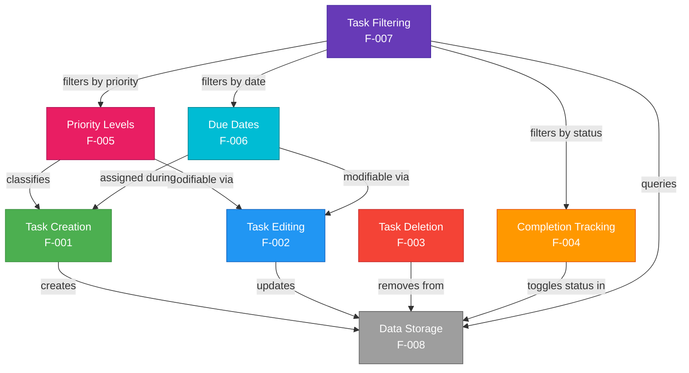

# Features

This document provides a complete catalog of features for the To-Do List Application. Each feature is described with its purpose, expected behavior, relevant data fields, and acceptance criteria. Together, these capabilities deliver a comprehensive task management experience — from creating and organizing tasks to filtering, tracking completion, and persisting data reliably.

[← Back to README](../README.md)

*Source: Technical Specification §2.1, §2.2*

---

## Feature Registry

The table below summarizes every feature offered by the To-Do List Application. Each feature is documented in detail in its own section within this document. For detailed API patterns and technical implementation specifics, see the [Core Functionality](functionality.md) reference.

| Feature ID | Feature Name | Description | Priority |
|------------|-------------|-------------|----------|
| F-001 | [Task Creation](#task-creation) | Create new tasks with a title, description, priority level, and optional due date | Critical |
| F-002 | [Task Editing](#task-editing) | Modify any property of an existing task | Critical |
| F-003 | [Task Deletion](#task-deletion) | Permanently remove tasks from the system | Critical |
| F-004 | [Completion Tracking](#completion-tracking) | Mark tasks as complete or incomplete with visual feedback | Critical |
| F-005 | [Priority Levels](#priority-levels) | Categorize tasks by urgency using High, Medium, and Low levels | High |
| F-006 | [Due Dates](#due-dates) | Assign temporal deadlines with overdue detection and date-based sorting | High |
| F-007 | [Task Filtering](#task-filtering) | Search and narrow displayed tasks by status, priority, due date, and text | High |
| F-008 | [Data Storage](#data-storage) | Persist all task data reliably in MongoDB across sessions | Critical |

---

## Task Creation

### Description

Users can create new tasks by providing a title, an optional description, a priority level, and an optional due date. Task creation is the entry point for all task management — every task in the system begins with this operation. The U! frontend presents a creation form, and the submitted data is sent to the archie-service-backend, which validates the input, assigns defaults, and persists the new task document in MongoDB.

*Source: Technical Specification §2.1, §2.2*

### Data Fields

| Field | Type | Required | Default | Description |
|-------|------|----------|---------|-------------|
| `title` | String | Yes | — | The name of the task; must be non-empty (maximum 200 characters) |
| `description` | String | No | `""` (empty string) | Additional details or notes about the task |
| `priority` | String | No | `"Medium"` | Urgency level: `"High"`, `"Medium"`, or `"Low"` |
| `due_date` | Date (ISO 8601) | No | `null` | Optional deadline in `YYYY-MM-DD` format |

### Expected Behavior

- The U! frontend displays a task creation form with fields for title, description, priority, and due date.
- The `title` field is validated as required — an empty or missing title prevents submission.
- If no priority is specified, the system defaults to **Medium**.
- If no due date is specified, the task is created without a deadline.
- Upon successful creation, the task appears in the task list immediately without requiring a page refresh.
- Server-generated fields (`_id`, `is_completed`, `created_at`, `updated_at`) are assigned automatically.

### Acceptance Criteria

- [ ] A task is saved with all provided fields (title, description, priority, due date) and appears in the task list immediately.
- [ ] Validation rejects submissions with a missing or empty title and displays an appropriate error message.
- [ ] The default priority of **Medium** is applied when no priority is explicitly selected.
- [ ] The task is persisted to MongoDB and survives page refreshes and application restarts.
- [ ] Server-generated timestamps (`created_at`, `updated_at`) are set at creation time.

For the detailed API endpoint pattern and request/response examples, see [Core Functionality — Task Creation](functionality.md#task-creation).

---

## Task Editing

### Description

Users can modify any field of an existing task, including the title, description, priority level, and due date. The application supports partial updates — only the fields the user changes are sent to the server, while all other fields remain intact. Editing can be performed through inline editing directly in the task list or via a modal form that presents all editable fields.

*Source: Technical Specification §2.2*

### Modifiable Fields

| Field | Type | Constraints |
|-------|------|-------------|
| `title` | String | Non-empty, maximum 200 characters |
| `description` | String | Free-text, no enforced length limit |
| `priority` | String | Must be `"High"`, `"Medium"`, or `"Low"` |
| `due_date` | Date (ISO 8601) / `null` | Valid date in `YYYY-MM-DD` format, or `null` to remove the deadline |

### Editing Modes

- **Inline Editing** — Users can click on a task field directly in the task list to edit it in place. This is suitable for quick single-field updates such as changing the title or toggling the priority.
- **Modal Form** — Users can open a dedicated editing form (modal or drawer) that presents all editable fields together. This is suitable for comprehensive edits to multiple fields at once.

### Expected Behavior

- When a user edits a task, only the modified fields are submitted to the archie-service-backend.
- The same validation rules that apply to task creation are enforced during editing (e.g., title must be non-empty, priority must be a valid value).
- Changes are reflected immediately in the task list after a successful save.
- The `updated_at` timestamp is refreshed on every edit.

### Acceptance Criteria

- [ ] Users can modify the title, description, priority, and due date of any existing task.
- [ ] Changes are saved and reflected in the task list immediately upon submission.
- [ ] Validation rules are consistently enforced — an empty title is rejected, and invalid priority values are rejected.
- [ ] Partial updates are supported — unchanged fields are not overwritten or lost.
- [ ] The `updated_at` timestamp is refreshed after each successful edit.

For the detailed API endpoint pattern, see [Core Functionality — Task Editing](functionality.md#task-editing).

---

## Task Deletion

### Description

Users can permanently remove tasks from the system that are no longer needed. The To-Do List Application uses **hard deletes** — when a task is deleted, it is permanently removed from the MongoDB database and cannot be recovered.

*Source: Technical Specification §2.2*

### Deletion Behavior

- **Hard Delete:** The task document is permanently removed from the `tasks` collection in MongoDB. There is no soft-delete mechanism, trash bin, or undo capability.
- **Standalone Documents:** Tasks have no foreign key relationships or dependent records. Deleting a task has no cascade effects on other data.

### Confirmation Safeguard

Before a task is deleted, the U! frontend displays a **confirmation dialog** asking the user to confirm the action. This prevents accidental deletions by requiring an explicit confirmation step before the DELETE request is sent to the archie-service-backend.

### Expected Behavior

- The user clicks a delete button or icon associated with a specific task.
- A confirmation dialog appears asking the user to confirm the deletion.
- If the user confirms, the task is permanently removed from the database and disappears from the task list.
- If the user cancels, no action is taken and the task remains unchanged.
- If the task does not exist (e.g., already deleted in another session), a `404 Not Found` response is handled gracefully.

### Acceptance Criteria

- [ ] A task is permanently removed from the task list and the database upon confirmed deletion.
- [ ] A confirmation dialog is displayed before any deletion is executed.
- [ ] The deleted task cannot be retrieved or restored after deletion.
- [ ] The task list updates immediately to reflect the removal.
- [ ] Attempting to delete a non-existent task is handled gracefully without application errors.

For the detailed API endpoint pattern, see [Core Functionality — Task Deletion](functionality.md#task-deletion).

---

## Completion Tracking

### Description

Users can mark tasks as complete or incomplete to track their progress. The completion state is toggled through a single action — clicking a checkbox or toggle control flips the task between its active and completed states.

*Source: Technical Specification §2.2*

### Toggle Mechanism

- The U! frontend provides a **checkbox** or **toggle control** on each task in the task list.
- Clicking the control sends a toggle request to the archie-service-backend, which flips the `is_completed` field between `true` and `false`.
- The toggle is a single-click action — no form submission or confirmation is required.

### Visual Indicators

Completed tasks are visually distinguished from active tasks to provide immediate feedback:

| Task State | Visual Treatment |
|------------|-----------------|
| **Active** (`is_completed: false`) | Normal text styling, unchecked checkbox, full opacity |
| **Completed** (`is_completed: true`) | Strikethrough text on the title, dimmed or muted styling, filled checkbox or checkmark icon |

### Expected Behavior

- The user clicks the checkbox or toggle control next to a task.
- The completion status is toggled in real-time — the UI updates immediately to reflect the new state.
- The change is persisted to the database so the status is maintained across sessions and page refreshes.
- The `updated_at` timestamp is refreshed on every toggle.
- Completed tasks remain visible in the task list (they can be hidden using the [Task Filtering](#task-filtering) feature).

### Acceptance Criteria

- [ ] Clicking the toggle control flips the task between complete and incomplete states.
- [ ] The status change is reflected visually in real-time with appropriate styling (strikethrough, dimmed, checkmark).
- [ ] The completion state is persisted to the database and survives page refreshes.
- [ ] The `updated_at` timestamp is refreshed after each toggle.
- [ ] Completed tasks can be filtered out of the task list using the status filter.

For the detailed API endpoint pattern, see [Core Functionality — Completion Tracking](functionality.md#completion-tracking).

---

## Priority Levels

### Description

Tasks are categorized by urgency using three priority levels: **High**, **Medium**, and **Low**. Priority classification helps users focus on the most important tasks first and provides visual cues through color-coded badges in the U! frontend.

*Source: Technical Specification §2.1, §2.2*

### Priority Values

| Priority | Meaning | Typical Use Case |
|----------|---------|------------------|
| **High** | Urgent — requires immediate attention | Critical deadlines, blockers, time-sensitive tasks |
| **Medium** | Standard — the default priority for new tasks | Regular work tasks, routine activities |
| **Low** | Deferrable — can be addressed later | Nice-to-have tasks, future considerations |

### Color Coding

Priority levels are visually represented in the U! frontend with color-coded badges:

| Priority | Color | Visual Indicator |
|----------|-------|------------------|
| **High** | 🔴 Red | Red badge, red border accent, or red text highlight |
| **Medium** | 🟡 Yellow / Amber | Yellow or amber badge |
| **Low** | 🟢 Green | Green badge, green border accent, or green text highlight |

### Default Priority

When a new task is created without the user explicitly selecting a priority level, the system automatically assigns a default priority of **Medium**. This ensures every task has a priority classification from the moment it is created.

### Sorting by Priority

Tasks can be sorted by priority in descending urgency order:

**High** → **Medium** → **Low**

Tasks sharing the same priority level are sub-sorted by their `created_at` timestamp (most recent first) unless a different secondary sort criterion is selected by the user.

### Expected Behavior

- Every task displays its priority as a color-coded badge in the task list.
- Users can set or change a task's priority during creation or editing.
- The task list can be sorted by priority to surface the most urgent tasks first.
- The default priority of **Medium** is applied automatically when no priority is specified.

### Acceptance Criteria

- [ ] Every task displays a color-coded priority badge (High = red, Medium = yellow/amber, Low = green).
- [ ] Users can set the priority when creating a task and change it when editing a task.
- [ ] New tasks default to **Medium** priority when no priority is explicitly selected.
- [ ] The task list is sortable by priority level (High → Medium → Low).
- [ ] Priority values are restricted to exactly `"High"`, `"Medium"`, or `"Low"` — no other values are accepted.

For the detailed API pattern and sorting behavior, see [Core Functionality — Priority Management](functionality.md#priority-management).

---

## Due Dates

### Description

Users can assign temporal deadlines to tasks by selecting a due date. Due dates help users track time-sensitive work and plan their activities. The system supports overdue detection, visual warnings for past-due tasks, and sorting by due date to surface upcoming deadlines.

*Source: Technical Specification §2.2*

### Date Picker

The U! frontend provides a **calendar-based date picker** for selecting due dates. The date picker allows users to:

- Select a specific date from a calendar view.
- Clear the due date to remove the deadline from a task.
- View the selected date in a human-readable format.

Due dates are transmitted and stored in **ISO 8601** format (`YYYY-MM-DD`).

### Overdue Indicators

Tasks that are past their due date and not yet completed are flagged with visual warnings in the U! frontend:

| Condition | Visual Indicator |
|-----------|-----------------|
| Due date is in the future or today | Normal date display |
| Due date is in the past **and** task is incomplete | Red text, warning icon, or highlighted background |
| Due date is in the past **and** task is complete | No overdue indicator (completed tasks are not flagged) |

### Sorting by Due Date

Tasks can be sorted by their due date in ascending or descending order. When sorted in ascending order (the recommended default), the nearest deadlines appear first, helping users prioritize upcoming work.

Tasks without a due date (`null`) are placed at the end of the list in ascending order and at the beginning in descending order.

### Expected Behavior

- Users can assign a due date when creating or editing a task using the date picker.
- Users can remove a due date to convert a task to an open-ended task.
- Overdue tasks (past due date and incomplete) are visually highlighted in the task list.
- The task list can be sorted by due date to surface upcoming deadlines.
- Due dates are stored in UTC and displayed in the user's local timezone.

### Acceptance Criteria

- [ ] Users can select a due date using a calendar-based date picker during task creation and editing.
- [ ] Due dates are properly formatted and displayed in a human-readable format.
- [ ] Tasks past their due date and not yet completed are visually highlighted as overdue (red text or warning icon).
- [ ] Completed tasks are never flagged as overdue, regardless of their due date.
- [ ] The task list is sortable by due date with tasks without deadlines placed at the end (ascending order).

For the detailed date handling and overdue logic, see [Core Functionality — Due Date Handling](functionality.md#due-date-handling).

---

## Task Filtering

### Description

Users can search and narrow the displayed task list by applying one or more filter criteria simultaneously. Task filtering enables users to focus on specific subsets of their tasks — for example, viewing only high-priority active tasks or searching for tasks containing a specific keyword.

*Source: Technical Specification §2.1, §2.2*

### Filter Options

The following filter criteria are available in the U! frontend:

| Filter | Options | Description |
|--------|---------|-------------|
| **Status** | All, Active, Completed | Filter tasks by their completion state |
| **Priority** | All, High, Medium, Low | Filter tasks by their priority level |
| **Due Date Range** | From date, To date | Filter tasks within a specific date range |
| **Text Search** | Free-text input | Search within task titles and descriptions |

### Combined Filters

Multiple filter criteria can be applied **simultaneously** using AND logic. For example:

- Status = **Active** AND Priority = **High** → shows only incomplete, high-priority tasks.
- Status = **Completed** AND Text Search = **"review"** → shows completed tasks containing "review" in the title or description.

All active filters work together to progressively narrow the displayed results.

### Dynamic Updates

The task list updates **dynamically** as the user adjusts filters. There is no need to click a separate "Apply" button — the displayed results refresh automatically when any filter criterion is changed.

### Filter State Persistence

Active filter selections are maintained during the user's session. Navigating away from the task list and returning preserves the previously applied filters, so users do not lose their filter context.

### Expected Behavior

- The U! frontend displays filter controls (dropdowns, date pickers, search bar) prominently above or alongside the task list.
- Selecting a filter narrows the displayed tasks in real-time.
- Multiple filters can be combined for precise task retrieval.
- Clearing all filters restores the complete task list.
- Filter state is maintained during the session but resets on application restart.

### Acceptance Criteria

- [ ] Users can filter tasks by status (All, Active, Completed).
- [ ] Users can filter tasks by priority (All, High, Medium, Low).
- [ ] Users can filter tasks by due date range (from date to date).
- [ ] Users can search tasks by text (matching titles and descriptions).
- [ ] Multiple filters can be applied simultaneously with AND logic.
- [ ] The task list updates dynamically as filters are adjusted.
- [ ] Filter state is persisted during the user's session.

For the detailed query parameters and pagination, see [Core Functionality — Task Filtering and Sorting](functionality.md#task-filtering-and-sorting).

---

## Data Storage

### Description

All task data is reliably persisted in **MongoDB 8.0.x**, ensuring that tasks survive page refreshes, browser closures, and application restarts. The archie-service-backend communicates with MongoDB through the **PyMongo 4.16.x** driver, providing atomic document-level operations for all task management activities.

*Source: Technical Specification §3.5, §6.2*

### Key Characteristics

| Characteristic | Detail |
|----------------|--------|
| **Database** | MongoDB 8.0.x (document-oriented NoSQL) |
| **Driver** | PyMongo 4.16.x |
| **Collection** | `tasks` — stores all task documents |
| **Atomicity** | Each write operation (`insert_one`, `update_one`, `delete_one`) is atomic at the document level |
| **Timestamps** | `created_at` set at insertion; `updated_at` refreshed on every modification |
| **Validation** | Input validation performed in archie-service-backend before any database write |

### Data Fields

Each task is stored as a JSON-like document in the `tasks` collection with the following fields:

| Field | Type | Description |
|-------|------|-------------|
| `_id` | ObjectId | Unique identifier auto-generated by MongoDB |
| `title` | String | Task name (required, max 200 characters) |
| `description` | String | Additional notes (defaults to empty string) |
| `priority` | String | `"High"`, `"Medium"`, or `"Low"` |
| `due_date` | ISODate / null | Optional deadline |
| `is_completed` | Boolean | Completion status (`false` by default) |
| `created_at` | ISODate | Timestamp of task creation (set once) |
| `updated_at` | ISODate | Timestamp of last modification (refreshed on every update) |

### Cross-References

Data storage underpins every other feature in the To-Do List Application. For comprehensive details on the MongoDB collection schema, indexing strategy, data validation rules, and sample documents, see:

- [Core Functionality — Data Storage Patterns](functionality.md#data-storage-patterns) for CRUD operation details and PyMongo method mappings.
- [Data Model](data-model.md) for the complete collection schema, ER diagram, and indexing strategy.
- [Technology Stack](technology-stack.md) for MongoDB 8.0.x and PyMongo 4.16.x version justifications.

---

## Feature Relationship Diagram

The following diagram illustrates the dependencies and relationships between the features of the To-Do List Application. Core CRUD features (creation, editing, deletion) are foundational, while completion tracking, priority levels, and due dates extend tasks with additional capabilities. Task filtering depends on the metadata provided by completion tracking, priority levels, and due dates, and data storage underpins all features.

**Diagram Legend:**

- **Green (Task Creation):** The entry point for all tasks — creates new documents in the data store.
- **Blue (Task Editing):** Modifies existing task properties including priority and due date.
- **Red (Task Deletion):** Permanently removes task documents from the data store.
- **Orange (Completion Tracking):** Toggles task completion status, which is used as a filter criterion.
- **Pink (Priority Levels):** Classifies tasks during creation and can be modified via editing; used as a filter criterion.
- **Cyan (Due Dates):** Assigned during creation and modifiable via editing; used as a filter criterion.
- **Purple (Task Filtering):** Depends on completion status, priority, and due date fields to filter the task list.
- **Grey (Data Storage):** The foundational layer that persists all task data for every other feature.

---

*This document is part of the To-Do List Application documentation. Return to the [README](../README.md) for the full documentation index.*
