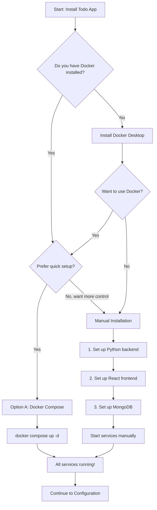

# Installation Guide

This guide walks you through setting up the Todo Application development environment, covering both Docker-based and manual installation approaches.

*Source: Tech Spec Sections 3.1, 3.2, 3.3, 3.7, 4.8*

The Todo Application consists of three core services — a **Python/Flask backend**, a **React/TypeScript frontend**, and a **MongoDB database**. You can set up all three services using either:

- **Option A: Docker Compose (Recommended)** — A single command starts all services in containers. Best for quick setup and consistent environments.
- **Option B: Manual Installation** — Install and run each service individually on your machine. Best for debugging, customization, and learning the stack.

After installation, you will configure environment variables and verify that all services are running correctly.

## Table of Contents

- [Prerequisites](#prerequisites)
- [Choose Your Installation Path](#choose-your-installation-path)
- [Option A: Docker Compose Installation (Recommended)](#option-a-docker-compose-installation-recommended)
- [Option B: Manual Installation](#option-b-manual-installation)
  - [Backend Setup (Python/Flask)](#backend-setup-pythonflask)
  - [Frontend Setup (React/TypeScript)](#frontend-setup-reacttypescript)
  - [Database Setup (MongoDB)](#database-setup-mongodb)
  - [Starting Services](#starting-services)
- [Verification](#verification)
- [Next Steps](#next-steps)

---

## Prerequisites

Before proceeding with either installation path, ensure the following software is installed on your system.

| Software | Version | Required For | Installation Link |
| --- | --- | --- | --- |
| Python | 3.13+ | Backend (Flask) | [python.org](https://www.python.org/downloads/) |
| Node.js | LTS (22.x+) | Frontend (React) | [nodejs.org](https://nodejs.org/) |
| npm | 10.x+ | Frontend package management | Included with Node.js |
| MongoDB | 8.0+ | Database | [mongodb.com](https://www.mongodb.com/try/download/community) |
| Docker | 27.x+ | Containerized setup | [docker.com](https://www.docker.com/get-started/) |
| Docker Compose | 2.x+ | Service orchestration | Included with Docker Desktop |
| Git | 2.x+ | Repository cloning | [git-scm.com](https://git-scm.com/) |

> **Note:** Docker and Docker Compose are required **only** for the Docker installation path (Option A). For manual installation (Option B), you need Python, Node.js, and MongoDB installed directly on your machine.

### Verify Prerequisites

Run the following commands to confirm that the required tools are installed and meet the minimum version requirements:

```bash
# Verify Python version (3.13 or later required)
python --version    # Expected: Python 3.13.x

# Verify Node.js version (LTS 22.x or later required)
node --version      # Expected: v22.x.x

# Verify npm version (10.x or later required)
npm --version       # Expected: 10.x.x

# Verify MongoDB version (8.0 or later required)
mongod --version    # Expected: db version v8.0.x

# Verify Docker version (27.x or later required — Docker path only)
docker --version    # Expected: Docker version 27.x.x

# Verify Docker Compose version (2.x or later required — Docker path only)
docker compose version  # Expected: Docker Compose version v2.x.x

# Verify Git version
git --version       # Expected: git version 2.x.x
```

If any prerequisite is missing or outdated, install or update it using the links in the table above before continuing.

---

## Choose Your Installation Path

Use the decision flowchart below to determine which installation path is right for you. If you are unsure, **Option A (Docker Compose)** is recommended for most developers.



- **Option A (Docker Compose):** Recommended for most users. A single command builds and starts all three services (MongoDB, Flask, React) in isolated containers. No need to install Python, Node.js, or MongoDB on your host machine.
- **Option B (Manual Installation):** Install and configure each service individually on your host machine. Offers more control over each component and is better suited for debugging, IDE integration, and step-by-step learning.

---

## Option A: Docker Compose Installation (Recommended)

Docker Compose orchestrates all three services — MongoDB, Flask backend, and React frontend — in containers. This is the fastest way to get the Todo Application running.

### Step 1: Clone the Repository

```bash
git clone https://github.com/your-org/todo-app.git
cd todo-app
```

### Step 2: Create Environment Configuration

Copy the example environment file and configure the required variables:

```bash
cp .env.example .env
```

Open `.env` in your editor and set the required values (database URI, Auth0 credentials, LLM API key). See the [Configuration Reference](configuration.md) for a complete list of environment variables and their descriptions.

### Step 3: Build and Start All Services

```bash
docker compose up -d --build
```

Expected output:

```text
[+] Building 3/3
 ✔ flask   Built
 ✔ react   Built
[+] Running 3/3
 ✔ Container todo-mongodb  Started
 ✔ Container todo-flask    Started
 ✔ Container todo-react    Started
```

### Step 4: Verify Services Are Running

```bash
docker compose ps
```

You should see all three services listed with a status of `running` and their port mappings:

```text
NAME             SERVICE    STATUS    PORTS
todo-mongodb     mongodb    running   0.0.0.0:27017->27017/tcp
todo-flask       flask      running   0.0.0.0:5000->5000/tcp
todo-react       react      running   0.0.0.0:3000->3000/tcp
```

### Step 5: Access the Application

- **Frontend:** Open [http://localhost:3000](http://localhost:3000) in your browser to see the login page.
- **Backend API:** Open [http://localhost:5000/api/health](http://localhost:5000/api/health) to verify the backend health endpoint returns a successful response.

### Stopping Services

```bash
# Stop all services (preserves data)
docker compose down

# Stop all services and remove volumes (WARNING: deletes database data)
docker compose down -v
```

> **Tip:** For advanced Docker workflows including log inspection, container rebuilding, hot-reload configuration, and volume management, see the [Docker Development Guide](../guides/docker-development.md).

---

## Option B: Manual Installation

Manual installation gives you full control over each service. You will set up the Python/Flask backend, React/TypeScript frontend, and MongoDB database individually.

### Backend Setup (Python/Flask)

The backend is a Python application built with Flask 3.1.3, PyMongo 4.16.0, and LangChain 1.2.10.

**Step 1:** Clone the repository (if you have not already):

```bash
git clone https://github.com/your-org/todo-app.git
cd todo-app
```

**Step 2:** Navigate to the backend directory:

```bash
cd backend
```

**Step 3:** Create and activate a Python virtual environment:

```bash
# Create the virtual environment
python -m venv venv

# Activate on macOS / Linux
source venv/bin/activate

# Activate on Windows (Command Prompt)
venv\Scripts\activate

# Activate on Windows (PowerShell)
venv\Scripts\Activate.ps1
```

**Step 4:** Upgrade pip and install Python dependencies:

```bash
pip install --upgrade pip
pip install -r requirements.txt
```

All packages should install successfully, including Flask 3.1.3, PyMongo 4.16.0, LangChain 1.2.10, and their transitive dependencies.

**Step 5:** Verify the Flask installation:

```bash
python -c "import flask; print(f'Flask {flask.__version__}')"
# Expected output: Flask 3.1.3
```

**Step 6:** Copy and configure the environment file:

```bash
cp .env.example .env
```

Edit `.env` with your configuration values. See the [Configuration Reference](configuration.md) for details.

### Frontend Setup (React/TypeScript)

The frontend is a React 19.2.1 application written in TypeScript 5.9.3 with TailwindCSS 4.1.x for styling and the Auth0 SPA SDK for authentication.

**Step 1:** Navigate to the frontend directory (from the repository root):

```bash
cd frontend
```

**Step 2:** Install Node.js dependencies:

```bash
npm install
```

npm installs all dependencies including React 19.2.1, TypeScript 5.9.3, TailwindCSS 4.1.x, and @auth0/auth0-react. You should see output confirming that packages were added successfully.

**Step 3:** Verify the frontend setup:

```bash
npx react-scripts --version 2>/dev/null || echo "React app ready"
```

### Database Setup (MongoDB)

The Todo Application uses MongoDB 8.0 as its primary database, accessed via the PyMongo 4.16.0 driver. You can run MongoDB locally or use MongoDB Atlas (cloud-hosted).

#### Local MongoDB Installation

Install MongoDB Community Edition for your platform:

- **macOS (Homebrew):**

  ```bash
  brew tap mongodb/brew
  brew install mongodb-community@8.0
  ```

- **Ubuntu / Debian:** Follow the official [MongoDB installation guide for Ubuntu](https://www.mongodb.com/docs/manual/tutorial/install-mongodb-on-ubuntu/).

- **Windows:** Download and install from the [MongoDB Download Center](https://www.mongodb.com/try/download/community). Select version 8.0 and follow the MSI installer wizard.

#### Start MongoDB

```bash
# macOS (Homebrew)
brew services start mongodb-community@8.0

# Linux (systemd)
sudo systemctl start mongod
sudo systemctl enable mongod

# All platforms (direct command)
mongod --dbpath /path/to/your/data/directory
```

#### Verify MongoDB Is Running

```bash
mongosh --eval "db.adminCommand('ping')"
# Expected output: { ok: 1 }
```

#### MongoDB Atlas Alternative

If you prefer a cloud-hosted database instead of a local installation:

1. Create a free cluster at [cloud.mongodb.com](https://cloud.mongodb.com).
2. Create a database user with read/write permissions.
3. Add your IP address to the network access whitelist.
4. Copy the connection string and set it as `MONGODB_URI` in your `.env` file.

For connection string format and configuration details, see the [Configuration Reference](configuration.md#database-configuration).

### Starting Services

After installing all three components, start each service in a separate terminal window or tab.

**Terminal 1 — MongoDB** (skip if using MongoDB Atlas or if MongoDB is already running as a service):

```bash
mongod --dbpath ./data/mongodb
```

**Terminal 2 — Flask Backend:**

```bash
cd backend
source venv/bin/activate
flask run --host=0.0.0.0 --port=5000
```

Expected output:

```text
 * Running on http://0.0.0.0:5000
 * Debug mode: on (if DEBUG=true in .env)
```

**Terminal 3 — React Frontend:**

```bash
cd frontend
npm run dev
```

Expected output:

```text
VITE v5.x.x  ready in XXX ms

  ➜  Local:   http://localhost:3000/
```

---

## Verification

After completing installation (Docker or manual), verify that all three services are running correctly using the checks below.

### Service Health Checks

| Service | Check Command | Expected Result |
| --- | --- | --- |
| MongoDB | `mongosh --eval "db.adminCommand('ping')"` | `{ ok: 1 }` |
| Flask Backend | `curl http://localhost:5000/api/health` | `{"status": "healthy"}` |
| React Frontend | Open `http://localhost:3000` in your browser | Login page loads |

### Docker-Specific Verification

If you used Docker Compose, you can also run these additional checks:

```bash
# Confirm all containers are running
docker compose ps

# View the last 20 lines of logs across all services
docker compose logs --tail=20

# Test the backend health endpoint directly
curl http://localhost:5000/api/health
```

### Troubleshooting

If any service fails to start, check the following:

- **Port conflicts:** Another process may already be using ports 3000, 5000, or 27017. Use `lsof -i :PORT` (macOS/Linux) or `netstat -ano | findstr :PORT` (Windows) to identify the conflicting process.
- **Missing environment variables:** Ensure your `.env` file exists and all required variables are set. See the [Configuration Reference](configuration.md) for the complete variable list.
- **Docker issues:** Run `docker compose logs` to inspect container output for error messages.

For detailed solutions to common problems, see the [Troubleshooting Guide](../troubleshooting.md).

---

## Next Steps

With the Todo Application installed and all services running, continue with the following guides:

- ⚙️ [Configure the Application](configuration.md) — Set up environment variables, Auth0 credentials, and database connection settings
- 🚀 [Quick Start Tutorial](quickstart.md) — Create your first to-do item in 5 minutes
- 🐳 [Docker Development Guide](../guides/docker-development.md) — Advanced Docker workflows including hot-reload, log inspection, and container rebuilding
- 🔑 [Authentication Guide](../guides/authentication.md) — Set up Auth0 authentication with OAuth 2.0 and MFA
- 🔧 [Troubleshooting](../troubleshooting.md) — Solutions for common installation and runtime issues
