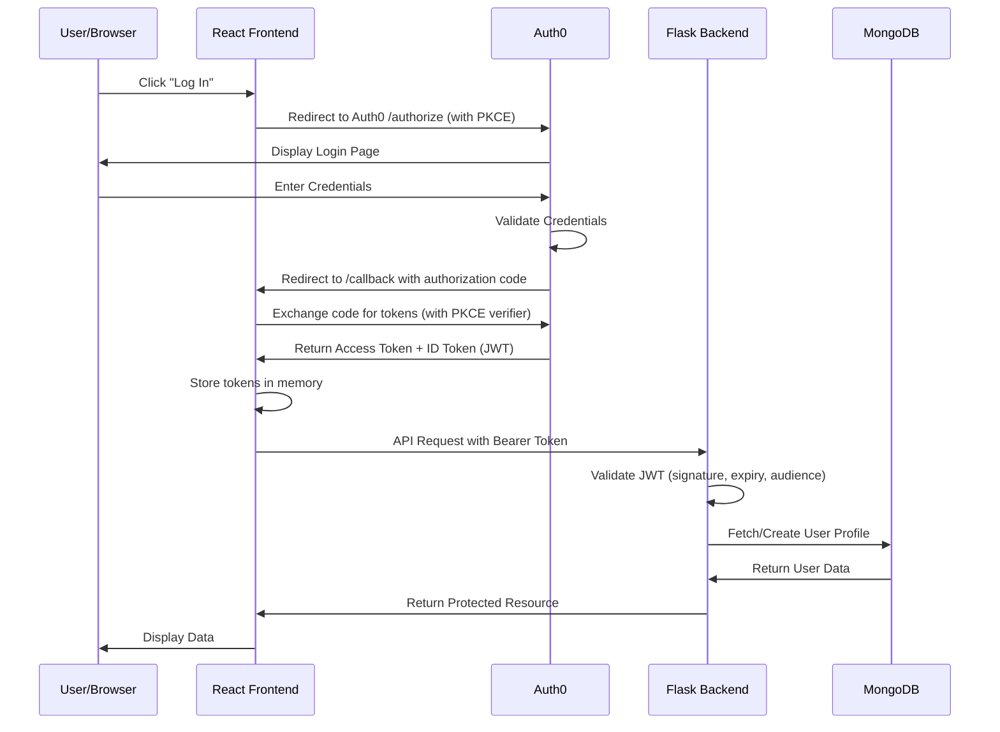

# Authentication Guide

This guide covers setting up Auth0 authentication for the Todo Application, including account configuration, login/logout flows, token management, and multi-factor authentication.

*Source: Tech Spec Sections 6.3, 6.4, 7.4*

The Todo Application delegates all authentication to [Auth0](https://auth0.com), a cloud-based identity provider that manages user registration, login, logout, and token lifecycle using the industry-standard OAuth 2.0 and OpenID Connect (OIDC) protocols.
The application never stores user passwords directly — Auth0 handles all credential management, password hashing, breach detection, and multi-factor authentication.

This guide walks you through every step required to configure Auth0 for the Todo Application, understand the authentication flow, and integrate authentication into both the backend and frontend.

## Prerequisites

Before following this guide, ensure you have completed the following:

- **Todo Application installed and running** — Follow the [Installation Guide](../getting-started/installation.md) to set up the backend, frontend, and database.
- **Auth0 account** — A free Auth0 account is sufficient for development. You will create one in the first section below if you do not already have one.
- **Environment variables configured** — The [Configuration Reference](../getting-started/configuration.md) describes all environment variables. This guide covers the authentication-specific variables in detail.

## Table of Contents

- [Auth0 Account Setup](#auth0-account-setup)
- [Application Registration](#application-registration)
- [Callback URL Configuration](#callback-url-configuration)
- [Environment Configuration](#environment-configuration)
- [Authentication Flow](#authentication-flow)
- [Login Flow](#login-flow)
- [Logout Process](#logout-process)
- [Token Refresh Mechanism](#token-refresh-mechanism)
- [Multi-Factor Authentication (MFA)](#multi-factor-authentication-mfa)
- [Role-Based Access Control](#role-based-access-control)
- [Session Management](#session-management)
- [Frontend Integration](#frontend-integration)
- [Troubleshooting Authentication Issues](#troubleshooting-authentication-issues)

---

## Auth0 Account Setup

Auth0 provides the identity infrastructure for the Todo Application. Follow these steps to create and configure your Auth0 tenant.

1. Navigate to the [Auth0 Sign Up](https://auth0.com/signup) page.
2. Create a free Auth0 account using your email address, GitHub, or Google account. If you already have an Auth0 account, [log in](https://manage.auth0.com/) instead.
3. When prompted, select a **tenant name** (e.g., `todo-app-dev`). The tenant name becomes part of your Auth0 domain and cannot be changed later.
4. Choose your **region** — US, EU, or AU. Select the region closest to your users for optimal latency.
5. Select **Personal Project** or **Company** based on your use case.

After account creation, you will be redirected to the Auth0 Dashboard. Your tenant domain follows the format:

```text
your-tenant-name.auth0.com
```

This domain is the value you will use for the `AUTH0_DOMAIN` environment variable.

> **Note:** The free Auth0 tier includes up to 7,000 monthly active users and is sufficient for development and small-scale production. See the [Auth0 pricing page](https://auth0.com/pricing) for plan details.

For comprehensive Auth0 documentation, visit the [Auth0 Docs](https://auth0.com/docs).

---

## Application Registration

After creating your Auth0 account, you need to register the Todo Application and create an API in the Auth0 Dashboard.

### Creating the Application

1. Log in to the [Auth0 Dashboard](https://manage.auth0.com/).
2. In the left sidebar, navigate to **Applications** → **Applications**.
3. Click the **Create Application** button.
4. Enter the application name: `Todo Application` (or your preferred name).
5. Select the application type: **Single Page Application** (this matches the React frontend architecture).
6. Click **Create**.

Auth0 creates the application and displays its settings page. You will use the values from this page to configure the Todo Application.

### Configuring Application Settings

Navigate to the **Settings** tab of your newly created application. Note the following values — you will need them for your `.env` file:

- **Domain:** Your Auth0 tenant domain (e.g., `your-tenant.auth0.com`) — maps to `AUTH0_DOMAIN`
- **Client ID:** A unique identifier for your application (e.g., `abc123def456ghi789`) — maps to `AUTH0_CLIENT_ID`
- **Client Secret:** A confidential string used by the Flask backend for server-to-server communication with Auth0 — maps to `AUTH0_CLIENT_SECRET`

> **⚠️ Security Warning:** Never commit your Auth0 client secret to version control. Always use environment variables. The client secret is used **only** by the Flask backend — never expose it in frontend code.

### Creating the API

In addition to the application, you must register an API in Auth0 to enable access token scoping and audience validation.

1. In the Auth0 Dashboard, navigate to **Applications** → **APIs**.
2. Click **Create API**.
3. Enter the following details:
   - **Name:** `Todo API`
   - **Identifier (Audience):** `https://api.todoapp.com` (or your preferred identifier — this does not need to be a real URL)
   - **Signing Algorithm:** `RS256` (RSA with SHA-256 — the recommended default)
4. Click **Create**.

Note the **Identifier** value — this is your `AUTH0_AUDIENCE` environment variable. The Flask backend uses this value to validate that incoming JWT tokens were issued for the correct API.

*Source: Tech Spec Section 6.3 — Auth0 Integration Architecture*

---

## Callback URL Configuration

Auth0 requires explicit URL whitelisting for security. You must register all URLs that Auth0 is allowed to redirect to after authentication events. Without these settings, login and logout flows will fail with callback URL mismatch errors.

In the Auth0 Dashboard, navigate to your application's **Settings** tab and configure the following fields:

**Allowed Callback URLs:**

```text
http://localhost:3000/callback,
http://localhost:3000
```

**Allowed Logout URLs:**

```text
http://localhost:3000
```

**Allowed Web Origins:**

```text
http://localhost:3000
```

**Allowed Origins (CORS):**

```text
http://localhost:3000,
http://localhost:5000
```

Scroll down and click **Save Changes** to apply the configuration.

> **Production Deployment:** When deploying to production, add your production URLs to each of the fields above
> (e.g., `https://your-domain.com/callback`, `https://your-domain.com`).
> Both development and production URLs can coexist in the same list, separated by commas.
>
> **⚠️ Common Error:** If you see a "callback URL mismatch" error during login, verify that the URLs listed above exactly match your application URLs —
> including the protocol (`http` vs `https`), hostname, and port number.
> Trailing slashes matter: `http://localhost:3000` and `http://localhost:3000/` are treated as different URLs by Auth0.

---

## Environment Configuration

With your Auth0 application and API registered, configure the authentication environment variables in your `.env` file.

### Authentication Environment Variables

| Variable | Required | Description | Example Value |
| --- | --- | --- | --- |
| `AUTH0_DOMAIN` | **Yes** | Auth0 tenant domain | `your-tenant.auth0.com` |
| `AUTH0_CLIENT_ID` | **Yes** | Application client ID from Auth0 Dashboard | `abc123def456ghi789` |
| `AUTH0_CLIENT_SECRET` | **Yes** | Application client secret (backend only) | `YOUR_AUTH0_CLIENT_SECRET` |
| `AUTH0_AUDIENCE` | **Yes** | API audience identifier from Auth0 Dashboard | `https://api.todoapp.com` |

### Configuration Steps

1. If you have not already, copy the example environment file to create your local configuration:

   ```bash
   cp .env.example .env
   ```

2. Open `.env` in your editor and replace the Auth0 placeholder values with the credentials from your Auth0 Dashboard:

   ```bash
   # Auth0 Configuration
   AUTH0_DOMAIN=your-tenant.auth0.com
   AUTH0_CLIENT_ID=YOUR_AUTH0_CLIENT_ID
   AUTH0_CLIENT_SECRET=YOUR_AUTH0_CLIENT_SECRET
   AUTH0_AUDIENCE=https://api.todoapp.com
   ```

3. Save the file and restart the application for the changes to take effect:

   ```bash
   # If using Docker Compose
   docker compose down && docker compose up -d

   # If running manually
   # Restart the Flask backend and React frontend processes
   ```

For the complete list of all environment variables (database, AI/LLM, CORS, and more), see the [Configuration Reference](../getting-started/configuration.md).

*Source: Tech Spec Section 6.3 — Integration Architecture*

---

## Authentication Flow

The Todo Application uses the **OAuth 2.0 Authorization Code Flow with PKCE** (Proof Key for Code Exchange).
This is the recommended authentication flow for single-page applications because it eliminates the need to expose the client secret in the browser
while protecting against authorization code interception attacks.

### Flow Diagram

The following sequence diagram illustrates the complete authentication flow from user login through API request authorization:



### Flow Explanation

The authentication flow proceeds through the following stages:

1. **User initiates login:** The user clicks the "Log In" button in the React frontend. The frontend generates a PKCE code verifier and code challenge, then redirects the user's browser to the Auth0 `/authorize` endpoint with the code challenge, client ID, redirect URI, and requested scopes.

2. **Auth0 displays login page:** Auth0 presents its Universal Login page where the user can enter their email/password credentials or use a configured social login provider (Google, GitHub, etc.).

3. **Auth0 validates credentials:** Auth0 verifies the user's credentials against its user store. If MFA is enabled, Auth0 prompts for the second factor at this stage.

4. **Auth0 redirects with authorization code:** After successful authentication, Auth0 redirects the user's browser back to the application's callback URL (`http://localhost:3000/callback`) with a short-lived authorization code and the state parameter for CSRF verification.

5. **Frontend exchanges code for tokens:** The React frontend sends the authorization code and the PKCE code verifier to Auth0's `/oauth/token` endpoint. Auth0 validates the code verifier against the original code challenge to prevent interception attacks.

6. **Auth0 issues JWT tokens:** Auth0 returns an access token (JWT) and an ID token. The access token is used to authenticate API requests; the ID token contains user profile claims (email, name, picture).

7. **Frontend stores tokens in memory:** The React frontend stores tokens in JavaScript memory (not in `localStorage` or `sessionStorage`) to protect against cross-site scripting (XSS) attacks.

8. **Frontend sends authenticated API requests:** For every API call, the frontend includes the access token in the `Authorization: Bearer <token>` header.

9. **Backend validates JWT:** The Flask backend validates the JWT on every request by checking the token signature (using Auth0's JWKS public keys), expiration time, audience claim (`AUTH0_AUDIENCE`), and issuer claim (`AUTH0_DOMAIN`).

10. **Backend processes request:** After successful token validation, the Flask backend fetches or creates the user profile in MongoDB and processes the requested operation.

### Security Considerations

- **PKCE (Proof Key for Code Exchange):** Prevents authorization code interception by requiring a cryptographic proof that the token request originates from the same client that initiated the authorization request.
- **Token storage in memory:** Storing tokens in JavaScript memory (rather than `localStorage`) protects against XSS attacks. Tokens are lost on page refresh, but silent authentication via Auth0 restores them seamlessly.
- **JWT validation checks:** The Flask backend performs four validation checks on every request — signature verification, expiration check, audience claim validation, and issuer claim validation.
- **State parameter:** The `state` parameter in the OAuth flow provides CSRF (Cross-Site Request Forgery) protection by ensuring the callback response matches the original authorization request.

*Source: Tech Spec Section 6.3 — OAuth 2.0/OIDC Lifecycle; Section 6.4 — Three-Checkpoint Request Validation*

---

## Login Flow

The login flow is the user-facing experience of the OAuth 2.0 authentication process described above. This section describes the step-by-step user journey.

### User Journey

1. The user navigates to the Todo Application at `http://localhost:3000`.
2. If the user is not authenticated, the application displays a login page or a "Log In" button.
3. Clicking "Log In" redirects the user to the Auth0 Universal Login page, which is hosted on your Auth0 tenant domain.
4. The user enters their email and password (or chooses a social login provider such as Google or GitHub, if configured).
5. If MFA is enabled, Auth0 prompts the user for a second verification factor.
6. After successful authentication, Auth0 redirects the user back to the application at the configured callback URL.
7. The application exchanges the authorization code for tokens and the user is now authenticated with access to all protected features.

### API Endpoint Reference

The login flow is initiated on the client side. The backend provides the following endpoint to generate the Auth0 authorization URL:

```bash
# Initiate login — generates the Auth0 authorization URL
POST /api/auth/login
Content-Type: application/json

{
  "redirect_uri": "http://localhost:3000/callback",
  "screen_hint": "login"
}
```

After the user authenticates with Auth0, the callback endpoint handles the authorization code exchange:

```bash
# Handle Auth0 callback — exchange authorization code for tokens
POST /api/auth/callback
Content-Type: application/json

{
  "code": "AUTHORIZATION_CODE",
  "state": "CSRF_STATE_VALUE",
  "redirect_uri": "http://localhost:3000/callback"
}
```

### Callback Response Example

```json
{
  "access_token": "eyJhbGciOiJSUzI1NiIs...",
  "refresh_token": "v1.refresh_token_value...",
  "token_type": "Bearer",
  "expires_in": 86400,
  "user": {
    "id": "507f1f77bcf86cd799439011",
    "email": "user@example.com",
    "name": "Jane Developer",
    "avatar_url": "https://avatars.example.com/jane.jpg"
  }
}
```

For complete API documentation including all request parameters, response fields, and status codes, see the [Auth API Endpoints](../api-reference/auth.md).

*Source: Tech Spec Sections 6.3, 7.4 — Authentication Screens*

---

## Logout Process

Logging out terminates both the local application session and the Auth0 session, ensuring complete session cleanup.

### Logout Steps

1. The user clicks "Log Out" in the application.
2. The frontend clears all stored tokens (access token, ID token, refresh token) from memory.
3. The frontend calls the backend logout endpoint to perform any server-side cleanup:

   ```bash
   POST /api/auth/logout
   Authorization: Bearer YOUR_ACCESS_TOKEN
   ```

4. The frontend redirects the user's browser to the Auth0 logout endpoint:

   ```text
   https://YOUR_AUTH0_DOMAIN/v2/logout?client_id=YOUR_AUTH0_CLIENT_ID&returnTo=http://localhost:3000
   ```

5. Auth0 terminates the server-side session and redirects the user back to the application's allowed logout URL.
6. The user is returned to the login page in an unauthenticated state.

> **Important:** Logging out clears both the local session and the Auth0 session. The user will need to re-authenticate (enter credentials again) to access the application.
> If you only clear local tokens without redirecting to the Auth0 logout endpoint, the user may be silently re-authenticated via Auth0's session cookie on their next visit.

---

## Token Refresh Mechanism

JWT access tokens have a limited lifespan to minimize the security impact of token theft. The Todo Application uses token refresh to maintain seamless user sessions without requiring repeated logins.

### Token Lifecycle

- **Access token lifetime:** Configurable in Auth0 API settings. The default is 86,400 seconds (24 hours).
- **Refresh token lifetime:** Configurable in Auth0. Refresh tokens can have absolute and idle expiration policies.
- **Proactive refresh:** The frontend monitors the access token's expiration time and initiates a refresh before the token expires (typically 5 minutes before expiry).

### Refresh Flow

1. The frontend detects that the access token is nearing expiration (e.g., within 5 minutes of the `expires_in` value).
2. The frontend sends a refresh request using the stored refresh token:

   ```bash
   POST /api/auth/refresh
   Content-Type: application/json

   {
     "refresh_token": "YOUR_REFRESH_TOKEN"
   }
   ```

3. The backend forwards the refresh token to Auth0's `/oauth/token` endpoint for validation.
4. Auth0 validates the refresh token and issues a new access token (and optionally a new refresh token via token rotation).
5. The frontend replaces the expired token with the new one. All subsequent API requests use the new access token.

### Refresh Response

```json
{
  "access_token": "eyJhbGciOiJSUzI1NiIs...(new token)",
  "token_type": "Bearer",
  "expires_in": 86400
}
```

### Error Handling

If the refresh fails — for example, because the refresh token has been revoked, has expired, or has already been used (in rotation mode) — the backend returns a `401 Unauthorized` response. In this case, the frontend must redirect the user to the login page for re-authentication.

Common refresh failure scenarios:

- **Refresh token expired:** The token exceeded its absolute or idle lifetime configured in Auth0.
- **Refresh token revoked:** An administrator revoked the token via the Auth0 Dashboard or Management API.
- **Refresh token reuse detected:** With refresh token rotation enabled, reusing a previously rotated token indicates potential theft. Auth0 revokes the entire token family.

*Source: Tech Spec Section 6.3 — Token Lifecycle Management*

---

## Multi-Factor Authentication (MFA)

Multi-factor authentication adds an additional security layer by requiring users to verify their identity with a second factor beyond their password. Auth0 manages the entire MFA lifecycle, including enrollment, challenge, and verification.

### Setting Up MFA in Auth0

1. In the Auth0 Dashboard, navigate to **Security** → **Multi-Factor Authentication**.
2. Toggle MFA to **Enabled**.
3. Choose one or more MFA factors:
   - **One-Time Password (OTP):** Users authenticate with a time-based code from an authenticator app such as Google Authenticator, Authy, or Microsoft Authenticator.
   - **SMS:** Users receive a verification code via text message.
   - **Email:** Users receive a verification code via email.
   - **Push Notification:** Users approve login requests via the Auth0 Guardian mobile app.
4. Configure the MFA policy:
   - **Always:** Every login requires MFA (recommended for production).
   - **Adaptive:** Auth0 uses risk-based analysis to prompt for MFA only when suspicious activity is detected (e.g., new device, new location).
   - **Never:** MFA is disabled (suitable for development environments only).
5. Click **Save** to apply the configuration.

### User Enrollment Flow

1. The user logs in normally with email and password.
2. Auth0 detects that the user has not yet enrolled in MFA and displays the enrollment screen.
3. For OTP enrollment, Auth0 displays a QR code that the user scans with their authenticator app.
4. The user enters the six-digit verification code from their authenticator app to confirm enrollment.
5. On subsequent logins, Auth0 prompts the user for their second factor after password verification.

### MFA in the Authentication Flow

MFA is handled entirely by Auth0 during the authentication process. The Todo Application does not need any code changes to support MFA — it is configured in the Auth0 Dashboard and enforced automatically during the OAuth 2.0 login flow.

When MFA is enabled:

- The authentication flow diagram above includes an additional MFA challenge step between credential validation and the callback redirect.
- Token issuance only occurs after both the primary credential and the MFA factor are verified.
- The `amr` (Authentication Methods References) claim in the ID token indicates which authentication methods were used.

> **💡 Tip:** For development environments, set the MFA policy to "Never" to speed up testing and avoid needing an authenticator app for every login. Always enable MFA (with "Always" or "Adaptive" policy) for staging and production deployments.

*Source: Tech Spec Section 6.4 — Security Architecture*

---

## Role-Based Access Control

The Todo Application uses Auth0's Role-Based Access Control (RBAC) to restrict access to features and API endpoints based on the user's assigned role. Roles and permissions are configured in Auth0 and included in the JWT access token for validation by the Flask backend.

### Default Roles

| Role | Description | Permissions |
| --- | --- | --- |
| **User** | Standard role for all registered users | `read:todos`, `create:todos`, `update:todos`, `delete:todos` (own items only) |
| **Admin** | Administrative role for application managers | All User permissions + `read:all_todos`, `manage:users`, `view:analytics` |

### Setting Up RBAC in Auth0

1. In the Auth0 Dashboard, navigate to **User Management** → **Roles**.
2. Click **Create Role** and create the following roles:
   - **Name:** `User` — **Description:** Standard user with access to own to-do items
   - **Name:** `Admin` — **Description:** Administrator with full access
3. For each role, click on the role name and navigate to the **Permissions** tab.
4. Add the appropriate permissions to each role:
   - **User role:** `read:todos`, `create:todos`, `update:todos`, `delete:todos`
   - **Admin role:** `read:todos`, `create:todos`, `update:todos`, `delete:todos`, `read:all_todos`, `manage:users`, `view:analytics`
5. Navigate to **User Management** → **Users** to assign roles to individual users.
6. Click on a user, go to the **Roles** tab, and click **Assign Roles** to assign the appropriate role.

### Enabling RBAC in the API

To include permissions in the access token, you must enable RBAC in the Auth0 API settings:

1. In the Auth0 Dashboard, navigate to **Applications** → **APIs**.
2. Click on the **Todo API**.
3. Go to the **Settings** tab.
4. Under **RBAC Settings**, enable:
   - **Enable RBAC:** Toggle on
   - **Add Permissions in the Access Token:** Toggle on
5. Click **Save**.

### JWT Permission Claims

With RBAC enabled, the JWT access token includes a `permissions` claim containing the user's granted permissions:

```json
{
  "iss": "https://your-tenant.auth0.com/",
  "sub": "auth0|507f1f77bcf86cd799439011",
  "aud": "https://api.todoapp.com",
  "permissions": [
    "read:todos",
    "create:todos",
    "update:todos",
    "delete:todos"
  ],
  "exp": 1700000000,
  "iat": 1699913600
}
```

### Backend Permission Validation

The Flask backend validates permissions on protected routes using decorator-based access control:

```python
from functools import wraps
from flask import jsonify, request, g


def require_auth(f):
    """Decorator that validates the JWT access token."""
    @wraps(f)
    def decorated(*args, **kwargs):
        token = request.headers.get("Authorization", "").replace("Bearer ", "")
        if not token:
            return jsonify({"error": "Missing authorization token"}), 401
        # Token validation logic (signature, expiry, audience, issuer)
        # Sets g.current_user with decoded token claims
        return f(*args, **kwargs)
    return decorated


def require_role(role):
    """Decorator that checks if the authenticated user has the specified role."""
    def decorator(f):
        @wraps(f)
        def decorated(*args, **kwargs):
            permissions = g.current_user.get("permissions", [])
            role_permissions = {
                "admin": ["read:all_todos", "manage:users"],
                "user": ["read:todos", "create:todos"]
            }
            required = role_permissions.get(role, [])
            if not all(p in permissions for p in required):
                return jsonify({"error": "Insufficient permissions"}), 403
            return f(*args, **kwargs)
        return decorated
    return decorator


# Example: Admin-only endpoint
@app.route("/api/admin/users", methods=["GET"])
@require_auth
@require_role("admin")
def list_all_users():
    """Only admin users can access this endpoint."""
    users = user_service.get_all_users()
    return jsonify(users), 200
```

*Source: Tech Spec Section 6.4 — RBAC Model*

---

## Session Management

The Todo Application uses a stateless session model where all authentication state is maintained in JWT tokens rather than server-side sessions. This approach simplifies horizontal scaling and eliminates server-side session storage requirements.

### Session Characteristics

- **Stateless backend:** The Flask backend does not maintain server-side sessions. Every request is authenticated independently by validating the JWT access token.
- **Client-side tokens:** Access tokens and refresh tokens are stored in the browser's JavaScript memory by the React frontend.
- **Session duration:** Controlled by the access token lifetime and refresh token policies configured in Auth0.
- **Concurrent sessions:** Users can be logged in simultaneously from multiple devices and browsers. Each device maintains its own set of tokens.

### Session Timeouts

| Timeout Type | Description | Configuration Location |
| --- | --- | --- |
| **Access token expiry** | Maximum lifetime of the JWT access token | Auth0 Dashboard → APIs → Todo API → Token Expiration |
| **Idle timeout** | Maximum inactivity period before session expires | Auth0 Dashboard → Settings → Sessions → Idle Session Timeout |
| **Absolute timeout** | Maximum session lifetime regardless of activity | Auth0 Dashboard → Settings → Sessions → Absolute Session Timeout |
| **Refresh token absolute lifetime** | Maximum lifetime of a refresh token | Auth0 Dashboard → APIs → Todo API → Refresh Token Expiration |
| **Refresh token idle lifetime** | Inactivity timeout for refresh tokens | Auth0 Dashboard → APIs → Todo API → Refresh Token Idle Expiration |

### Security Best Practices

- **Never store tokens in `localStorage`:** The `localStorage` API is accessible to any JavaScript running on the page, making tokens vulnerable to cross-site scripting (XSS) attacks. Store tokens in memory instead.
- **Use `httpOnly` cookies for refresh tokens (when applicable):** If your architecture supports it, storing refresh tokens in `httpOnly` cookies prevents JavaScript access entirely.
- **Enable refresh token rotation:** With rotation enabled, each token refresh issues a new refresh token and invalidates the old one. If a rotated token is reused, Auth0 detects potential theft and revokes the entire token family.
- **Clear all tokens on logout:** When the user logs out, clear all tokens from memory and redirect to the Auth0 logout endpoint to terminate the Auth0 session.
- **Validate tokens on every request:** The Flask backend must validate the JWT access token (signature, expiry, audience, issuer) on every protected API request — never trust a token without validation.

---

## Frontend Integration

This section describes how to integrate Auth0 authentication into the React frontend using the `@auth0/auth0-react` SDK.

### Installing the Auth0 React SDK

Install the Auth0 React SDK in the frontend directory:

```bash
cd frontend
npm install @auth0/auth0-react
```

### Configuring the Auth0 Provider

Wrap your React application with the `Auth0Provider` component to make authentication state available throughout the component tree:

```typescript
// src/index.tsx
import React from "react";
import ReactDOM from "react-dom/client";
import { Auth0Provider } from "@auth0/auth0-react";
import App from "./App";

const root = ReactDOM.createRoot(
  document.getElementById("root") as HTMLElement
);

root.render(
  <Auth0Provider
    domain="YOUR_AUTH0_DOMAIN"
    clientId="YOUR_AUTH0_CLIENT_ID"
    authorizationParams={{
      redirect_uri: window.location.origin,
      audience: "YOUR_AUTH0_AUDIENCE",
      scope: "openid profile email",
    }}
  >
    <App />
  </Auth0Provider>
);
```

> **Note:** Replace `YOUR_AUTH0_DOMAIN`, `YOUR_AUTH0_CLIENT_ID`, and `YOUR_AUTH0_AUDIENCE` with the values from your Auth0 Dashboard. In a production setup, these values should be loaded from environment variables (e.g., `process.env.REACT_APP_AUTH0_DOMAIN`).

### Login and Logout Buttons

Use the `useAuth0` hook to implement login and logout functionality:

```typescript
import React from "react";
import { useAuth0 } from "@auth0/auth0-react";

const LoginButton: React.FC = () => {
  const { loginWithRedirect } = useAuth0();

  return (
    <button onClick={() => loginWithRedirect()}>
      Log In
    </button>
  );
};

const LogoutButton: React.FC = () => {
  const { logout } = useAuth0();

  return (
    <button
      onClick={() =>
        logout({ logoutParams: { returnTo: window.location.origin } })
      }
    >
      Log Out
    </button>
  );
};

const AuthButton: React.FC = () => {
  const { isAuthenticated } = useAuth0();

  return isAuthenticated ? <LogoutButton /> : <LoginButton />;
};

export { LoginButton, LogoutButton, AuthButton };
```

### Accessing User Profile Information

Retrieve the authenticated user's profile information using the `useAuth0` hook:

```typescript
import React from "react";
import { useAuth0 } from "@auth0/auth0-react";

const UserProfile: React.FC = () => {
  const { user, isAuthenticated, isLoading } = useAuth0();

  if (isLoading) {
    return <div>Loading...</div>;
  }

  if (!isAuthenticated || !user) {
    return <div>Please log in to view your profile.</div>;
  }

  return (
    <div>
      
      <h2>{user.name}</h2>
      <p>{user.email}</p>
    </div>
  );
};

export default UserProfile;
```

### Making Authenticated API Calls

Use `getAccessTokenSilently` to obtain the access token for API requests:

```typescript
import React, { useEffect, useState } from "react";
import { useAuth0 } from "@auth0/auth0-react";

interface Todo {
  id: string;
  title: string;
  completed: boolean;
}

const TodoList: React.FC = () => {
  const { getAccessTokenSilently } = useAuth0();
  const [todos, setTodos] = useState<Todo[]>([]);
  const [error, setError] = useState<string | null>(null);

  useEffect(() => {
    const fetchTodos = async () => {
      try {
        const token = await getAccessTokenSilently();
        const response = await fetch("http://localhost:5000/api/todos", {
          headers: {
            Authorization: `Bearer ${token}`,
            "Content-Type": "application/json",
          },
        });

        if (!response.ok) {
          throw new Error(`API error: ${response.status}`);
        }

        const result = await response.json();
        setTodos(result.data);
      } catch (err) {
        setError(err instanceof Error ? err.message : "Failed to fetch todos");
      }
    };

    fetchTodos();
  }, [getAccessTokenSilently]);

  if (error) {
    return <div>Error: {error}</div>;
  }

  return (
    <ul>
      {todos.map((todo) => (
        <li key={todo.id}>
          {todo.title} — {todo.completed ? "Done" : "Pending"}
        </li>
      ))}
    </ul>
  );
};

export default TodoList;
```

### Protecting Routes

Use the `withAuthenticationRequired` higher-order component to protect routes that require authentication:

```typescript
import React from "react";
import { withAuthenticationRequired } from "@auth0/auth0-react";
import { Route, Routes } from "react-router-dom";
import TodoList from "./components/TodoList";
import LoginPage from "./components/LoginPage";

const ProtectedTodoList = withAuthenticationRequired(TodoList, {
  onRedirecting: () => <div>Redirecting to login...</div>,
});

const AppRoutes: React.FC = () => {
  return (
    <Routes>
      <Route path="/" element={<LoginPage />} />
      <Route path="/todos" element={<ProtectedTodoList />} />
    </Routes>
  );
};

export default AppRoutes;
```

---

## Troubleshooting Authentication Issues

This section covers common authentication problems and their solutions. For additional troubleshooting topics, see the [Troubleshooting Guide](../troubleshooting.md).

### "Callback URL mismatch" Error

**Symptom:** After entering credentials on the Auth0 login page, you are redirected to an Auth0 error page with a "callback URL mismatch" message.

**Cause:** The redirect URI in the authentication request does not match any URL in Auth0's Allowed Callback URLs list.

**Solution:**

1. Go to the Auth0 Dashboard → your application → Settings.
2. Verify that **Allowed Callback URLs** includes your application's callback URL exactly — including protocol, hostname, port, and path.
3. Ensure there are no trailing slashes or extra spaces.
4. Save the settings and try logging in again.

### "Unauthorized" (401) on API Requests

**Symptom:** API requests return `401 Unauthorized` even though you are logged in.

**Cause:** The access token is missing, expired, or invalid.

**Solution:**

1. Verify that the `Authorization: Bearer <token>` header is included in every API request.
2. Check the token expiration — tokens expire after the configured `expires_in` period (default: 24 hours).
3. Implement the [Token Refresh Mechanism](#token-refresh-mechanism) to proactively renew tokens before expiry.
4. Verify that `AUTH0_AUDIENCE` in your `.env` matches the API Identifier in Auth0.

### "Invalid audience" Error

**Symptom:** The Flask backend rejects the token with an "invalid audience" error during JWT validation.

**Cause:** The `aud` (audience) claim in the JWT does not match the `AUTH0_AUDIENCE` environment variable configured in the Flask backend.

**Solution:**

1. Open the Auth0 Dashboard → APIs → Todo API → Settings.
2. Copy the **Identifier** value.
3. Set `AUTH0_AUDIENCE` in your `.env` to this exact value.
4. Restart the Flask backend.

### CORS Errors

**Symptom:** Browser console shows CORS errors such as "Access to XMLHttpRequest has been blocked by CORS policy."

**Cause:** The frontend origin is not allowed by the backend's CORS configuration or Auth0's Allowed Web Origins.

**Solution:**

1. In Auth0 Dashboard → your application → Settings, verify that **Allowed Web Origins** includes `http://localhost:3000`.
2. In your `.env` file, verify that `CORS_ORIGINS` includes the frontend origin: `http://localhost:3000`.
3. Restart the Flask backend after any `.env` changes.

### Token Expired / Silent Authentication Fails

**Symptom:** The user is unexpectedly logged out, or the `getAccessTokenSilently()` call fails with an error.

**Cause:** The access token has expired and silent authentication (iframe-based) cannot obtain a new one. This can happen if third-party cookies are blocked by the browser.

**Solution:**

1. Implement refresh token rotation as described in [Token Refresh Mechanism](#token-refresh-mechanism).
2. In Auth0 Dashboard → APIs → Todo API → Settings, enable **Allow Offline Access** to enable refresh token support.
3. Update the Auth0 Provider configuration to include `useRefreshTokens: true`:

   ```typescript
   <Auth0Provider
     domain="YOUR_AUTH0_DOMAIN"
     clientId="YOUR_AUTH0_CLIENT_ID"
     authorizationParams={{
       redirect_uri: window.location.origin,
       audience: "YOUR_AUTH0_AUDIENCE",
     }}
     useRefreshTokens={true}
     cacheLocation="memory"
   >
   ```

4. If the issue persists, check that the browser is not blocking third-party cookies or running in an incognito/private mode that restricts cookie access.

### Additional Resources

- [Auth API Endpoints](../api-reference/auth.md) — Complete REST API reference for authentication operations
- [API Overview](../api-reference/overview.md) — API conventions, error formats, and authentication headers
- [Security Architecture](../architecture/security.md) — In-depth security architecture including JWT validation, encryption, and RBAC
- [Configuration Reference](../getting-started/configuration.md) — Complete environment variable reference including all Auth0 settings
- [Troubleshooting Guide](../troubleshooting.md) — Comprehensive troubleshooting for all application components
- [Auth0 Documentation](https://auth0.com/docs) — Official Auth0 documentation for advanced configuration
