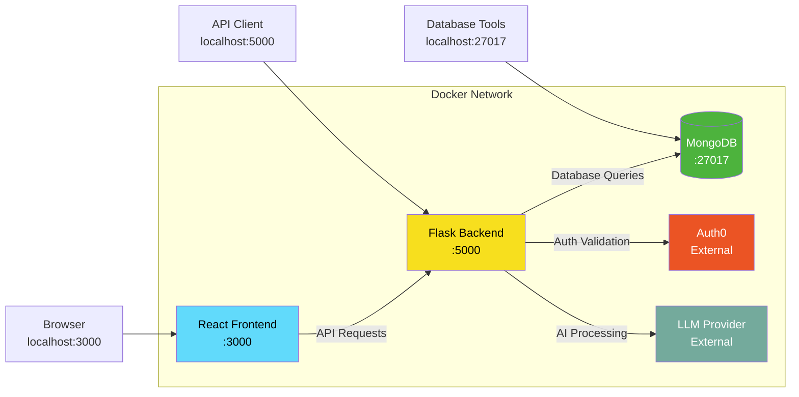

# Docker Development Guide

This guide explains how to set up and use Docker Compose for local development of the Todo Application, providing a consistent and reproducible development environment.

*Source: Tech Spec Sections 3.7, 4.8, 8.3 — Docker Configuration, Local Development Environment, Container Orchestration*

The Docker Compose setup orchestrates three services — a **MongoDB 8.0 database**, a **Python/Flask 3.1.3 backend**, and a **React 19.2.1 frontend** — in isolated containers with shared networking, persistent storage, and hot-reload enabled for rapid development.

> **Target Audience:** Developers who want to run the complete application stack using Docker without installing individual dependencies on their host machine.

## Prerequisites

Before proceeding, ensure the following tools are installed:

- **Docker Desktop** (Docker Engine 24.0+ and Docker Compose V2) — [docker.com](https://www.docker.com/get-started/)
- **Git** for cloning the repository — [git-scm.com](https://git-scm.com/)
- A **text editor** for configuring environment variables
- *(Optional)* An Auth0 account and LLM API key for full feature testing

> **Prefer manual installation?** See the [Installation Guide](../getting-started/installation.md) for setting up each service individually without Docker.

## Table of Contents

- [Docker Service Topology](#docker-service-topology)
- [Docker Compose File Overview](#docker-compose-file-overview)
- [Service Definitions](#service-definitions)
  - [MongoDB Service](#mongodb-service)
  - [Flask Backend Service](#flask-backend-service)
  - [React Frontend Service](#react-frontend-service)
- [Getting Started](#getting-started)
- [Environment Configuration](#environment-configuration)
- [Starting Services](#starting-services)
- [Stopping Services](#stopping-services)
- [Volume Management](#volume-management)
- [Hot-Reload Configuration](#hot-reload-configuration)
- [Log Inspection](#log-inspection)
- [Database Seeding](#database-seeding)
- [Common Docker Commands](#common-docker-commands)
- [Troubleshooting Docker Issues](#troubleshooting-docker-issues)

---

## Docker Service Topology

The Todo Application uses a three-service Docker Compose architecture. All services communicate over a shared Docker network, with external connections to Auth0 (authentication) and an LLM Provider (AI features) over the internet.



**Service overview:**

- **React Frontend (port 3000):** Serves the React application with hot-reload enabled. Accessible from a browser at `http://localhost:3000`.
- **Flask Backend (port 5000):** Runs the Flask API server with auto-restart on code changes. Accessible at `http://localhost:5000` for direct API requests.
- **MongoDB (port 27017):** Persistent database with volume-mounted data. Accessible at `localhost:27017` via `mongosh` or MongoDB Compass.
- **Auth0 (external):** Authentication provider accessed by the Flask backend over HTTPS for token validation.
- **LLM Provider (external):** AI/LLM service accessed by the Flask backend over HTTPS for AI-powered features.

*Source: Tech Spec Sections 3.7, 4.8 — Docker Configuration and Local Development Environment*

---

## Docker Compose File Overview

The `docker-compose.yml` file at the repository root defines all three services, their configurations, and how they connect. Below is the recommended configuration for local development.

```yaml
version: "3.8"

services:
  mongodb:
    image: mongo:8.0
    container_name: todo-mongodb
    ports:
      - "27017:27017"
    volumes:
      - mongodb_data:/data/db
    environment:
      MONGO_INITDB_DATABASE: todo_app
    restart: unless-stopped
    healthcheck:
      test: ["CMD", "mongosh", "--eval", "db.adminCommand('ping')"]
      interval: 10s
      timeout: 5s
      retries: 5

  flask:
    build:
      context: .
      dockerfile: Dockerfile
    container_name: todo-flask
    ports:
      - "5000:5000"
    volumes:
      - ./src:/app/src
      - ./requirements.txt:/app/requirements.txt
    environment:
      - FLASK_APP=src/app.py
      - FLASK_ENV=development
      - FLASK_DEBUG=1
      - MONGODB_URI=mongodb://mongodb:27017/todo_app
    env_file:
      - .env
    depends_on:
      mongodb:
        condition: service_healthy
    restart: unless-stopped

  react:
    build:
      context: ./frontend
      dockerfile: Dockerfile
    container_name: todo-react
    ports:
      - "3000:3000"
    volumes:
      - ./frontend/src:/app/src
      - ./frontend/public:/app/public
    environment:
      - REACT_APP_API_URL=http://localhost:5000
    depends_on:
      - flask
    restart: unless-stopped

volumes:
  mongodb_data:
    driver: local
```

**Key configuration points:**

- **`version: "3.8"`** — Docker Compose file format version supporting health check conditions and named volumes.
- **Named volume `mongodb_data`** — Persists database data across container restarts so your to-do items are not lost when you stop services.
- **Health check on MongoDB** — Ensures the database is responsive before the Flask backend starts, preventing connection errors on startup.
- **Bind mounts for source code** — Maps local source directories into containers to enable hot-reload during development.
- **`env_file: .env`** — Loads environment variables (Auth0 credentials, LLM API keys, secrets) from the `.env` file at the project root.
- **`depends_on` with conditions** — Enforces proper startup order: MongoDB starts first, then Flask, then React.

> **Note:** The actual `docker-compose.yml` file in the repository may differ slightly as the project evolves. This example represents the recommended configuration for local development.

---

## Service Definitions

### MongoDB Service

The MongoDB service provides the application's data layer using the official `mongo:8.0` image, matching the prescribed MongoDB 8.0 version from the technology stack.

| Setting | Value | Description |
| --- | --- | --- |
| Image | `mongo:8.0` | Official MongoDB 8.0 Docker image |
| Container Name | `todo-mongodb` | Consistent name for log inspection and commands |
| Port Mapping | `27017:27017` | Exposes MongoDB on the default port (host:container) |
| Volume | `mongodb_data:/data/db` | Named volume for persistent data storage |
| Environment | `MONGO_INITDB_DATABASE=todo_app` | Creates the `todo_app` database on first run |
| Health Check | `mongosh --eval "db.adminCommand('ping')"` | Verifies database responsiveness every 10 seconds |
| Restart Policy | `unless-stopped` | Automatically restarts unless explicitly stopped |

The health check runs every 10 seconds with a 5-second timeout and allows up to 5 retries before marking the service as unhealthy. Other services that depend on MongoDB wait for it to pass this health check before starting.

### Flask Backend Service

The Flask backend service builds from the project root `Dockerfile` and runs the Python/Flask 3.1.3 API server with debug mode enabled for development.

| Setting | Value | Description |
| --- | --- | --- |
| Build Context | `.` (project root) | Builds from the root Dockerfile |
| Container Name | `todo-flask` | Consistent name for log inspection and commands |
| Port Mapping | `5000:5000` | Exposes Flask on the default port (host:container) |
| Source Volume | `./src:/app/src` | Bind mount for backend source code (enables hot-reload) |
| Deps Volume | `./requirements.txt:/app/requirements.txt` | Bind mount for Python dependencies |
| `FLASK_APP` | `src/app.py` | Flask application entry point |
| `FLASK_ENV` | `development` | Enables development mode |
| `FLASK_DEBUG` | `1` | Enables auto-restart on code changes |
| `MONGODB_URI` | `mongodb://mongodb:27017/todo_app` | Connects to MongoDB using Docker network hostname |
| Env File | `.env` | Loads Auth0 credentials, LLM API keys, and other secrets |
| Dependency | `mongodb` (service_healthy) | Waits for MongoDB health check to pass |

Setting `FLASK_DEBUG=1` activates Flask's built-in reloader, which watches for file changes in the mounted `./src` directory and automatically restarts the server when a Python file is modified.

### React Frontend Service

The React frontend service builds from the `./frontend` directory and runs the React 19.2.1 development server with Hot Module Replacement (HMR) enabled by default.

| Setting | Value | Description |
| --- | --- | --- |
| Build Context | `./frontend` | Builds from the frontend directory Dockerfile |
| Container Name | `todo-react` | Consistent name for log inspection and commands |
| Port Mapping | `3000:3000` | Exposes React dev server on port 3000 (host:container) |
| Source Volume | `./frontend/src:/app/src` | Bind mount for frontend source code (enables HMR) |
| Public Volume | `./frontend/public:/app/public` | Bind mount for public assets |
| `REACT_APP_API_URL` | `http://localhost:5000` | Backend API URL used by the frontend |
| Dependency | `flask` | Starts after the Flask backend is running |

The React development server provides built-in Hot Module Replacement, which instantly reflects changes to React components, styles, and other frontend files in the browser without a full page reload.

### Service Communication

The following table summarizes how services communicate with each other:

| From | To | Protocol | Network Address |
| --- | --- | --- | --- |
| React Frontend | Flask Backend | HTTP | `http://localhost:5000` (from browser) |
| Flask Backend | MongoDB | MongoDB Wire Protocol | `mongodb://mongodb:27017` (Docker network) |
| Flask Backend | Auth0 | HTTPS | `https://YOUR_AUTH0_DOMAIN` (external) |
| Flask Backend | LLM Provider | HTTPS | Provider-specific URL (external) |

> **Important:** Inside the Docker network, services communicate using their service names as hostnames (e.g., `mongodb` instead of `localhost`). The browser, however, accesses the Flask backend via `localhost:5000` since it runs outside the Docker network.

*Source: Tech Spec Section 3.7 — Docker Configuration; Section 4.8 — Local Development Environment*

---

## Getting Started

Follow these steps to start the entire application stack with Docker Compose.

### Step 1: Clone the Repository

```bash
git clone https://github.com/your-org/todo-app.git
cd todo-app
```

### Step 2: Create the Environment File

```bash
cp .env.example .env
```

### Step 3: Configure Environment Variables

Open `.env` in your editor and set the required values. At minimum, configure:

- `SECRET_KEY` — Flask secret key for session signing
- `AUTH0_DOMAIN` — Your Auth0 tenant domain *(optional for basic testing)*
- `AUTH0_CLIENT_ID` — Your Auth0 application client ID *(optional for basic testing)*
- `LLM_API_KEY` — Your LLM provider API key *(optional for AI features)*

For the full list of configuration options, see the [Configuration Guide](../getting-started/configuration.md).

### Step 4: Build and Start All Services

```bash
docker compose up -d --build
```

This command builds the Flask and React Docker images (if not already built) and starts all three services in detached mode (background).

### Step 5: Verify Services Are Running

```bash
docker compose ps
```

**Expected output:**

```text
NAME            SERVICE    STATUS     PORTS
todo-mongodb    mongodb    running    0.0.0.0:27017->27017/tcp
todo-flask      flask      running    0.0.0.0:5000->5000/tcp
todo-react      react      running    0.0.0.0:3000->3000/tcp
```

### Step 6: Access the Application

| Service | URL | Description |
| --- | --- | --- |
| Frontend | `http://localhost:3000` | React web application |
| Backend API | `http://localhost:5000` | Flask REST API |
| MongoDB | `localhost:27017` | Database (via `mongosh` or MongoDB Compass) |

### Health Checks

Verify each service is responding correctly:

```bash
# Check backend health
curl http://localhost:5000/health

# Check MongoDB
docker compose exec mongodb mongosh --eval "db.adminCommand('ping')"
```

---

## Environment Configuration

Docker Compose reads environment variables from two sources: the inline `environment` section in `docker-compose.yml` and the `.env` file at the project root.

### Variable Precedence

Environment variables are resolved in this order (highest priority first):

1. **Inline `environment`** in `docker-compose.yml` — Takes highest priority
2. **`env_file: .env`** — Loaded from the `.env` file
3. **Shell environment variables** — Used if not overridden by the above

### Docker-Specific Variables

The following variables are set directly in `docker-compose.yml` for the Docker environment:

| Variable | Default | Description |
| --- | --- | --- |
| `MONGODB_URI` | `mongodb://mongodb:27017/todo_app` | MongoDB connection string using Docker network hostname |
| `FLASK_APP` | `src/app.py` | Flask application entry point |
| `FLASK_ENV` | `development` | Flask environment mode |
| `FLASK_DEBUG` | `1` | Enables debug mode and auto-reload |
| `REACT_APP_API_URL` | `http://localhost:5000` | Backend API URL for the frontend |

> **Important:** When running with Docker Compose, the MongoDB connection string uses the Docker network hostname `mongodb` instead of `localhost`. The `MONGODB_URI` defined in `docker-compose.yml` overrides any value set in the `.env` file. Do not change this unless you have a custom networking setup.

For the full environment variable reference including Auth0, LLM, and application settings, see the [Configuration Guide](../getting-started/configuration.md).

---

## Starting Services

### Start All Services in Background

```bash
docker compose up -d
```

The `-d` flag runs containers in detached mode, returning your terminal immediately.

### Start All Services with Logs in Foreground

```bash
docker compose up
```

Logs from all services stream to your terminal. Press `Ctrl+C` to stop all services.

### Start with a Fresh Build

Use this after modifying `Dockerfile`, `requirements.txt`, or `package.json`:

```bash
docker compose up -d --build
```

### Start a Specific Service

```bash
# Start only MongoDB
docker compose up -d mongodb

# Start MongoDB and Flask (without React)
docker compose up -d mongodb flask
```

When starting a service that depends on another (e.g., `flask` depends on `mongodb`), Docker Compose automatically starts the dependency first.

### Force Recreate Containers

```bash
docker compose up -d --force-recreate
```

This stops existing containers and creates new ones, useful when environment variables or configuration files have changed.

> **Note:** On first run, Docker pulls the `mongo:8.0` image and builds the Flask and React images. This may take several minutes depending on your internet connection. Subsequent runs use cached images and start in seconds.

---

## Stopping Services

### Stop All Services

```bash
docker compose down
```

This stops and removes all containers but **preserves named volumes** (your database data is safe).

### Stop All Services and Remove Volumes

```bash
docker compose down -v
```

> **⚠️ Warning:** Using `-v` deletes the MongoDB data volume. All database data will be permanently lost. Use this only when you want a completely clean slate.

### Stop a Specific Service

```bash
docker compose stop flask
```

The container is stopped but not removed. Other services continue running.

### Restart a Specific Service

```bash
docker compose restart flask
```

This stops and restarts the container. Useful after configuration changes that are not picked up by hot-reload.

---

## Volume Management

Docker volumes provide persistent storage and source code mapping for the containerized services.

### Named Volumes

| Volume | Mount Point | Purpose |
| --- | --- | --- |
| `mongodb_data` | `/data/db` | Persists MongoDB data across container restarts |

Named volumes are managed by Docker and survive container removal. Your database data persists even when you run `docker compose down` (without `-v`).

### Bind Mounts

| Host Path | Container Path | Service | Purpose |
| --- | --- | --- | --- |
| `./src` | `/app/src` | Flask | Backend source code (hot-reload) |
| `./requirements.txt` | `/app/requirements.txt` | Flask | Python dependencies |
| `./frontend/src` | `/app/src` | React | Frontend source code (HMR) |
| `./frontend/public` | `/app/public` | React | Public assets |

Bind mounts map your local source code into containers, enabling hot-reload. Changes to files on your host machine are immediately reflected inside the container.

### Volume Commands

```bash
# List all Docker volumes
docker volume ls

# Inspect the MongoDB data volume
docker volume inspect todo-app_mongodb_data

# Remove all unused volumes (prompts for confirmation)
docker volume prune
```

> **Important:** Bind mounts depend on your local file system. Named volumes are managed by Docker and persist independently. When you modify a file on your host machine in a bind-mounted directory, the change is instantly visible inside the container — this is what enables hot-reload during development.

---

## Hot-Reload Configuration

Both Flask and React are configured for automatic code reloading during development, so you rarely need to manually restart containers.

### Flask Hot-Reload

Flask's built-in reloader is activated by the `FLASK_DEBUG=1` environment variable in the Docker Compose configuration.

- The reloader watches for file changes in the mounted `./src` directory
- When a Python file is saved, Flask automatically restarts the server
- No manual restart is needed — changes take effect in 1–2 seconds
- Log output shows `* Restarting with stat` when a reload is triggered

### React Hot Module Replacement (HMR)

React's development server includes Hot Module Replacement by default.

- Changes to React components, styles, and other frontend files are reflected instantly in the browser
- The browser does **not** need to be manually refreshed for most changes
- State is preserved across reloads when possible
- Some changes (like new environment variables or `package.json` modifications) require a container restart

### Troubleshooting Hot-Reload

If hot-reload is not working as expected:

1. **Verify bind mount paths** are correct in `docker-compose.yml` — the host path must point to your actual source directory.

2. **Check Docker Desktop file sharing** — On macOS and Windows, Docker Desktop must have permission to access your project directory. Go to Docker Desktop → Settings → Resources → File Sharing and ensure your project folder is included.

3. **Restart the specific service** to reset the file watcher:

   ```bash
   docker compose restart flask
   docker compose restart react
   ```

4. **Enable polling-based file watching** if event-based watching fails (common on some macOS/Windows configurations):

   ```yaml
   # Add to Flask service environment in docker-compose.yml
   environment:
     - FLASK_RUN_EXTRA_FILES=src/**/*.py
   ```

5. **Check container logs** for file-watching errors:

   ```bash
   docker compose logs -f flask
   ```

---

## Log Inspection

Docker Compose provides built-in log management for all services.

### View All Service Logs

```bash
docker compose logs
```

### Follow Logs in Real-Time

```bash
docker compose logs -f
```

Press `Ctrl+C` to stop following. This does not stop the services.

### View Logs for a Specific Service

```bash
# Flask backend logs
docker compose logs -f flask

# MongoDB logs
docker compose logs -f mongodb

# React frontend logs
docker compose logs -f react
```

### View Last N Lines

```bash
# Last 100 lines of Flask logs
docker compose logs --tail=100 flask
```

### Filter Logs by Time

```bash
# Logs from the last 30 minutes
docker compose logs --since 30m flask

# Logs since a specific timestamp
docker compose logs --since 2026-03-24T10:00:00 flask
```

### Common Log Patterns

When inspecting logs, look for these patterns to confirm service health:

| Service | Log Pattern | Meaning |
| --- | --- | --- |
| Flask | `* Running on http://0.0.0.0:5000` | Server started successfully |
| Flask | `* Restarting with stat` | Hot-reload triggered by code change |
| MongoDB | `Waiting for connections` | Database is ready to accept connections |
| React | `Compiled successfully!` | Frontend build completed and dev server is ready |

**Error patterns to watch for:**

- `ConnectionRefusedError` — A service cannot reach a dependency (check startup order)
- `Authentication failed` — Auth0 credentials may be misconfigured
- `ImportError` or `ModuleNotFoundError` — Python dependency is missing (rebuild the Flask image)
- `ENOSPC` — Docker ran out of disk space (run `docker system prune`)

---

## Database Seeding

Populate the MongoDB database with sample data for development and testing.

### Using a Seed Script

If a seed script is available in the project, run it inside the Flask container:

```bash
docker compose exec flask python src/scripts/seed_database.py
```

### Manual Seeding with mongosh

Connect to the MongoDB container and insert sample to-do items directly:

```bash
docker compose exec mongodb mongosh todo_app
```

Once inside the MongoDB shell, run:

```javascript
db.todos.insertMany([
  {
    title: "Set up development environment",
    description: "Install all prerequisites and configure local dev setup",
    priority: "high",
    completed: true,
    created_at: new Date(),
    updated_at: new Date()
  },
  {
    title: "Review API documentation",
    description: "Go through the API reference and test all endpoints",
    priority: "medium",
    completed: false,
    created_at: new Date(),
    updated_at: new Date()
  },
  {
    title: "Write integration tests",
    description: "Add test coverage for CRUD endpoints",
    priority: "medium",
    completed: false,
    created_at: new Date(),
    updated_at: new Date()
  }
]);
```

### Verify Seeded Data

```bash
docker compose exec mongodb mongosh todo_app --eval "db.todos.find().pretty()"
```

### Reset Database

To drop all data and re-seed from scratch:

```bash
# Drop the database
docker compose exec mongodb mongosh todo_app --eval "db.dropDatabase()"

# Re-seed (if using a seed script)
docker compose exec flask python src/scripts/seed_database.py
```

Alternatively, stop all services and remove the data volume for a completely clean database:

```bash
docker compose down -v
docker compose up -d --build
```

---

## Common Docker Commands

### Quick Reference

| Command | Description |
| --- | --- |
| `docker compose up -d` | Start all services in background |
| `docker compose up -d --build` | Build images and start services |
| `docker compose down` | Stop all services (preserves volumes) |
| `docker compose down -v` | Stop services and remove volumes |
| `docker compose ps` | List running services and their status |
| `docker compose logs -f` | Follow all service logs in real-time |
| `docker compose logs -f flask` | Follow Flask logs only |
| `docker compose restart flask` | Restart the Flask service |
| `docker compose exec flask bash` | Open a shell in the Flask container |
| `docker compose exec mongodb mongosh` | Open the MongoDB shell |
| `docker compose build --no-cache` | Rebuild images without using cache |
| `docker system prune -a` | Remove all unused Docker resources |

### Accessing Container Shells

Open an interactive shell inside a running container for debugging or manual tasks:

```bash
# Open bash shell in Flask container
docker compose exec flask bash

# Open shell in React container (uses sh if bash is unavailable)
docker compose exec react sh

# Open MongoDB shell connected to the todo_app database
docker compose exec mongodb mongosh todo_app
```

### Running One-Off Commands

Execute commands inside containers without opening an interactive shell:

```bash
# Run a Python command in the Flask container
docker compose exec flask python -c "print('Hello from Flask container')"

# Run npm lint in the React container
docker compose exec react npm run lint

# Run tests in the Flask container
docker compose exec flask pytest

# Check installed Python packages
docker compose exec flask pip list

# Check Node.js version in the React container
docker compose exec react node --version
```

---

## Troubleshooting Docker Issues

This section covers common Docker-related issues. For application-level troubleshooting, see the [Troubleshooting Guide](../troubleshooting.md).

### Port Already in Use

**Error:**

```text
Bind for 0.0.0.0:5000 failed: port is already allocated
```

**Cause:** Another process on your machine is already using the required port.

**Solution:**

1. Find the conflicting process:

   ```bash
   # macOS / Linux
   lsof -i :5000

   # Windows
   netstat -ano | findstr :5000
   ```

2. Stop the conflicting process, or change the port mapping in `docker-compose.yml`:

   ```yaml
   ports:
     - "5001:5000"  # Map to a different host port
   ```

### MongoDB Connection Refused

**Error:** `ServerSelectionTimeoutError` in Flask logs.

**Cause:** Flask is trying to connect to MongoDB before it is ready, or the connection string uses an incorrect hostname.

**Solution:**

1. Check that MongoDB is healthy:

   ```bash
   docker compose ps
   ```

2. Verify the `MONGODB_URI` uses the Docker network hostname `mongodb` — not `localhost`:

   ```text
   MONGODB_URI=mongodb://mongodb:27017/todo_app
   ```

3. Restart the Flask service:

   ```bash
   docker compose restart flask
   ```

### Build Failures

**Error:** `ERROR: Service 'flask' failed to build`

**Cause:** Missing dependencies, invalid Dockerfile syntax, or network issues during the build.

**Solution:**

1. Check the Dockerfile for syntax errors.
2. Rebuild without cache to pull fresh dependencies:

   ```bash
   docker compose build --no-cache
   ```

3. Ensure your network connection is stable (Docker needs to download base images and packages).

### Volume Permission Issues

**Error:** `Permission denied` errors when reading or writing to mounted volumes.

**Cause:** The container user does not have permission to access files on the host machine.

**Solution:**

1. Check file ownership on the host:

   ```bash
   ls -la ./src
   ```

2. Add a `user` directive to the service in `docker-compose.yml`:

   ```yaml
   flask:
     user: "${UID}:${GID}"
   ```

3. Or adjust host directory permissions:

   ```bash
   chmod -R 755 ./src
   ```

### Hot-Reload Not Working

**Cause:** File system events are not propagating from the host to the container.

**Solution:**

1. Verify bind mount paths are correct in `docker-compose.yml`.
2. Check Docker Desktop file sharing settings (macOS/Windows).
3. Restart the affected service:

   ```bash
   docker compose restart flask
   ```

4. See the [Hot-Reload Configuration](#hot-reload-configuration) section for additional troubleshooting steps.

### Out of Disk Space

**Error:** `ENOSPC: no space left on device` or Docker commands hang.

**Solution:**

```bash
# Remove unused containers, networks, and images
docker system prune -a

# Remove unused volumes
docker volume prune
```

> **Tip:** Run `docker system df` to see Docker's disk usage breakdown.

---

## Related Documentation

- [Installation Guide](../getting-started/installation.md) — Manual setup without Docker
- [Configuration Guide](../getting-started/configuration.md) — Full environment variable reference
- [Architecture Overview](../architecture/overview.md) — System architecture and component interactions
- [Troubleshooting Guide](../troubleshooting.md) — Comprehensive troubleshooting reference
