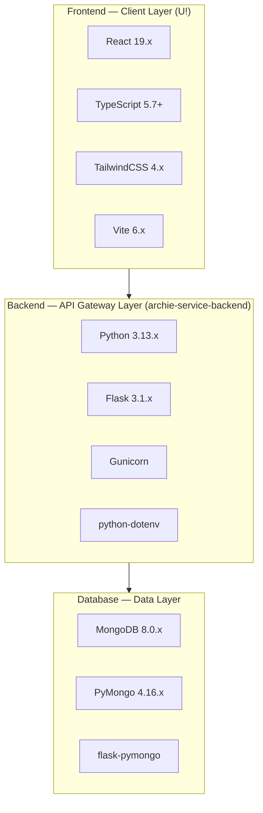

# Technology Stack

This document details all technologies powering the To-Do List Application, aligned with the Blitzx platform's prescribed technology stack. Each technology is listed with its version, purpose, and justification for selection. The stack is organized across three architectural layers — frontend, backend, and database — to provide a clear view of how the application's components are built and connected.

[← Back to README](../README.md)

---

## Stack Overview

The To-Do List Application follows a three-tier architecture. The **U!** frontend delivers the user interface, the **archie-service-backend** handles API logic and business rules, and **MongoDB** provides persistent document storage. The diagram below illustrates how these layers and their constituent technologies are organized.

*Source: Technical Specification §3.8*

---

## Frontend

The frontend layer powers the **U!** user interface — the sole client application through which users interact with the To-Do List Application. It is built with modern web technologies optimized for developer productivity, type safety, and responsive design.

### React 19.x

**Role:** UI library for building the task management interface.

React serves as the foundation of the U! frontend, providing a component-based architecture for constructing the task list view, task creation/editing forms, filter controls, and all interactive elements of the application.

**Justification:**

- **Component-based architecture** — Encapsulates UI elements (task cards, filter panels, priority badges) into reusable, composable components
- **Virtual DOM** — Efficient rendering through a diffing algorithm that minimizes direct DOM manipulation, ensuring smooth updates when tasks are created, edited, or filtered
- **Ecosystem maturity** — Extensive community support, rich library ecosystem, and battle-tested patterns for state management and routing
- **Concurrent features** — React 19.x introduces improvements to concurrent rendering, enhancing the responsiveness of the task management interface

*Source: Technical Specification §3.2*

### TypeScript 5.7+

**Role:** Static type checking for frontend code.

TypeScript adds a type system on top of JavaScript, enabling compile-time validation of task data structures, component props, and API response types throughout the U! frontend codebase.

**Justification:**

- **Type safety** — Catches data shape mismatches (e.g., missing task fields, incorrect priority values) at compile time rather than runtime
- **IDE support** — Rich autocompletion, inline documentation, and refactoring assistance accelerate development and reduce errors
- **Reduced runtime errors** — Strict typing eliminates entire categories of bugs related to undefined values, incorrect function signatures, and incompatible data types
- **Self-documenting code** — Type annotations serve as living documentation for task interfaces, API contracts, and component props

*Source: Technical Specification §3.1*

### TailwindCSS 4.x

**Role:** Utility-first CSS framework for UI styling.

TailwindCSS provides low-level utility classes that enable rapid, consistent styling of the To-Do List Application's interface without writing custom CSS files.

**Justification:**

- **Rapid UI development** — Utility classes applied directly in component markup eliminate the overhead of maintaining separate stylesheets
- **Consistent styling** — A design token system ensures uniform spacing, colors, typography, and sizing across all task management screens
- **Responsive design utilities** — Built-in breakpoint prefixes (`sm:`, `md:`, `lg:`) enable mobile-first responsive layouts for the task list, filters, and forms
- **Small production bundle** — Automatic tree-shaking removes unused styles, resulting in minimal CSS payload

*Source: Technical Specification §3.2*

### Vite 6.x

**Role:** Frontend build tool and development server.

Vite powers both the local development experience and the production build pipeline for the U! frontend application.

**Justification:**

- **Fast Hot Module Replacement (HMR)** — Near-instant browser updates during development when modifying task components or styles
- **ESM-native** — Leverages native ES modules for faster development server startup compared to traditional bundlers
- **Optimized production builds** — Rollup-based production bundling with code splitting, tree shaking, and asset optimization
- **TypeScript support** — Native TypeScript compilation without additional configuration

*Source: Technical Specification §3.2*

---

## Backend

The backend layer implements the **archie-service-backend** service — the single entry point for all API requests from the U! frontend. It handles task management business logic, data validation, and communication with the MongoDB data layer.

### Python 3.13.x

**Role:** Backend runtime language.

Python serves as the primary programming language for the archie-service-backend, providing the runtime environment for the Flask web framework and all server-side task management logic.

**Justification:**

- **Modern language features** — Python 3.13.x includes performance improvements, enhanced error messages, and updated standard library modules
- **Performance improvements** — Continued interpreter optimizations in the 3.13 release line reduce overhead for request processing
- **Extensive library ecosystem** — Access to thousands of packages for data validation, date handling, logging, and testing
- **Readability and maintainability** — Python's clean syntax supports long-term maintainability of the task management codebase

*Source: Technical Specification §3.1*

### Flask 3.1.x

**Role:** Lightweight web framework for archie-service-backend.

Flask provides the HTTP routing, request/response handling, and application structure for all task management API endpoints (create, read, update, delete, filter, and completion toggle).

**Justification:**

- **Minimal boilerplate** — Flask's micro-framework approach keeps the codebase focused on task management logic rather than framework ceremony
- **Flexible routing** — Decorator-based route definitions make it straightforward to define RESTful endpoints for task CRUD operations
- **Extensive extension ecosystem** — Flask extensions (flask-pymongo, flask-cors, etc.) integrate seamlessly to add database connectivity, cross-origin support, and other capabilities
- **Blueprint architecture** — Modular application structure through Blueprints supports clean separation of API routes as the application grows

*Source: Technical Specification §3.2*

### Gunicorn

**Role:** Production WSGI server for Flask.

Gunicorn serves as the production-grade HTTP server, replacing Flask's built-in development server for deployment scenarios.

**Justification:**

- **Process management** — Pre-fork worker model manages multiple worker processes to handle concurrent task management requests
- **Worker concurrency** — Configurable worker count enables scaling request throughput based on server resources
- **Production readiness** — Battle-tested in production environments with graceful restart, signal handling, and process monitoring
- **WSGI compliance** — Full WSGI compatibility ensures seamless integration with the Flask application

### python-dotenv

**Role:** Environment variable management.

python-dotenv loads environment variables from `.env` files into the application's runtime environment, enabling configuration of database URLs, API ports, and application modes.

**Justification:**

- **Separation of configuration from code** — Database connection strings, port numbers, and environment modes are externalized from source code
- **Development convenience** — Local `.env` files provide developer-specific configuration without modifying shared code
- **Deployment flexibility** — Environment variables can be sourced from `.env` files locally or from platform-level configuration in production
- **Security** — Sensitive values (database credentials, secret keys) are kept out of version control

---

## Database

The database layer provides persistent storage for all task data. MongoDB's document-oriented model aligns naturally with the task data structure, and the Python driver stack enables efficient communication between the backend and the database.

### MongoDB 8.0.x

**Role:** Document-oriented NoSQL database.

MongoDB stores all task documents in a flexible, schema-less collection, serving as the primary data persistence layer for the To-Do List Application.

**Justification:**

- **Flexible schema for task documents** — Tasks with varying optional fields (description, due date) are stored without rigid schema constraints, simplifying data evolution
- **JSON-native storage** — BSON (Binary JSON) storage format aligns naturally with the JSON data exchanged between the U! frontend and archie-service-backend
- **Horizontal scalability** — Sharding and replica set capabilities provide a path for scaling as task volume grows
- **Rich query language** — Expressive query operators support filtering tasks by priority, date ranges, completion status, and text search
- **Indexing support** — Secondary indexes on priority, due date, and completion status fields enable efficient query execution

*Source: Technical Specification §3.5*

### PyMongo 4.16.x

**Role:** Official MongoDB driver for Python.

PyMongo provides the archie-service-backend with direct access to MongoDB, translating Python operations into MongoDB wire protocol commands.

**Justification:**

- **Direct MongoDB wire protocol access** — Low-level driver communicates directly with MongoDB without ORM abstraction overhead
- **Comprehensive query support** — Full access to MongoDB's query language, aggregation framework, and index management from Python
- **Connection pooling** — Built-in connection pool management ensures efficient reuse of database connections across request handlers
- **BSON handling** — Native BSON serialization/deserialization for seamless conversion between Python dictionaries and MongoDB documents

*Source: Technical Specification §3.5*

### flask-pymongo

**Role:** Flask integration for PyMongo.

flask-pymongo bridges Flask's application context with PyMongo's connection management, providing a convenient interface for database operations within Flask route handlers.

**Justification:**

- **Simplified connection management** — Automatically manages MongoDB client lifecycle within the Flask application context
- **Configuration integration** — Reads MongoDB connection settings from Flask's configuration system, supporting environment-based configuration via python-dotenv
- **Request-scoped access** — Provides access to the MongoDB database instance through Flask's `g` or extension attributes within request handlers

---

## Development Tools

The following tools support the local development workflow for the To-Do List Application, enabling rapid iteration across all three layers.

| Tool | Purpose | Details |
|------|---------|---------|
| **Docker** | Containerized development environment | Provides consistent, reproducible environments for MongoDB and backend services. Eliminates "works on my machine" issues |
| **Vite Dev Server** | Frontend hot module replacement | Instant browser updates during U! frontend development. Serves the React application on a local development port |
| **Flask Dev Server** | Backend auto-reload | Automatically restarts the archie-service-backend when Python source files change during development |
| **`mongo:8.0`** | MongoDB container image | Official MongoDB 8.0 Docker image for running the database locally without a system-wide installation |
| **`python:3.13-slim`** | Python container image | Lightweight Python 3.13 Docker image for containerized backend development and deployment |

---

## Version Compatibility Matrix

The table below lists all technologies in the To-Do List Application stack with their prescribed versions, architectural layer, and compatibility notes.

| Technology | Version | Layer | Compatibility Notes |
|------------|---------|-------|---------------------|
| React | 19.x | Frontend | Requires Node.js LTS runtime for build tooling; pairs with TypeScript 5.7+ for type-checked components |
| TypeScript | 5.7+ | Frontend | Compiled by Vite 6.x; strict mode recommended for maximum type safety |
| TailwindCSS | 4.x | Frontend | Integrated via Vite plugin; zero-runtime CSS utility framework |
| Vite | 6.x | Frontend | Serves as both dev server and production bundler; native TypeScript and TailwindCSS support |
| Python | 3.13.x | Backend | Runtime for Flask 3.1.x and all backend dependencies; required for PyMongo 4.16.x |
| Flask | 3.1.x | Backend | WSGI framework; served by Gunicorn in production; requires Python 3.13.x |
| Gunicorn | Latest stable | Backend | Production WSGI server; manages Flask worker processes; Linux/macOS recommended |
| python-dotenv | Latest stable | Backend | Loads `.env` files; compatible with all Python 3.x versions |
| MongoDB | 8.0.x | Database | Document store; accessed via PyMongo 4.16.x; available as `mongo:8.0` Docker image |
| PyMongo | 4.16.x | Database | Official Python driver for MongoDB 8.0.x; provides connection pooling and BSON handling |
| flask-pymongo | Latest stable | Database | Flask extension bridging Flask app context with PyMongo connections |

*Source: Technical Specification §3.8*

---

## Related Documentation

- [Architecture](architecture.md) — How the To-Do List Application maps to the Blitzx platform's five-layer architecture
- [System Requirements](system-requirements.md) — Runtime prerequisites, environment configuration, and browser compatibility
- [Data Model](data-model.md) — MongoDB collection schema, field definitions, and indexing strategy
- [Getting Started](getting-started.md) — Setup instructions including dependency installation and environment configuration

---

*This document is part of the To-Do List Application documentation. Return to the [README](../README.md) for the full documentation index.*
