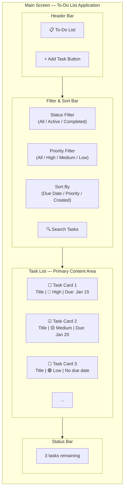
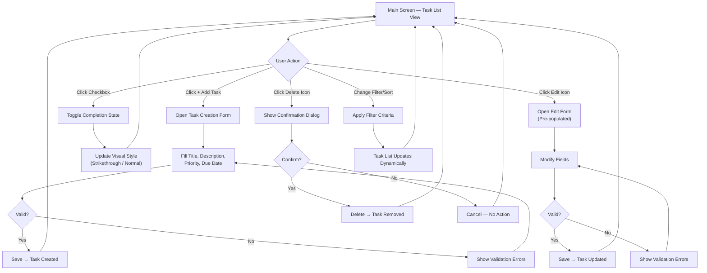

# User Interface Design

This document describes the visual design, layout, interaction patterns, and responsive design considerations for the To-Do List Application's U! frontend. The U! interface is the sole client for the Blitzx platform, providing users with a clean, intuitive task management experience. All user interactions with the application — creating, editing, completing, deleting, and filtering tasks — flow through the U! frontend, which communicates with the archie-service-backend API gateway.

[← Back to README](../README.md)

*Source: Technical Specification §7.2, §7.5, §3.2.2*

---

## Design Philosophy

The To-Do List Application's user interface is built on a **clean, minimal, and responsive** design philosophy, leveraging **TailwindCSS 4.x** as the utility-first CSS framework within a **React 19.x** and **TypeScript 5.7+** component architecture.

### Core Principles

| Principle | Description |
|-----------|-------------|
| **Usability First** | Every interaction is intuitive and requires minimal cognitive effort. Common actions (completing a task, adding a task) are accessible with a single click or minimal steps. |
| **Accessibility** | The interface follows web accessibility standards (WCAG guidelines) with proper color contrast, keyboard navigation support, focus indicators, and semantic HTML elements. Screen reader compatibility is a design requirement. |
| **Progressive Disclosure** | The interface reveals complexity gradually. The main screen shows essential task information (title, priority, due date, status), while detailed views and editing forms appear only when the user requests them. |
| **Visual Clarity** | Color-coded priority badges, clear status indicators, and consistent typography guide the user's attention to the most important information. Whitespace is used generously to avoid visual clutter. |
| **Responsive Design** | The layout adapts seamlessly from mobile to desktop viewports using TailwindCSS 4.x responsive breakpoints, ensuring a consistent experience across all device sizes. |

### Styling Approach

TailwindCSS 4.x provides the styling foundation through utility classes applied directly to React components. This approach offers several advantages for the To-Do List Application:

- **Consistency** — Predefined spacing, color, and typography scales ensure visual uniformity across all components.
- **Rapid Iteration** — Utility classes enable quick UI adjustments without writing custom CSS.
- **Small Bundle Size** — TailwindCSS purges unused styles, keeping the production CSS footprint minimal.
- **Dark Mode Support** — TailwindCSS 4.x includes built-in dark mode utilities for potential theme switching.

*Source: Technical Specification §3.2.2 (TailwindCSS 4.x)*

---

## Main Screen Layout

The main screen is the central hub of the To-Do List Application. It organizes all task management functionality into clearly defined regions, allowing users to view, create, filter, and manage their tasks without navigating away from the primary interface.

### Layout Regions

| Region | Position | Purpose |
|--------|----------|---------|
| **Header** | Top of the screen (full width) | Displays the application title ("To-Do List"), optional user actions (theme toggle, settings), and the primary "Add Task" button for quick task creation. |
| **Filter and Sort Bar** | Below the header (full width) | Houses filter controls (status, priority, due date), sort selectors (by date, priority, creation time), and a text search input for narrowing displayed tasks. |
| **Task List** | Center / main content area | The primary content region showing all tasks matching the current filter criteria. Tasks are displayed in a vertical list using card or row components. |
| **Task Creation/Edit Panel** | Overlay modal or inline form area | A contextual panel that appears when creating a new task or editing an existing one. May render as a modal overlay on desktop or a full-screen form on mobile. |
| **Empty State** | Center area (when no tasks exist) | A friendly placeholder message with a call-to-action encouraging users to create their first task. Displayed when the task list is empty or no tasks match the active filters. |

### Screen Composition Wireframe

The following Mermaid diagram illustrates the spatial arrangement of the main screen regions:

### Layout Behavior

- The **Header** remains fixed at the top of the viewport during scrolling, ensuring the "Add Task" button is always accessible.
- The **Filter and Sort Bar** sits directly below the header. On desktop, all filter controls are displayed inline. On mobile, filters are condensed into a collapsible panel.
- The **Task List** fills the remaining vertical space and scrolls independently when the number of tasks exceeds the visible area.
- The **Task Creation/Edit Panel** opens as a centered modal overlay on medium and large screens, or as a slide-up full-screen panel on small screens.

*Source: Technical Specification §7.5*

---

## Component Inventory

This section catalogs every major UI component in the To-Do List Application, describing its visual structure, data requirements, and behavior.

### Task List Component

The task list is the primary visual element of the application. It renders all tasks matching the current filter and sort criteria as a vertical list of task cards or task rows.

**Card Layout (Default)**

Each task card displays the following elements arranged horizontally:

| Element | Position | Description |
|---------|----------|-------------|
| **Completion Checkbox** | Far left | A checkbox or toggle control. Unchecked for active tasks; checked with a checkmark for completed tasks. Clicking toggles the `is_completed` state. |
| **Task Title** | Left of center (primary text) | The task title displayed in regular weight for active tasks and with strikethrough styling for completed tasks. |
| **Priority Badge** | Right of title | A small color-coded badge displaying the priority level: **High** (red), **Medium** (yellow/amber), **Low** (green). |
| **Due Date** | Right section | The due date formatted as a readable date string (e.g., "Jan 15, 2026"). Overdue dates are highlighted in red. Tasks without a due date show no date indicator. |
| **Action Buttons** | Far right | Edit (pencil icon) and Delete (trash icon) buttons, visible on hover or always visible on touch devices. |

**Visual States**

| Task State | Visual Treatment |
|------------|-----------------|
| **Active** (`is_completed: false`) | Normal text styling, unchecked checkbox, full opacity, priority badge visible |
| **Completed** (`is_completed: true`) | Strikethrough text on the title, dimmed/muted styling (reduced opacity), filled checkbox or checkmark icon, priority badge muted |
| **Overdue** (due date in the past, not completed) | Red text or red icon indicator on the due date, optional red left border accent on the task card |

**Empty State**

When no tasks exist or no tasks match the current filters, the task list area displays a centered empty state message:

- **No tasks at all:** "You have no tasks yet. Click '+ Add Task' to get started!"
- **No matching filter results:** "No tasks match your current filters. Try adjusting your filter criteria."

For a complete description of task fields and their constraints, see [Features — Task Creation](features.md#task-creation).

### Task Creation/Edit Form

The task creation and editing form is a modal or inline panel that allows users to input or modify task properties. The same form layout is used for both creating new tasks and editing existing ones, with the form pre-populated with existing values during editing.

**Form Fields**

| Field | Input Type | Required | Placeholder / Default | Validation |
|-------|-----------|----------|----------------------|------------|
| **Title** | Text input | Yes | "Enter task title..." | Non-empty, maximum 200 characters. Error message displayed below the field if validation fails. |
| **Description** | Textarea (multi-line) | No | "Add a description (optional)..." | Free-text, no enforced length limit. |
| **Priority** | Dropdown select | No | Pre-selected: **Medium** | Options: **High**, **Medium**, **Low**. Defaults to **Medium** if unchanged. |
| **Due Date** | Date picker | No | No date selected | Calendar-style date picker. Only future dates and today's date are selectable for new tasks. |

**Form Layout**

- Fields are arranged vertically, each spanning the full width of the form container.
- The **Title** field appears first, with a prominent label and a visible red asterisk (*) indicating it is required.
- The **Description** textarea appears below the title, with two to three visible lines and the ability to expand.
- The **Priority** dropdown and **Due Date** picker appear side by side on desktop screens and stack vertically on mobile screens.
- **Action buttons** appear at the bottom of the form:
  - **Save** (primary button, blue/indigo) — submits the form and creates or updates the task.
  - **Cancel** (secondary button, gray/outlined) — closes the form without saving.

**Validation Feedback**

- If the user attempts to submit with an empty title, the title field is highlighted with a red border and a red error message ("Title is required") appears below it.
- The Save button is disabled while the form is being submitted (loading state) to prevent duplicate submissions.
- Successful submission closes the form and returns the user to the task list with the new or updated task visible.

### Filter and Sort Controls

The filter and sort controls allow users to narrow the displayed task list based on specific criteria and order the results in a meaningful way.

**Filter Options**

| Filter | Control Type | Options | Default |
|--------|-------------|---------|---------|
| **Status** | Segmented button group or dropdown | All, Active, Completed | All |
| **Priority** | Dropdown select | All, High, Medium, Low | All |
| **Due Date Range** | Date range picker or preset buttons | Today, This Week, Overdue, All Dates | All Dates |
| **Search** | Text input with search icon | Free-text search across task titles and descriptions | Empty (no filter) |

**Sort Options**

| Sort Criterion | Description | Default Direction |
|---------------|-------------|-------------------|
| **Due Date** | Sorts tasks by their due date (earliest first) | Ascending (soonest due first) |
| **Priority** | Sorts tasks by priority level (High → Medium → Low) | Descending (highest first) |
| **Created Date** | Sorts tasks by their creation timestamp | Descending (newest first) |

**Behavior**

- Filters are applied **dynamically** — the task list updates immediately as the user changes any filter value without requiring a manual "Apply" button.
- Multiple filters can be combined (e.g., "Active" status + "High" priority + search text).
- The current active filter state is visually indicated (e.g., highlighted segmented button, filled dropdown).
- A "Clear Filters" or "Reset" control resets all filters to their defaults.

For the full description of filtering capabilities and acceptance criteria, see [Features — Task Filtering](features.md#task-filtering).

### Priority Visual Indicators

Priority levels are communicated visually through color-coded badges that appear consistently across all relevant UI components.

**Color Mapping**

| Priority | Badge Color | TailwindCSS Classes (Illustrative) | Usage Contexts |
|----------|------------|-------------------------------------|----------------|
| **High** | Red | `bg-red-100 text-red-800 border-red-200` | Task list card, task form dropdown option, filter dropdown option |
| **Medium** | Yellow / Amber | `bg-amber-100 text-amber-800 border-amber-200` | Task list card, task form dropdown option, filter dropdown option |
| **Low** | Green | `bg-green-100 text-green-800 border-green-200` | Task list card, task form dropdown option, filter dropdown option |

**Badge Design**

- Badges are rendered as small, rounded pill-shaped elements (e.g., `rounded-full px-2 py-0.5 text-xs font-medium`) containing the priority label text.
- The background color is a light tint of the priority color for readability, with the text rendered in a darker shade of the same hue.
- Badges maintain their color coding consistently across the task list, the task creation/edit form's priority dropdown, and the filter controls.
- For completed tasks, priority badges are rendered with reduced opacity (e.g., `opacity-50`) to visually de-emphasize them.

### Due Date Display

Due dates are displayed alongside each task in the task list and managed through a date picker in the task form.

**Date Formatting**

- Dates are displayed in a human-readable, locale-appropriate format: **"MMM DD, YYYY"** (e.g., "Jan 15, 2026").
- If no due date is assigned, the date area is left blank or displays a subtle "No due date" placeholder in muted text.

**Overdue Indicators**

| Condition | Visual Treatment |
|-----------|-----------------|
| **Due today** | Amber/yellow text or icon to indicate urgency (e.g., "Due today" label in amber) |
| **Overdue** (past due date, task not completed) | Red text, red calendar icon, or a "Overdue" badge in red. The due date text itself is rendered in red (e.g., `text-red-600`). |
| **Upcoming** (due within the next 3 days) | Subtle amber or orange highlight to warn the user about approaching deadlines |
| **Future** (more than 3 days away) | Standard text styling with no special highlighting |
| **No due date** | Muted gray text ("No due date") or the date area is left empty |

**Date Picker Component**

- The date picker in the task creation/edit form uses a calendar-style input allowing users to select a date visually.
- Past dates are visually disabled for new task creation to prevent assigning deadlines in the past.
- The selected date is displayed in the input field in the same human-readable format used in the task list.

For the full specification of due date behavior and acceptance criteria, see [Features — Due Dates](features.md#due-dates).

---

## Interaction Patterns

This section describes the key user interactions in the To-Do List Application, outlining the step-by-step flow for each major action.

### Task Completion Toggle

| Step | User Action | System Response |
|------|-------------|-----------------|
| 1 | Click the checkbox or toggle control on a task | The checkbox state changes immediately (optimistic UI update) |
| 2 | — | A PATCH request is sent to the archie-service-backend to toggle `is_completed` |
| 3 | — | On success: the task's visual style updates (strikethrough, dimmed). On failure: the checkbox reverts and an error notification appears. |

- This is a **single-click** interaction — no confirmation dialog is required.
- The toggle works identically for both completing and un-completing a task.

### Task Creation Flow

| Step | User Action | System Response |
|------|-------------|-----------------|
| 1 | Click the "+ Add Task" button in the header | The task creation form opens as a modal or inline panel |
| 2 | Fill in the title (required), description, priority, and due date fields | Real-time validation highlights any errors (e.g., empty title) |
| 3 | Click "Save" | The form is validated; if valid, a POST request is sent to the archie-service-backend |
| 4 | — | On success: the form closes, and the new task appears at the top of the task list. On failure: an error message is displayed in the form. |
| 5 | (Alternative) Click "Cancel" | The form closes without saving; no data is sent to the server |

### Task Editing Flow

| Step | User Action | System Response |
|------|-------------|-----------------|
| 1 | Click the edit (pencil) icon on a task, or click the task card itself | The editing form opens pre-populated with the task's current values |
| 2 | Modify any fields (title, description, priority, due date) | Real-time validation ensures data integrity |
| 3 | Click "Save" | A PATCH request is sent with only the changed fields |
| 4 | — | On success: the form closes, and the updated task is reflected in the task list. On failure: an error message is displayed. |
| 5 | (Alternative) Click "Cancel" | The form closes without saving; no changes are applied |

### Task Deletion Flow

| Step | User Action | System Response |
|------|-------------|-----------------|
| 1 | Click the delete (trash) icon on a task | A confirmation dialog appears: "Are you sure you want to delete this task? This action cannot be undone." |
| 2a | Click "Confirm" / "Delete" | A DELETE request is sent to the archie-service-backend. The task is removed from the task list immediately (optimistic UI). On failure: the task reappears and an error notification is shown. |
| 2b | Click "Cancel" | The dialog closes; the task remains unchanged. |

### Filtering Interaction

| Step | User Action | System Response |
|------|-------------|-----------------|
| 1 | Select a status filter (All / Active / Completed) | The task list immediately updates to show only tasks matching the selected status |
| 2 | Select a priority filter (All / High / Medium / Low) | The task list further narrows to tasks matching both the status and priority filters |
| 3 | Enter text in the search input | The task list filters in real time to show only tasks whose title or description contains the search text |
| 4 | Change the sort order (Due Date / Priority / Created Date) | The visible tasks are reordered according to the selected sort criterion |
| 5 | Click "Clear Filters" / "Reset" | All filters return to their default values (All / All / All Dates / empty search), and the full task list is displayed |

### Interaction Flow Diagram

The following diagram summarizes the primary interaction flows available from the main screen:

---

## Responsive Design Considerations

The To-Do List Application is designed with a **mobile-first** approach, using TailwindCSS 4.x responsive utilities to adapt the layout across all device sizes.

### Breakpoint Strategy

TailwindCSS 4.x provides a set of responsive breakpoints that the application uses to adjust layout and component sizing:

| Breakpoint | Prefix | Min Width | Layout Behavior |
|------------|--------|-----------|-----------------|
| **Mobile** | (default) | 0px | Single-column stacked layout. All components fill the full viewport width. |
| **Small** | `sm:` | 640px | Slight spacing adjustments. Filters begin to arrange inline where possible. |
| **Medium** | `md:` | 768px | Two-column layout for form fields (priority and due date side by side). Filter bar displays all controls inline. |
| **Large** | `lg:` | 1024px | Full desktop layout. Task cards display all information in a single row. Modal forms use a centered overlay. |
| **Extra Large** | `xl:` | 1280px | Maximum content width constrained to prevent overly wide layouts. Additional whitespace on ultra-wide screens. |

### Mobile Layout Adaptations

| Component | Mobile Behavior | Desktop Behavior |
|-----------|----------------|------------------|
| **Header** | Compact header with app title and a floating action button (FAB) for "Add Task" | Full header bar with title and an inline "Add Task" button |
| **Filter Bar** | Collapsed behind a "Filters" toggle button. Expands as a dropdown or slide-down panel when tapped. | All filter and sort controls displayed inline in a horizontal bar |
| **Task Cards** | Full-width cards with stacked content (title on one line, priority and due date on the next). Action buttons always visible. | Single-row cards with all elements inline. Action buttons appear on hover. |
| **Task Form** | Full-screen slide-up panel covering the entire viewport. Fields stacked vertically. | Centered modal overlay (max-width ~500px) with side-by-side layout for priority and due date fields |
| **Confirmation Dialog** | Full-width bottom sheet dialog | Centered modal dialog |

### Touch Target Sizing

To ensure comfortable interaction on touch devices:

- All interactive elements (buttons, checkboxes, links) maintain a minimum touch target size of **44×44 pixels** in accordance with accessibility guidelines.
- The completion checkbox on each task card has an expanded touch area beyond its visual bounds.
- Action buttons (edit, delete) on task cards use appropriately sized icons with sufficient surrounding padding.
- Dropdown menus and select controls have adequate row height for comfortable touch selection.

### Performance Considerations

- The task list uses **virtualized rendering** for large datasets, ensuring that only visible task cards are rendered in the DOM at any given time.
- Image assets (if any) and icons use optimized SVG formats for crisp rendering at all resolutions.
- TailwindCSS 4.x's CSS purging ensures that only the utility classes actually used in the application are included in the production build, minimizing CSS file size.

*Source: Technical Specification §3.2.2 (TailwindCSS 4.x), §7.5*

---

## Related Documentation

| Document | Description |
|----------|-------------|
| [Features](features.md) | Complete feature catalog with acceptance criteria |
| [Core Functionality](functionality.md) | Detailed API patterns and operation reference |
| [Technology Stack](technology-stack.md) | Full technology stack with version details |
| [Workflow](workflow.md) | End-to-end user and system workflow diagrams |

[← Back to README](../README.md)
