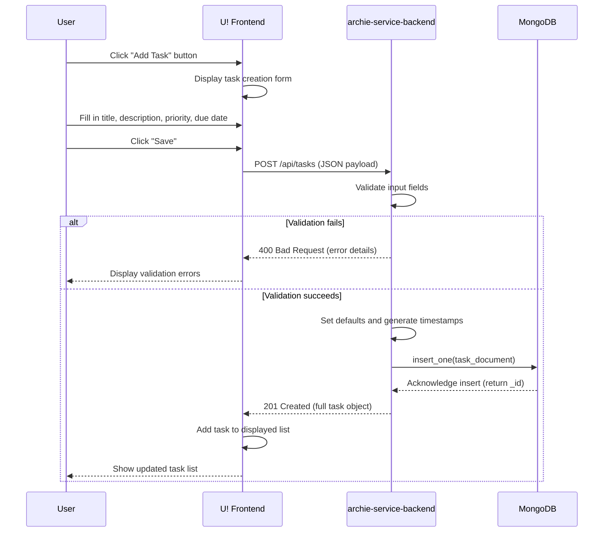
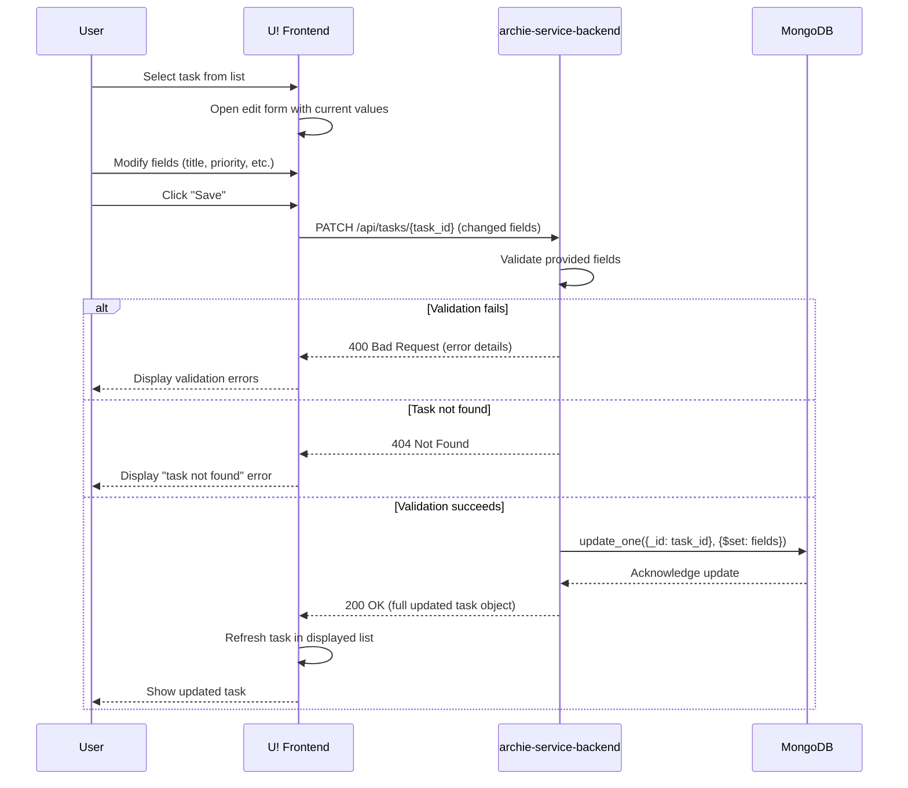
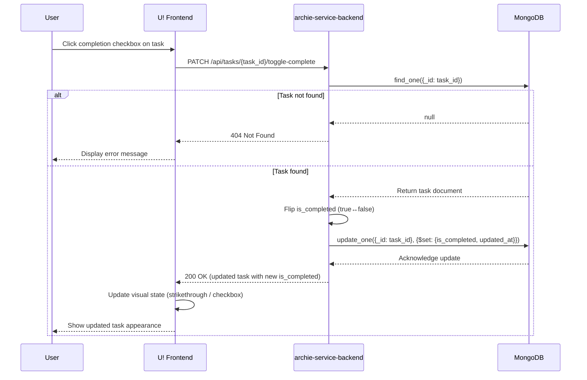
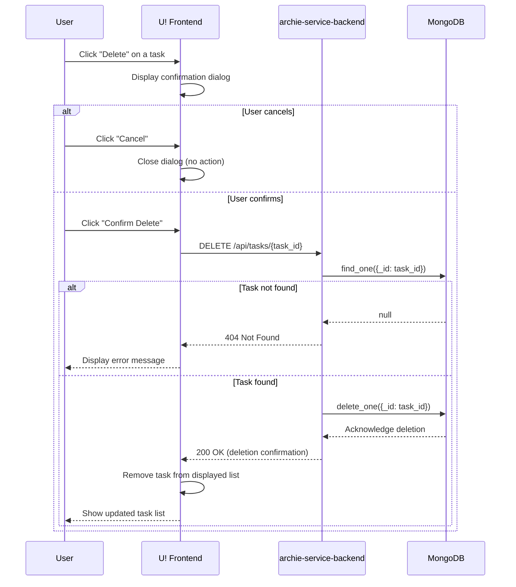
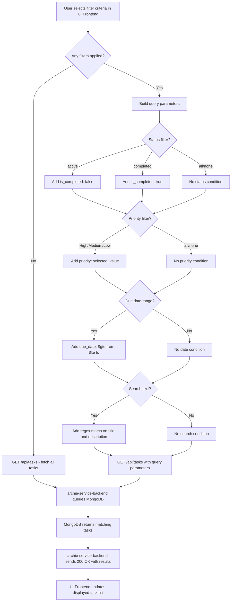
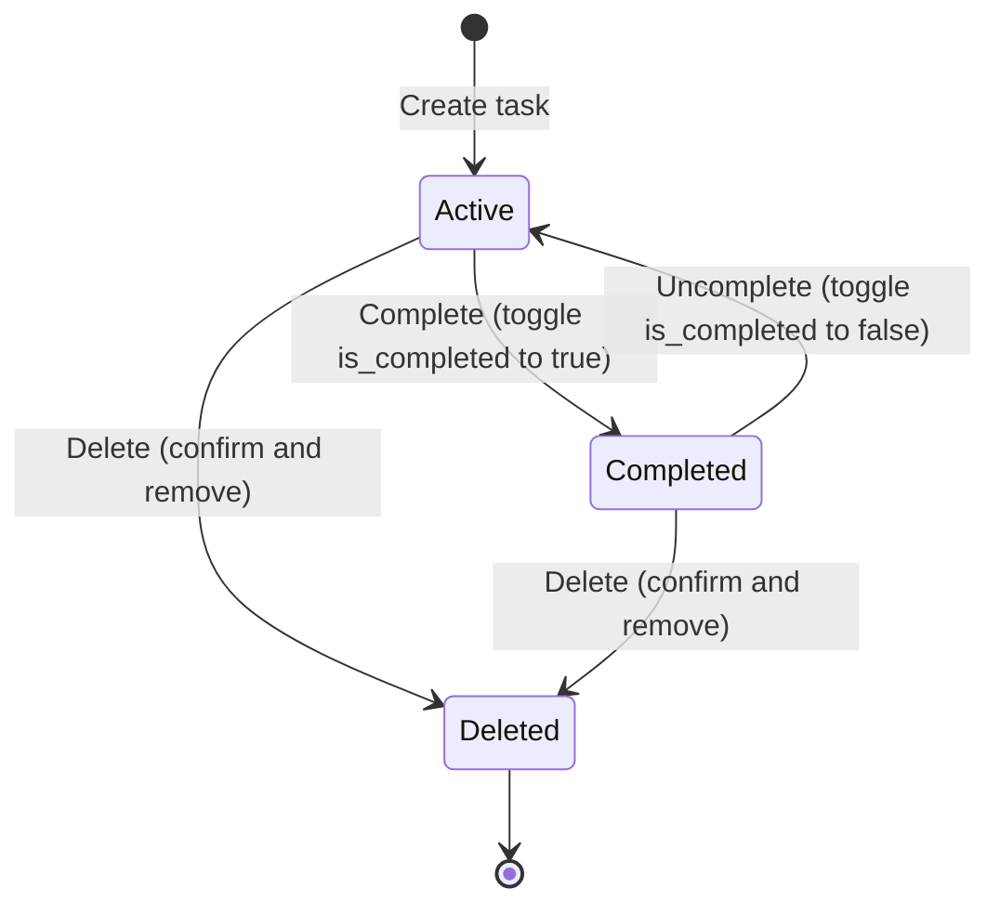

# Workflows

This document illustrates the end-to-end user and system workflows for the To-Do List Application. Each workflow describes the complete journey of a task management operation — from the user's action in the U! frontend, through the archie-service-backend API gateway, to the MongoDB data layer, and back. Mermaid sequence diagrams, flowcharts, and state diagrams provide visual representations of every major workflow to clarify the interactions between system components.

[← Back to README](../README.md)

*Source: Technical Specification §4.1*

---

## Workflow Overview

Every task management operation in the To-Do List Application follows a consistent request lifecycle governed by architectural constraint C-001: all client requests must be routed through archie-service-backend. The U! frontend never communicates directly with MongoDB.

The standard request lifecycle is:

1. **User Action** — The user interacts with the U! frontend (e.g., clicks a button, submits a form).
2. **HTTP Request** — U! sends an HTTP/REST request with a JSON payload to archie-service-backend.
3. **Validation and Processing** — archie-service-backend validates the input, applies business rules, and prepares the database operation.
4. **Database Operation** — archie-service-backend executes the operation against MongoDB 8.0.x via PyMongo 4.16.x.
5. **Response** — MongoDB returns the result to archie-service-backend, which constructs an HTTP response and sends it back to U!.
6. **UI Update** — The U! frontend updates its local state and re-renders the interface to reflect the change.

This lifecycle applies uniformly to task creation, editing, completion toggling, deletion, and filtering. The sections below detail each workflow with step-by-step descriptions and Mermaid diagrams.

> **Constraint C-002:** U! is the only client application. All API interactions documented here originate exclusively from the U! React frontend.

For detailed API patterns, request/response formats, and validation rules for each operation, see the [Core Functionality](functionality.md) documentation.

*Source: Technical Specification §4.1, §5.1*

---

## Task Creation Workflow

The task creation workflow enables users to add new tasks to the system. The user fills out a creation form in the U! frontend, which sends the data to archie-service-backend for validation and persistence in MongoDB.

### Step-by-Step Description

1. The user clicks the **"Add Task"** button in the U! frontend.
2. The U! frontend displays a task creation form with fields for **title** (required), **description** (optional), **priority** (defaults to Medium), and **due date** (optional).
3. The user fills in the desired fields and clicks **"Save"** or **"Create"**.
4. The U! frontend sends a `POST /api/tasks` request to archie-service-backend with a JSON payload containing the task fields.
5. archie-service-backend validates the request:
   - Verifies that **title** is present and non-empty (maximum 200 characters).
   - Validates **priority** is one of High, Medium, or Low (if provided).
   - Validates **due_date** is a valid ISO 8601 date string (if provided).
6. If validation fails, archie-service-backend returns a `400 Bad Request` response with error details, and the U! frontend displays the validation errors to the user.
7. If validation succeeds, archie-service-backend sets default values (`is_completed: false`, `priority: "Medium"` if not specified), generates `created_at` and `updated_at` timestamps, and inserts the task document into the MongoDB `tasks` collection via PyMongo.
8. MongoDB confirms the insertion and returns the generated `_id`.
9. archie-service-backend responds with `201 Created` and the full task object.
10. The U! frontend adds the new task to the displayed task list and clears the creation form.

### Sequence Diagram

*Source: Technical Specification §4.1, §2.2*

---

## Task Editing Workflow

The task editing workflow allows users to modify one or more properties of an existing task. The archie-service-backend supports partial updates — only the fields included in the request are changed while all other fields remain unchanged.

### Step-by-Step Description

1. The user selects an existing task from the task list in the U! frontend.
2. The U! frontend opens an edit form (or inline editing mode) pre-populated with the task's current values.
3. The user modifies one or more fields (title, description, priority, or due date) and clicks **"Save"**.
4. The U! frontend sends a `PATCH /api/tasks/{task_id}` request to archie-service-backend with only the changed fields in the JSON payload.
5. archie-service-backend validates the provided fields:
   - If **title** is included, it must be non-empty and at most 200 characters.
   - If **priority** is included, it must be one of High, Medium, or Low.
   - If **due_date** is included, it must be a valid ISO 8601 date string or `null` to remove the deadline.
6. If validation fails, archie-service-backend returns a `400 Bad Request` response, and the U! frontend displays the validation errors.
7. If the task with the given `task_id` does not exist, archie-service-backend returns a `404 Not Found` response.
8. If validation succeeds, archie-service-backend updates the specified fields in MongoDB using PyMongo's `update_one()` with the `$set` operator. The `updated_at` timestamp is always refreshed.
9. MongoDB confirms the update.
10. archie-service-backend responds with `200 OK` and the full updated task object.
11. The U! frontend refreshes the task in the displayed list with the updated data.

### Sequence Diagram

*Source: Technical Specification §4.1, §2.2*

---

## Task Completion Workflow

The task completion workflow enables users to mark a task as complete or revert it back to an active state. This is implemented as a toggle operation — each request flips the `is_completed` field between `true` and `false`.

### Step-by-Step Description

1. The user clicks the **completion checkbox** (or toggle control) next to a task in the U! frontend.
2. The U! frontend sends a `PATCH /api/tasks/{task_id}/toggle-complete` request to archie-service-backend. No request body is required — the backend determines the current state and flips it.
3. archie-service-backend retrieves the task document from MongoDB to read the current `is_completed` value.
4. If the task does not exist, archie-service-backend returns a `404 Not Found` response.
5. archie-service-backend flips the `is_completed` field:
   - If currently `false`, it is set to `true` (task marked as completed).
   - If currently `true`, it is set to `false` (task reverted to active).
6. archie-service-backend updates the document in MongoDB using `update_one()` with the new `is_completed` value and a refreshed `updated_at` timestamp.
7. MongoDB confirms the update.
8. archie-service-backend responds with `200 OK` and the updated task object (including the new `is_completed` status).
9. The U! frontend applies visual changes to reflect the new state:
   - **Completed tasks:** Strikethrough text on the title, dimmed styling, and a filled checkbox.
   - **Active tasks:** Normal text styling and an unfilled checkbox.

### Sequence Diagram

*Source: Technical Specification §4.1, §2.2*

---

## Task Deletion Workflow

The task deletion workflow allows users to permanently remove a task from the system. The To-Do List Application uses hard deletes — once a task is deleted, it cannot be recovered. A confirmation dialog in the U! frontend prevents accidental deletions.

### Step-by-Step Description

1. The user clicks the **"Delete"** button (or icon) on a task in the U! frontend.
2. The U! frontend displays a **confirmation dialog** asking the user to confirm the deletion (e.g., "Are you sure you want to delete this task?").
3. If the user **cancels**, the dialog closes and no request is sent. The task remains unchanged.
4. If the user **confirms**, the U! frontend sends a `DELETE /api/tasks/{task_id}` request to archie-service-backend.
5. archie-service-backend locates the task document in MongoDB.
6. If the task does not exist, archie-service-backend returns a `404 Not Found` response.
7. If the task exists, archie-service-backend permanently removes it from the `tasks` collection using PyMongo's `delete_one()`.
8. MongoDB confirms the deletion.
9. archie-service-backend responds with `200 OK` and a confirmation message including the deleted task's `_id`.
10. The U! frontend removes the task from the displayed task list.

### Sequence Diagram

*Source: Technical Specification §4.1, §2.2*

---

## Task Filtering Workflow

The task filtering workflow allows users to narrow the displayed task list by applying one or more filter criteria. Filters are applied using query parameters sent to the archie-service-backend, which constructs a MongoDB query to retrieve only matching tasks. Multiple filters are combined using AND logic.

### Step-by-Step Description

1. The user interacts with the filter controls in the U! frontend. Available filter criteria include:
   - **Status** — Filter by completion state: All, Active, or Completed.
   - **Priority** — Filter by priority level: All, High, Medium, or Low.
   - **Due Date Range** — Filter tasks within a date range (from date, to date).
   - **Search Text** — Free-text search matching task titles and descriptions.
2. As the user selects or types filter values, the U! frontend constructs a query string with the corresponding parameters (e.g., `?status=active&priority=High&search=proposal`).
3. The U! frontend sends a `GET /api/tasks` request to archie-service-backend with the filter query parameters.
4. archie-service-backend parses the query parameters and builds a MongoDB query:
   - **Status filter:** Translates to a condition on the `is_completed` field (`active` → `is_completed: false`, `completed` → `is_completed: true`, `all` → no filter).
   - **Priority filter:** Matches the `priority` field exactly (High, Medium, or Low).
   - **Due date range:** Applies `$gte` and `$lte` operators on the `due_date` field.
   - **Search text:** Performs a case-insensitive regex match on `title` and `description` fields.
5. archie-service-backend executes the constructed query against the MongoDB `tasks` collection via PyMongo's `find()` method, applying any sort and pagination parameters.
6. MongoDB returns the matching task documents.
7. archie-service-backend responds with `200 OK` and the filtered task list (with pagination metadata if applicable).
8. The U! frontend updates the displayed task list to show only the filtered results.

### Filtering Flowchart

For the complete list of query parameters, combined filter behavior, pagination support, and sorting options, see the [Core Functionality — Task Filtering and Sorting](functionality.md#task-filtering-and-sorting) documentation.

*Source: Technical Specification §4.1, §2.2*

---

## Task Lifecycle State Diagram

The task lifecycle represents the complete set of states a task can occupy and the transitions between them. From the moment a task is created until it is deleted, it follows a well-defined state machine driven by user actions.

### States

| State | Description |
|-------|-------------|
| **Created** | Initial state immediately after a task is saved to the database. The task exists with `is_completed: false`. |
| **Active** | The task is available for work. This is the working state where users can edit the task, change its priority, or assign a due date. Functionally equivalent to Created for the purposes of display and filtering. |
| **Completed** | The task has been marked as done by the user (`is_completed: true`). Completed tasks remain in the system and can be reverted to Active. |
| **Deleted** | The task has been permanently removed from the system. This is a terminal state — deleted tasks cannot be recovered. |

### Transitions

| Transition | From State | To State | Trigger |
|------------|-----------|----------|---------|
| Create | (none) | Active | User creates a new task via the creation form |
| Complete | Active | Completed | User toggles the completion checkbox (sets `is_completed: true`) |
| Uncomplete | Completed | Active | User toggles the completion checkbox (sets `is_completed: false`) |
| Delete (from Active) | Active | Deleted | User confirms deletion of an active task |
| Delete (from Completed) | Completed | Deleted | User confirms deletion of a completed task |

### State Diagram

> **Note:** The "Created" and "Active" states are logically merged in this diagram because a newly created task immediately enters the Active state (`is_completed: false`) with no intervening user action. The distinction is conceptual — every new task is immediately active and available for work.

*Source: Technical Specification §4.1*

---

## Cross-References

For additional details on the operations and components referenced in this document, see the following related documentation:

- **[Core Functionality](functionality.md)** — Detailed API patterns, request/response formats, validation rules, and data storage operations for every task management capability
- **[Architecture](architecture.md)** — System architecture overview, three-tier design, request flow lifecycle, and architectural constraints (C-001 through C-004)
- **[Data Model](data-model.md)** — MongoDB collection schema, task document field definitions, indexing strategy, and sample documents
- **[UI Design](ui-design.md)** — User interface layout, component descriptions, visual indicators for task states and priorities, and interaction patterns

---

*This document is part of the To-Do List Application documentation. Return to the [README](../README.md) for the full documentation index.*
